# 好物周刊#167：春江水暖鸭先知

> 作者：[村雨遥](https://github.com/cunyu1943)
> 
> 不要哀求，学会争取，若是如此，终有所获
> 
> 原文：https://mp.weixin.qq.com/s/eSLpauOHmyJc-vYoaffmeQ

## 🎈 号外 

最近，公众号之外，建立了微信交流群，不定期会在群里分享各种资源（影视、IT 编程、考试提升……）&知识。如果有需要，可以**扫码或者后台添加小编微信备注入群**。进群后**优先看群公告**，**呼叫群中【资源分享小助手】**，还能免费帮找资源哦～

## 一、项目

### 1. [Neko Master](https://github.com/foru17/neko-master)

让你的网络流量一目了然，实时监控你的流量，让你能够直观的看到你的网络到底发生了什么。

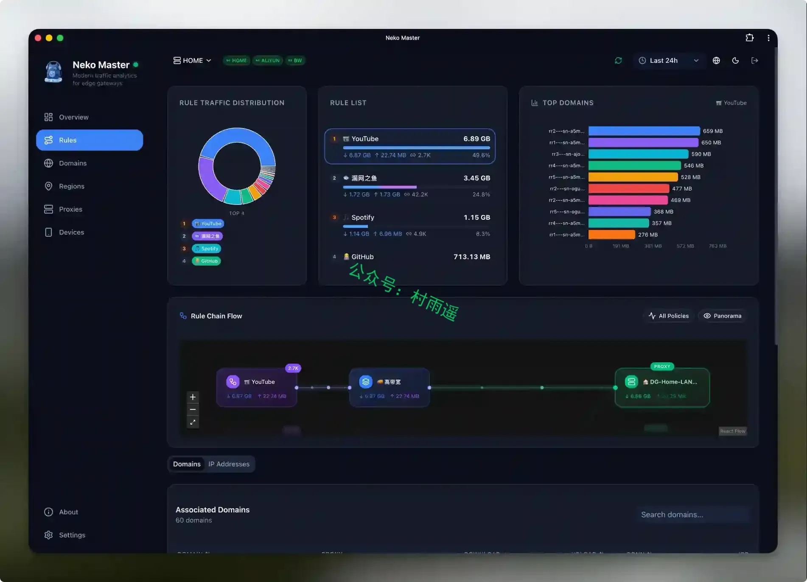

### 2. [uView-Pro](https://github.com/anyup/uView-Pro)

全面支持 Vue3.0、TypeScript 的 uni-app 生态框架，uView Pro 的基线版本是基于 uView 1.8.8 修改，使用 TypeScript 完全重构，已覆盖 Android、iOS、鸿蒙以及微信/头条/支付宝等主流小程序平台，真正实现 “一套代码，多端运行”，支持多主题系统、暗黑模式与国际化（i18n）。

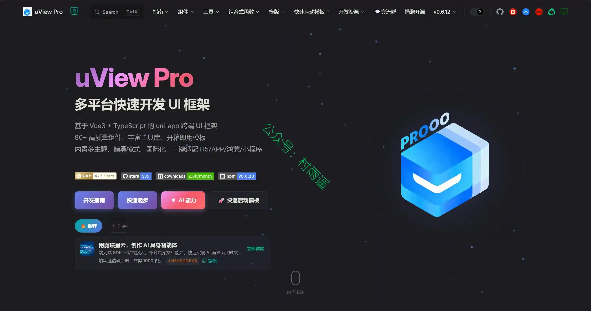

### 3. [ai-commit](https://github.com/guanguans/ai-commit)

使用 AI 自动生成约定式 git 提交信息。

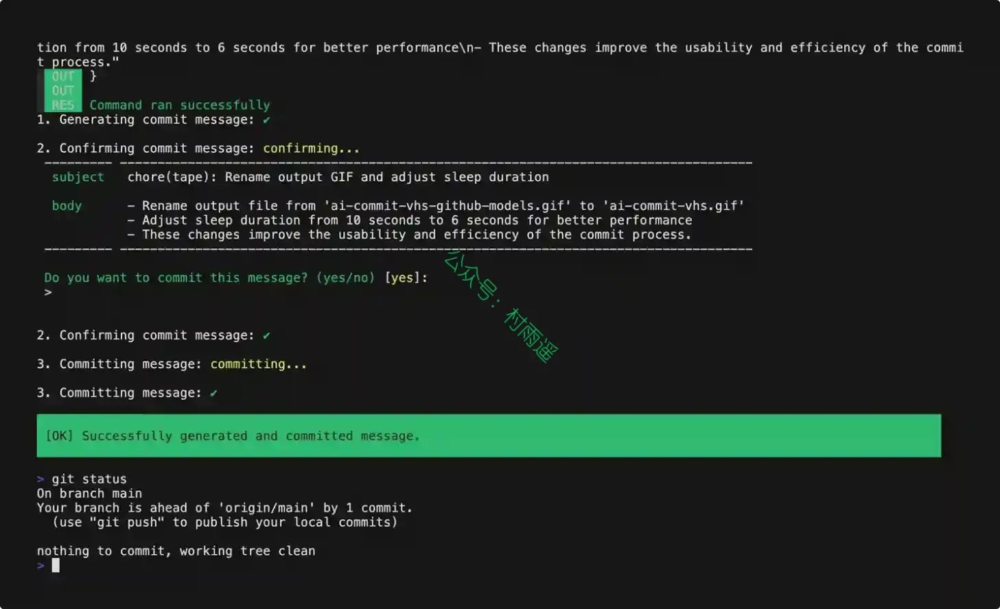

## 二、软件

### 1. [GTweak](https://github.com/Greedeks/GTweak)

一款开源的 Windows 优化利器，集成了激活、去臃肿、隐私保护、性能优化、界面美化等近 100 项实用功能，一键操作即可打造「理想 Windows 系统」。

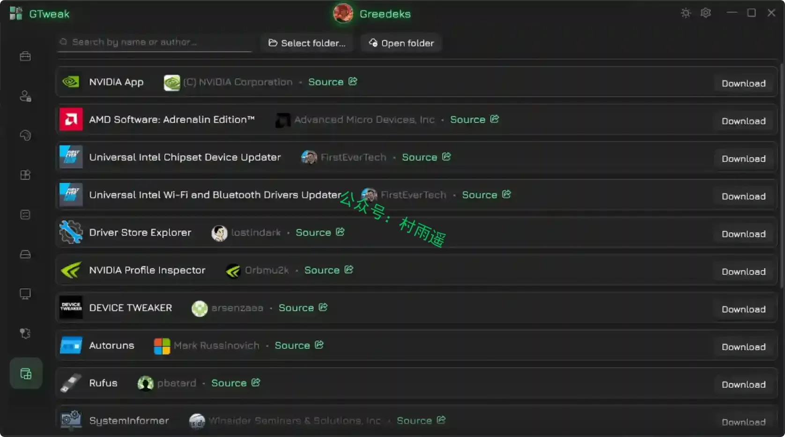

### 2. [AI File Sorter](https://github.com/hyperfield/ai-file-sorter)

一款跨平台桌面应用程序，借助人工智能整理文件，并为图片、文档以及受支持的音视频文件推荐更规整、格式更统一的文件名。该软件旨在减少文件杂乱问题、统一文件命名规范，方便后续查找文件，满足查阅、归档或长期存储等各类使用场景。

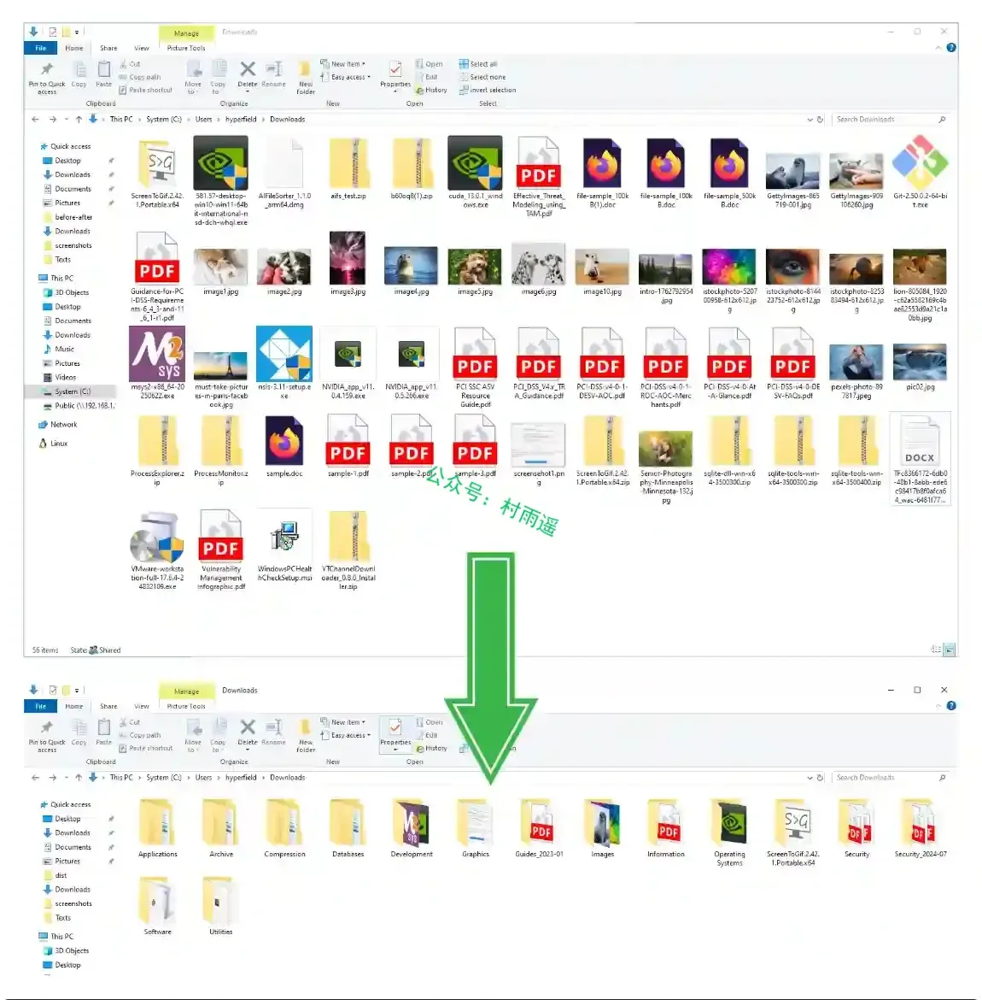

### 3. [PDFCraft](https://github.com/PDFCraftTool/pdfcraft)

专业 PDF 工具
131+ 款免费、安全且易于使用的工具，满足您所有的 PDF 需求。

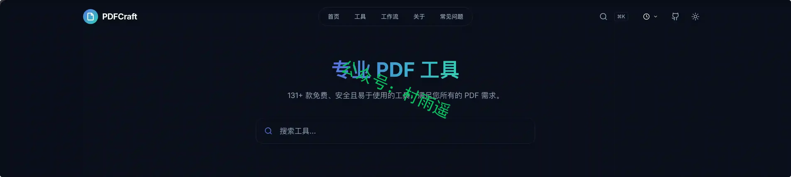

## 三、网站

### 1. [TempUtils](https://temputils.com)

所有临时工具，一站搞定。笔记、表格、文件、白板、聊天、邮箱等，无需注册，无需安装，用完即走。

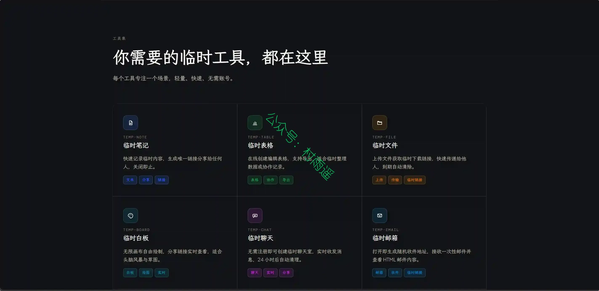

### 2. [磐代 AI](https://pandai.pro/?ref=I4LJDoy0)

磐代 AI 是多模型并行的 AI PPT 自动生成工具：输入一句话，Deepseek / Kimi / 通义千问 / 智谱 / MiniMax / 豆包 / MiMo / StepFun 等多个大模型同时生成 PPT，对比选优，免费试用，导出可二次编辑的真实 .pptx 文件。

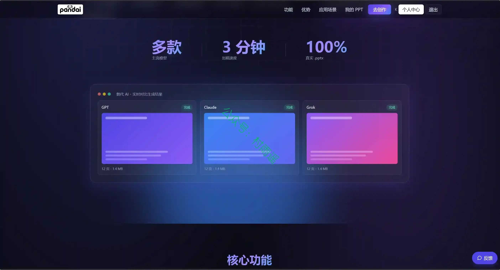

### 3. [鸭先知](https://www.yxzhi.com)

创办于 2022 年，是原资源否网站，专注于分享优质软件、技术、教程、脚本、插件等资源的综合性网站。找软件，找资源，学技术，提效率，尽在鸭先知！

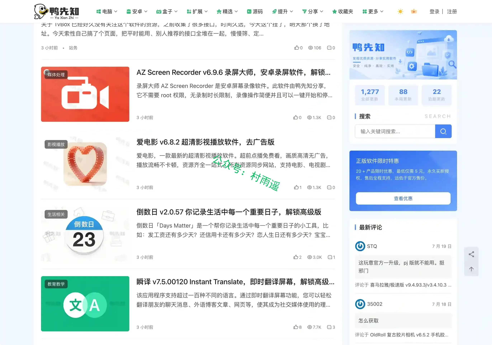

## 四、插件

### 1. [只译](https://github.com/airhunter/OnlyTranslate)

一款开源双语阅读浏览器扩展：在原页面翻译网页正文、视频字幕和本地 EPUB 电子书，并尽量保留原内容的结构与阅读节奏。无需注册只译账号，也不绑定订阅；翻译服务由你自己选择。

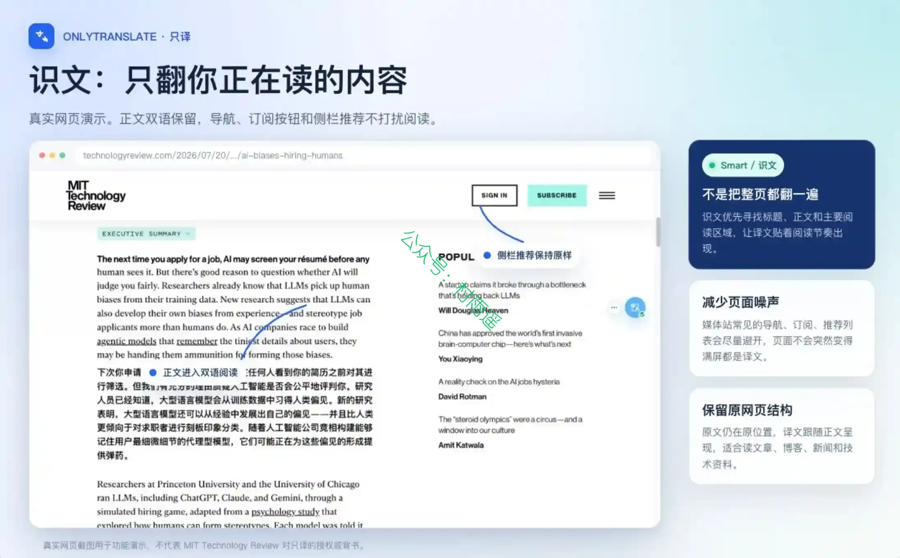

### 2. [GitHub 中文化插件](https://github.com/maboloshi/github-chinese)

一款开源的 Tampermonkey 油猴脚本，可将 GitHub 网页界面完整汉化，支持多版本分发，适配新版 GitHub 页面并提供词条管理等配套能力。

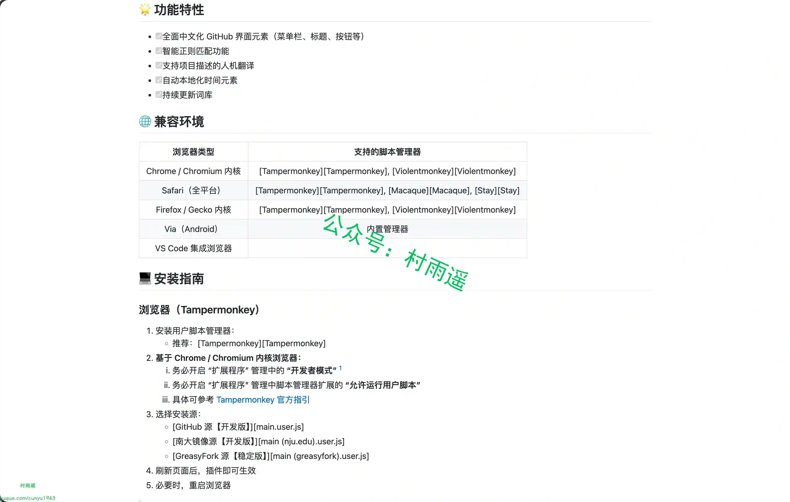

### 3. [Ad Block Ninja](https://chromewebstore.google.com/detail/ad-block-ninja/ppfadpgpccljindldolejmgkhgaficka)

一款跨浏览器轻量广告拦截扩展，可拦截网页各类广告与跟踪脚本，支持自定义白名单，实现更快速、隐私安全的浏览体验。

## 五、资料

### 1. [System Design 101](https://github.com/ByteByteGoHq/system-design-101)

一个开源知识库仓库，以图解通俗的方式汇总分布式系统、架构案例、数据库、网络等技术，服务于系统设计学习与面试备考。

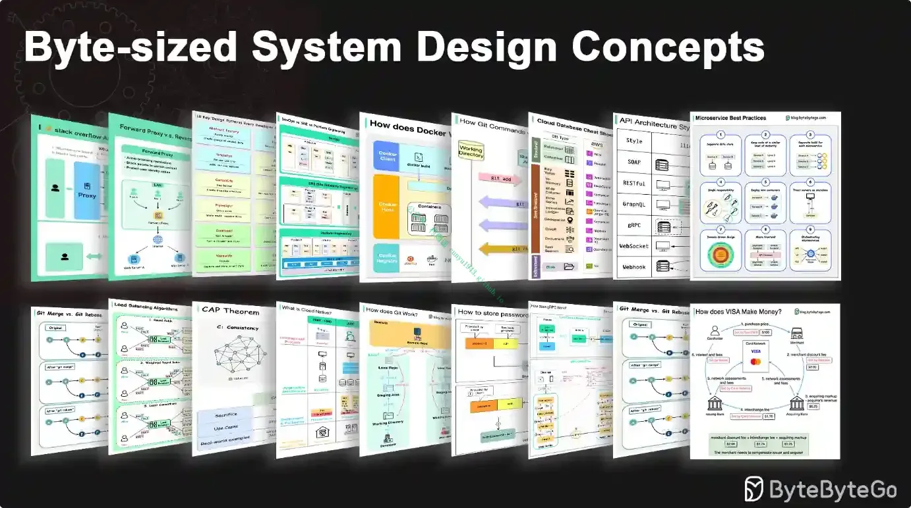

### 2. [Docker Curriculum](https://github.com/prakhar1989/docker-curriculum)

面向零基础新手、全程实操驱动的 Docker 完整教程，从容器基础、Dockerfile、多容器 Compose，到基于 AWS 云端部署 Web 与分布式应用，手把手带你掌握容器化全流程。

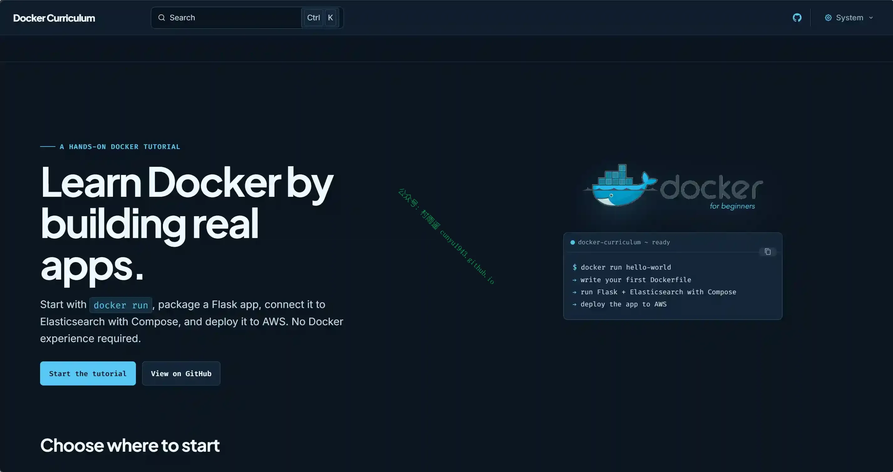

### 3. [Docker 从入门到实践](https://github.com/yeasy/docker_practice)

一套覆盖 Docker 基础、进阶、底层原理、容器生态与工程实战的完整中文教程，分岗位定制学习路线，支持在线 / 离线多渠道阅读，适配初学者与架构、运维、开发全人群。

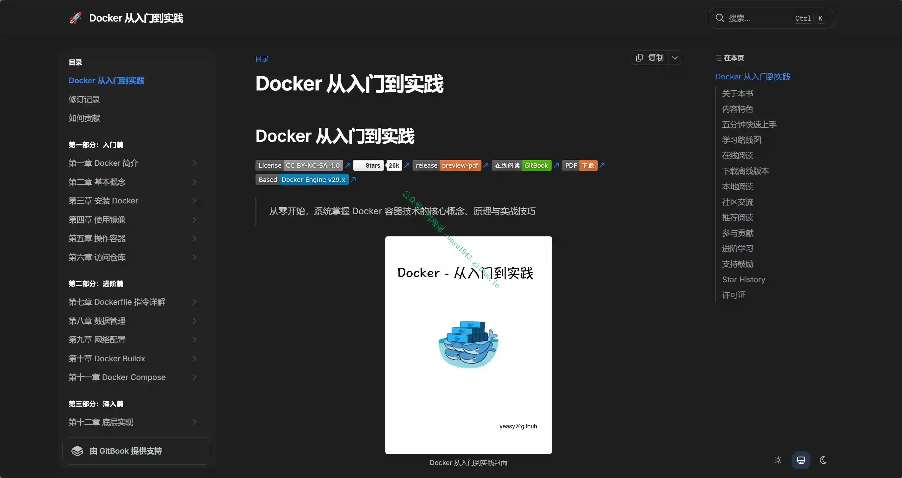

## ✍️ 说明

周刊专栏相关信息：

- **项目地址**：[Github](https://github.com/cunyu1943/weekly)，觉得不错麻烦给我一个**Star**，感谢 ❤️
- **浏览地址**：公众号 | [电子书](https://cunyu1943.github.io/weekly) | [语雀](https://yuque.com/cunyu1943/weekly) | [ima 知识库](https://ima.qq.com/wiki/?shareId=860487e32c6cc8d6c9070cd7f00caedf3cbf4102f695862d9c82f463b92417af)

如果你阅读到这里，说明我的工作没有白费。如果你想推荐项目/网站/软件/资源，欢迎提交 **[issue](https://github.com/cunyu1943/weekly/issues)** 或者添加我 **个人微信：coder_cunYu** 与我交流。

