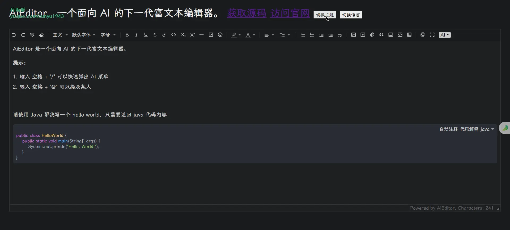
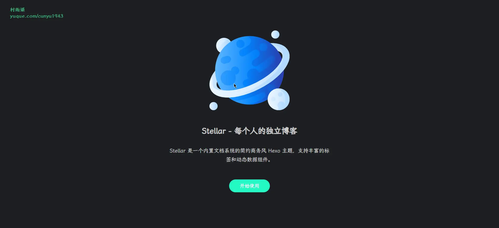
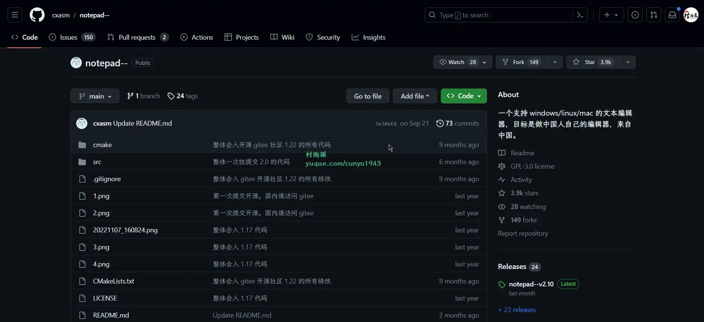
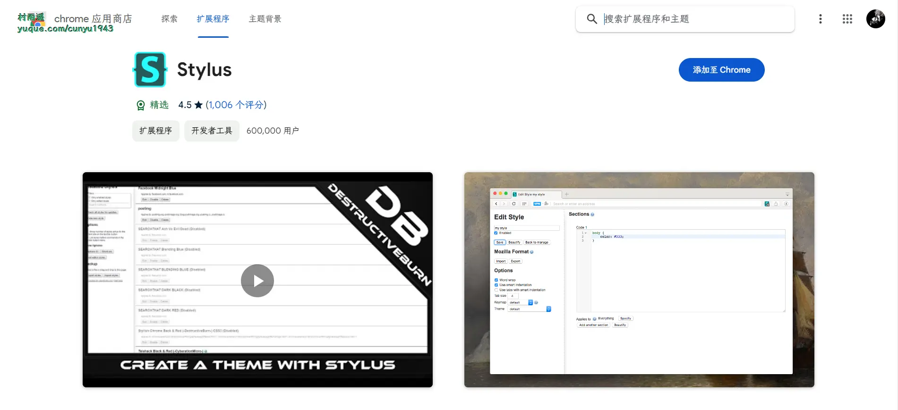
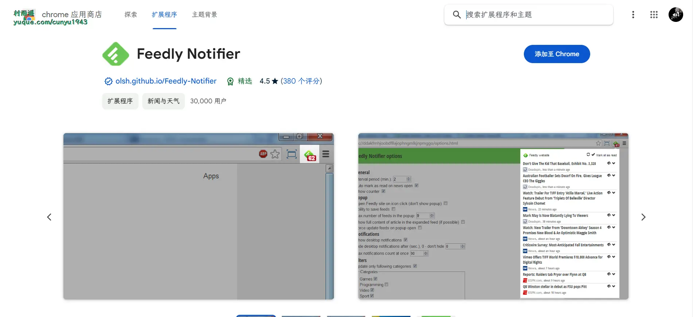
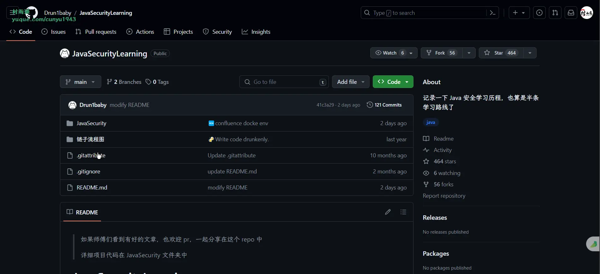
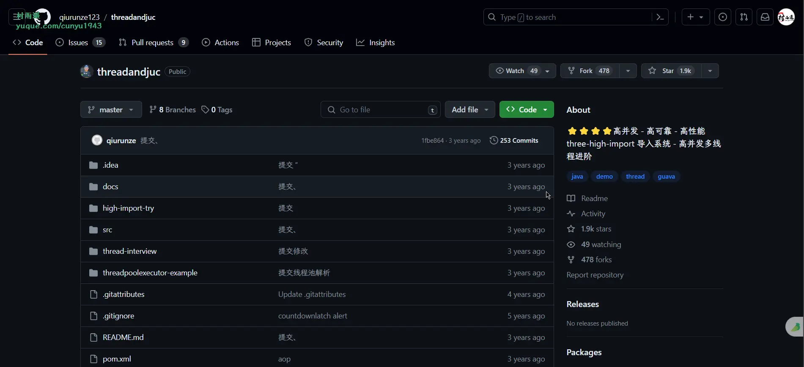

# 好物周刊#38：在线图片处理

> 作者：[村雨遥](https://github.com/cunyu1943)
> 
> 不要哀求，学会争取，若是如此，终有所获
> 
> 原文：
https://mp.weixin.qq.com/s/jy6pfjLa5Jfp9rZVGem3pg

## 号外

最近，公众号之外，建立了微信交流群，不定期会在群里分享各种资源（影视、IT 编程、考试提升……）&知识。如果有需要，可以**扫码或者后台添加小编微信备注入群**。进群后**优先看群公告**，**呼叫群中【资源分享小助手】**，还能免费帮找资源哦～

 

## 一、项目

### 1. [AiEditor](https://gitee.com/aieditor-team/aieditor)

一个面向 `AI` 的下一代富文本编辑器，她基于 `Web Component`，因此支持 `Layui`、`Vue`、`React`、`Angular` 等几乎任何前端框架。她适配了 `PC Web` 端和手机端，并提供了亮色和暗色两个主题。除此之外，还提供了灵活的配置，开发者可以方便的使用其开发任何文字编辑的应用。

### 2. [GoView](https://gitee.com/dromara/go-view)

一个 `Vue3` 搭建的低代码数据可视化开发平台，将图表或页面元素封装为基础组件，无需编写代码即可完成业务需求。

### 3. [hexo-theme-stellar](https://github.com/xaoxuu/hexo-theme-stellar)

一个内置文档系统的简约商务风 `Hexo` 主题，支持丰富的标签和动态数据组件。

## 二、软件

### 1. [酷呆桌面](https://www.coodesker.com/)

自动分类整理桌面上的快捷方式、目录、图片等文件。

### 2. [Notepad--](https://github.com/cxasm/notepad--)

一个使用 `C++` 编写的文本编辑器 `Notepad--`, 可以支持 `Win/Linux/Mac` 平台。

### 3. [PxCook](https://fancynode.com.cn/pxcook)

高效易用的自动标注工具，生成前端代码，设计研发协作利器。

## 三、网站

### 1. [太美工具箱](https://tiomg.org/)

在线工具，免费图片压缩工具，在线图片工具，在线 `PDF` 工具，程序开发者工具。

### 2. [改图鸭](https://www.gaituya.com/)

改图鸭作为在线版图片格式处理工具，提供图片编辑、图片格式转换、图片压缩等大量的图片处理功能，用户不用下载任何软件，只需将图片上传到官网即可对图片进行编辑，方便快捷。

### 3. [去去去](https://quququ.cn/)

一款图片在线去水印网站，永久免费，使用人工智能技术，支持批量去除图片中的文字、标志，多余物体等多种水印，去水印不留痕，不压画质，高质不糊图！

## 四、插件

### 1. [ColorZilla](https://chromewebstore.google.com/detail/colorzilla/bhlhnicpbhignbdhedgjhgdocnmhomnp)

高级吸管、拾色器、渐变生成器和其他与颜色相关的实用工具。

最用户友好、功能齐全、安全且可靠的颜色选择器和与颜色相关的工具套件。

### 2. [Stylus](https://chromewebstore.google.com/detail/stylus/clngdbkpkpeebahjckkjfobafhncgmne)

一个调整网页外观的用户样式管理器。

### 3. [Feedly Notifier](https://chromewebstore.google.com/detail/feedly-notifier/egikgfbhipinieabdmcpigejkaomgjgb)

一个精巧的扩展，可让您随时了解 `Feedly` 订阅。支持如下功能：

-   显示未读新闻数
-   未读新闻标题(直链新闻站点)
-   文章预览在弹窗显示
-   设置更新类别 
-   HTTPS支持
-   将新闻标记为已读
-   保存以便稍后阅读
-   单击按钮即可打开网站(作为计数器)
-   桌面通知
-   后台模式

## 五、资料

### 1. [BingheGuide](https://github.com/binghe001/BingheGuide)

包含：编程语言，开发技术，分布式，微服务，高并发，高可用，高可扩展，高可维护，`JVM` 技术，`MySQL`，分布式数据库，分布式事务，云原生，大数据，云计算，渗透技术，各种面试题，面试技巧等方面内容。

### 2. [JavaSecurityLearning](https://github.com/Drun1baby/JavaSecurityLearning)

记录了作者 `Java` 安全的学习历程，主要包含以下方面的内容：

- 基础开发
- `Java` 安全基础
- `Java` 反序列化基础
- `Java` 反序列化进阶
- `Weblogic`
- 内存马
- ……

### 3. [threadandjuc](https://github.com/qiurunze123/threadandjuc)

项目利用多线程进行千万级别导入，实现可扩展，高性能、高可用、高可靠三个高，本项目可以在千万级别数据实现无差别高性能数据上报与导入，与普通导入相比性能提高 10 倍左右，而且规避风险在偶尔的机器宕机，网络波动等情况出现时，仍能够实现数据一致，数据可靠，数据重试，数据报警等功能。

## ✍️ 说明

周刊专栏相关信息：

- **项目地址**：[Github](https://github.com/cunyu1943/weekly)，觉得不错麻烦给我一个**Star**，感谢 ❤️
- **浏览地址**：公众号 | [电子书](https://cunyu1943.github.io/weekly) | [语雀](https://yuque.com/cunyu1943/weekly)

如果你阅读到这里，说明我的工作没有白费。如果你想推荐项目/网站/软件/资源，欢迎提交 **[issue](https://github.com/cunyu1943/weekly/issues)** 或者添加我 **个人微信：coder_cunYu** 与我交流。

## ⏳ 联系

想解锁更多知识？不妨关注我的微信公众号：**村雨遥（id：JavaPark）**。

扫一扫，探索另一个全新的世界。

