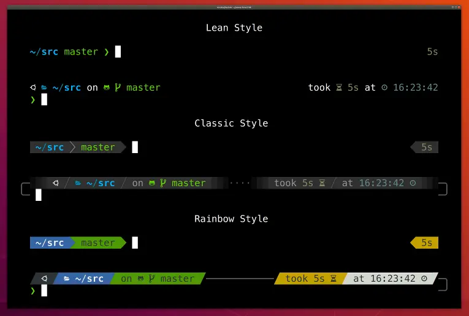
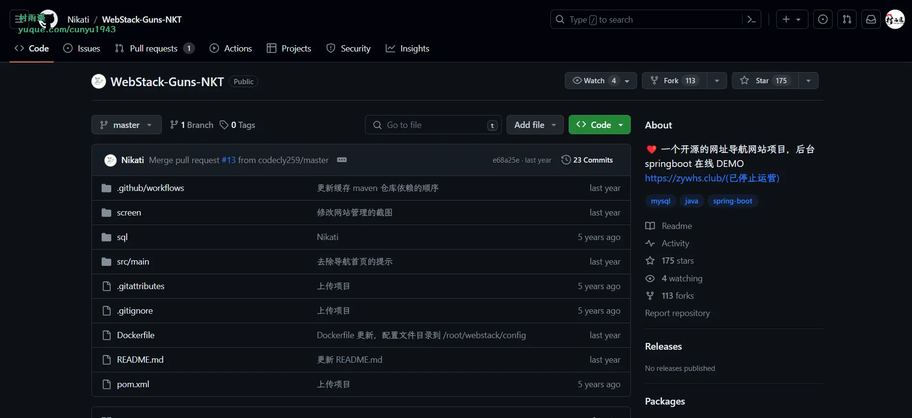
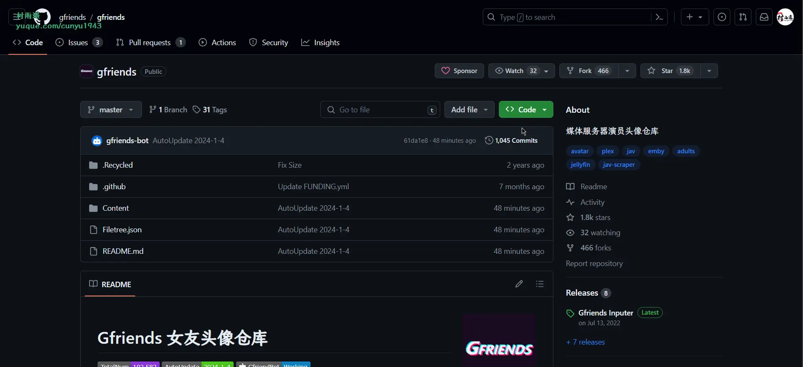
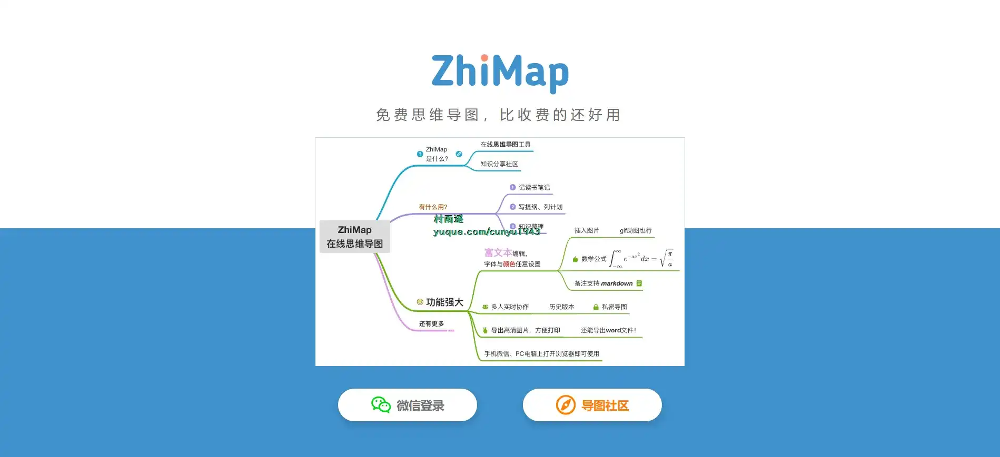
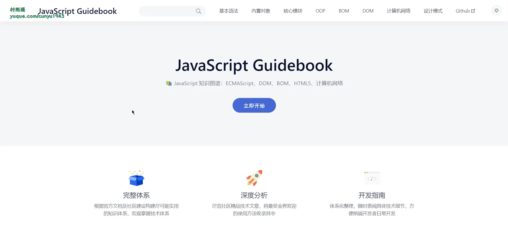
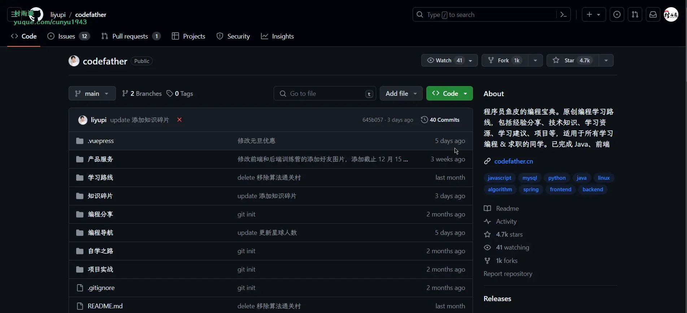
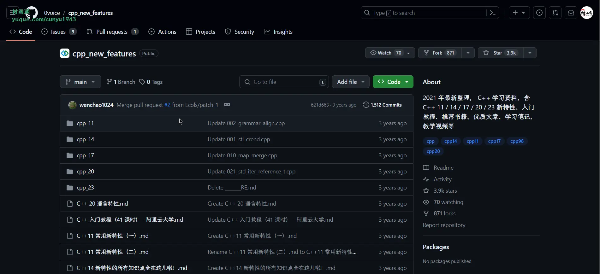

# 好物周刊#39：IT 人必备神器

> 作者：[村雨遥](https://github.com/cunyu1943)
> 
> 不要哀求，学会争取，若是如此，终有所获
> 
> 原文：
https://mp.weixin.qq.com/s/7cYV6BHlCXgCSjnPqWe_cg

## 🎈 号外 

最近，公众号之外，建立了微信交流群，不定期会在群里分享各种资源（影视、IT 编程、考试提升……）&知识。如果有需要，可以**扫码或者后台添加小编微信备注入群**。进群后**优先看群公告**，**呼叫群中【资源分享小助手】**，还能免费帮找资源哦～

 

## 一、项目

### 1. [Powerlevel10k](https://github.com/romkatv/powerlevel10k)

最好看，方便，实用的 zsh 命令行主题。

### 2. [WebStack-Guns-NKT](https://github.com/Nikati/WebStack-Guns-NKT)

一个开源的网址导航网站项目，具备完整的前后台，后端使用 SpringBoot 搭建，可以拿来制作自己的网址导航。

### 3. [Gfriends](https://github.com/gfriends/gfriends)

媒体服务器演员头像仓库。旨在满足数量需求前提下，尽可能收集和处理高质量女友头像，并提供导入媒体服务器方案。

## 二、软件

### 1. [ZhiMap](https://zhimap.com/)

好用、好看的在线思维导图工具，帮助你提高工作效率、学习效率。

### 2. [Legado](https://github.com/gedoor/legado)

一款可以自定义来源阅读网络内容的工具，为广大网络文学爱好者提供一种方便、快捷舒适的试读体验。

### 3. [日事清](https://www.rishiqing.com/)

日事清是高效能团队管理专家，为追求高效、有序的工作方式的团队管理者，提供专业、有效的团队管理工具和方法，让工作变得井井有条。

## 三、网站

### 1. [国图公开课](http://open.nlc.cn/onlineedu/client/index.htm)

中国国家图书馆推出的高质量免费在线学习网站。

### 2. [办公资源网](https://www.bangongziyuan.com/)

一家专注海量办公资源下载的网站，提供各种精美创意 `PPT` 模板、`Excel` 模板、`Word` 模板、免费音效资源及大量办公素材，包括个人简历 `Word` 模板、工作总结 `PPT`、教育培训课件等大量办公模板，来办公资源网，办公不求人。

### 3. [好知](http://www.howzhi.com/)

一个综合性在线学习平台。这里有大量的在线课程，课程涵盖计算机知识、企业管理、摄影、`photoshop`、职业技能、运动、外语、美食、时尚、手工艺、公开课、职业资格考试等。

## 四、插件

### 1. [闪记](https://kjeek.com/)

ALL IN ONE，包括但不止于万级书签管理、沉浸式网页笔记、双语沉浸式翻译、智能网页大纲等 10+ 项高频功能/操作。

### 2. [迅雷下载支持](https://chromewebstore.google.com/detail/迅雷下载支持/ncennffkjdiamlpmcbajkmaiiiddgioo?hl=zh-CN)

用于实现迅雷 X 接管 Chrome 浏览器的下载请求，方便的“多选下载”模式可以快速下载网页中的多个链接，并支持下载网页中的在线视频。

### 3. [会译](https://chromewebstore.google.com/detail/会译·对照式翻译/dgeiaiglmhdhajbpfbmajaajdlfdinpi?hl=zh-CN)

一款 AI 翻译浏览器插件，采用 AI 智能翻译，你的专属 AI 翻译专家。会译沉浸式的帮你翻译网上的任何语言内容，支持多语种对照式翻译，在线翻译，文档翻译，英汉互译，智能识别网页内容，降低语言障碍门槛，一键极速翻译，支持所有网站。

## 五、资料

### 1.[JavaScript Guidebook](https://github.com/tsejx/javascript-guidebook)

JavaScript 前端知识图谱，整理自各大技术社区和权威书籍的前端技术图谱。

### 2. [鱼皮的编程宝典](https://github.com/liyupi/codefather)

程序员鱼皮的编程宝典。原创编程学习路线，包括经验分享、技术知识、学习资源、学习建议、项目等，适用于所有学习编程 & 求职的同学。

### 3. [cpp_new_features](https://github.com/0voice/cpp_new_features)

C++ 学习资料，含 C++ 11/14/17/20/23 新特性、入门教程、推荐书籍、优质文章、学习笔记、教学视频等。

## ✍️ 说明

周刊专栏相关信息：

- **项目地址**：[Github](https://github.com/cunyu1943/weekly)，觉得不错麻烦给我一个**Star**，感谢 ❤️
- **浏览地址**：公众号 | [电子书](https://cunyu1943.github.io/weekly) | [语雀](https://yuque.com/cunyu1943/weekly)

如果你阅读到这里，说明我的工作没有白费。如果你想推荐项目/网站/软件/资源，欢迎提交 **[issue](https://github.com/cunyu1943/weekly/issues)** 或者添加我 **个人微信：coder_cunYu** 与我交流。

## ⏳ 联系

想解锁更多知识？不妨关注我的微信公众号：**村雨遥（id：JavaPark）**。

扫一扫，探索另一个全新的世界。

