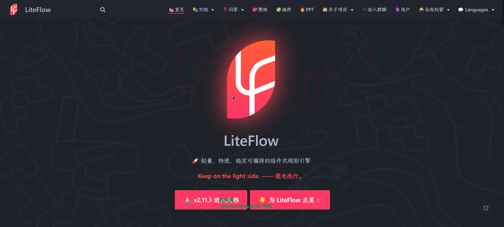
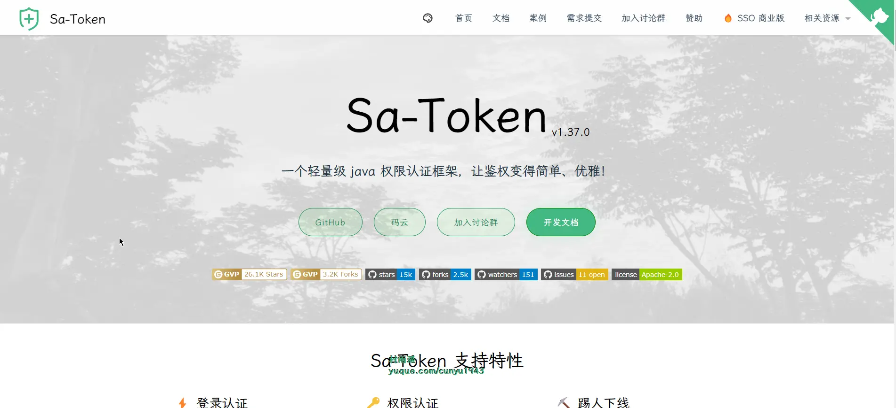
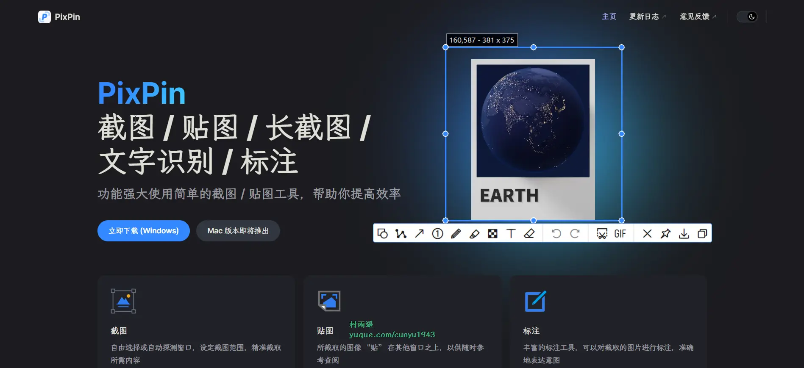
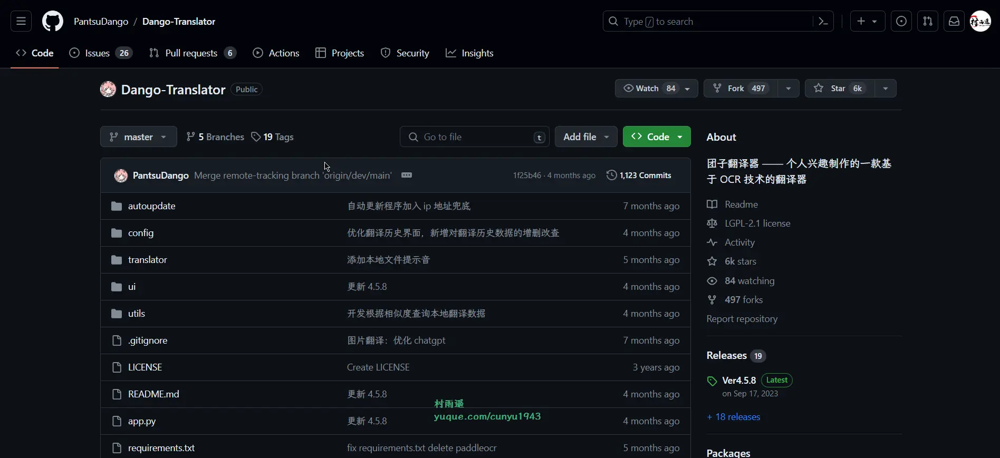
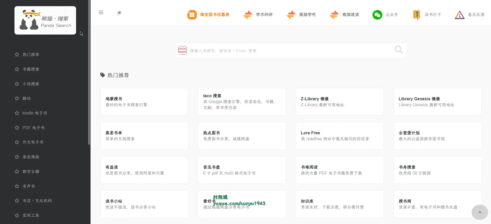
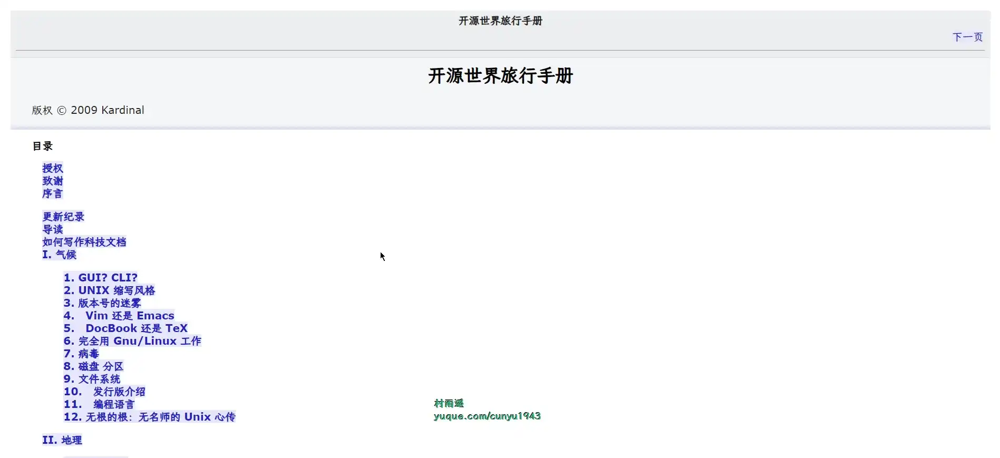
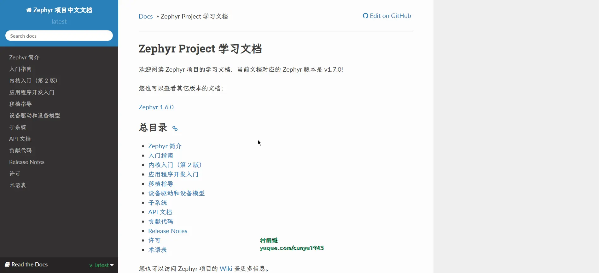

# 好物周刊#41：新一代截图神器

> 作者：[村雨遥](https://github.com/cunyu1943)
> 
> 不要哀求，学会争取，若是如此，终有所获
> 
> 原文：
https://mp.weixin.qq.com/s/sjPIgXpigiJdAKMHWvbm9A

## 🎈 号外 

最近，公众号之外，建立了微信交流群，不定期会在群里分享各种资源（影视、IT 编程、考试提升……）&知识。如果有需要，可以**扫码或者后台添加小编微信备注入群**。进群后**优先看群公告**，**呼叫群中【资源分享小助手】**，还能免费帮找资源哦～

 

## 一、项目

### 1. [LiteFlow](https://gitee.com/dromara/liteFlow)

轻量，快速，稳定，可编排的组件式规则引擎 / 流程引擎。 拥有全新设计的 DSL 规则表达式。 组件复用，同步 / 异步编排，动态编排，支持超多语言脚本，复杂嵌套规则，热部署，平滑刷新规则等等功能，让你加快开发效率！

### 2. [Restful Fast Request](https://github.com/dromara/fast-request)

一个类似于 Postman 的 IDEA 插件。它是一个强大的 restful api 工具包插件，可以根据已有的方法帮助您快速生成 url 和 params。 Restful Fast Request = API调试工具 + API管理工具 + API搜索工具。 它有一个漂亮的界面来完成请求、检查服务器响应、存储你的 api 请求和导出 api 请求。插件帮助你在 IDEA 界面内更快更高效得调试你的 API。

对比于 HTTP Client，Fast Request 不仅拥有 HTTP Client 内置的功能，还提供了友好易懂直观的界面，让使用者调试 API 的时候能够更加方便、简捷。同时各种类型参数也提供了不同的定制方式，更加灵活。而且集成了搜索、Postman 集成，Swagger 支持等额外的功能。

### 3. [Sa-Token](https://github.com/dromara/sa-token)

一个轻量级 Java 权限认证框架，主要解决：登录认证、权限认证、单点登录、OAuth2.0、分布式 Session 会话、微服务网关鉴权等一系列权限相关问题。

## 二、软件

### 1. [PixPin](https://pixpinapp.com/)

集截图/贴图/长截图/文字识别/标注功能于一身。

功能强大使用简单的截图/贴图工具，帮助你提高效率。

### 2. [团子翻译器](https://github.com/PantsuDango/Dango-Translator)

一款生肉翻译软件，通过 OCR 识别屏幕特定范围内的文字，然后将识别到的文字调取各种翻译源，并实时输出翻译结果。

软件具有如下特点：

- 搭载了离线 OCR
- 搭载了在线 OCR 和漫画 OCR
- 实现自动模式，实时识别区域内的文本并翻译
- 配置了 15 种翻译源
- 账号系统，能够自动云端保存配置
- 另有图片翻译功能，实现对生肉漫画图片自动识别、翻译、消字、嵌字

### 3. [Apipost](https://www.apipost.cn/)

集 API 设计、API 调试、API 文档、自动化测试为一体的 API 研发协同平台，支持 grpc、http、websocket、socketio、socketjs 类型接口调试，支持私有化部署。

## 三、网站

### 1. [熊猫搜索](https://xmsoushu.com/)

熊猫搜索，熊猫搜书，聚合电子书、文档搜索引擎，一站式搜索导航，方便快速导航搜索全网资源，读书学习必备导航站。

### 2. [ChatPaper](https://github.com/kaixindelele/ChatPaper)

全流程加速科研，利用 chatgpt 进行论文全文总结 + 专业翻译 + 润色 + 审稿 + 审稿回复。

### 3. [MACYY](https://www.macyy.cn/)

Mac 破解软件分享中心。

## 四、插件

### 1. [Zoom](https://chromewebstore.google.com/detail/zoom-chrome-extension/kgjfgplpablkjnlkjmjdecgdpfankdle)

只需单击按钮，您就可以直接通过 Google 日历开始即时会议或安排未来的会议。会议 URL 和信息通过 Google 日历邀请发送，参会者只需单击一下即可加入。

### 2. [Screencastify](https://chromewebstore.google.com/detail/screencastify-screen-vide/mmeijimgabbpbgpdklnllpncmdofkcpn)

Chrome 最简单的免费屏幕录像机和视频创建平台之一，使任何人都可以通过在几秒钟内录制、编辑、共享和评估视频来成为更好的沟通者。

### 3. [Honey](https://chromewebstore.google.com/detail/honey-automatic-coupons-r/bmnlcjabgnpnenekpadlanbbkooimhnj)

Honey 是一个浏览器扩展，只需点击一下，就能在结账时自动找到并应用优惠券折扣码。

## 五、资料

### 1. [开源世界旅行手册](https://i.linuxtoy.org/docs/guide/index.html)

本书分为四个部分：气候、地理、景观、地质。

气候篇中的内容为课外读物，包括一些杂谈随笔，可以增长知识。

地理篇为必修课，它是这本书的核心，包含一些基本教程。这一部分的内容，建议熟读。

景观篇为选修课，里面的内容为实用的解决方案，但并不是每个人都需要。

地质篇的内容为开源运动史。

### 2. [Zephyr OS 文档](https://github.com/chunhuajiang/zephyr-doc)

Zephyr Project 官方文档的中文翻译版。

### 3. [Go 程序员面试笔试宝典](https://github.com/golang-design/go-questions)

从问题切入，串连 Go 语言相关的所有知识，融会贯通。

## ✍️ 说明

周刊专栏相关信息：

- **项目地址**：[Github](https://github.com/cunyu1943/weekly)，觉得不错麻烦给我一个**Star**，感谢 ❤️
- **浏览地址**：公众号 | [电子书](https://cunyu1943.github.io/weekly) | [语雀](https://yuque.com/cunyu1943/weekly)

如果你阅读到这里，说明我的工作没有白费。如果你想推荐项目/网站/软件/资源，欢迎提交 **[issue](https://github.com/cunyu1943/weekly/issues)** 或者添加我 **个人微信：coder_cunYu** 与我交流。

## ⏳ 联系

想解锁更多知识？不妨关注我的微信公众号：**村雨遥（id：JavaPark）**。

扫一扫，探索另一个全新的世界。

