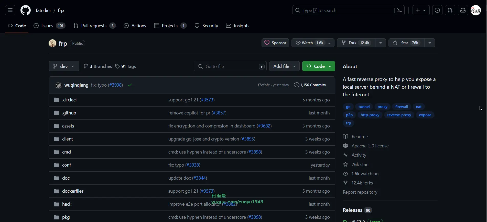
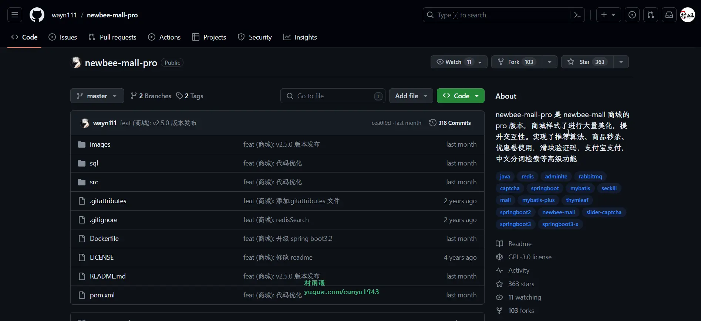
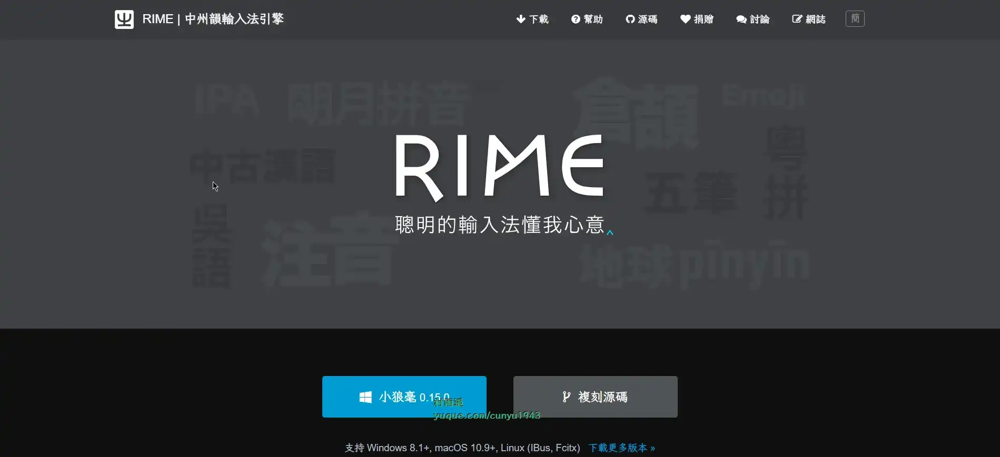
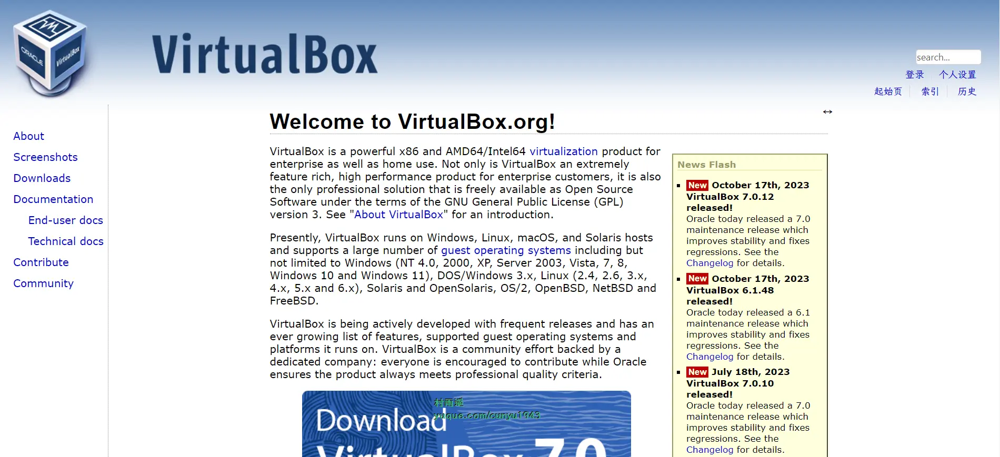
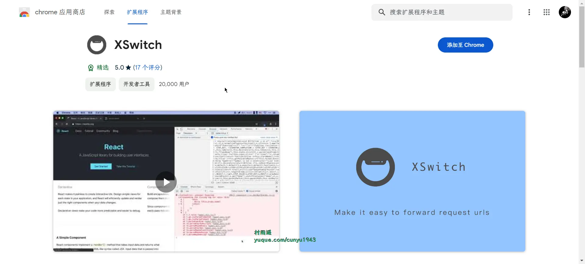
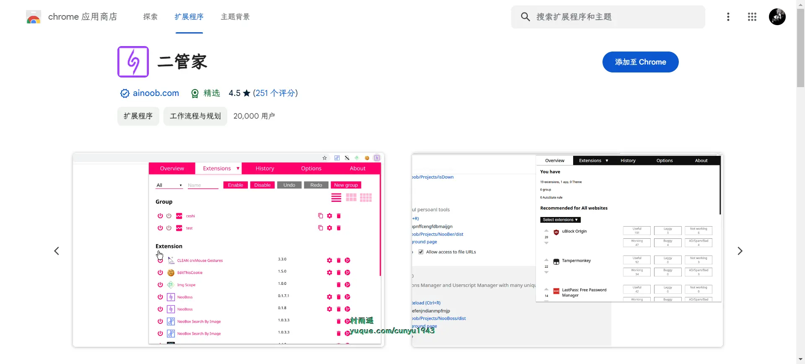
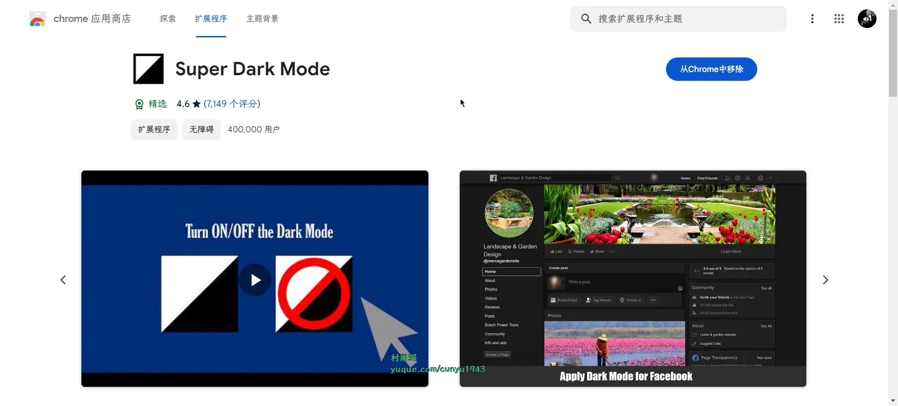
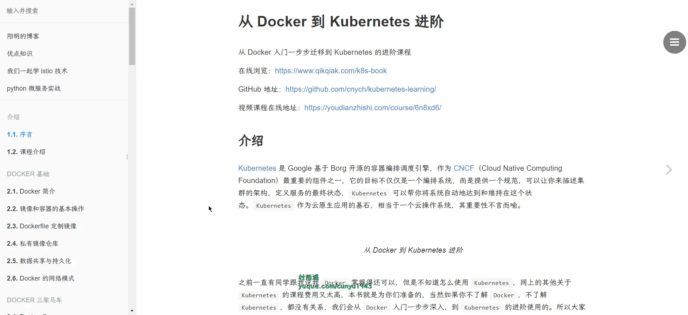
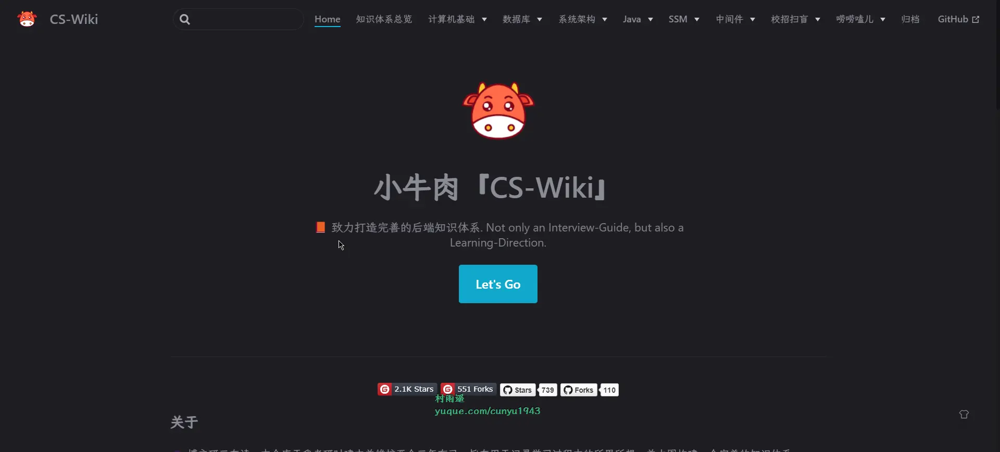
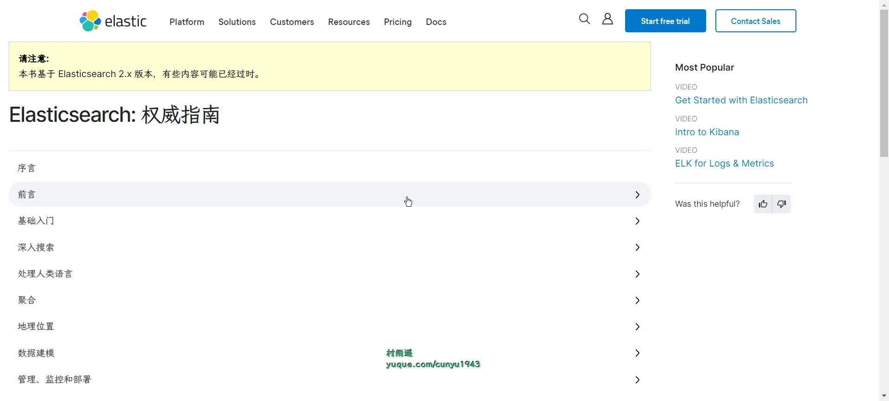

# 好物周刊#43：设计素材下载

> 作者：[村雨遥](https://github.com/cunyu1943)
> 
> 不要哀求，学会争取，若是如此，终有所获
> 
> 原文：
https://mp.weixin.qq.com/s/3bGCHHkwOObr60X5yh2pLA

## 🎈 号外 

最近，公众号之外，建立了微信交流群，不定期会在群里分享各种资源（影视、IT 编程、考试提升……）&知识。如果有需要，可以**扫码或者后台添加小编微信备注入群**。进群后**优先看群公告**，**呼叫群中【资源分享小助手】**，还能免费帮找资源哦～

 

## 一、项目

### 1. [frp](https://github.com/fatedier/frp/)

一个专注于内网穿透的高性能的反向代理应用，支持 TCP、UDP、HTTP、HTTPS 等多种协议，且支持 P2P 通信。可以将内网服务以安全、便捷的方式通过具有公网 IP 节点的中转暴露到公网。

### 2. [刚果商城](https://gitee.com/nageoffer/congomall)

一个从零到一的 C 端商城项目，包含商城核心业务和基础架构两大模块。

参照商城系统原型，推出用户、消息、商品、订单、优惠券、支付、网关、购物车等业务模块，通过商城系统中复杂场景，给出对应解决方案。使用 DDD 模型开发系统功能，帮助对 DDD 一知半解的开发者树立正确地开发思路。

### 3. [newbee-mall-pro](https://github.com/wayn111/newbee-mall-pro)

在 newbee-mall 项目的基础上改造而来，使用 mybatis-plus 作为 orm 层框架，并添加了一系列高级功能以及代码优化。对商城样式了进行大量美化，提升交互性。实现了推荐算法、商品秒杀、优惠卷使用，滑块验证码，支付宝支付，中文分词检索等高级功能。

## 二、软件

### 1. [RIME](https://rime.im/)

高度可定制化的输入法框架，完全无广告，适合喜欢折腾的朋友。

### 2. [VirtualBox](https://www.virtualbox.org/)

一款开源免费的虚拟机管理软件，支持但不限于 Windows（NT 4.0、2000、XP、Server 2003、Vista、7、8、Windows 10 和 Windows 11)、DOS/Windows 3.x、Linux（2.4、2.6、3.x、4.x、5.x 和 6.x）、Solaris 和 OpenSolaris、OS/2、OpenBSD、NetBSD 和 FreeBSD 等系统中运行。

### 3. [VMware](https://www.vmware.com/)

使用针对现代应用、多云、数字化工作空间、安全和网络的 VMware 解决方案构建数字化基础，以在任何设备和任何云环境中运行任何应用。

## 三、网站

### 1. [搜图神器](https://www.logosc.cn/so/)

一键搜索多家免版权图库，再也不用担心商用图片侵权了。

### 2. [朋友圈素材库](https://www.apptu.cn/)

设计师、运营、市场、营销、产品经理找朋友圈推广素材的必备网站。

### 3. [新 CG 儿](https://www.newcger.com/)

致力于为广大影视后期设计师打造相互交流、分享作品与经验的互动平台。同时还提供了免费 AE 模板素材下载和国内外 CG 佳作供 CG 儿学习与参考。

## 四、插件

### 1. [XSwitch](https://chromewebstore.google.com/detail/xswitch/idkjhjggpffolpidfkikidcokdkdaogg?hl=zh-CN)

可以使用它将在线 CDN 或任意其他 URL 重定向到其他 URL，如本地文件/CDN 地址/行内 JavaScript 等，使得本地开发更为简单！

### 2. [二管家](https://chromewebstore.google.com/detail/二管家/aajodjghehmlpahhboidcpfjcncmcklf)

一个全能的扩展管理和用户脚本管理扩展。

支持拓展更新通知并记录拓展历史，自动开启/关闭拓展，根据当前网站获取二管家社区推荐。

### 3. [Super Dark Mode](https://chromewebstore.google.com/detail/super-dark-mode/nlgphodeccebbcnkgmokeegopgpnjfkc)

支持给任意网站切换黑暗模式，有助于节省电量，降低眼睛压力。不过对于以下页面暂不支持：

- 新标签页
- Chrome 商店页面

## 五、资料

### 1. [从 Docker 到 Kubernetes 进阶课程](https://github.com/cnych/kubernetes-learning)

从 Docker 入门一步步迁移到 Kubernetes 的进阶课程。

### 2. [cs-wiki](https://gitee.com/veal98/cs-wiki)

博主考研时建立并一直维护，旨在用于记录学习过程中博主的所思所想，并力图构建一个完善的后端知识体系。

### 3. [Elasticsearch 权威指南](https://github.com/elasticsearch-cn/elasticsearch-definitive-guide)

Elasticsearch 权威指南翻译中文版。

## ✍️ 说明

周刊专栏相关信息：

- **项目地址**：[Github](https://github.com/cunyu1943/weekly)，觉得不错麻烦给我一个**Star**，感谢 ❤️
- **浏览地址**：公众号 | [电子书](https://cunyu1943.github.io/weekly) | [语雀](https://yuque.com/cunyu1943/weekly)

如果你阅读到这里，说明我的工作没有白费。如果你想推荐项目/网站/软件/资源，欢迎提交 **[issue](https://github.com/cunyu1943/weekly/issues)** 或者添加我 **个人微信：coder_cunYu** 与我交流。

---

## ⏳ 联系

想解锁更多知识？不妨关注我的微信公众号：**村雨遥（id：JavaPark）**。

扫一扫，探索另一个全新的世界。

