# 好物周刊#45：系统激活工具

> 作者：[村雨遥](https://github.com/cunyu1943)
> 
> 不要哀求，学会争取，若是如此，终有所获
> 
> 原文：
https://mp.weixin.qq.com/s/gY9Dd1wBb0A0zJj48wGSdw

## 一、项目

### 1. [OJ 判题系统微服务版](https://github.com/z-h-u-a-i/oj-backend-microservice)

这是一个 OJ 系统，用户可以在此系统中编写代码，提交代码，查看执行结果是否正确。同时，项目集成了 API 开放平台，制作了 SDK 来简化程序员调用 API 的程序。主要分为四个部分：
- 前端
- 微服务后端
- 开放平台 SDK
- 代码沙箱

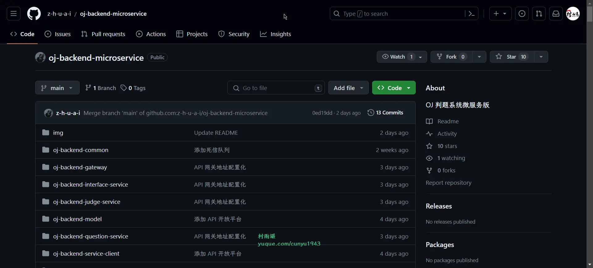

### 2. [咩咩单词](https://github.com/airingursb/miemie)

一款简易背单词的微信小程序。

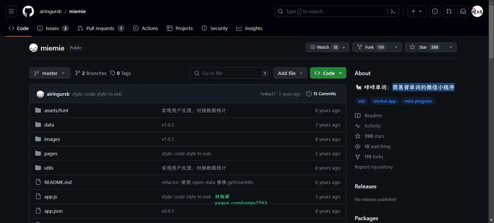

### 3. [我的电视](https://github.com/lizongying/my-tv)

安卓电视直播软件，内置直播源。

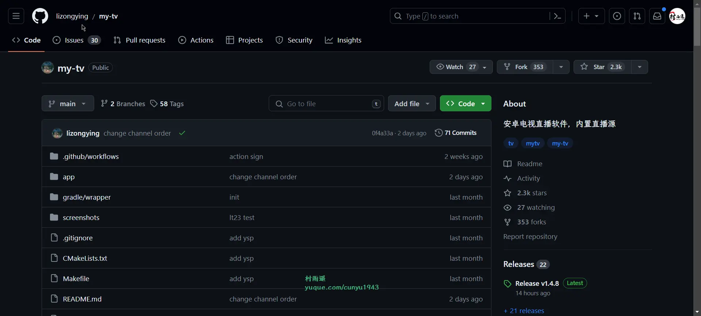

## 二、软件

### 1. [7-Zip](https://sparanoid.com/lab/7z/)

一款开源免费软件。大多数源代码都基于 GNU LGPL 许可协议下发布。部分代码基于 BSD 3 句条款（BSD 3-clause）许可协议发布。并且，部分代码受到了 unRAR 许可协议的限制。主要具有以下特性：

-   使用了 LZMA 与 LZMA2 算法的 7z 格式 拥有极高的压缩比
-   支持格式：
    -   压缩 / 解压缩：7z、XZ、BZIP2、GZIP、TAR、ZIP 以及 WIM
    -   仅解压缩：AR、ARJ、CAB、CHM、CPIO、CramFS、DMG、EXT、FAT、GPT、HFS、IHEX、ISO、LZH、LZMA、MBR、MSI、NSIS、NTFS、QCOW2、RAR、RPM、SquashFS、UDF、UEFI、VDI、VHD、VMDK、WIM、XAR 以及 Z
-   与 ZIP 及 GZIP 格式相比，7-Zip 能提供比使用 PKZip 及 WinZip 高 2-10% 的压缩比
-   为 7z 与 ZIP 提供更完善的 AES-256 加密算法
-   7z 格式支持创建自释放压缩包
-   Windows 资源管理器集成
-   强大的文件管理器
-   强大的命令行版本
-   支持 FAR Manager 插件
-   支持 87 种语言

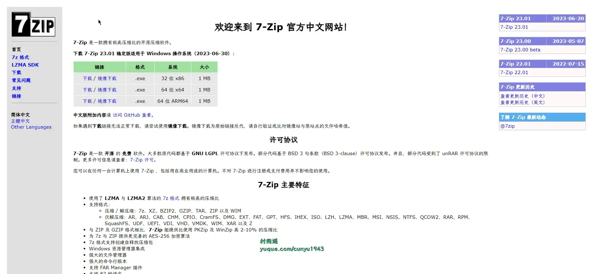

### 2. [LKY Office Tools](https://github.com/OdysseusYuan/LKY_OfficeTools)

一键自动化 下载、安装、激活 Office 的利器。绿色、开源、安全、无毒。目前支持以下功能：

- 一键快速下载、安装、激活最新版 Microsoft Office 软件。
- 用户可在安装 Word、PPT、Excel 的同时，根据软件提示，自助安装其它组件，包括： Outlook、OneNote、Access、Visio、Project、Publisher、Teams、OneDrive、Lync/Skype。
- 工具可自动识别不同的操作系统架构，自动下载适配版本的 Office。
- 本工具激活 Office 的方式为正版激活模式，不会篡改任何系统文件。
- 当系统中存在多个冗余 Office 版本时，本工具在用户同意的情况下，可实现自动升级。

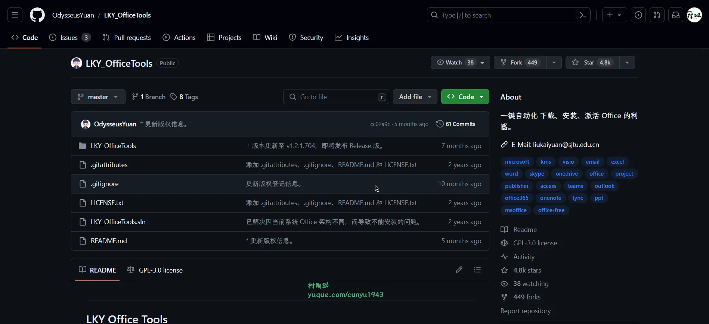

### 3. [云萌](https://github.com/TGSAN/CMWTAT_Digital_Edition)

Windows 10+ 激活工具，一键免费终身激活，享受正版相同服务，每次重装自动激活，更换硬件支持 Microsoft 账户迁移激活。

## 三、网站

### 1. [53 报刊](http://www.53bk.com/Baokan/)

全国报刊大全和国内报刊大全，在线看报系统，在线读报，报纸在线阅读系统，无论国内和国外。

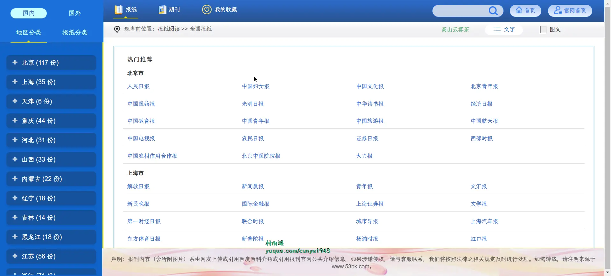

### 2. [书摘天下](http://www.shuzhai.org/)

书摘天下提供古诗词赏析，励志名言，作文写作指导，范文参考，包括名人名言，励志名言，工作总结，优秀作文，诗词鉴赏等资料。

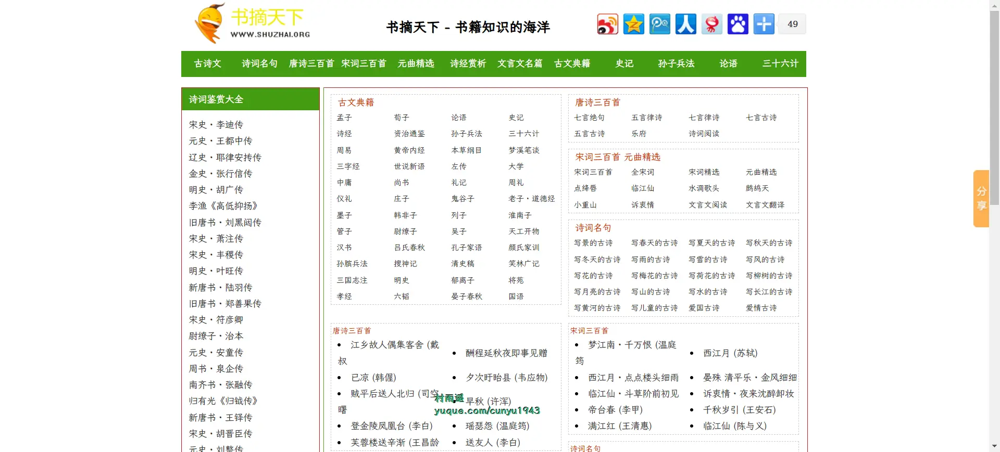

### 3. [汉典重光](https://wenyuan.aliyun.com)

汉典重光古籍数字化平台，收录海外回归古籍，基于达摩院文字识别技术进行数字化古籍识别，方便古籍爱好者查阅使用。

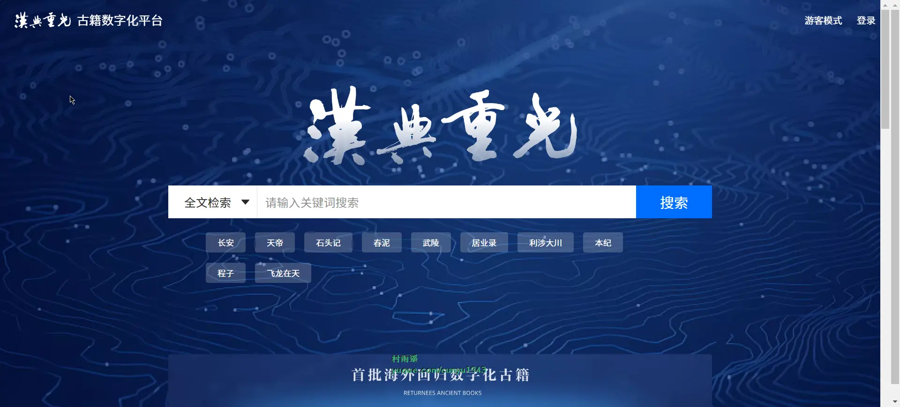

## 四、插件

### 1. [oscnews](https://chromewebstore.google.com/detail/oscnews/iheapfheanfjcemgneblljhaebonakbg)

查看开源中国软件更新资讯，内置文档导航，GitHub 趋势榜，Linux 命令索引，浏览历史记录和时钟页面。

### 2. [Replace Google CDN](https://chromewebstore.google.com/detail/replace-google-cdn/kpampjmfiopfpkkepbllemkibefkiice)

将 Google CDN 替换为国内镜像，加速网站访问速度。

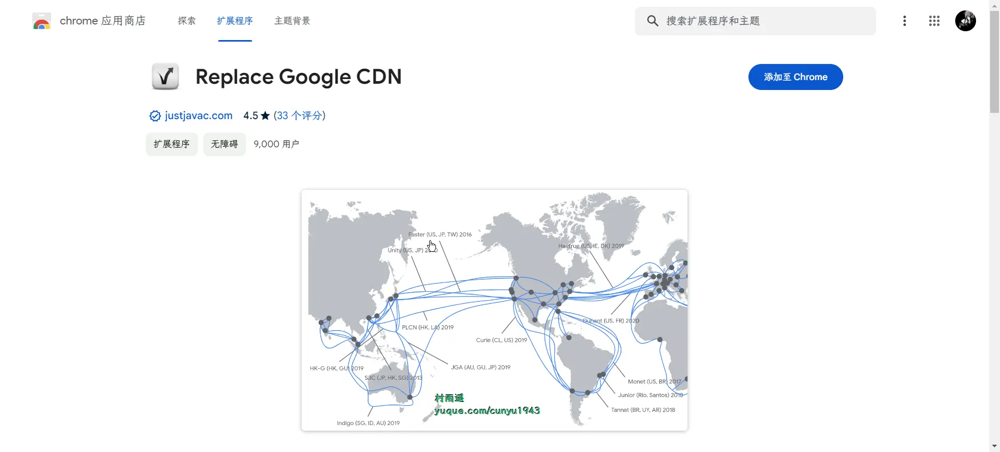

### 3. [野草书签](https://chromewebstore.google.com/detail/野草书签/agboddkglokgkojmbjefdpccdopckjnp?hl=zh-CN)

基于 Chrome 的书签管理器，启用插件后会提示是否覆盖默认页面，点确定后插件会接管默认首页，插件具有如下特性：

- 基于 Chrome 自身收藏夹数据。
- 支持 mp4, webm, m8u3 等音视频后缀直接播放。
- 支持第三方独立播放器在线播放。（只要包含【?url=】等特征即可。）
- 支持上传本地文件到图床服务器。
- 支持暗黑模式。
- 支持拖动排序书签顺序。

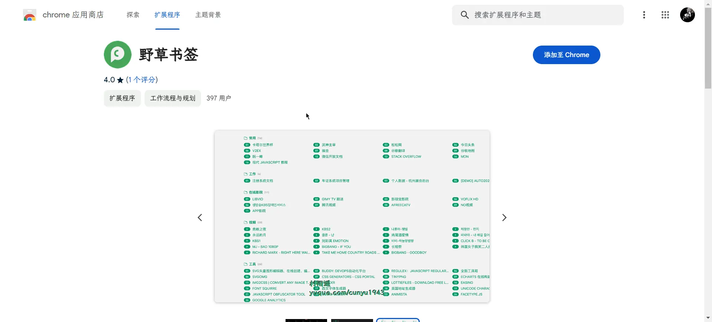

## 五、资料

### 1. [值得一看的技术类书籍列表](https://github.com/doocs/technical-books)

国内外互联网技术大牛们都写了哪些书籍：计算机基础、网络、前端、后端、数据库、架构、大数据、深度学习……

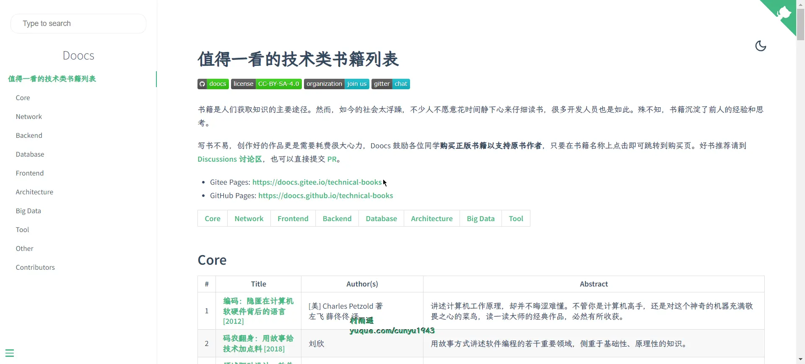

### 2. [VimWiki](https://github.com/vimwiki/vimwiki)

Vim 中的个人 Wiki —— 一组链接起来的、有独特语法高亮的文本文件。

通过 Vimwiki，你可以:

- 组织笔记和想法
- 管理待办事项
- 编写文档
- 坚持写日记
- 将这一切导出成 HTML 网页

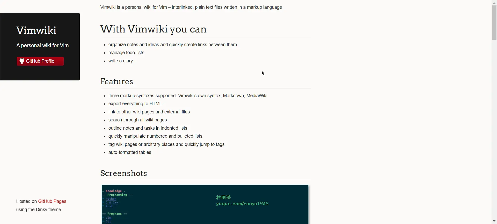

### 3. [The Book of Secret Knowledge](https://github.com/trimstray/the-book-of-secret-knowledge)

作者收集的一系列提升效率的清单，包含手册、备忘录、博客、cli/web 工具等，截止目前已经收获了 120k 的 star。

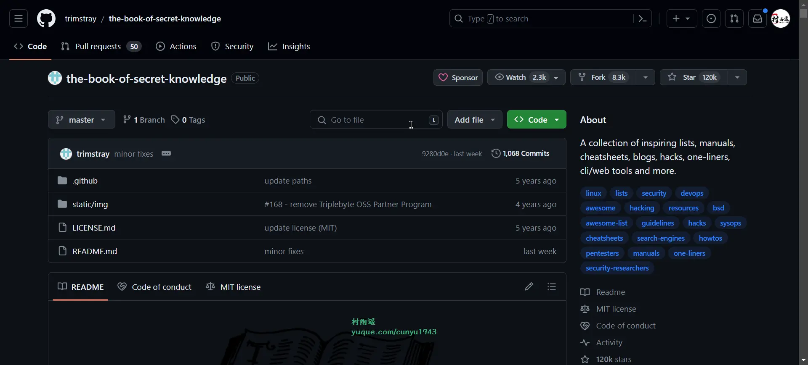

## ✍️ 说明

周刊专栏相关信息：

- **项目地址**：[Github](https://github.com/cunyu1943/weekly)，觉得不错麻烦给我一个**Star**，感谢 ❤️
- **浏览地址**：公众号 | [电子书](https://cunyu1943.github.io/weekly) | [语雀](https://yuque.com/cunyu1943/weekly)

如果你阅读到这里，说明我的工作没有白费。如果你想推荐项目/网站/软件/资源，欢迎提交 **[issue](https://github.com/cunyu1943/weekly/issues)** 或者添加我 **个人微信：coder_cunYu** 与我交流。

---

## ⏳ 联系

想解锁更多知识？不妨关注我的微信公众号：**村雨遥（id：JavaPark）**。

扫一扫，探索另一个全新的世界。

