# 好物周刊#47：快捷启动器

> 作者：[村雨遥](https://github.com/cunyu1943)
> 
> 不要哀求，学会争取，若是如此，终有所获
> 
> 原文：
https://mp.weixin.qq.com/s/MpM92h9ejra3cL6-gOCUaQ

## 🎈 号外 

最近，公众号之外，建立了微信交流群，不定期会在群里分享各种资源（影视、IT 编程、考试提升……）&知识。如果有需要，可以**扫码或者后台添加小编微信备注入群**。进群后**优先看群公告**，**呼叫群中【资源分享小助手】**，还能免费帮找资源哦～

 

## 一、项目

### 1. [Tianji](https://github.com/msgbyte/tianji)

`All-in-One` 的数据洞察中心，同时具备网站分析器 + 状态监控器 + 服务状态上报的功能。

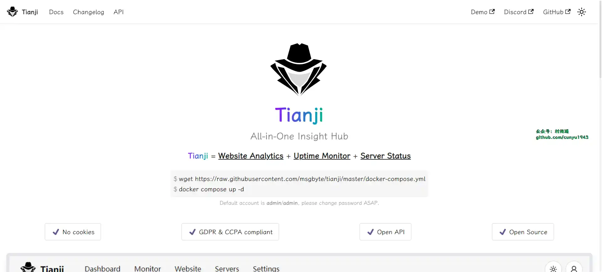

### 2. [Ip2regin](https://gitee.com/lionsoul/ip2region)

一个离线 `IP` 地址定位库和 `IP` 定位数据管理框架，10 微秒级别的查询效率，提供了众多主流编程语言的 `xdb` 数据生成和查询客户端实现。

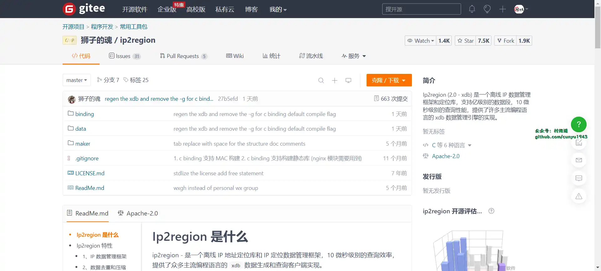

### 3. [asyncTool](https://gitee.com/jd-platform-opensource/asyncTool)

解决任意的多线程并行、串行、阻塞、依赖、回调的并行框架，可以任意组合各线程的执行顺序，带全链路执行结果回调。多线程编排一站式解决方案。

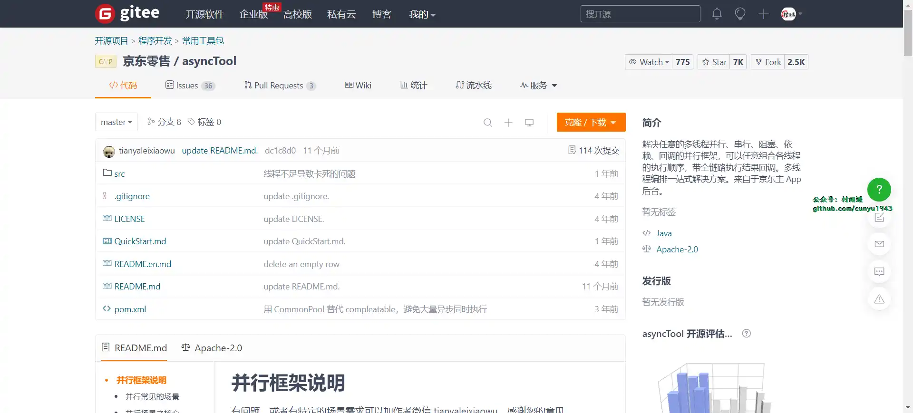

## 二、软件

### 1. [uTools](https://u.tools/)

新一代效率工具平台，自由组合插件应用，打造专属你的趁手工具集。

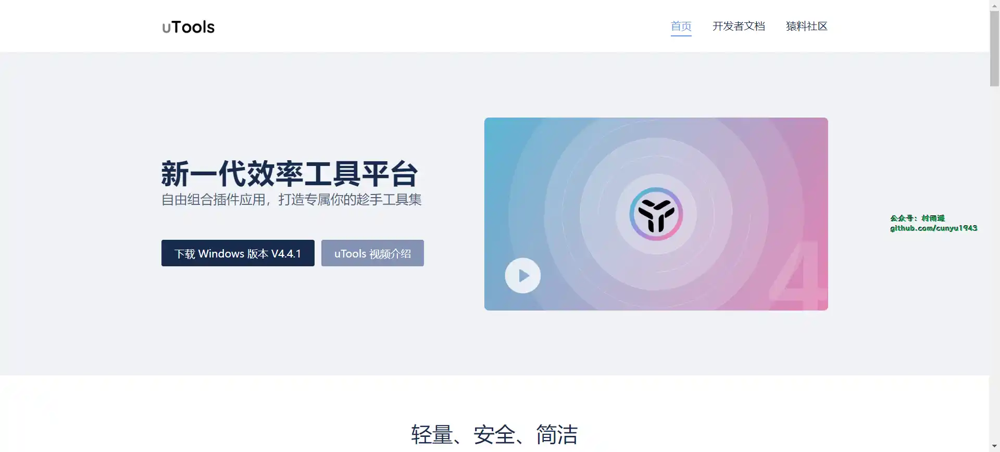

### 2. [Wox](https://github.com/Wox-launcher/Wox)

一款快捷启动工具软件，可以搜索你电脑上的程序/文件。。通过快捷键呼出搜索框，输入关键词快速匹配出对应软件并启动。配合插件甚至可以打开网页、翻译单词等。

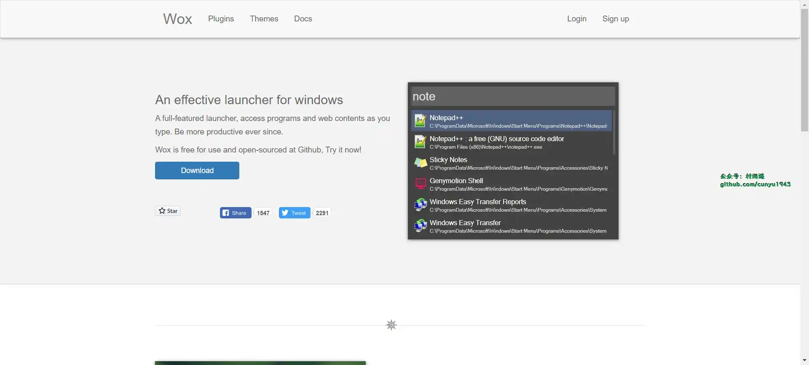

### 3. [Raycast](https://www.raycast.com/)

`macOS` 下的一款应用程序启动器和生产力软件。提供对应用程序、词典、文件、文本片段、剪贴板等的快速访问。

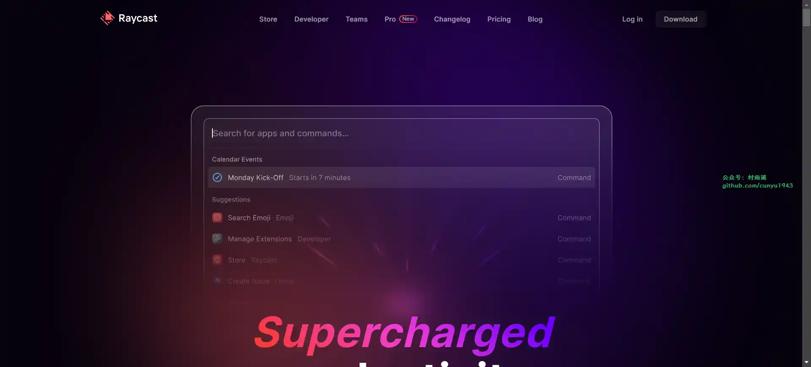

## 三、网站

### 1. [All To All](https://www.alltoall.net/)

国最全面的格式转换平台。支持约 200 多种格式的文件转换，包括：视频、音频、图片、字体等多媒体文件，以及常见的 `office` 文件、`PDF`、电子书等文档。

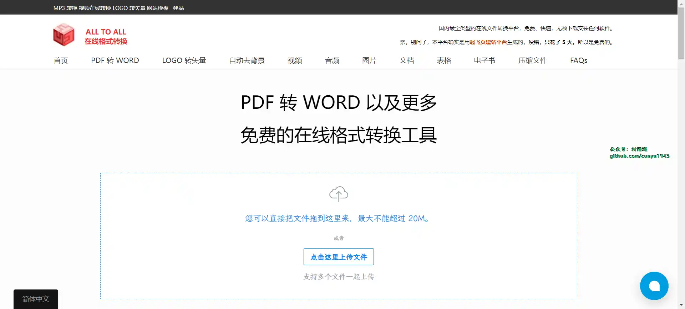

### 2. [致美化](https://zhutix.com/)

致美化是国内最专业的视觉美化研究平台，聚集了超过 50 万的活跃用户，你可以在此个性化你的设备，探索及下载丰富多彩的电脑主题、壁纸、图标、皮肤等酷炫的美化素材及教程。

### 3. [Win 7](https://www.newxitong.com/)

专注于 `Win7` 系列作品是吻妻出品，一直专注于 `win7`，致力于分享最新最好用的 `Windows7` 纯净旗舰版系统下载，而吻妻是一位有态度，有原则的不随波逐流的系统爱好者。

## 四、插件

### 1. [翻译侠](https://chromewebstore.google.com/detail/翻译侠（translate-man）/fapgabkkfcaejckbfmfcdgnfefbmlion)

支持划词翻译，即指即译，自动识别语言，支持上百种语言，专为国内用户优化，采用谷歌翻译接口，人性化界面。

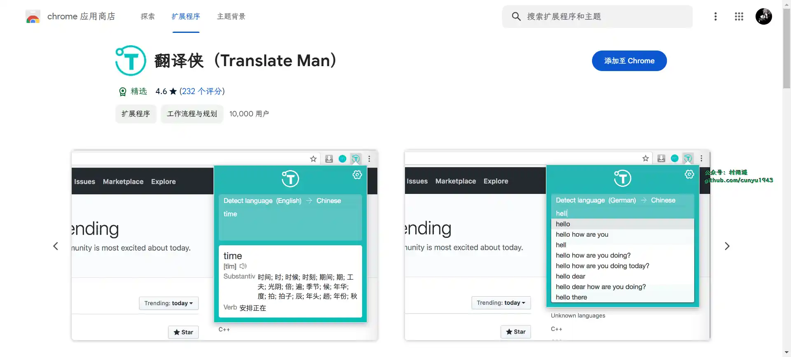

### 2. [FetchV](https://chromewebstore.google.com/detail/fetchv-m3u8hls视频下载器/imleiiaoeclikefimmcdkjabjbpcdgaj)

通用的网页视频下载器，免费、安全、简单易用。帮助你轻松将 `m3u8`、直播、`mp4`、`webm` 等在线视频下载到本地。支持多线程下载模式，在视频服务器和你的带宽条件允许之下，一个约 `1GB` 的视频可以在约十分钟内下载完成。

### 3. [easyScholar](https://chromewebstore.google.com/detail/easyscholar/njgedjcccpcfmjecccaajkjiphpddfji)

显示各种文献排名，并且提供翻译、文献收藏功能，助力科研。具有以下功能：

-   显示期刊登记
-   在线翻译
-   文献管理

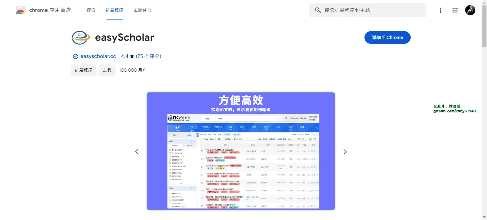

## 五、资料

### 1. [掘金翻译计划](https://github.com/xitu/gold-miner)

可能是世界最大最好的英译中技术社区，最懂读者和译者的翻译平台。

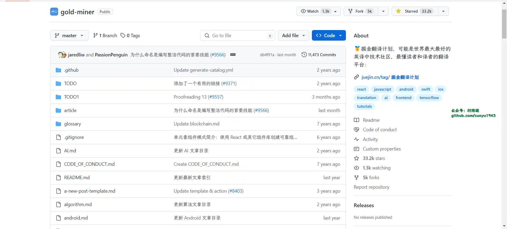

### 2. [955.WLB](https://github.com/formulahendry/955.WLB)

955 不加班的公司名单，旨在让更多的人逃离 996，加入 955 的行列。

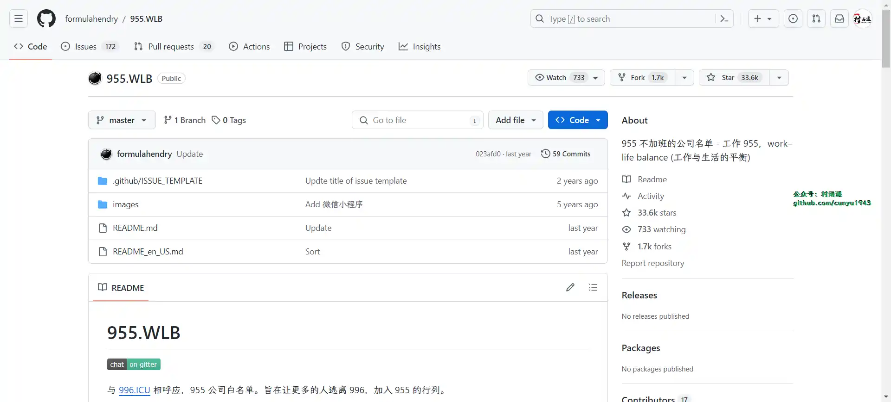

### 3. [996.ICU](https://github.com/996icu/996.ICU)

与 995.WLB 相对应，需要 996 加班的公司名单。旨在让更多人在找工作时尽量规避，远离 996。

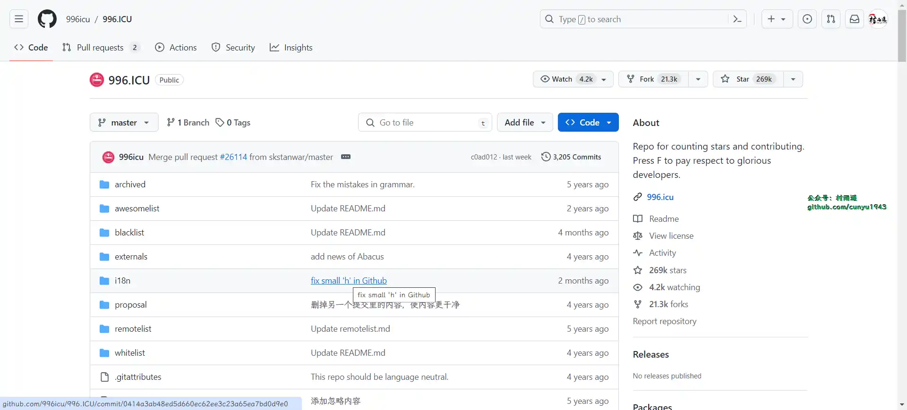

## ✍️ 说明

周刊专栏相关信息：

- **项目地址**：[Github](https://github.com/cunyu1943/weekly)，觉得不错麻烦给我一个**Star**，感谢 ❤️
- **浏览地址**：公众号 | [电子书](https://cunyu1943.github.io/weekly) | [语雀](https://yuque.com/cunyu1943/weekly)

如果你阅读到这里，说明我的工作没有白费。如果你想推荐项目/网站/软件/资源，欢迎提交 **[issue](https://github.com/cunyu1943/weekly/issues)** 或者添加我 **个人微信：coder_cunYu** 与我交流。

---

## ⏳ 联系

想解锁更多知识？不妨关注我的微信公众号：**村雨遥（id：JavaPark）**。

扫一扫，探索另一个全新的世界。

