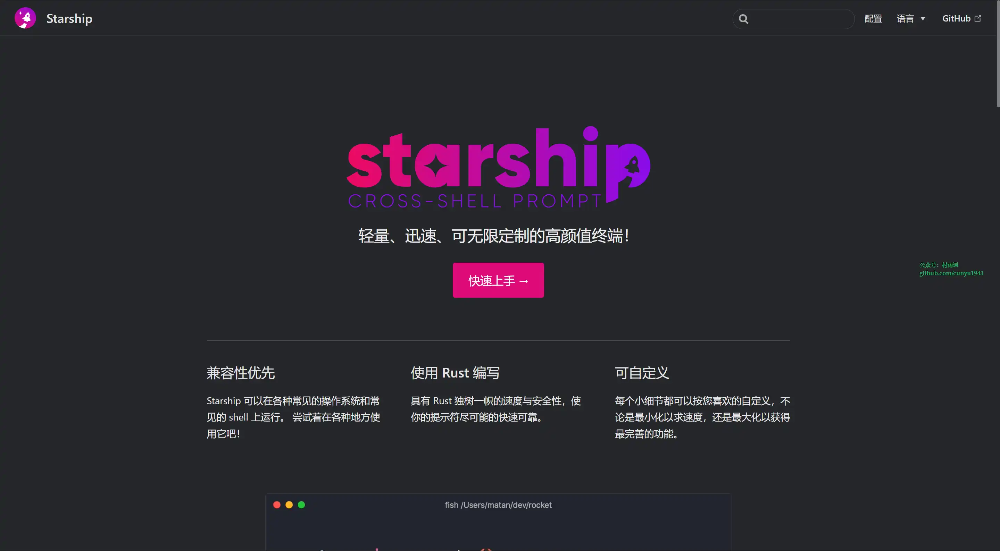
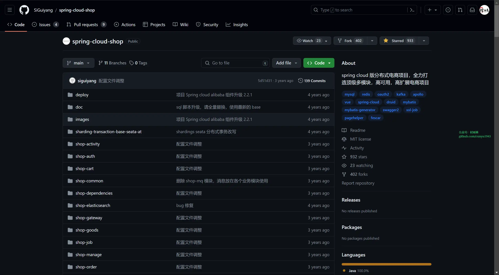
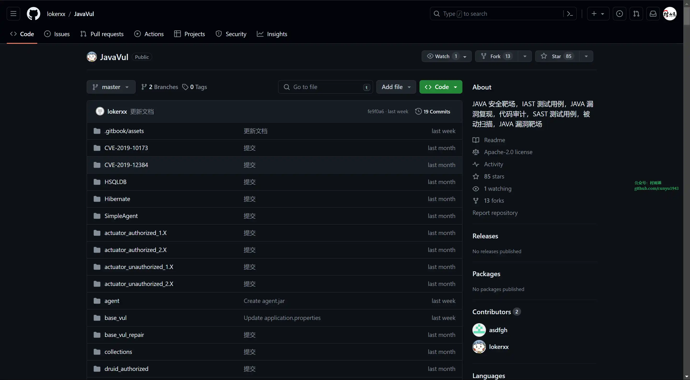
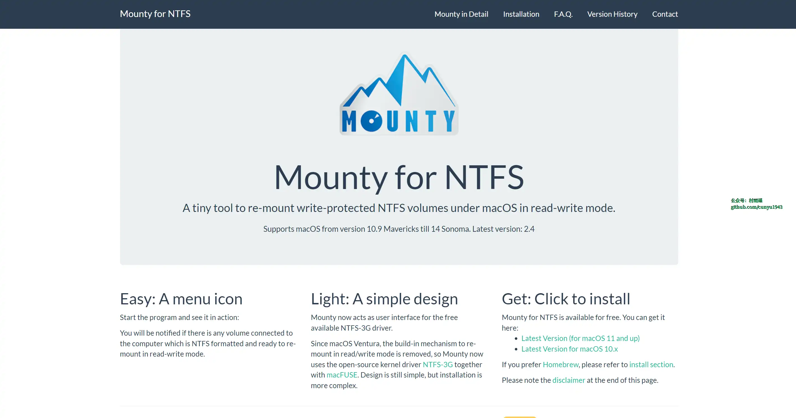
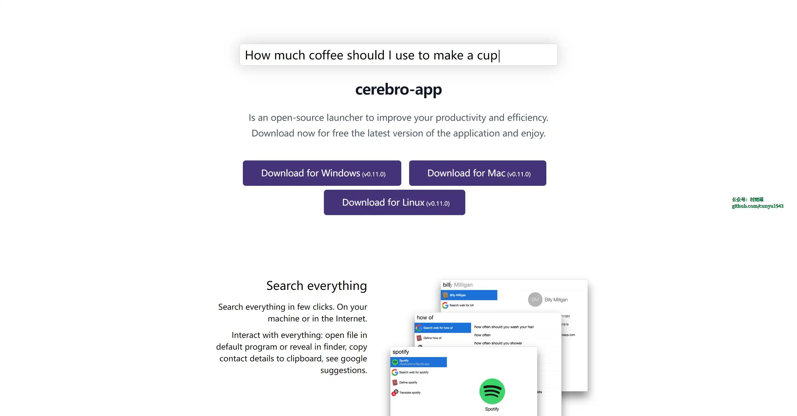
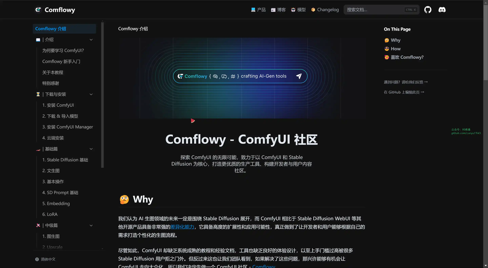
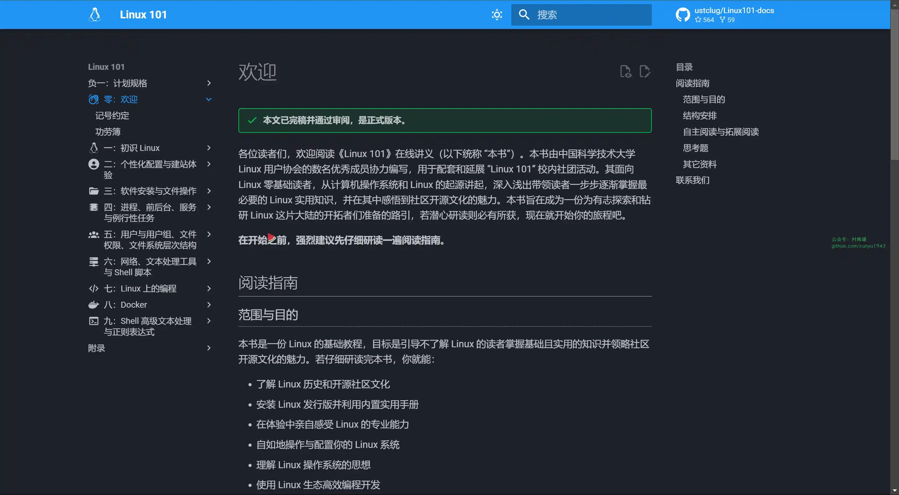

# 好物周刊#49：字幕交流网站

> 作者：[村雨遥](https://github.com/cunyu1943)
> 
> 不要哀求，学会争取，若是如此，终有所获
> 
> 原文：https://mp.weixin.qq.com/s/aBki6pNYWQLL_AIg2TcGIw

## 🎈 号外 

最近，公众号之外，建立了微信交流群，不定期会在群里分享各种资源（影视、IT 编程、考试提升……）&知识。如果有需要，可以**扫码或者后台添加小编微信备注入群**。进群后**优先看群公告**，**呼叫群中【资源分享小助手】**，还能免费帮找资源哦～

 

## 一、项目

### 1. [Starship](https://github.com/starship/starship)

轻量、迅速、可无限定制的高颜值终端，可用于各种 `Shell` 的提示符。

### 2. [spring cloud shop](https://github.com/SiGuiyang/spring-cloud-shop)

`Spring Cloud` 版分布式电商项目，全力打造顶级多模块，高可用，高扩展电商项目。

### 3. [JavaVul](https://github.com/lokerxx/JavaVul)

`Java` 安全漏洞靶场，用于测试 `IAST` 和扫描器的被动扫描功能，集合了多个安全漏洞，利用 `docker` 镜像为每个靶场独立环境运行。

## 二、软件

### 1. [Mounty](https://mounty.app/)

`macOS` 中挂载 `NTFS` 格式硬盘的工具，方便在 `macOS` 中读写 `Windows` 格式硬盘。

### 2. [Cerebro](https://github.com/cerebroapp/cerebro)

一个开源启动器，类似于 `macOS` 中的 `Alfred`，用于提高生产力和效率。

### 3. [showDoc](https://github.com/star7th/showdoc)

一个非常适合 `IT` 团队的在线 `API` 文档、技术文档工具。你可以使用 `Showdoc` 来编写在线 `API` 文档、技术文档、数据字典、在线手册。

## 三、网站

### 1. [字幕库](https://srtku.com/)

字幕下载网站，提供中文、美剧、韩剧字幕下载。

### 2. [SubHD](https://subhd.tv/)

分享交流下载字幕平台，绝对是美剧、韩剧、日剧等爱好者但又看不懂生肉朋友的福地。

### 3. [R3 字幕网](https://r3sub.com/)

`R3` 字幕网提供最方便的字幕搜索、电影简介、电影剧照、电影评分。

## 四、插件

### 1. [什么字体](https://chromewebstore.google.com/detail/什么字体-找字体/acpcapnaopbhbelhmbbmppghilclpkep)

通过该插件，能够知道自己当前正在浏览的网站所用的字体。

### 2. [Bonjourr](https://chromewebstore.google.com/detail/dlnejlppicbjfcfcedcflplfjajinajd)

一个美观，轻量，可自定义的主页。

每当你打开一个新的窗口或标签，迎接你的将是这个看起来很简约的页面，这将有助于你的宁静和生产力。由于其华丽的高质量背景根据一天的心情而变化，你的新标签将永远感到新鲜。

### 3. [DeepL 翻译](https://chromewebstore.google.com/detail/cofdbpoegempjloogbagkncekinflcnj)

无需离开浏览器，你便可以享受 `DeepL` 无与伦比的翻译质量。 轻松翻译你在 `Chrome` 浏览器内阅读或输入的任何内容。如果你是 `DeepL Pro` 用户，还可以进行全网页翻译。 如果你需要翻译任何文本，请先选择该文本，并点击随之出现的 `DeepL` 图标。如果你想在 `Chrome` 浏览器上使用 `DeepL` 更快捷地翻译你所读写的内容，还可以在设置中自定义快捷方式。

## 五、资料

### 1. [Comflowy](https://github.com/6174/comflowy)

探索 `ComfyUI` 的无限可能，致力于以 `ComfyUI` 和 `Stable Diffusion` 为核心，打造更优质的生产工具、构建开发者与用户内容社区。

### 2. [Linux 101](https://github.com/ustclug/Linux101-docs)

一份 `Linux` 的基础教程，目标是引导不了解 `Linux` 的读者掌握基础且实用的知识并领略社区开源文化的魅力。通过阅读本书，你能：

- 了解 `Linux` 历史和开源社区文化
- 安装 `Linux` 发行版并利用内置实用手册
- 在体验中亲自感受 `Linux` 的专业能力
- 自如地操作与配置你的 `Linux` 系统
- 理解 `Linux` 操作系统的思想
- 使用 `Linux` 生态高效编程开发
- 以及灵活运用其它 `Linux` 生态中十分流行的各类工具等等

### 3. [数据库教程](https://www.sjkjc.com/)

一个数据库相关的技术学习网站，定期发布数据相关的文章、教程、资讯等。教程包括 `MySQL`，`PostgreSQL`，`Oracle`，`SQL Server`, `SQLite`，`MongoDB`，`Redis` 等关系数据库和非关系数据库。本站所有的教程都是基于实例的，都带有可以运行的代码及实操的截图，助您更快的进入数据库的世界。

## ✍️ 说明

周刊专栏相关信息：

- **项目地址**：[Github](https://github.com/cunyu1943/weekly)，觉得不错麻烦给我一个**Star**，感谢 ❤️
- **浏览地址**：公众号 | [电子书](https://cunyu1943.github.io/weekly) | [语雀](https://yuque.com/cunyu1943/weekly)

如果你阅读到这里，说明我的工作没有白费。如果你想推荐项目/网站/软件/资源，欢迎提交 **[issue](https://github.com/cunyu1943/weekly/issues)** 或者添加我 **个人微信：coder_cunYu** 与我交流。

---

## ⏳ 联系

想解锁更多知识？不妨关注我的微信公众号：**村雨遥（id：JavaPark）**。

扫一扫，探索另一个全新的世界。

