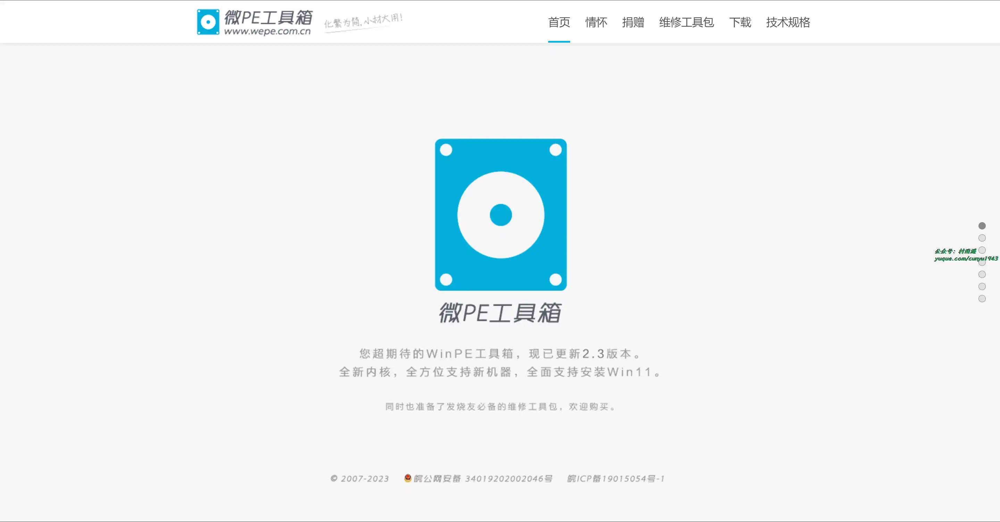

# 好物周刊#52：此刻电影推荐

> 作者：[村雨遥](https://github.com/cunyu1943)
>
> 不要哀求，学会争取，若是如此，终有所获
>
> 原文：https://mp.weixin.qq.com/s/hQ9ndcLvr2Gf-xXa_jaDNA

## 🎈 号外 

最近，公众号之外，建立了微信交流群，不定期会在群里分享各种资源（影视、IT 编程、考试提升……）&知识。如果有需要，可以**扫码或者后台添加小编微信备注入群**。进群后**优先看群公告**，**呼叫群中【资源分享小助手】**，还能免费帮找资源哦～

 

## 一、项目

### 1. [MeterSphere](https://github.com/metersphere/metersphere)

一站式开源持续测试平台，涵盖测试跟踪、接口测试、`UI` 测试和性能测试等功能，全面兼容 `JMeter`、`Selenium` 等主流开源标准，有效助力开发和测试团队充分利用云弹性进行高度可扩展的自动化测试，加速高质量的软件交付，推动中国测试行业整体效率的提升。

### 2. [MateCloud](https://github.com/matevip/matecloud)

一款基于 `Spring Cloud Alibaba` 的微服务架构。目前已经整合 `Spring Boot 2.7.0`、 `Spring Cloud 2021`、`Spring Cloud Alibaba 2021`、`Spring Security Oauth2`、`Feign`、`Dubbo`、`JetCache`、`RocketMQ` 等，支持多租户的低代码平台，`Saas` 平台开发套件。

### 3. [lute](https://github.com/88250/lute)

一款结构化的 `Markdown` 引擎，支持 `Go` 和 `JavaScript`，完整实现了最新的 `GFM/CommonMark` 规范，对中文语境支持更好。

## 二、软件

### 1. [WizTree](https://www.diskanalyzer.com/)

一款免费的电脑磁盘空间分析软件，直接从 `NTFS` 格式的驱动器读取主文件表 (`MFT`) ，速度十分快，算得上是最快的磁盘分析工具之一了。

### 2. [微 PE 工具箱](https://www.wepe.com.cn/)

跨时代的 `PE` 工具箱，装机维护得力的助手，最后的救命稻草。化繁为简，小材大用，一键安装，极速启动。

### 3. [HiBit Uninstaller](https://www.hibitsoft.ir/Uninstaller.html)

免费小巧却功能强大的 `Windows` 系统软件卸载工具。

## 三、网站

### 1. [OfficePlus](https://www.officeplus.cn/)

微软 `officePLUS` 是微软官方在线 `PPT` 模板、插件网站，提供各类 `PPT` 模板、`PPT` 模板免费下载、`PPT` 素材、求职简历 `PPT`、教学课件 `PPT`、营销策划 `PPT`、`PPT` 模板页、`PPT` 关系图、`PPT` 图表。

### 2. [LearnKu](https://learnku.com/)

专为终身学习者定制的编程知识社区。

### 3. [此刻](https://www.cikeee.com/)

电影日历，每天推荐一部优秀电影。电影爱好者的心灵港湾，在这里，发现电影，享受电影，分享电影。

## 四、插件

### 1. [FaceBook 视频下载器](https://chromewebstore.google.com/detail/kjnmedaeobfmoehceokbmpamheibpdjj?hl=zh-CN)

使用此扩展程序，您不仅可以从 `facebook.com` 下载 `Facebook` 视频，还可以从其他网站下载。 

### 2. [refoorest](https://chromewebstore.google.com/detail/lfngfmpnafmoeigbnpdfgfijmkdndmik)

无需更改搜索引擎即可植树的免费解决方案。

### 3. [Raindrop.io](https://chromewebstore.google.com/detail/raindropio/ldgfbffkinooeloadekpmfoklnobpien)

多功能的书签管理工具，支持如下功能：

- 保存网络上的任何内容
- 轻松整理收藏
- 支持全文搜索和永久保存
- 无跟踪或侵入性广告
- ……

## 五、资料

### 1. [JavaScript 工程师的 Python 指南](https://github.com/luckrnx09/python-guide-for-javascript-engineers)

一本基于 `abook` 编写的开源电子书，涵盖了从 `Python` 环境安装到项目开发的方方面面。本书通过大量案例对比 `JavaScript` 和 `Python` 语言的异同，帮助 `JavaScript` 工程师快速掌握 `Python` 语言。

### 2. [云安全攻防入门](https://lzcloudsecurity.gitbook.io/yun-an-quan-gong-fang-ru-men)

关于云安全攻防的基础知识，适用于初中级安全从业人员，乙方安全测试，甲方安全自检，网络安全爱好者等，企业安全防护与提高。

### 3. [Easy 搞定 Golang 设计模式](https://www.yuque.com/aceld/lfhu8y/rg6nsf)

一份 `Golang` 设计模式教程，涵盖创建型、结构型、行为型模式。

## ✍️ 说明

周刊专栏相关信息：

- **项目地址**：[Github](https://github.com/cunyu1943/weekly)，觉得不错麻烦给我一个**Star**，感谢 ❤️
- **浏览地址**：公众号 | [电子书](https://cunyu1943.github.io/weekly) | [语雀](https://yuque.com/cunyu1943/weekly)

如果你阅读到这里，说明我的工作没有白费。如果你想推荐项目/网站/软件/资源，欢迎提交 **[issue](https://github.com/cunyu1943/weekly/issues)** 或者添加我 **个人微信：coder_cunYu** 与我交流。

---

## ⏳ 联系

想解锁更多知识？不妨关注我的微信公众号：**村雨遥（id：JavaPark）**。

扫一扫，探索另一个全新的世界。

