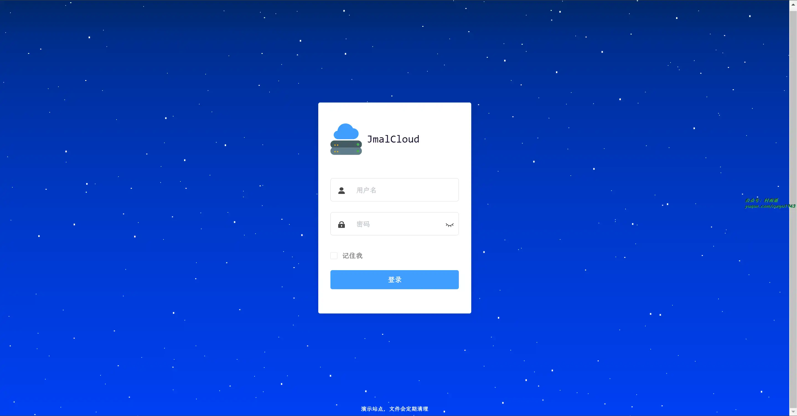
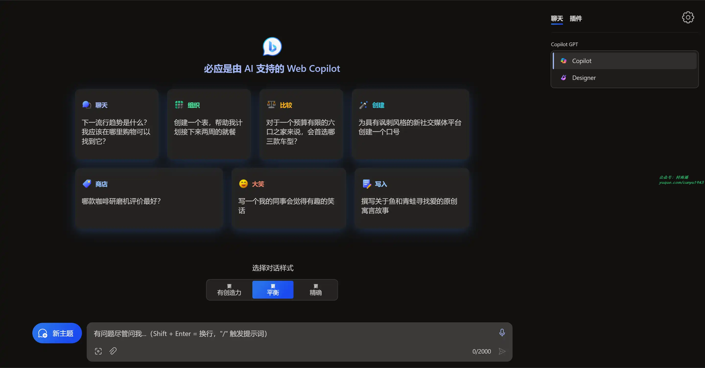
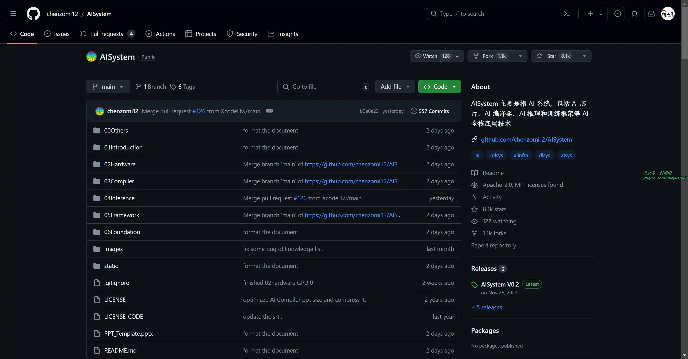
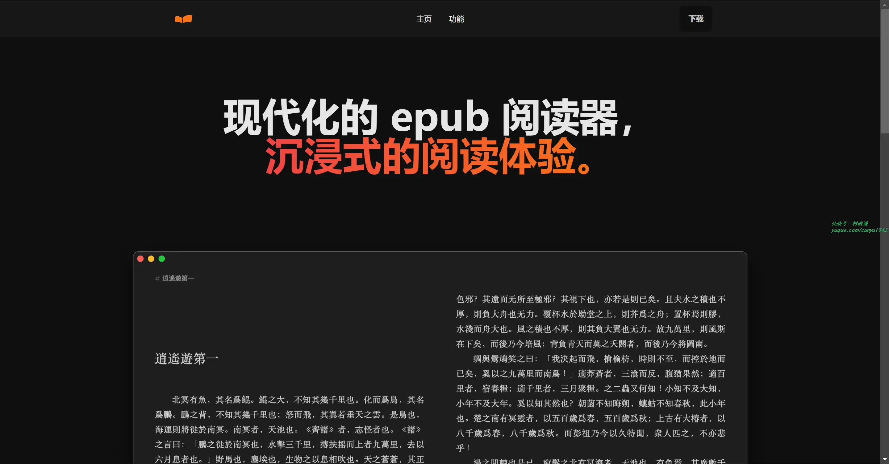
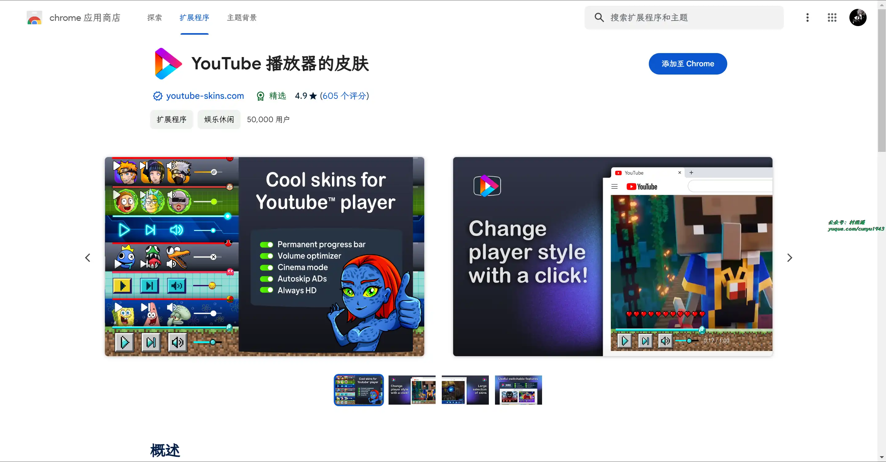
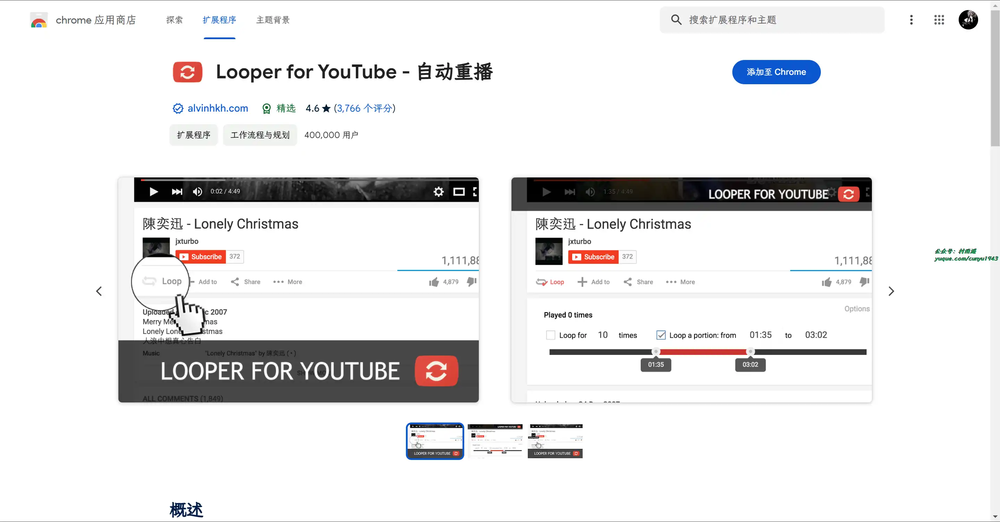
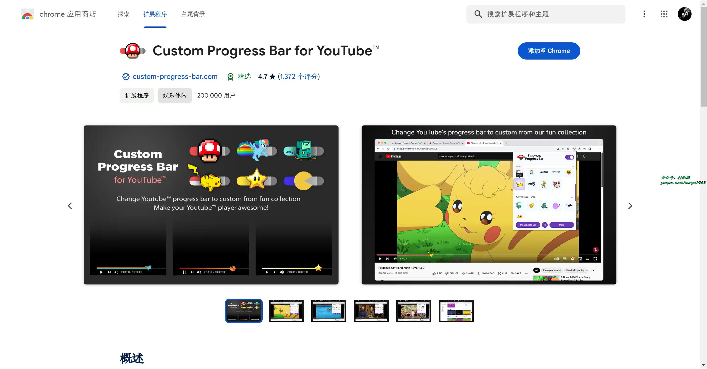
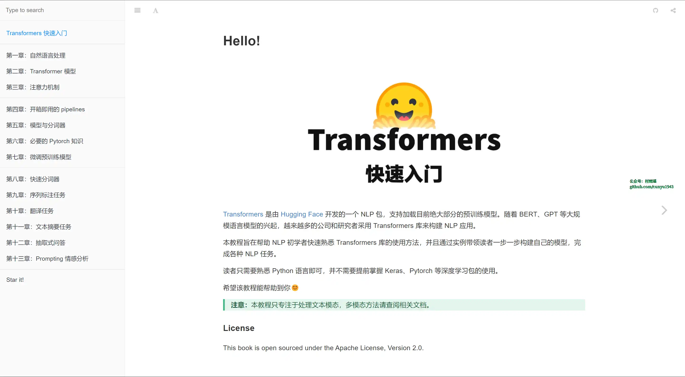
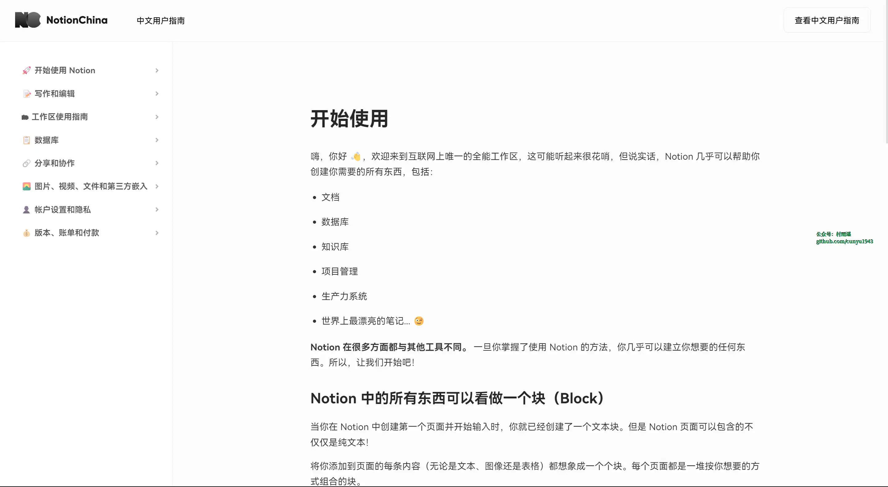
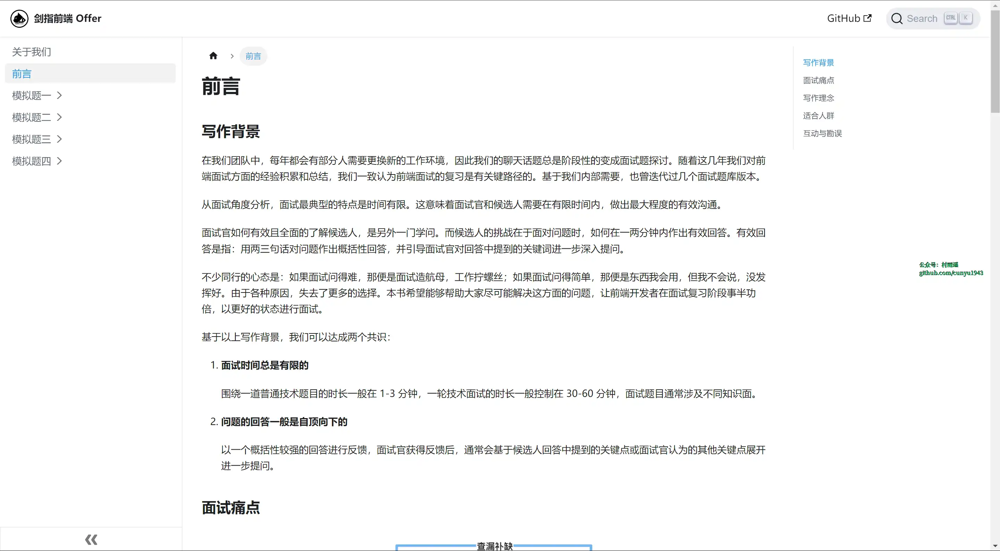

# 好物周刊#53：大模型工具

> 作者：[村雨遥](https://github.com/cunyu1943)
>
> 不要哀求，学会争取，若是如此，终有所获
>
> 原文：

## 🎈 号外 

最近，公众号之外，建立了微信交流群，不定期会在群里分享各种资源（影视、IT 编程、考试提升……）&知识。如果有需要，可以**扫码或者后台添加小编微信备注入群**。进群后**优先看群公告**，**呼叫群中【资源分享小助手】**，还能免费帮找资源哦～

 

## 一、项目

### 1. [JmalCloud 个人网盘](https://github.com/jamebal/jmal-cloud-view)

一款私有云存储网盘项目，能够简单安全管理您的云端文件。具有以下特点：

- ✅ 支持 OSS, 阿里云 OS、腾讯云 OSS 和 MinIO
- ✅ 支持图片，音频，视频等文件的在线预览
- ✅ 支持 Word、Excel、PPT、流程图和思维导图的编辑和预览
- ✅ 支持 x86、arm64 (Centos/Debian/Ubuntu/macOS)
- ✅ 提供强大的在线文本编辑器
- ✅ 支持超大文件上传，断点续传
- ✅ 支持 WebDAV

### 2. [Go-Proxy-BingAI](https://github.com/Harry-zklcdc/go-proxy-bingai)

用 Vue3 和 Go 搭建的微软 New Bing 演示站点，拥有一致的 UI 体验，支持 ChatGPT 提示词，一键部署，支持 API 调用，国内可用，无需登录即可畅聊。

### 3. [AI System](https://github.com/chenzomi12/AISystem)

主要指 AI 系统，包括 AI 芯片、AI 编译器、AI 推理和训练框架等 AI 全栈底层技术。

项目旨在跟大家一起探讨和学习人工智能、深度学习的系统设计，而整个系统是围绕着 ZOMI 在工作当中所积累、梳理、构建 AI 系统全栈的内容。希望跟所有关注 AI 开源项目的好朋友一起探讨研究，共同促进学习讨论。

## 二、软件

### 1. [智谱清言](https://chatglm.cn/)

清华大学千亿参数对话模型，基于 GLM 模型开发，支持多轮对话，具备内容创作、信息归纳总结等能力。

### 2. [推兔](https://tuitool.cn/)

多平台多账号内容运营工具，主流内容创作平台多账号登录，作品一键分发，评论自动回复，数据综合分析。

### 3. [Jane Reader](https://janereader.com/)

一款现代化的 epub 阅读器，沉浸式的阅读体验。

## 三、网站

### 1. [豆包](https://www.doubao.com/)

你的 AI 聊天智能对话问答助手，写作文案翻译情感陪伴编程全能工具。豆包为你答疑解惑，提供灵感，辅助创作，也可以和你畅聊任何你感兴趣的话题。

### 2. [腾讯混元](https://hunyuan.tencent.com/)

由腾讯研发的大语言模型，具备强大的中文创作能力，复杂语境下的逻辑推理能力，以及可靠的任务执行能力。

### 3. [面壁露卡](https://luca.cn/)

知乎旗下千亿多模态大模型，智能对话助手。

基于面壁智能的新一代大语言模型，能与你互动对话，帮你了解世界知识、激发创作灵感、理解图片内容、处理数理逻辑、编写程序代码，帮助你更好地获取信息、做出规划、解决问题。

## 四、插件

### 1. [YouTube 皮肤](https://chromewebstore.google.com/detail/imomahaddnhnhfggpmpbphdiobpmahof)

自动跳过广告、影院模式、永久进度条和许多自定义 YouTube 播放器主题。

### 2. [Looper for YouTube](https://chromewebstore.google.com/detail/iggpfpnahkgpnindfkdncknoldgnccdg)

一键自动重播 YouTube 视频 ，还可以设置默认自动重播每段视频、重播多少次、重播某个部分。

### 3. [Custom Progress Bar for YouTube](https://chromewebstore.google.com/detail/custom-progress-bar-for-y/nbkomboflhdlliegkaiepilnfmophgfg)

将 YouTube 上的进度条更改为我们有趣的自定义进度条集合中的自定义进度条。让 YouTube 播放器可爱又棒！ 用有趣酷炫的动画、颜色和渐变让 YouTube 播放器的进度条脱颖而出！

## 五、资料

### 1. [Transformers 快速入门](https://github.com/jsksxs360/How-to-use-Transformers)

教程旨在帮助 `NLP` 初学者快速熟悉 `Transformers` 库的使用方法，并通过实例带领读者一步一步构建自己的模型，完成各种 `NLP` 任务。而且读者只需熟悉 `Python` 语言即可，并不需要提前掌握 `Keras`、`Pytorch` 等深度学习包的使用。

### 2. [Notion 中文用户指南](https://notionchina.co/guide/)

了解 `Notion` 的基础概念，帮助中文用户更好的使用 `Notion`。

### 3. [剑指前端 Offer](https://github.com/hzfe/awesome-interview)

本书的受众群体：

- 有意冲刺互联网大厂的前端开发者，可参考本书题目和答案提纲，自主深入学习，查漏补缺。
- 短时间内参加面试的前端开发者，可借助本书快速了解面试高频的技术问题和相关解答。
- 前端面试官可参考本书的题型和题目，按岗位需求对候选人进行有梯度的考察。

## ✍️ 说明

周刊专栏相关信息：

- **项目地址**：[Github](https://github.com/cunyu1943/weekly)，觉得不错麻烦给我一个**Star**，感谢 ❤️
- **浏览地址**：公众号 | [电子书](https://cunyu1943.github.io/weekly) | [语雀](https://yuque.com/cunyu1943/weekly)

如果你阅读到这里，说明我的工作没有白费。如果你想推荐项目/网站/软件/资源，欢迎提交 **[issue](https://github.com/cunyu1943/weekly/issues)** 或者添加我 **个人微信：coder_cunYu** 与我交流。

---

## ⏳ 联系

想解锁更多知识？不妨关注我的微信公众号：**村雨遥（id：JavaPark）**。

扫一扫，探索另一个全新的世界。

