# 好物周刊#54：性格测试

> 作者：[村雨遥](https://github.com/cunyu1943)
>
> 不要哀求，学会争取，若是如此，终有所获
>
> 原文：

## 🎈 号外 

最近，公众号之外，建立了微信交流群，不定期会在群里分享各种资源（影视、IT 编程、考试提升……）&知识。如果有需要，可以**扫码或者后台添加小编微信备注入群**。进群后**优先看群公告**，**呼叫群中【资源分享小助手】**，还能免费帮找资源哦～

 

## 一、项目

### 1. [FastBee](https://gitee.com/kerwincui/fastbee)

开源物联网平台，简单易用，更适合中小企业和个人学习使用。适用于智能家居、智慧办公、智慧社区、农业监测、水利监测、工业控制等。

后端采用 Spring boot；前端采用 Vue；消息服务器采用 EMQX；移动端支持微信小程序、安卓、苹果和 H5 采用 Uniapp；数据库采用 Mysql、TDengine 和 Redis；设备端支持 ESP32、ESP8266、树莓派、合宙等。

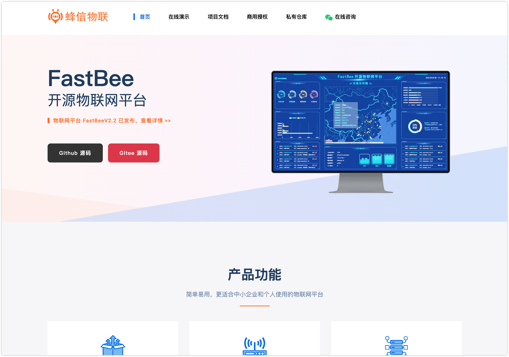

### 2. [Source Vue](https://gitee.com/open-source-byte/source-vue)

基于 Spring Boot + MyBatis + Vue & Element ，包含微信小程序 & Uniapp，支持 Web 报表、可视化大屏、三方登录、支付、短信、邮件、OSS 等功能。

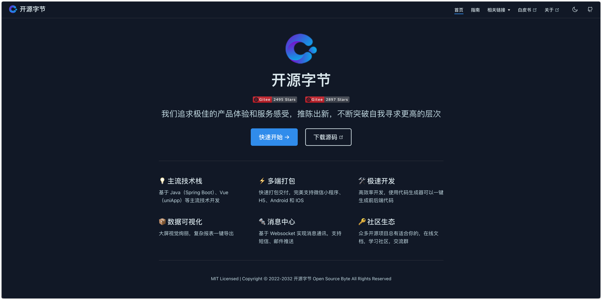

### 3. [多多客](https://gitee.com/doodooke/doodoo)

免费开源的小程序 SaaS 系统，支持微信小程序，支付宝小程序，百度小程序，公众号等。

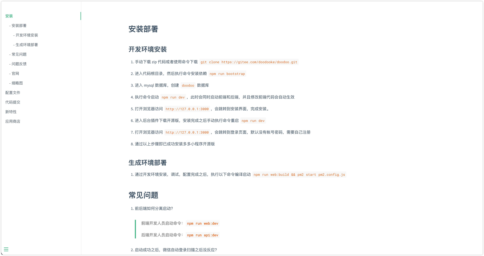

## 二、软件

### 1. [Kodi](https://kodi.tv/)

开源免费的家庭影院软件。

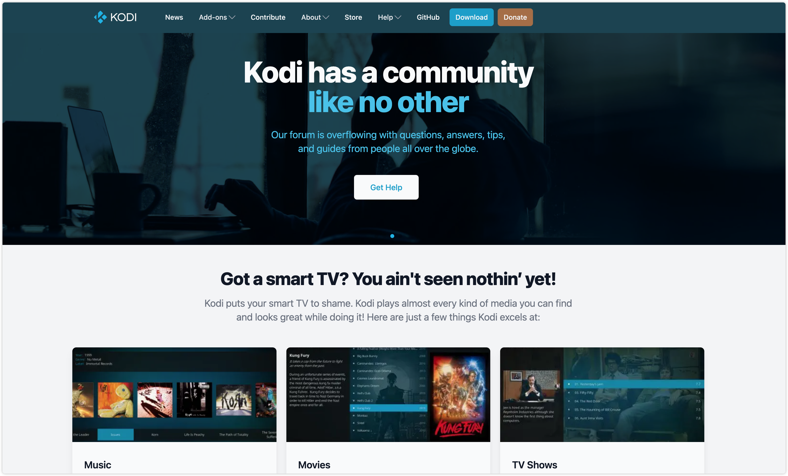

### 2. [追光几何](https://evercraft.co/)

文件历史管理，轻松追踪文件的历史变更，提高工作效率，减少数据丢失风险。

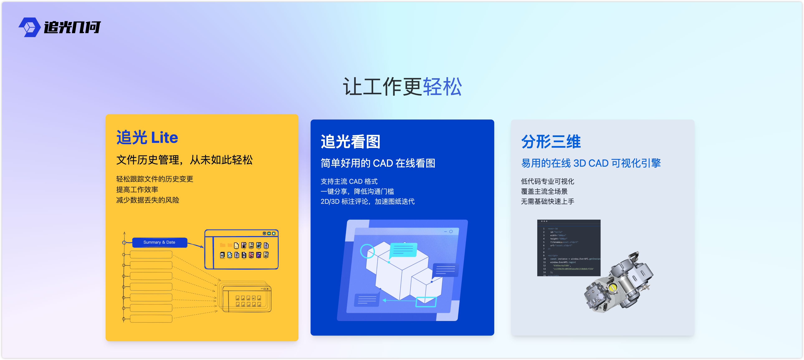

### 3. [Mem Reduct](https://memreduct.org/)

内存整理神器，体积小巧，启动速度快，但功能确十分强大。

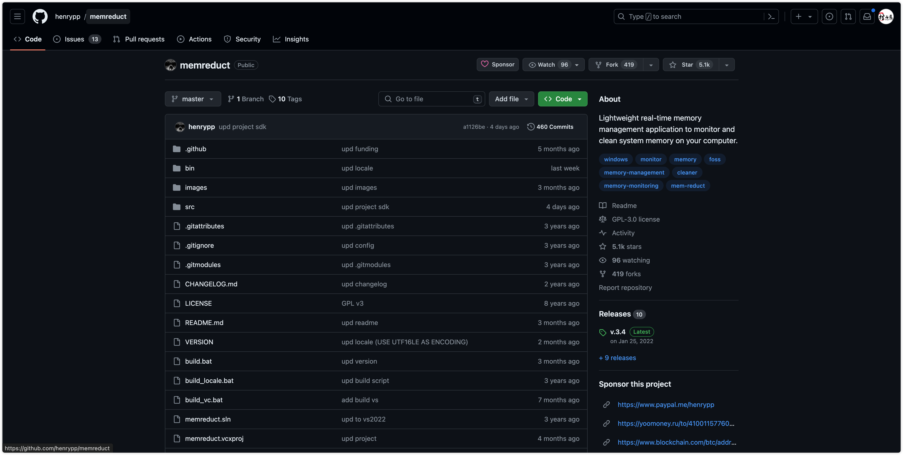

## 三、网站

### 1. [万能小 in](https://xiaoin.com.cn/home/index)

智能 AI 助你轻松写作，智能对话助手快速解决你的各种问题。一键快速创作，学习工作报告，文章，读书笔记，毕业答辩，演讲稿，PPT，小红书笔记，活动策划，简历优化，魔法头像，脚本创作等。AI 智能写作，使用自然语言大模型，创作更加高效！

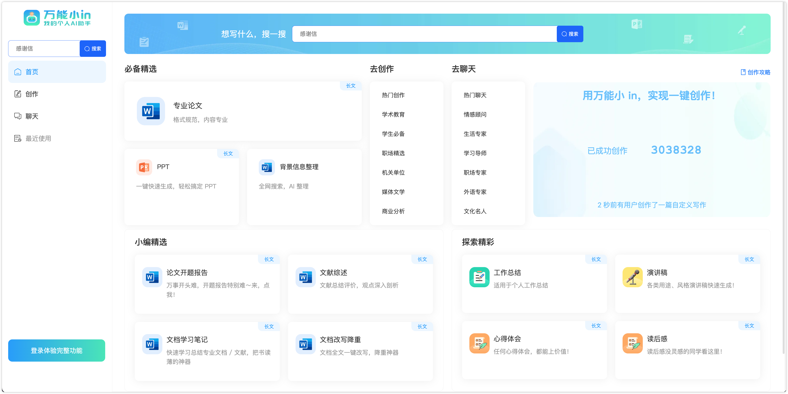

### 2. [测速网](https://www.speedtest.cn/)

提供网速测试，网络质量测试，宽带测速，Wi-Fi 测速，5G 测速，IPv6 测速，带宽检测，路由器测速，网关测速，宽带提速，宽带升级，网络加速，内网测速，专网测速，视频测试，游戏测速，直播测速，网络诊断，蹭网检测，物联网监测，网站监测，API 监测，Ping 测试，路由测试等专业服务。

同时，拥有国内外大量高性能测试点，覆盖电信，移动，联通，网通，广电，长城宽带，鹏博士等运营商。

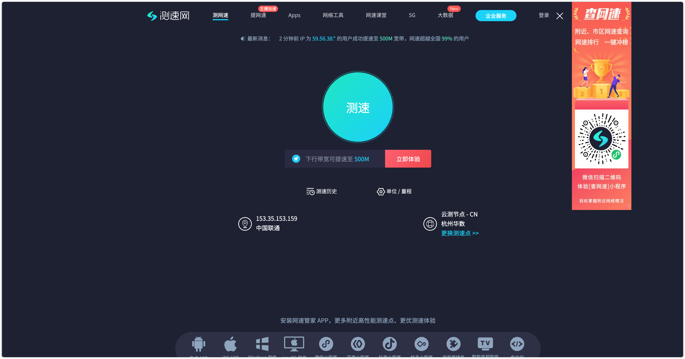

### 3. [16 Personalities](https://www.16personalities.com/ch)

免费的 16 型人格测试，快来看看你是属于 i 人还是 e 人吧！

只需 10 分钟，就能 “惊人般准确” 地描述出你是谁，以及你为何以这样的方式行事。

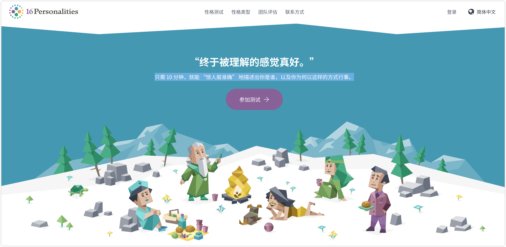

## 四、插件

### 1. [BewlyBewly](https://chromewebstore.google.com/detail/bewlybewly/bbbiejemhfihiooipfcjmjmbfdmobobp?hl=zh-CN)

只需对哔哩哔哩主页进行小修改，就可以让你的主页拥有更多功能，并能根据您的喜好对其进行个性化设置。

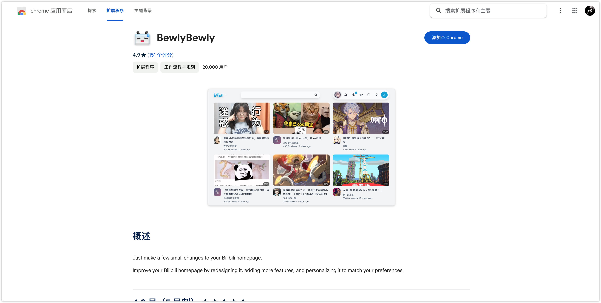

### 2. [ChatsNow AI 助手](https://chromewebstore.google.com/detail/hcmiiaachajoiijecmakkhlcpagafklj?hl=zh-CN)

AI 智能写作插件，支持 GPT-4、Claude2、GPT-3.5 等多个大模型。提供聊天、翻译、提问、自定义提示等智能化功能。

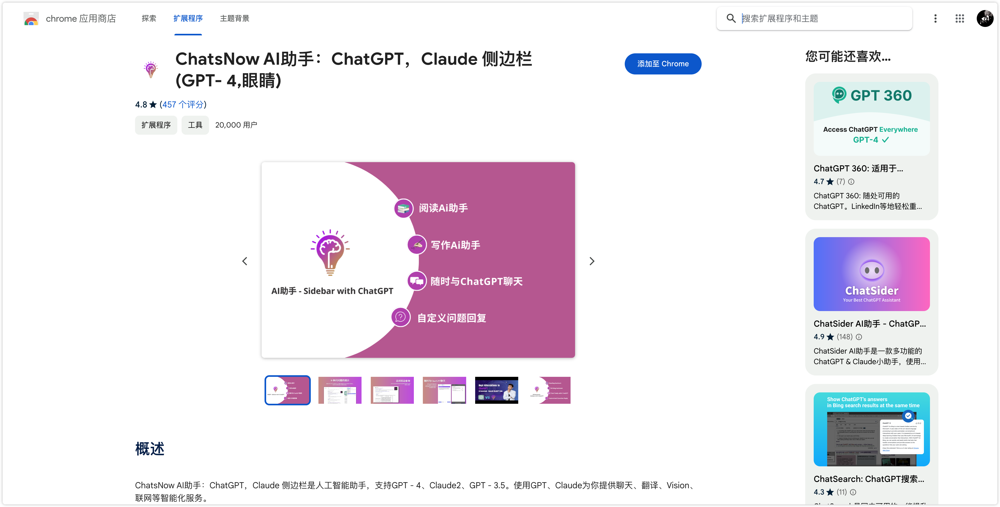

### 3. [APK 下载器](https://chromewebstore.google.com/detail/glngapejbnmnicniccdcemghaoaopdji?hl=zh-CN)

免费安全地下载来自谷歌商城的安卓应用和游戏。APKPure 免费在线 APK Downloader 为您提供了最快的搜索和从 Google Play 商店中免费的应用程序和游戏下载。只需输入应用程序名称或软件包名称即可找到并下载所需的应用。插件支持以下功能：

-   无需登录
-   安全下周
-   解锁区域限制

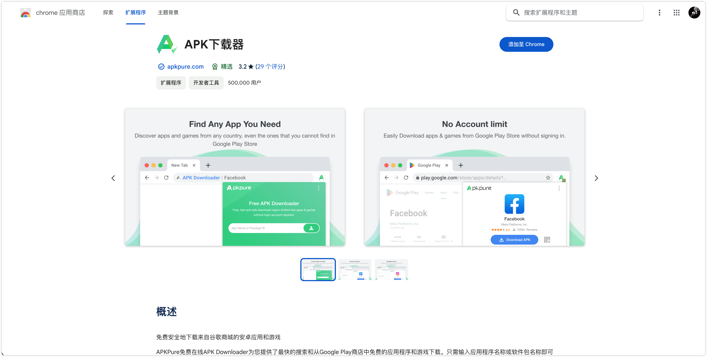

## 五、资料

### 1. [Rust 语言开源杂志（2021）](https://github.com/RustMagazine/rust_magazine_2021)

为了丰富 `Rust` 社区成员的学习生活而推出的杂志。

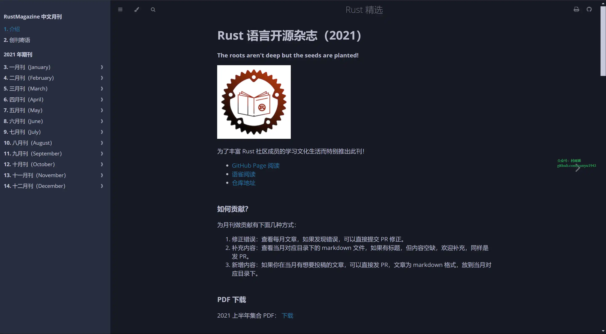

### 2. [游戏开发-技术图谱](https://github.com/gonglei007/GameDevMind)

最全面的游戏开发技术图谱。帮助游戏开发者们在已知问题上节省时间，省出更多的精力投入到更有创造性的工作中去。

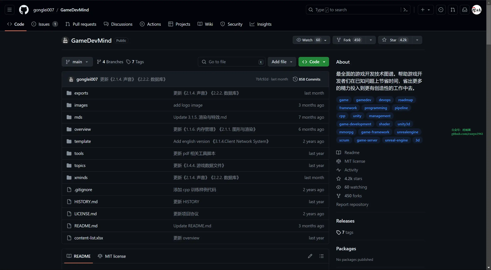

### 3. [learning-note](https://github.com/rbmonster/learning-note)

`Java` 开发及个人面试、工作总结、资料收集站。

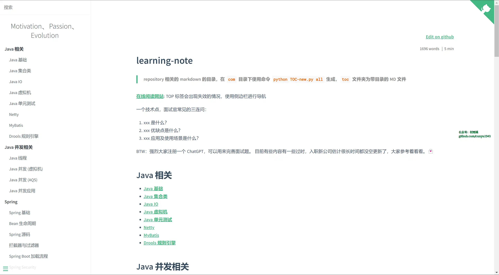

## ✍️ 说明

周刊专栏相关信息：

- **项目地址**：[Github](https://github.com/cunyu1943/weekly)，觉得不错麻烦给我一个**Star**，感谢 ❤️
- **浏览地址**：公众号 | [电子书](https://cunyu1943.github.io/weekly) | [语雀](https://yuque.com/cunyu1943/weekly)

如果你阅读到这里，说明我的工作没有白费。如果你想推荐项目/网站/软件/资源，欢迎提交 **[issue](https://github.com/cunyu1943/weekly/issues)** 或者添加我 **个人微信：coder_cunYu** 与我交流。

---

## ⏳ 联系

想解锁更多知识？不妨关注我的微信公众号：**村雨遥（id：JavaPark）**。

扫一扫，探索另一个全新的世界。

