# 好物周刊#55：编程字体

> 作者：[村雨遥](https://github.com/cunyu1943)
>
> 不要哀求，学会争取，若是如此，终有所获
>
> 原文：https://mp.weixin.qq.com/s/VJ02FJok6NB1GA1LutEXmQ

## 🎈 号外 

最近，公众号之外，建立了微信交流群，不定期会在群里分享各种资源（影视、IT 编程、考试提升……）&知识。如果有需要，可以**扫码或者后台添加小编微信备注入群**。进群后**优先看群公告**，**呼叫群中【资源分享小助手】**，还能免费帮找资源哦～

 

## 一、项目

### 1. [twikoo](https://github.com/twikoojs/twikoo)

一个简洁、安全、免费的静态网站评论系统。

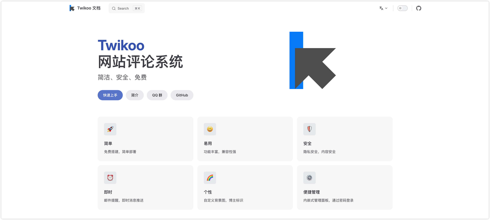

### 2. [cool-admin](https://github.com/cool-team-official/cool-admin-midway)

一个很酷的后台权限管理框架，模块化、插件化、CRUD 极速开发，永久开源免费，基于 midway.js 3.x、TypeScript、Typeorm、MySQL、jwt、Vue3、Vite、Element-ui 等构建。

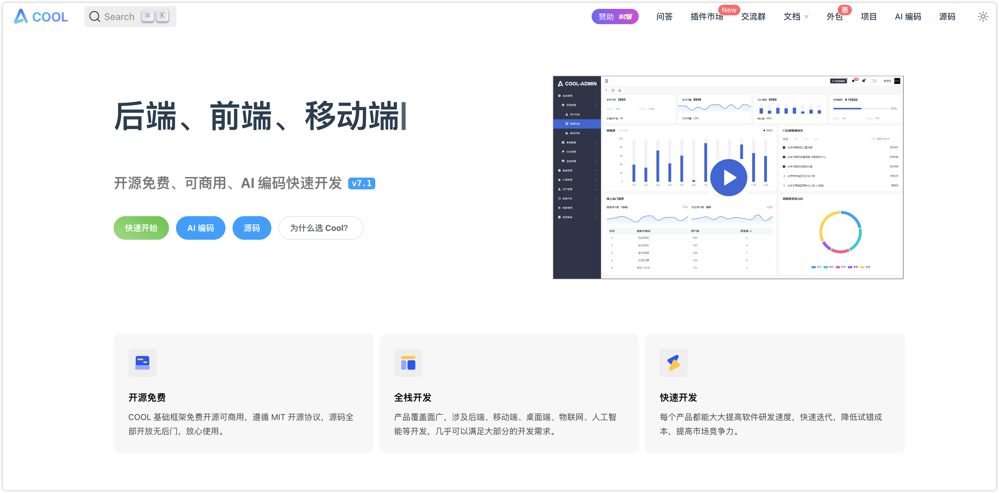

### 3. [领课教育系统](https://github.com/roncoo/roncoo-education)

基于领课网络多年的在线教育平台开发和运营经验打造出来的产品，致力于打造一个各行业都适用的分布式在线教育系统。系统采用前后端分离模式，前台采用 Vue.js 为核心框架，后台采用 Spring Cloud 为核心框架。系统目前主要功能有课程点播功能，支持多家视频云的接入，课程附件管理功能，支持多家存储云的接入，可以帮助个人或者企业快速搭建一个轻量级的在线教育平台。

## 二、软件

### 1. [QuickRecorder](https://github.com/lihaoyun6/QuickRecorder)

基于 ScreenCapture Kit 的轻量化多功能 macOS 录屏工具。

软件具有以下特点：

-   使用 SwiftUI 编写，体积小巧轻量化。软件大小仅 4MB 左右，无任何累赘功能。
-   支持窗口录制，App 录制等模式；支持窗口声音内录，鼠标高亮，隐藏桌面文件等功能。
-   QuickRecorder 启动后直接显示主功能面板，关闭后可以点击 Dock 栏图标再次呼出。
-   开始录制后 QuickRecorder 会在菜单栏显示录制指示器，可随时暂停或查看录制时长。

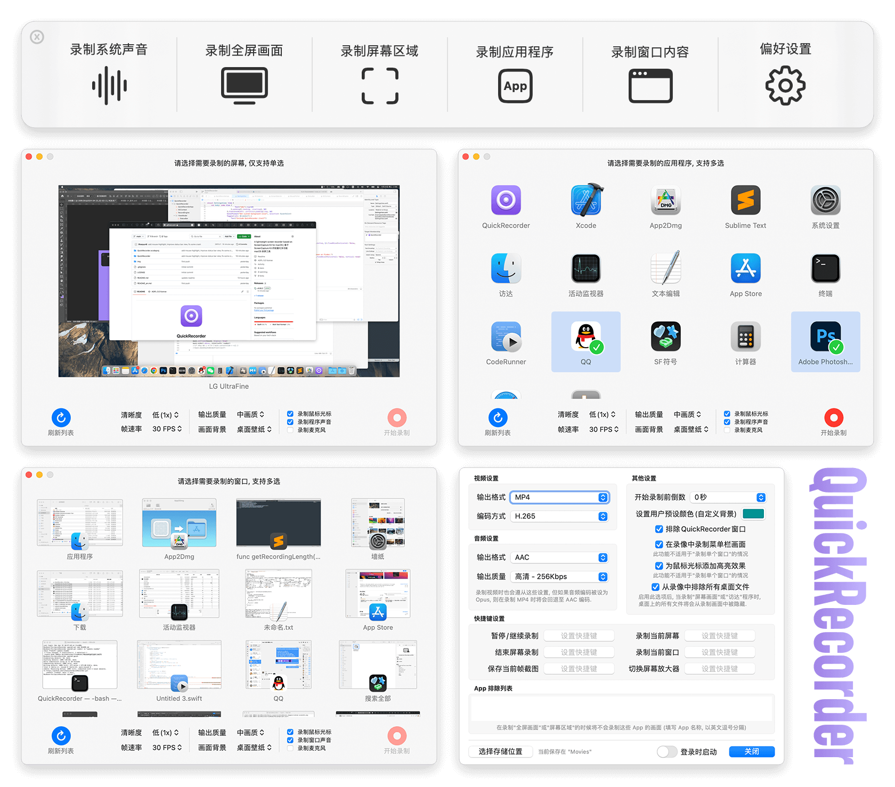

### 2. [CareUEyes](https://care-eyes.com/)

一款优秀的过滤蓝光的护眼软件，能够减少屏幕蓝光和强亮度对眼睛的伤害，缓解视疲劳，长时间面对屏幕的上班族必备。

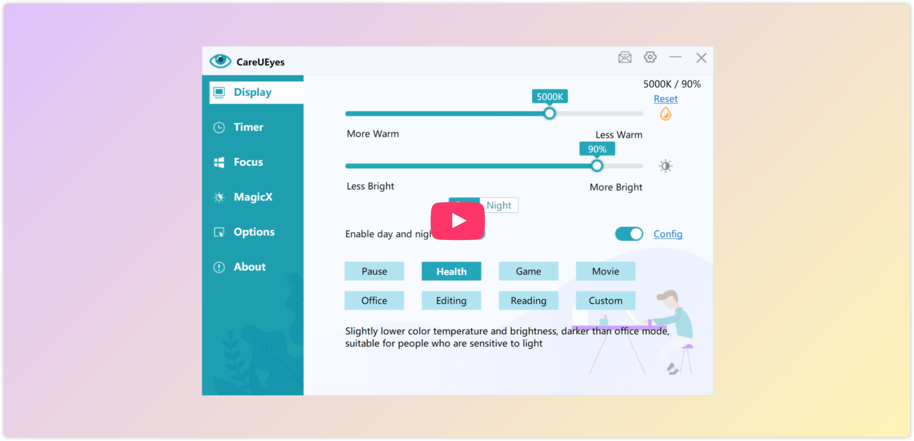

### 3. [OpenAi Translator](https://github.com/openai-translator/openai-translator)

基于 ChatGPT API 的划词翻译浏览器插件和跨平台桌面端应用，软件具有如下特点：

-   支持三种翻译模式：翻译、润色、总结
-   支持 55 种语言的相互翻译、润色和总结功能
-   支持实时翻译、润色和总结，以最快的速度响应用户，让翻译、润色和总结的过程达到前所未有的流畅和顺滑
-   支持自定义翻译文本
-   支持一键复制
-   支持 TTS
-   有桌面端应用，全平台（Windows + macOS + Linux）支持！
-   支持截图翻译

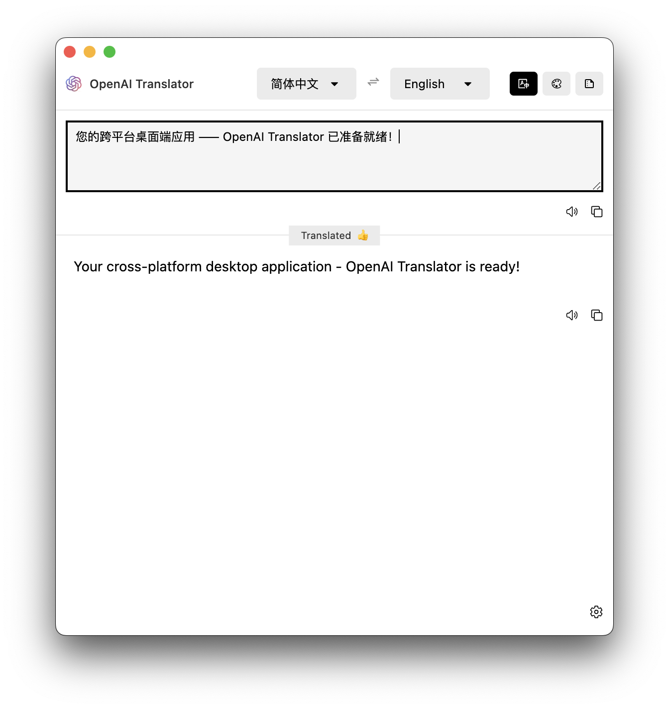

## 三、网站

### 1. [中国行政区划小测验](https://vultr.youmu.moe/quiz/)

点击开始即可在空白地图中标记省份，快来检测下你的地理知识过不过关吧。

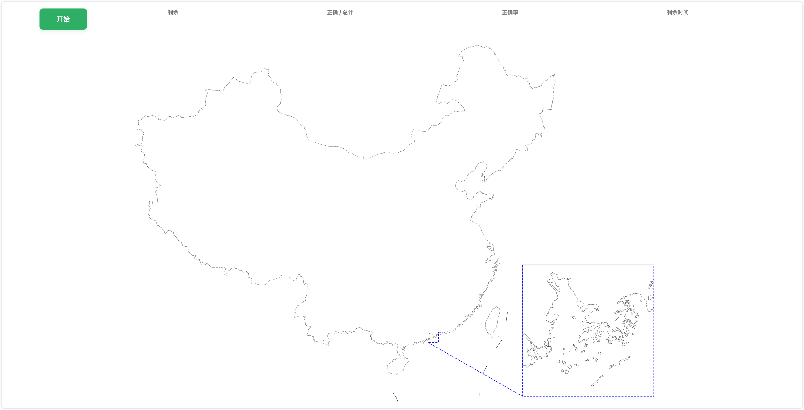

### 2. [死亡公司公墓](https://www.itjuzi.com/deathCompany)

新经济死亡公司数据库，是目前最全面的死亡公司数据公开平台，从死亡原因、 死亡公司赛道、烧钱榜等多维度呈现死亡公司全貌，全方位把握风口生死的命脉。

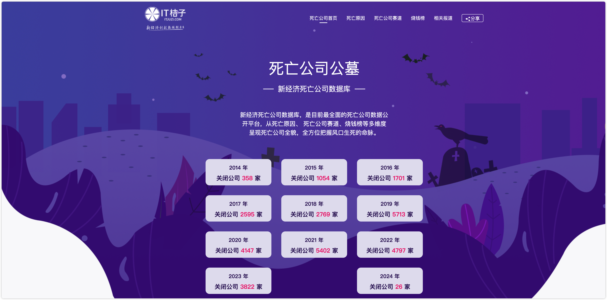

### 3. [编程字体](https://www.codingfont.com/)

这里汇集了超多编程字体，快来寻找适合自己的字体吧。

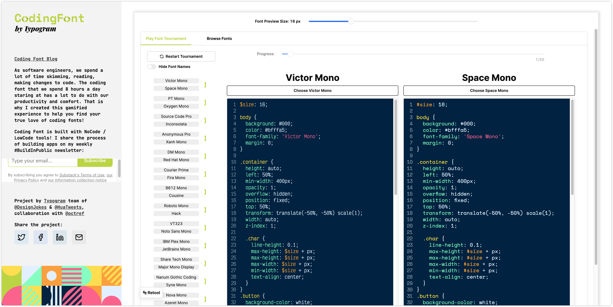

## 四、插件

### 1. [HARPA AI](https://chromewebstore.google.com/detail/eanggfilgoajaocelnaflolkadkeghjp)

浏览网页和实现自动化的个人 AI 副驾驶员，由 GPT 驱动的浏览器人工智能自动化代理。它将 OpenAI ChatGPT、GPT3 / GPT4、ClaudeAI、Bard、网页监控和自动化集成到任何标签页。

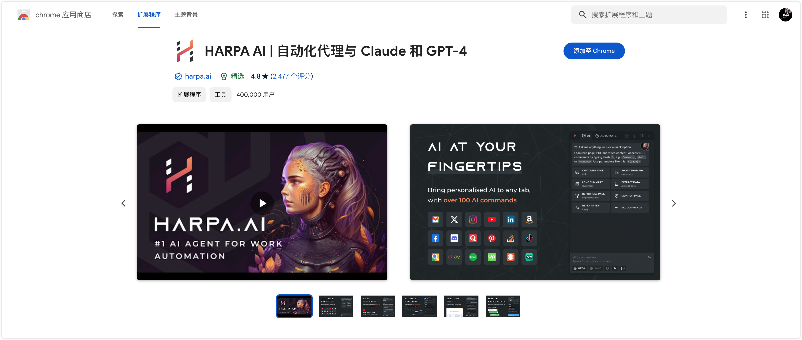

### 2. [在线视频下载器](https://chromewebstore.google.com/detail/iikjcbakondakcbblkccdmiaiklnddke)

通用的视频下载器，用于下载 HLS、m3u8、mp4、webm 等在线影片，也可以用于录制网页直播视频。

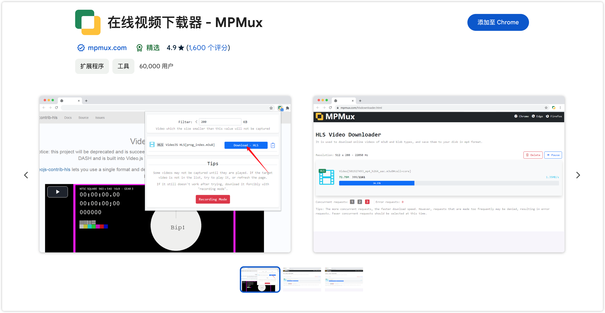

### 3. [UltraWideo](https://chromewebstore.google.com/detail/ultrawideo/bfbnagnphiehemkdgmmficmjfddgfhpl)

跨浏览器扩展，可以调整视频的宽高比以适应整个屏幕。

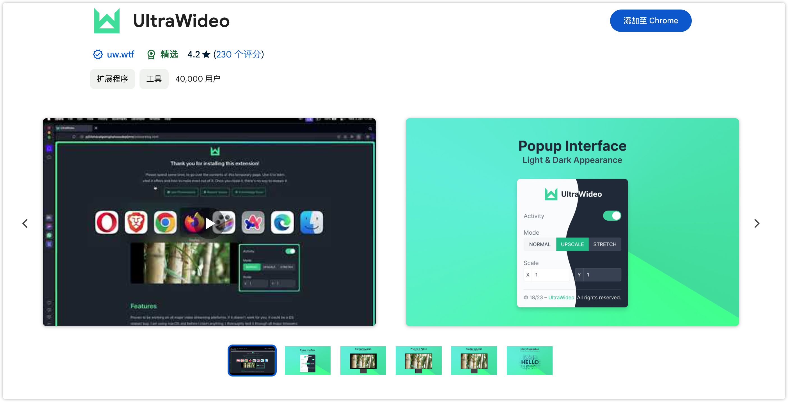

## 五、资料

### 1. [Java-Interview-Tutorial](https://github.com/Java-Edge/Java-Interview-Tutorial)

涵盖互联网大厂数据库、缓存、`DDD`、设计模式、微服务架构、主流中间件框架原理及真实业务最佳实践。

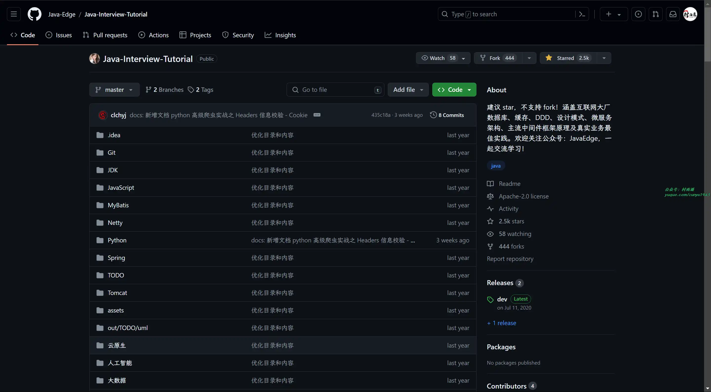

### 2. [java-notes](https://github.com/DreamCats/java-notes)

要内容包括个人秋招经历、牛客面经问题按照频率总结、`Java` 一系列知识、数据库、分布式、微服务、前端、技术面试、每日文章等。

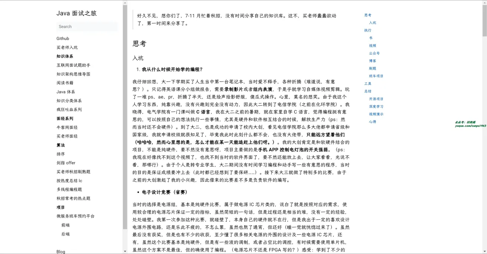

### 3. [前端开发者手册](https://www.kancloud.cn/kancloud/front-end-dev-handbook/75919)

任何人都可以用来学习前端的实践手册，它概述并讨论了前端工程的实践：该如何学习以及实践时该使用什么工具. 撰写该手册的目的有两个：

一是为潜在以及正在实践的前端开发人员提供一个包括学习资料和开发工具的专业资源；

二是该手册可以被管理者，CTO，讲师和猎头用来作为洞察前端开发的实践. 该手册的内容支持 Web 技术 (HTML, CSS, DOM, 和 JavaScript), 并且手册提供的解决方案都直接建立在这些开放的技术之上。

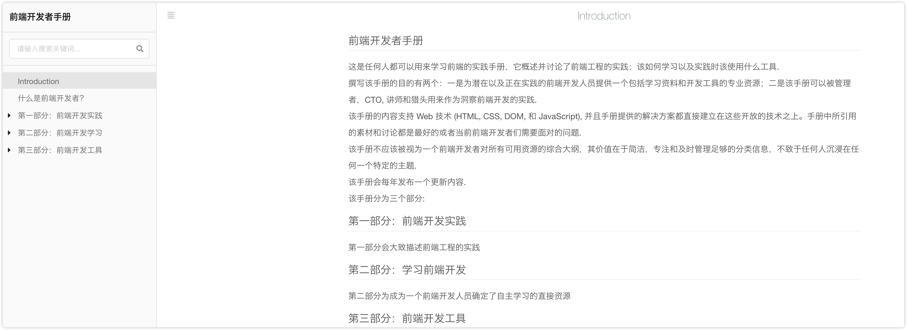

## ✍️ 说明

周刊专栏相关信息：

- **项目地址**：[Github](https://github.com/cunyu1943/weekly)，觉得不错麻烦给我一个**Star**，感谢 ❤️
- **浏览地址**：公众号 | [电子书](https://cunyu1943.github.io/weekly) | [语雀](https://yuque.com/cunyu1943/weekly)

如果你阅读到这里，说明我的工作没有白费。如果你想推荐项目/网站/软件/资源，欢迎提交 **[issue](https://github.com/cunyu1943/weekly/issues)** 或者添加我 **个人微信：coder_cunYu** 与我交流。

## ⏳ 联系

想解锁更多知识？不妨关注我的微信公众号：**村雨遥（id：JavaPark）**。

扫一扫，探索另一个全新的世界。

< src="/contact/contact.png" width="300">

