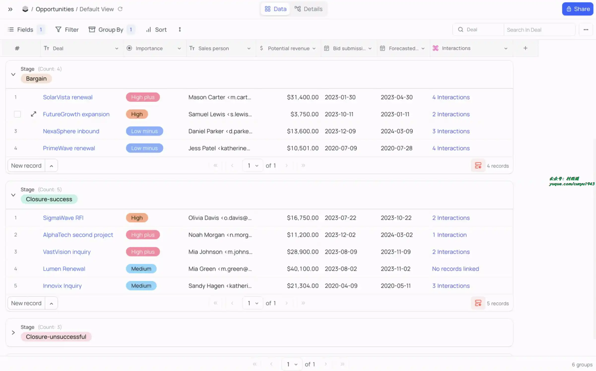
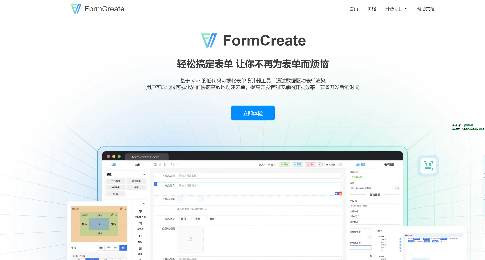
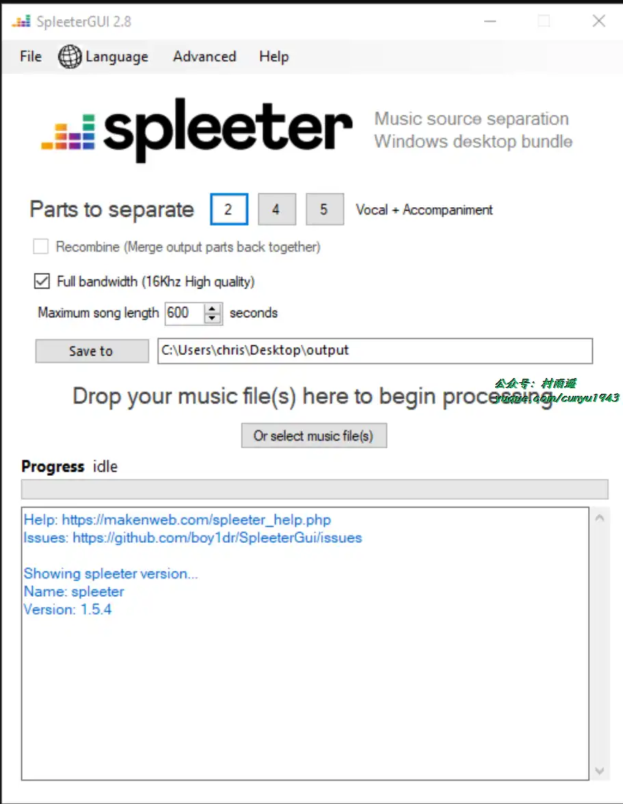
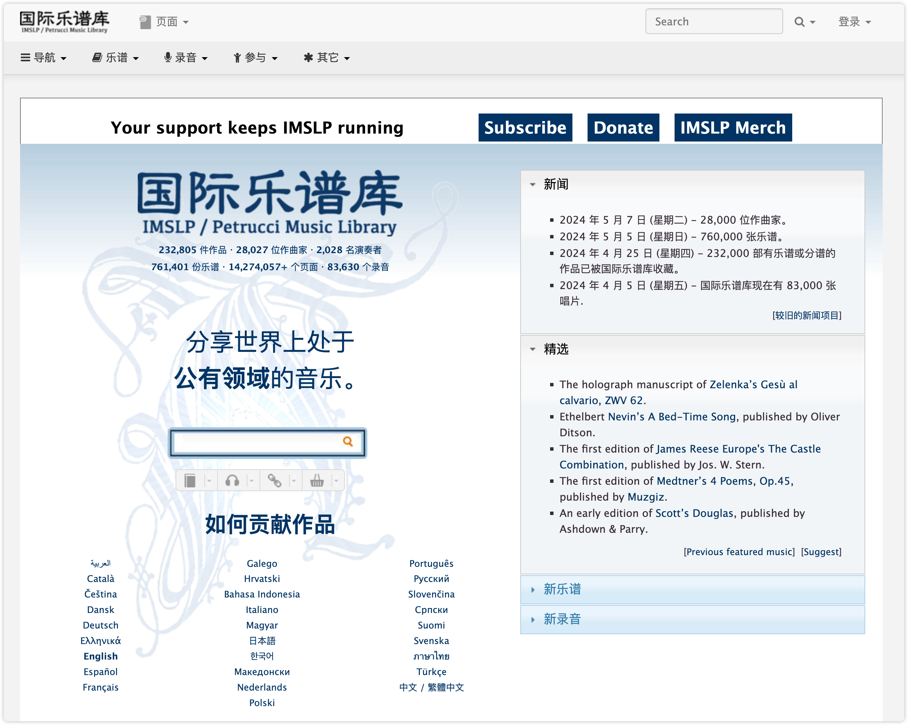
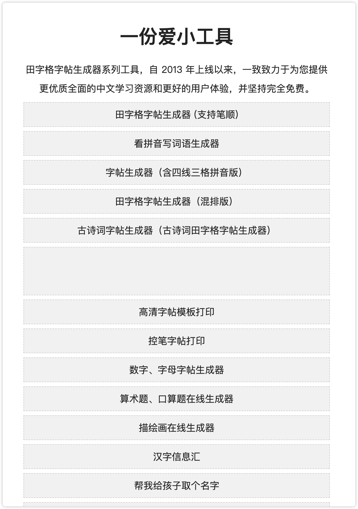
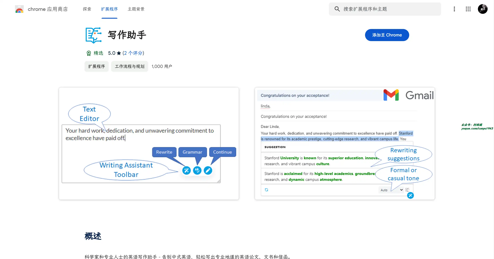
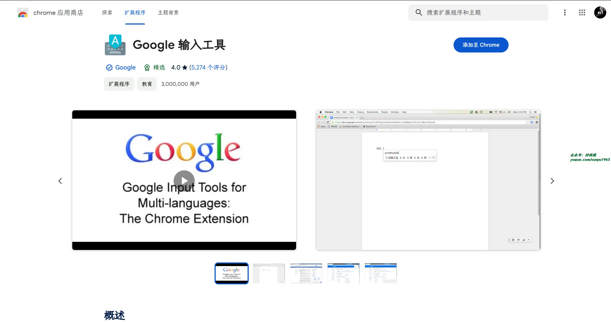
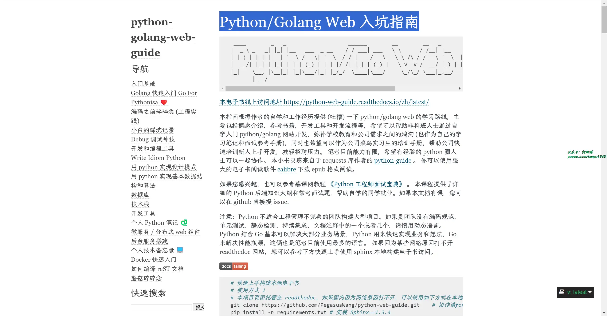
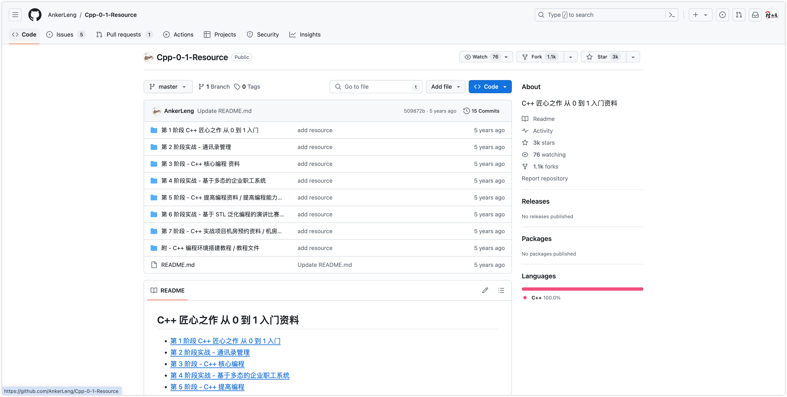

# 好物周刊#56：像老乡鸡一样做饭

> 作者：[村雨遥](https://github.com/cunyu1943)
> 
> 不要哀求，学会争取，若是如此，终有所获
> 
> 原文：https://mp.weixin.qq.com/s/8RVbBO8B48p3sRyZ00B75g

## 🎈 号外 

最近，公众号之外，建立了微信交流群，不定期会在群里分享各种资源（影视、IT 编程、考试提升……）&知识。如果有需要，可以**扫码或者后台添加小编微信备注入群**。进群后**优先看群公告**，**呼叫群中【资源分享小助手】**，还能免费帮找资源哦～

 

## 一、项目

### 1. [NocoDB](https://github.com/nocodb/nocodb)

Airtable 的开源替代品，支持将 MySQL、PostgreSQL、SQL Server、SQLite 或 MariaDB 转换为智能电子表格。

### 2. [Old Photo Restoration](https://github.com/microsoft/Bringing-Old-Photos-Back-to-Life)

一款特殊的软件，用户可以用来补全旧照片，消除图像中的斑点划痕，让你的旧照片焕发新生。

### 3. [FormCreate](https://github.com/xaboy/form-create)

强大的动态表单生成器，通过数据驱动表单渲染，支持可视化设计，提高开发者对表单的开发效率。一个可以通过 JSON 生成具有动态渲染、数据收集、验证和提交功能的表单生成组件。支持 5 个 UI 框架，并且支持生成任何 Vue 组件。内置 20 种常用表单组件和自定义组件，再复杂的表单都可以轻松搞定。目前在 OA 系统、ERP 系统、电商系统、流程管理等系统中已稳定应用。

## 二、软件

### 1. [SpleeterGui](https://github.com/boy1dr/SpleeterGui)

一款特色便捷的音轨 AI 分离软件，由法国音乐流媒体公司 Deezer 开源的项目，基于 TensorFlow 开发，运行速度极快。支持导入 mp3、wav、ogg 等格式音频文件，它就会将其分成 2、4、5 等多个独立音轨。

### 2. [4K Download](https://www.4kdownload.com/zh-cn/)

适用于所有主流平台的免费实用应用。从 YouTube 下载视频、音频、字幕，从 Instagram 下载照片，制作幻灯片以及更多功能！

### 3. [Upscayl](https://github.com/upscayl/upscayl)

一款免费开源的 AI 图像超分辨率跨平台软件，通过内置模型，增强图像显示效果，提高分辨率，让你的旧照片焕然一新。

## 三、网站

### 1. [奈飞工厂](https://www.netflixgc.com/)

一个致力于免费提供奈飞影剧动漫的流媒体播放平台，更汇聚了国外各种影视资源。界面简单清爽，找剧超方便。

### 

### 2. [国际乐谱库](https://cn.imslp.org/wiki/)

分享世界上处于公有领域的音乐谱，截止目前，已经收录了 28027 位作曲家、2028 名演奏者的共计 761401 份乐谱。

### 3. [一份爱小工具](https://www.an2.net/)

田字格字帖生成器系列工具，给低年级学生准备的练字神器。自 2013 年上线以来，一致致力于为您提供更优质全面的中文学习资源和更好的用户体验，并坚持完全免费。

## 四、插件

### 1. [Read Aloud](https://chromewebstore.google.com/detail/hdhinadidafjejdhmfkjgnolgimiaplp)

轻轻点击，即可为您朗读页面上的文本，支持超过 40 种以上语言。

### 2. [写作助手](https://chromewebstore.google.com/detail/icfibfjidabjcklhikmodelmopjmghgj)

一款为科学家和专业人士设计的工具，旨在提高他们的英语写作水平。无论你当前的英语水平如何，写作助手都可以帮助你将你的写作转化为专业水平的英语。它还可以直接将你的母语（例如西班牙语、日语、中文和许多其他语言）翻译成英语。它可以改写句子或整段文字。

### 3. [谷歌输入工具](https://chromewebstore.google.com/detail/mclkkofklkfljcocdinagocijmpgbhab)

通过安装该插件，就能通过点击鼠标轻松实现切换不同语言，让您以自己选择的语言输入文字，支持超 90 种语言。

## 五、资料

### 1. [Python/Golang Web 入坑指南](https://python-web-guide.readthedocs.io/zh/latest/)

指南根据作者的自学和工作经历提供 (吐槽) 一下 Python/Golang Web 的学习路线，主要包括概念介绍，参考书籍，开发工具和开发流程等，希望可以帮助非科班人士通过自学入门 Python/Golang 网站开发，弥补学校教育和公司需求之间的鸿沟 (也作为自己的学习笔记和面试参考手册)，同时也希望可以作为公司菜鸟实习生的培训手册，帮助公司快速培训新人上手开发，减轻招聘压力。

### 2. [像老乡鸡那样做饭](https://github.com/Gar-b-age/CookLikeHOC)

文字来自《老乡鸡菜品溯源报告》，并做归纳、编辑与整理，让厨房小白也能快速做出美食。

### 3. [C++ 匠心之作 从 0 到 1 入门资料](https://github.com/AnkerLeng/Cpp-0-1-Resource)

C++ 从 0 到 1 入门资料，共分为 7 大阶段，适合新手入门，配合视频教程食用效果更佳。

## ✍️ 说明

周刊专栏相关信息：

- **项目地址**：[Github](https://github.com/cunyu1943/weekly)，觉得不错麻烦给我一个**Star**，感谢 ❤️
- **浏览地址**：公众号 | [电子书](https://cunyu1943.github.io/weekly) | [语雀](https://yuque.com/cunyu1943/weekly)

如果你阅读到这里，说明我的工作没有白费。如果你想推荐项目/网站/软件/资源，欢迎提交 **[issue](https://github.com/cunyu1943/weekly/issues)** 或者添加我 **个人微信：coder_cunYu** 与我交流。

---

## ⏳ 联系

想解锁更多知识？不妨关注我的微信公众号：**村雨遥（id：JavaPark）**。

扫一扫，探索另一个全新的世界。

< src="/contact/contact.png" width="300">

