# 好物周刊#57：终身教育平台

> 作者：[村雨遥](https://github.com/cunyu1943)
> 
> 不要哀求，学会争取，若是如此，终有所获
> 
> 原文：https://mp.weixin.qq.com/s/a5nPGI6QPTTJHV93oxUjlA

## 🎈 号外 

最近，公众号之外，建立了微信交流群，不定期会在群里分享各种资源（影视、IT 编程、考试提升……）&知识。如果有需要，可以**扫码或者后台添加小编微信备注入群**。进群后**优先看群公告**，**呼叫群中【资源分享小助手】**，还能免费帮找资源哦～

 

## 一、项目

### 1. [cool-admin](https://github.com/cool-team-official/cool-admin-vue)

一个很酷的后台权限管理框架，模块化、插件化、CRUD 极速开发，永久开源免费，基于 Midway.js 3.0、Typeorm、MySQL、jwt、Element-ui、Vuex、Vue-router、Vue 等构建。

### 

### 2. [开发者边车](https://github.com/docmirror/dev-sidecar)

为开发者打辅助的边车工具，通过本地代理的方式将 https 请求代理到一些国内的加速通道上。从而解决 Github 打不开，Github 加速，Git clone 加速，Git release 下载加速，StackOverflow 加速等问题。

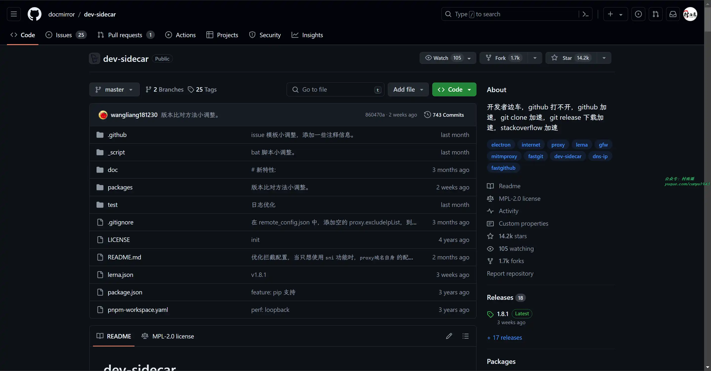

### 3. [1Panel](https://github.com/1Panel-dev/1Panel)

新一代现代化、开源的 Linux 服务器运维管理面板，具有以下特点：

- 高效管理：用户可以通过 Web 图形界面轻松管理 Linux 服务器，实现主机监控、文件管理、数据库管理、容器管理等功能；
- 快速建站：深度集成开源建站软件 WordPress 和 Halo，域名绑定、SSL 证书配置等操作一键搞定；
- 应用商店：精选上架各类高质量的开源工具和应用软件，协助用户轻松安装并升级；
- 安全可靠：基于容器管理并部署应用，实现最小的漏洞暴露面，同时提供防火墙和日志审计等功能；
- 一键备份：支持一键备份和恢复，用户可以将数据备份到各类云端存储介质，永不丢失。

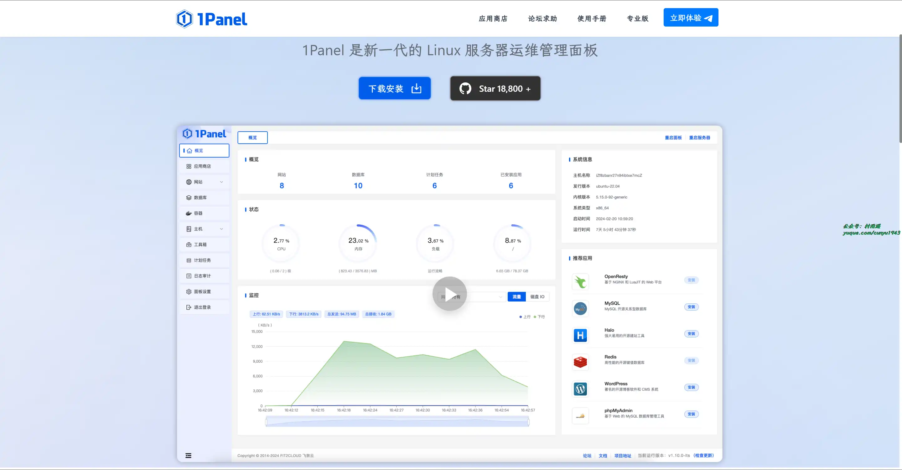

## 二、软件

### 1. [Optimizer](https://github.com/hellzerg/optimizer)

一款高级配置工具，旨在增强 Windows 的隐私和安全性。建议在安装 Windows 后使用此工具，从而获得最大的隐私和安全优势。根据你的 Windows 版本，Optimizer 还可以帮助你应用特定的系统调整。

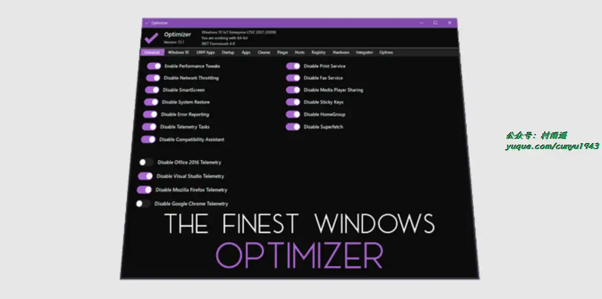

### 2. [Apifox](https://apifox.com/)

API 设计、开发、测试一体化协作平台，可以将其看作是 Postman + Swagger + Mock + JMeter 等工具的集合。

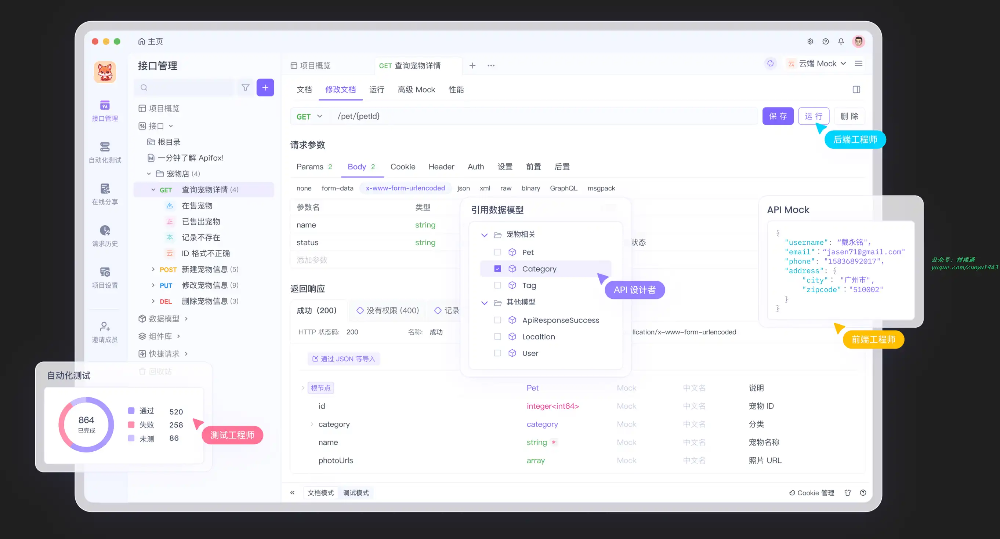

### 3. [QtScrcpy](https://github.com/barry-ran/QtScrcpy)

基于 Qt ffmpeg opengl 开发跨平台安卓实时投屏软件，支持以下功能：

- 设备投屏 & 控制：批量投屏、单个控制、批量控制
- 分组管理
- wifi 投屏 / OTG 投屏
- adb shell 快捷指令
- 文件传输、apk 安装
- 投屏数量多：在 OTG 投屏模式，设置分辨率和流畅度为低的情况下，单台电脑可以同时管理 500 + 台手机
- 低延迟：usb 投屏 1080p 延迟在 30ms 以内，在相同分辨率流畅度情况下，比市面上所有投屏软件延迟都低
- cpu 占用率低：纯 C++ 开发，高性能 GPU 视频渲染
- 高分辨率：可调节，最大支持安卓终端的原生分辨率
- 完美中文输入：支持闲鱼 app，支持三星手机
- 免费版最多投屏 20 台，功能无限制 (除了自动重新投屏)

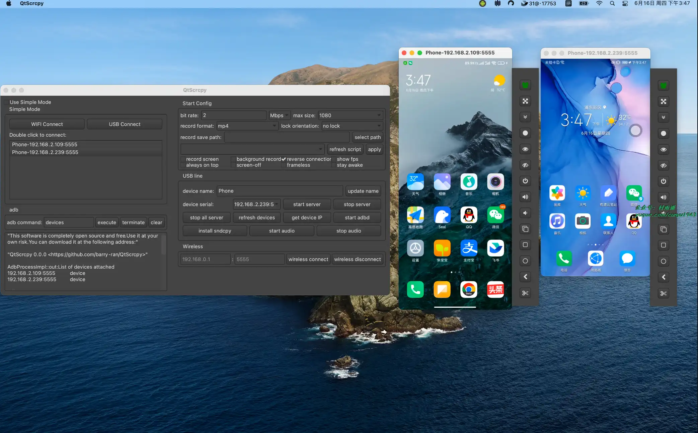

## 三、网站

### 1. [海螺 AI](https://hailuoai.com/)

海螺 AI 是 MiniMax 基于通用大模型为用户打造的 AI 伙伴，可以帮你分析财报、速读长文、创作文案、智能搜索等、拍照答疑等等，也支持语音通话。10 倍速获取信息、10 倍速解决问题。

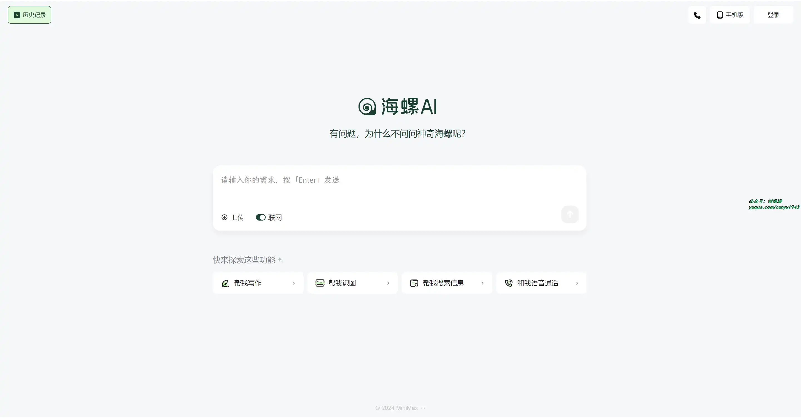

### 2. [终身教育平台](https://le.ouchn.cn)

国家牵头建设的学习平台，面向社会免费开放。截至目前，已汇聚国家开放大学自建学习资源、338 所知名高校的课程资源、10 个头部平台的特色课程等共计 50 万门。

### 3. [VELeap 社区](https://veleap.com/)

一个在线 AE 设计师交流社区，设计师在这里可以免费获取原创的 AE 插件和脚本，学习 AE 教程，还能兼职赚钱。

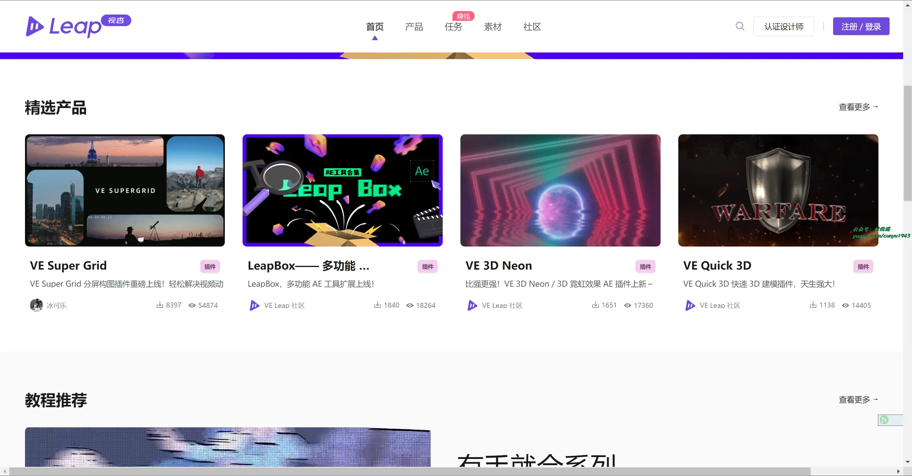

## 四、插件

### 1. [Relingo](https://chromewebstore.google.com/detail/dpphkcfmnbkdpmgneljgdhfnccnhmfig)

帮助你在浏览任何网页的时候自动提取生词、划词/划句翻译、全文沉浸式翻译。同时支持 Youtube, Netflix, TED, Coursera 等平台的双语字幕以及 PDF 翻译，帮助你轻松掌握语言和词汇。

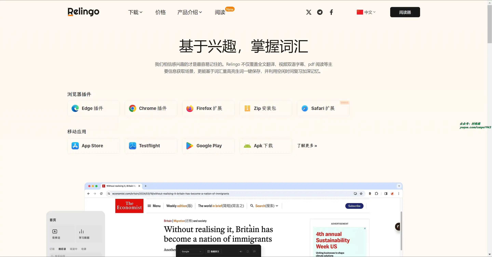

### 2. [GoFullPage](https://chromewebstore.google.com/detail/gofullpage-full-page-scre/fdpohaocaechififmbbbbbknoalclacl)

无需多余权限即可捕获当前页面的截图，单击扩展程序图标或者使用快捷键 Alt + Shift + P 即可实现截图。

截图后，您可以将其保存为图片或者 PDF，或者直接将其拖拽到你想要保存的地方即可。

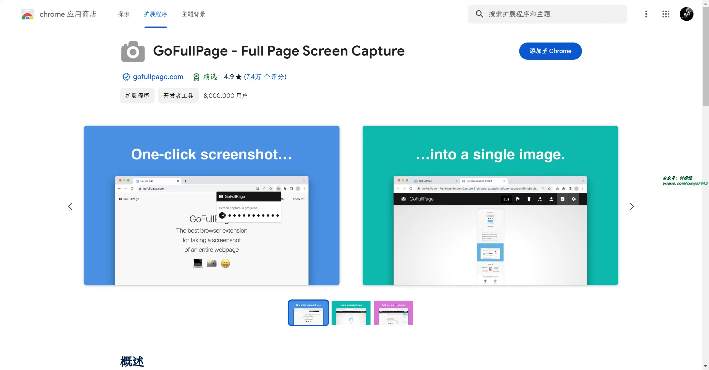

### 3. [CSS Peeper](https://chromewebstore.google.com/detail/css-peeper/mbnbehikldjhnfehhnaidhjhoofhpehk)

提取网站 CSS 并用于构建自己的样式，是一款专为设计师量身定制的 CSS 查看器，让其专注于设计并尽可能地减少时间深入研究代码就能知道行高、字体、按钮大小等信息。

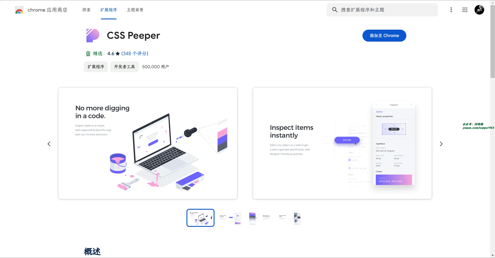

## 五、资料

### 1. [Front-end-Developer-Interview-Questions](https://github.com/h5bp/Front-end-Developer-Interview-Questions)

包含了一些常见的前端工作面试问题，不过遗憾的是并未提供答案，需要自己整理。

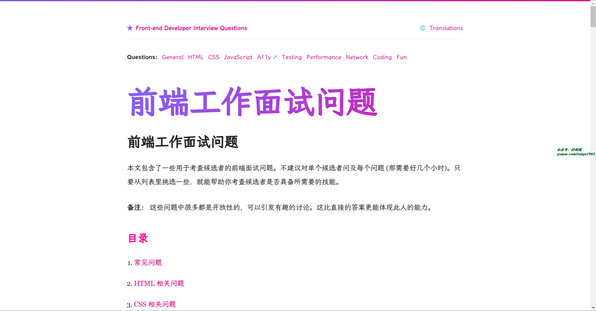

### 2. [Tech Interview Handbook](https://github.com/yangshun/tech-interview-handbook)

技术面试宝典，总结了开发工作者的各种面试经验，主要介绍了如何写简历、自我面试、面试常见问题、常见面试算法等方面内容。

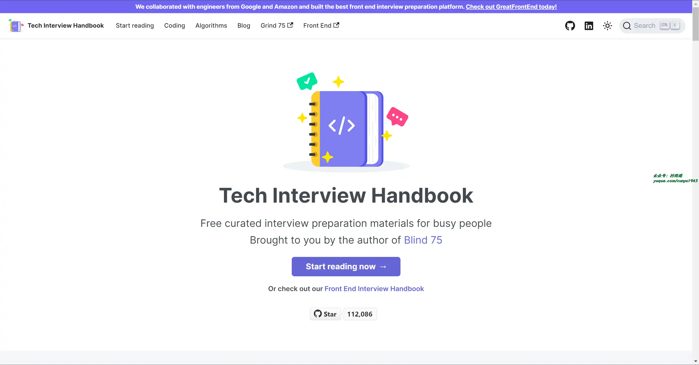

### 3. [WebGL 理论基础](https://github.com/gfxfundamentals/webgl-fundamentals)

包含了 WebGL 的一系列教程，从 WebGL 的基本理论讲起。不像大多数其他教程那样改编自旧的 OpenGL 文章。内容去旧迎新，丢弃一些过时的思想，让你彻底了解 WebGL 的工作原理。

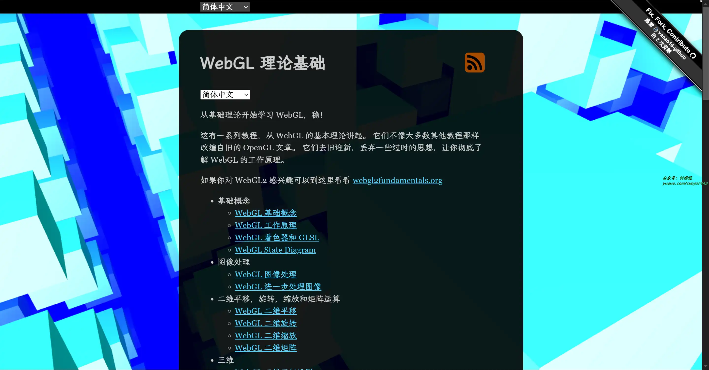

## ✍️ 说明

周刊专栏相关信息：

- **项目地址**：[Github](https://github.com/cunyu1943/weekly)，觉得不错麻烦给我一个**Star**，感谢 ❤️
- **浏览地址**：公众号 | [电子书](https://cunyu1943.github.io/weekly) | [语雀](https://yuque.com/cunyu1943/weekly)

如果你阅读到这里，说明我的工作没有白费。如果你想推荐项目/网站/软件/资源，欢迎提交 **[issue](https://github.com/cunyu1943/weekly/issues)** 或者添加我 **个人微信：coder_cunYu** 与我交流。

---

## ⏳ 联系

想解锁更多知识？不妨关注我的微信公众号：**村雨遥（id：JavaPark）**。

扫一扫，探索另一个全新的世界。

