# 好物周刊#59：Golang 学习

> 作者：[村雨遥](https://github.com/cunyu1943)
> 
> 不要哀求，学会争取，若是如此，终有所获
> 
> 原文：https://mp.weixin.qq.com/s/ziSMU8muXdZk-4qjiReYew

## 🎈 号外 

最近，公众号之外，建立了微信交流群，不定期会在群里分享各种资源（影视、IT 编程、考试提升……）&知识。如果有需要，可以**扫码或者后台添加小编微信备注入群**。进群后**优先看群公告**，**呼叫群中【资源分享小助手】**，还能免费帮找资源哦～

 

## 一、项目

### 1. [视频翻译配音工具](https://github.com/jianchang512/pyvideotrans)

一键实现将视频从一种语言翻译为另一种语言，并添加配音。支持多种配音和翻译渠道，支持完全离线使用。

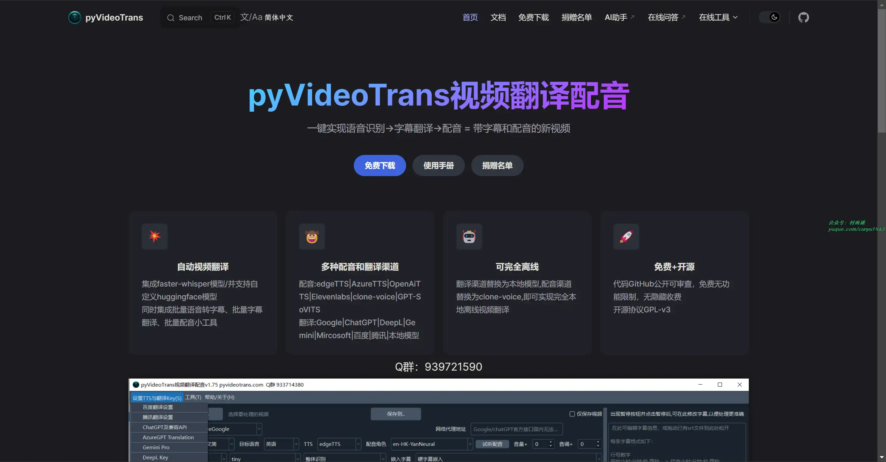

### 2. [PicImpact](https://github.com/besscroft/PicImpact)

一个摄影师专用的摄影作品展示网站，基于 Next.js 开发。具有如下特性：

- 瀑布流相册展示图片，支持常见的格式。
- 点击图片查看原图，浏览图片信息和 EXIF 信息。
- 响应式设计，在 PC 和移动端都有不错的体验，支持暗黑模式。
- 图片存储兼容 S3 API、Cloudflare R2、AList API。
- 图片支持绑定标签，并且可通过标签进行交互，筛选标签下所有图片。
- 上传图片时会生成 0.3 倍率的压缩图片，以提供加载优化。
- 图片版权信息展示和维护功能，支持外链跳转。
- 后台有图片数据统计、图片上传、图片维护、相册管理、系统设置和存储配置功能。
- 基于 SSR 的混合渲染，采用状态机制，提供良好的使用体验。
- 基于 prisma 的自动初始化数据库和数据迁移，简化部署流程。
- 支持 Vercel 部署、Node.js 部署、Docker 等容器化部署，当然 k8s 也支持。

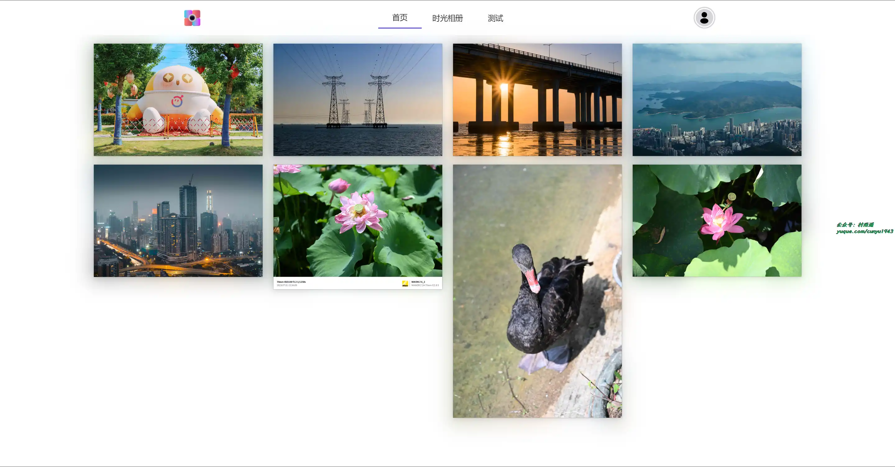

### 3. [hsweb4](https://github.com/hs-web/hsweb-framework)

一个基于 spring-boot 2.x 开发，首个使用全响应式编程的企业级后台管理系统基础项目。

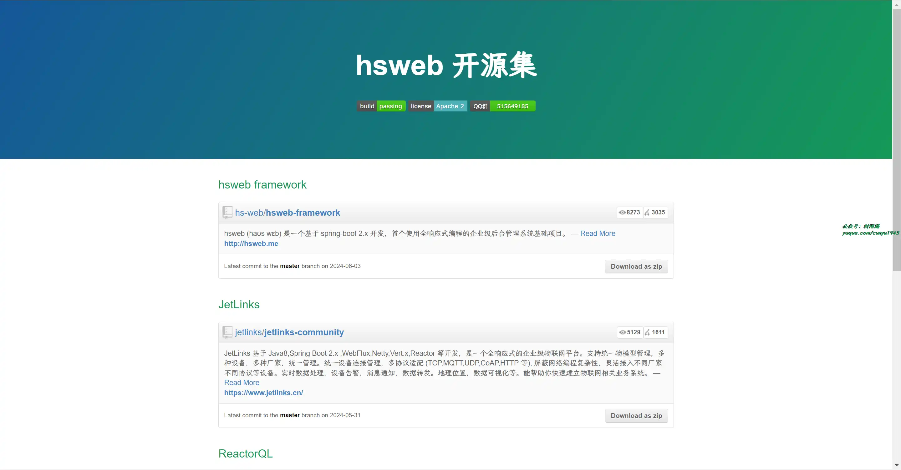

## 二、软件

### 1. [Listen 1](https://github.com/listen1/listen1_desktop)

可以搜索和播放来自网易云音乐，QQ 音乐，酷狗音乐，酷我音乐，Bilibili，咪咕音乐网站的歌曲，让你的曲库更全面。

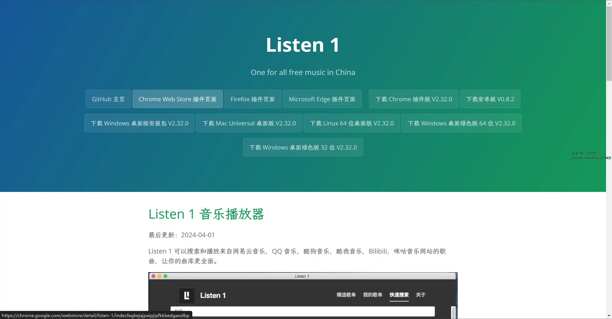

### 2. [VLC](https://www.videolan.org/vlc/)

一款自由、开源的跨平台多媒体播放器及框架，可播放大多数多媒体文件，以及 DVD、音频 CD、VCD 及各类流媒体协议。

### 3. [WizTree](https://diskanalyzer.com)

可以说是 Windows 上最快的磁盘空间分析器。使用它可以快速查找并删除硬盘中的空间占用，释放宝贵的磁盘空间。

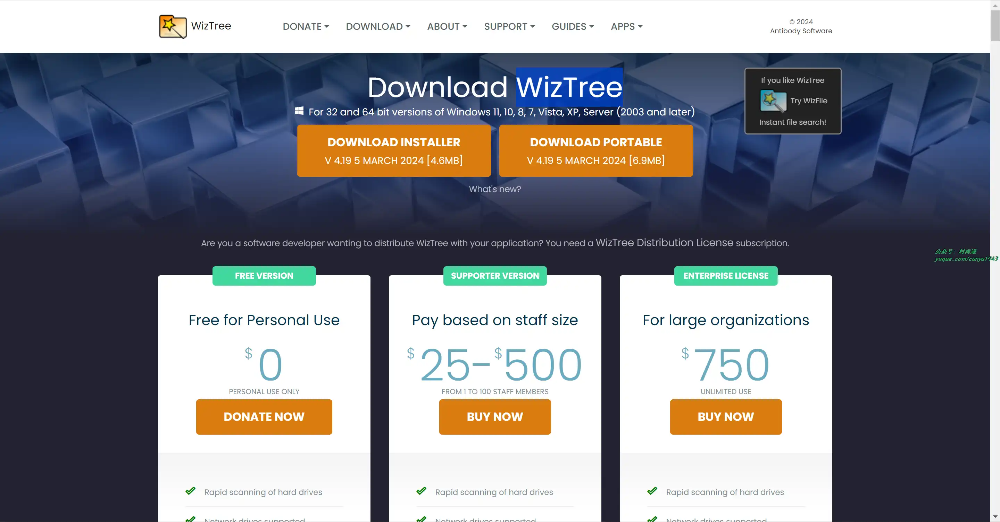

## 三、网站

### 1. [食用手册](https://cook.yunyoujun.cn/)

根据所选食材，主要指蔬菜、肉类以及主食，再选用我们烹饪时的厨具，就能够通过模糊匹配、严格匹配以及生存模式的方式来组合出菜单供选择。

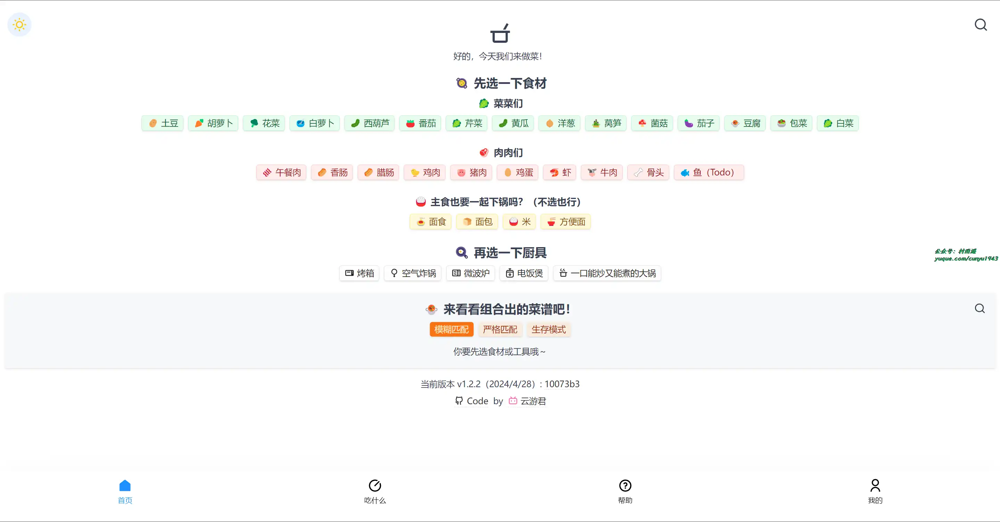

### 2. [在线 PS](https://ps.gaoding.com/)

稿定设计联合 Photopea 出品的 PS 软件网页版，方便我们在线处理图片。

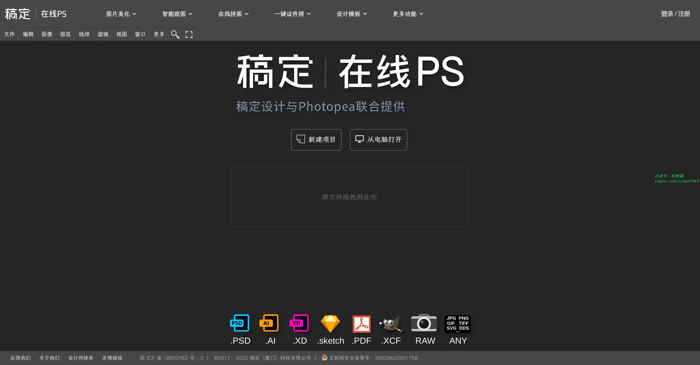

### 3. [反向词典](https://wantwords.net/)

唯一支持中文及中英跨语言查询的反向词典系统，可以通过描述意思来查找词语。基于最先进的人工智能和自然语言处理算法实现，由清华大学自然语言处理实验室出品。

## 四、插件

### 1. [Superb Copy](https://chromewebstore.google.com/detail/superb-copy/agdjnnfibbfdffpdljlilaldngfheapb)

你是否厌倦了浏览网站时受到的限制？你是否经常发现自己无法右键单击、复制或访问上下文菜单？我们为您提供了完美的解决方案！Super Copy 是一款终极浏览器扩展，能让您充分释放网页浏览体验的潜力。

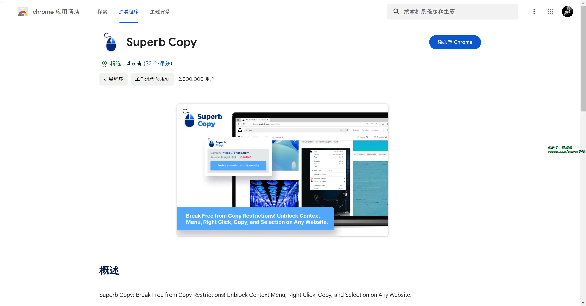

### 2. [Just One Page PDF](https://chromewebstore.google.com/detail/just-one-page-pdf/fgbhbfdgdlojklkbhdoilkdlomoilbpl)

可将任何网页、任何区域保存为一页 PDF，就像截图工具一样，只不过保存的是 PDF 格式。

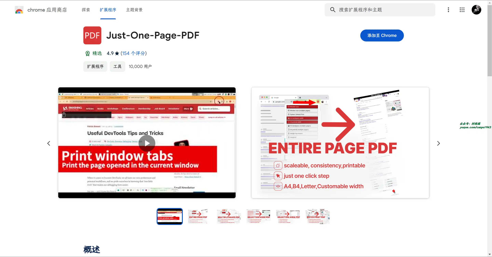

### 3. [TABLERONE tab Manager](https://chromewebstore.google.com/detail/tablerone-tab-manager/andpjllgocabfacjlelkfpdemfklpfpo)

多合一标签管理器，用于保存标签、恢复会话和组织书签，选项卡管理器通过使您能够关闭所有选项卡而不会丢失它们来解决此问题。

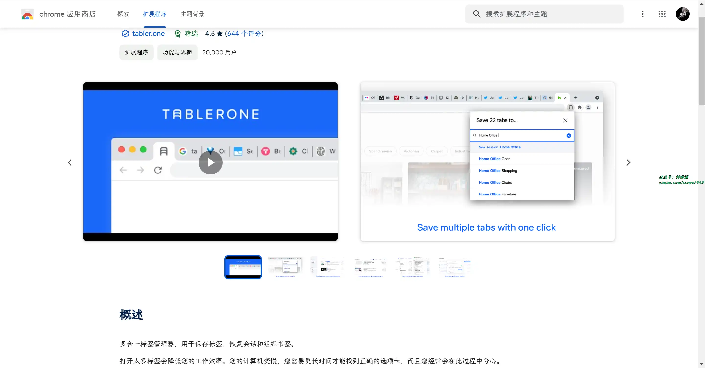

## 五、资料

### 1. [Go 学习路线](https://github.com/yongxinz/gopher)

Go 学习路线图，包括基础专栏，进阶专栏，源码阅读，实战开发，面试刷题，必读书单等一系列资源。

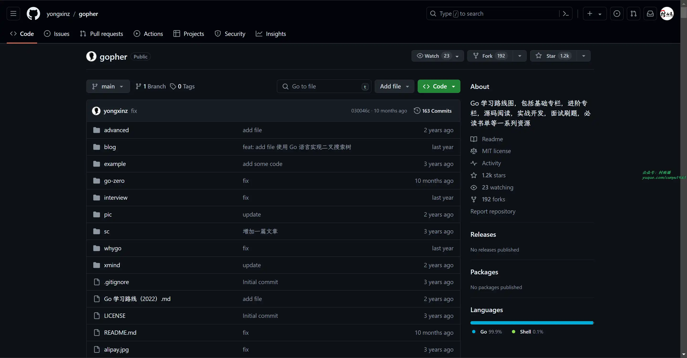

### 2. [Golang 100 天从新手到大师](https://github.com/rubyhan1314/Golang-100-Days)

教程分为 100 天内容，从零到 一，助力从 Golang 新手成长为大师。

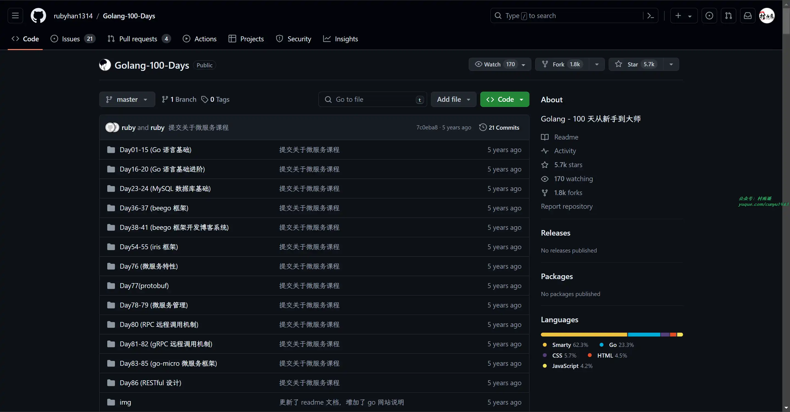

### 3. [Go tutorial](https://github.com/jincheng9/go-tutorial)

Go 语言学习笔记，涵盖基础、中级和高级方面的教程文章，帮助你快速入门。

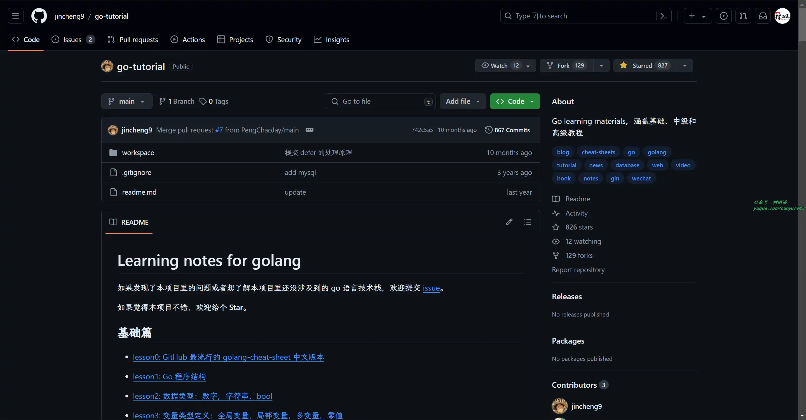

## ✍️ 说明

周刊专栏相关信息：

- **项目地址**：[Github](https://github.com/cunyu1943/weekly)，觉得不错麻烦给我一个**Star**，感谢 ❤️
- **浏览地址**：公众号 | [电子书](https://cunyu1943.github.io/weekly) | [语雀](https://yuque.com/cunyu1943/weekly)

如果你阅读到这里，说明我的工作没有白费。如果你想推荐项目/网站/软件/资源，欢迎提交 **[issue](https://github.com/cunyu1943/weekly/issues)** 或者添加我 **个人微信：coder_cunYu** 与我交流。

---

## ⏳ 联系

想解锁更多知识？不妨关注我的微信公众号：**村雨遥（id：JavaPark）**。

扫一扫，探索另一个全新的世界。

