# 好物周刊#60：以图搜图

> 作者：[村雨遥](https://github.com/cunyu1943)
> 
> 不要哀求，学会争取，若是如此，终有所获
> 
> 原文：https://mp.weixin.qq.com/s/c0ujTt7DvYfU9h3rYJWSkA

## 🎈 号外 

最近，公众号之外，建立了微信交流群，不定期会在群里分享各种资源（影视、IT 编程、考试提升……）&知识。如果有需要，可以**扫码或者后台添加小编微信备注入群**。进群后**优先看群公告**，**呼叫群中【资源分享小助手】**，还能免费帮找资源哦～

 

## 一、项目

### 1. [Rin](https://github.com/OXeu/Rin)

一个基于 Cloudflare Pages + Workers + D1 + R2 全家桶的博客，无需服务器无需备案，只需要一个解析到 Cloudflare 的域名即可部署。

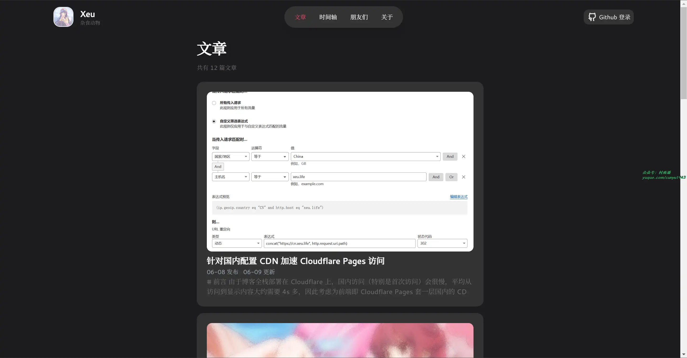

### 2. [My Blog](https://github.com/ZHENFENG13/My-Blog)

由 SpringBoot + Mybatis + Thymeleaf 等技术实现的 Java 博客系统，页面美观、功能齐全、部署简单及完善的代码，给使用者带来无与伦比的体验。

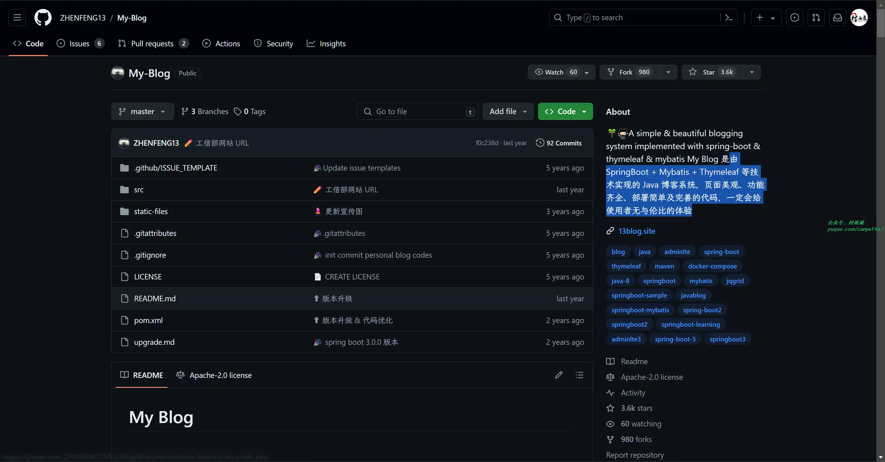

### 3. [12306](https://gitee.com/nageoffer/12306)

基于 SpringBoot3 + Java17 + SpringCloud Alibaba + Vue3 等技术架构，完成高仿铁路 12306 用户 + 抢票 + 订单 + 支付服务，帮助学生主打就业的项目。

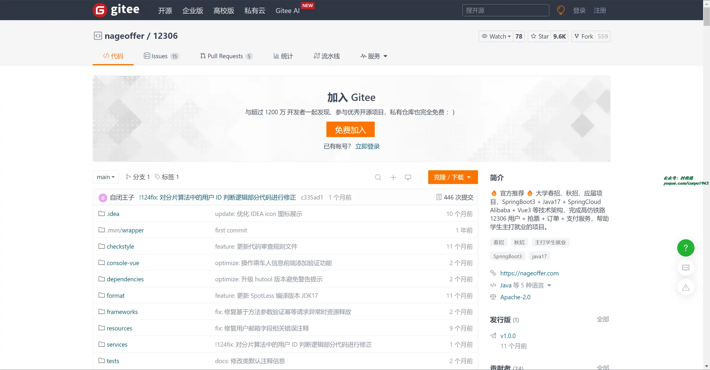

## 二、软件

### 1. [Latest](https://github.com/mangerlahn/Latest)

macOS 端小众工具，用于检查并更新本机已安装软件到最新版本。

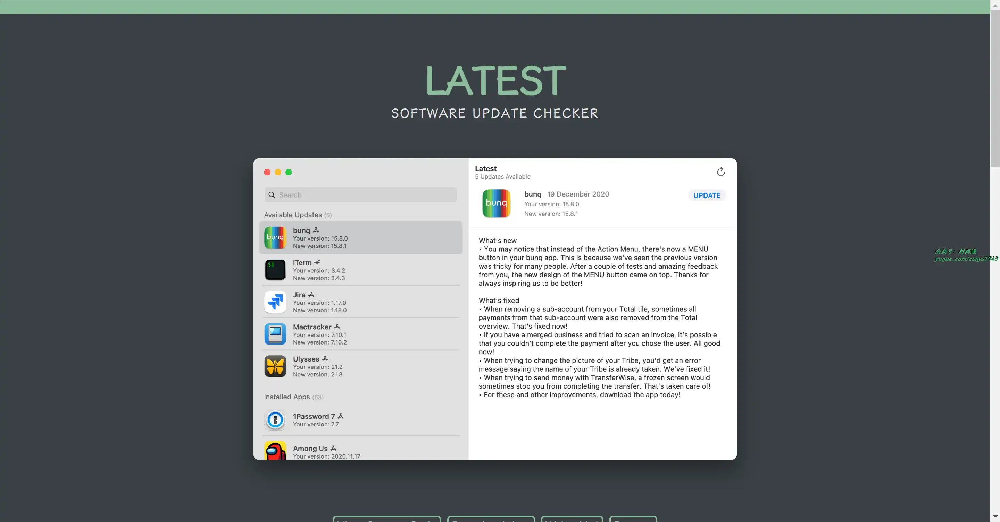

### 2. [Outline](https://github.com/outline/outline)

开源软件，可以当做 Notion 的平替，用于搭建团队内部知识库。

### 3. [DataEase](https://github.com/dataease/dataease)

开源数据可视化分析工具，数据大屏开发神器！人人可用，Power BI、帆软、Tableau 等商业 BI 工具的开源替代。

## 三、网站

### 1. [SauceNAO](https://saucenao.com/)

支持从从本地上传图片或者粘贴图片在线地址，就能搜索出相关联的图片。

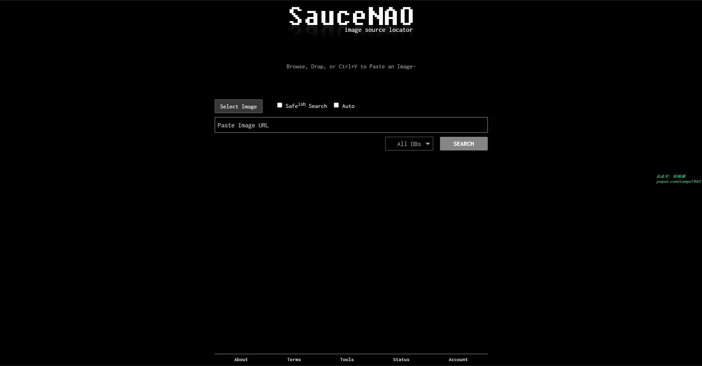

### 2. [Multi-service image search](https://iqdb.org/)

比起 SauceNAO 更加简单，支持 JPEG、PNG、GIF 等文件格式，最大支持上传 8M，同时也同样支持图片在线地址进行搜索。

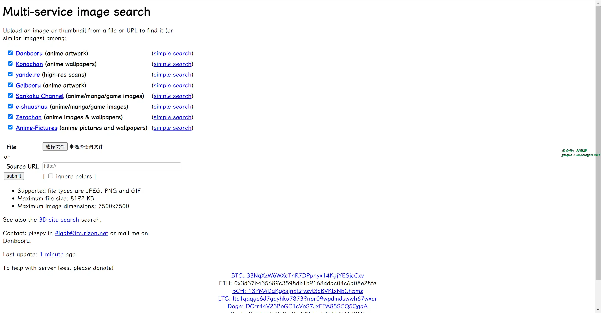

### 3. [TinyEye](https://tineye.com/)

反向图像搜索，查找图片在网上出现的位置，支持上传图片或者图片 URL 的方式。

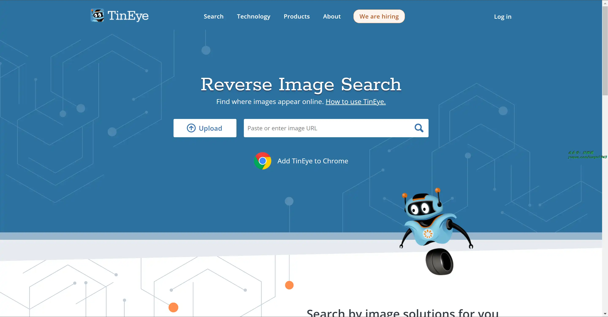

## 四、插件

### 1. [Fake Filler](https://chromewebstore.google.com/detail/fake-filler/bnjjngeaknajbdcgpfkgnonkmififhfo)

一款表单填充器，它使用随机生成的虚假数据填充页面上的所有输入字段。对于使用表单的开发人员和测试人员来说是十分有必要，因为它消除了手动输入字段值的步骤，提高了工作效率。

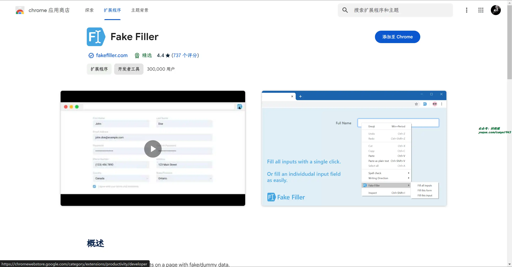

### 2. [Clean Cache](https://chromewebstore.google.com/detail/clear-cache/cppjkneekbjaeellbfkmgnhonkkjfpdn)

安装后，只需轻轻单击按钮即可清除浏览器缓存和浏览数据，无需任何确认对话框、弹出窗口或其他烦人的操作。

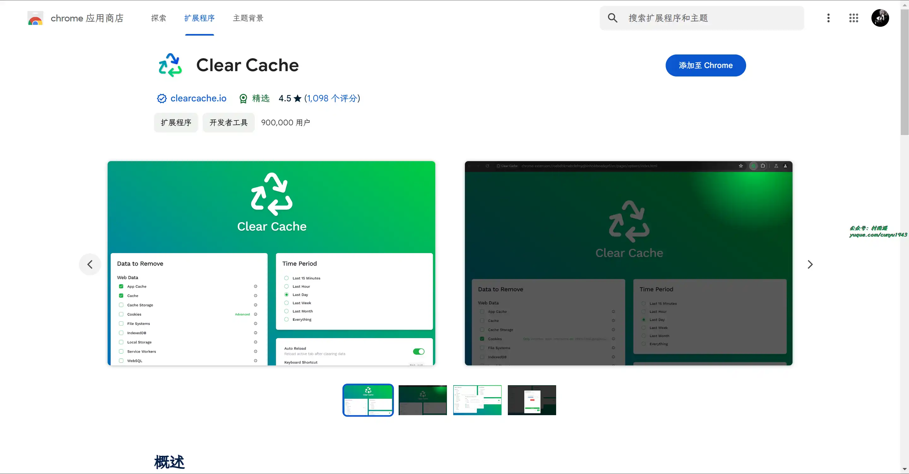

### 3. [GitZip for github](https://chromewebstore.google.com/detail/gitzip-for-github/ffabmkklhbepgcgfonabamgnfafbdlkn)

支持将 Github 仓库的子目录和文件打包成 zip 文件，有了它，你就能轻易从 Github 中获取各种资源的压缩包文件了。

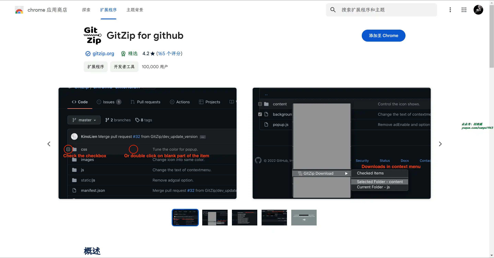

## 五、资料

### 1. [你缺失的那门计算机课](https://github.com/criwits/missing-web/)

一份适合电脑小白的电脑使用技巧手册。它以近乎手把手教的语言，介绍了从基本的文件管理到软件的寻找安装，从简要的硬件组成到电脑的安全防护，从各类使用技巧到优良软件推荐的许多内容，旨在帮助对电脑操作不甚了解的所谓小白逐渐上手电脑的使用。

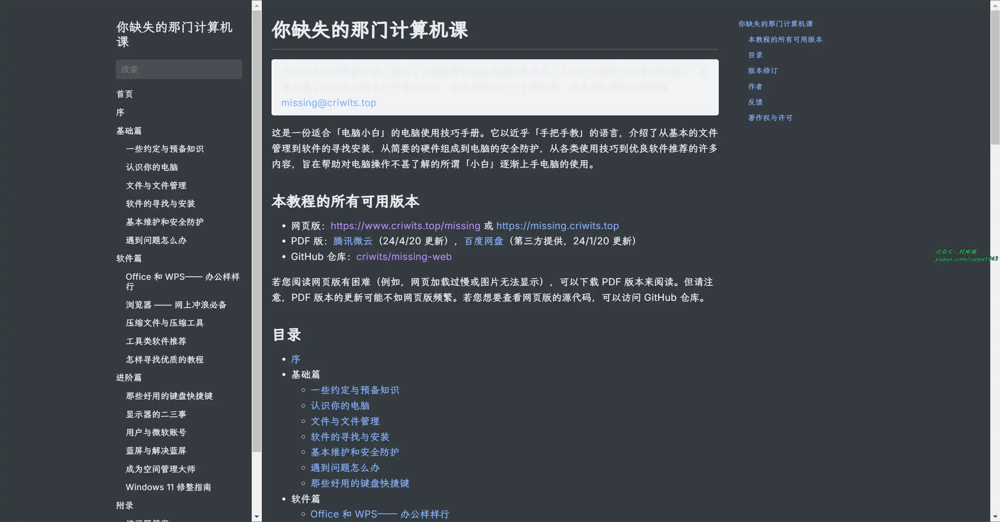

### 2. [CS 自学指南](https://github.com/PKUFlyingPig/cs-self-learning)

一本计算机的自学指南，也是作者对自己大学三年自学生涯的一个纪念。

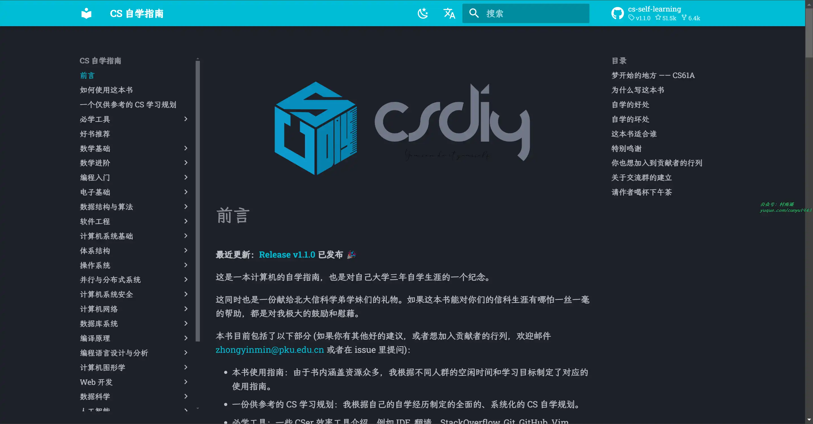

### 3. [一份硬核计算机科学 CS 自学计划](https://github.com/spring2go/cs_study_plan)

一份硬核计算机科学 CS 自学计划，偏向软件工程和系统架构方向，帮助自己夯实 CS 基本功。

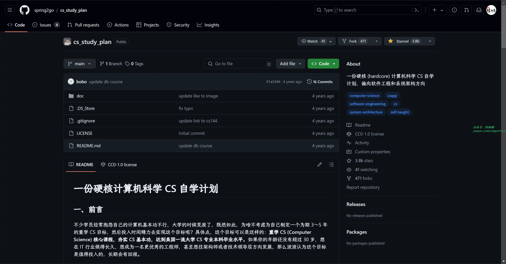

## ✍️ 说明

周刊专栏相关信息：

- **项目地址**：[Github](https://github.com/cunyu1943/weekly)，觉得不错麻烦给我一个 **Star**，感谢 ❤️
- **浏览地址**：公众号 | [电子书](https://cunyu1943.github.io/weekly) | [语雀](https://yuque.com/cunyu1943/weekly)

如果你阅读到这里，说明我的工作没有白费。如果你想推荐项目/网站/软件/资源，欢迎提交 **[issue](https://github.com/cunyu1943/weekly/issues)** 或者添加我 **个人微信：coder_cunYu** 与我交流。

---

## ⏳ 联系

想解锁更多知识？不妨关注我的微信公众号：**村雨遥（id：JavaPark）**。

扫一扫，探索另一个全新的世界。

