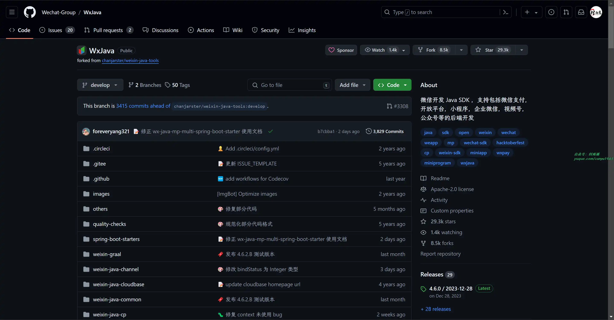
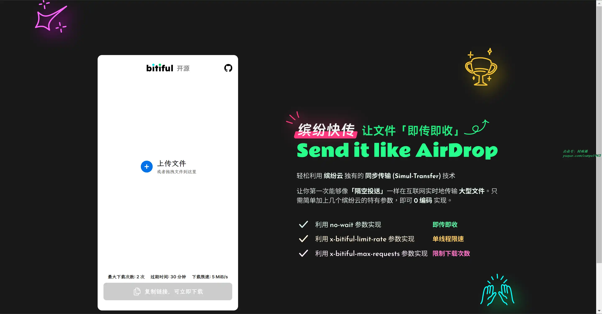
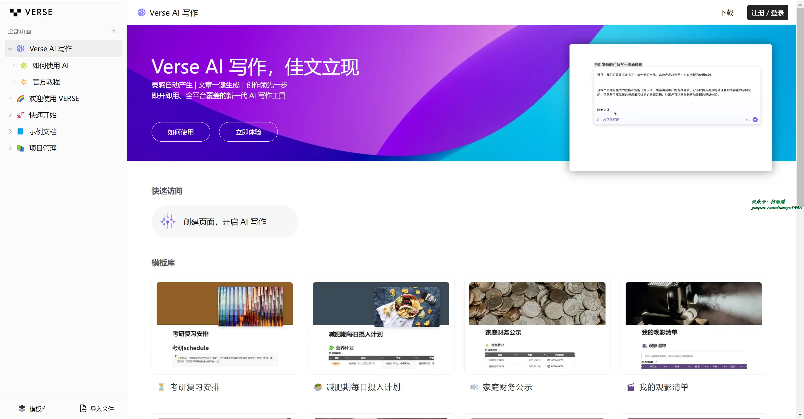
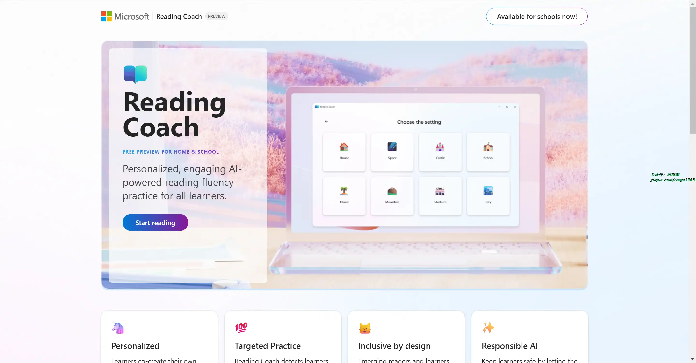
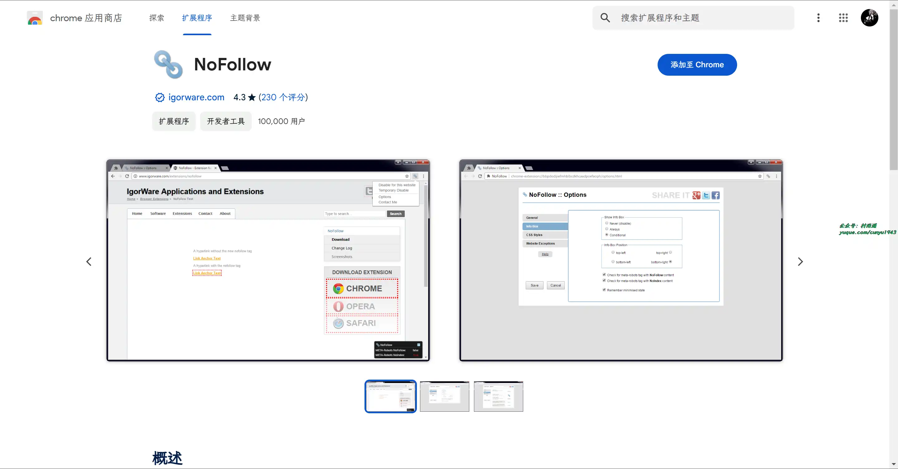
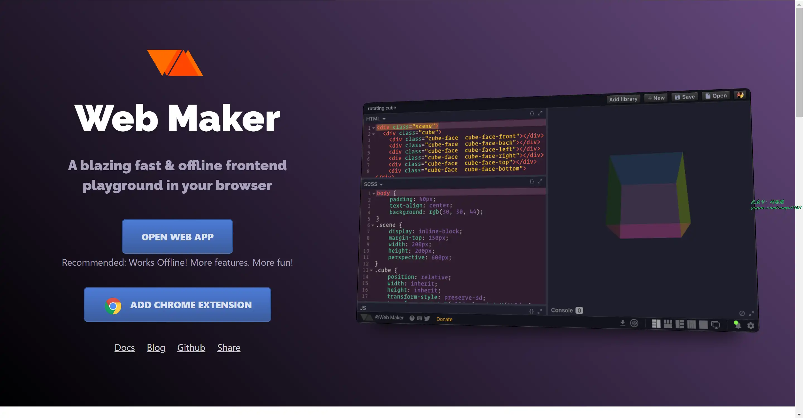
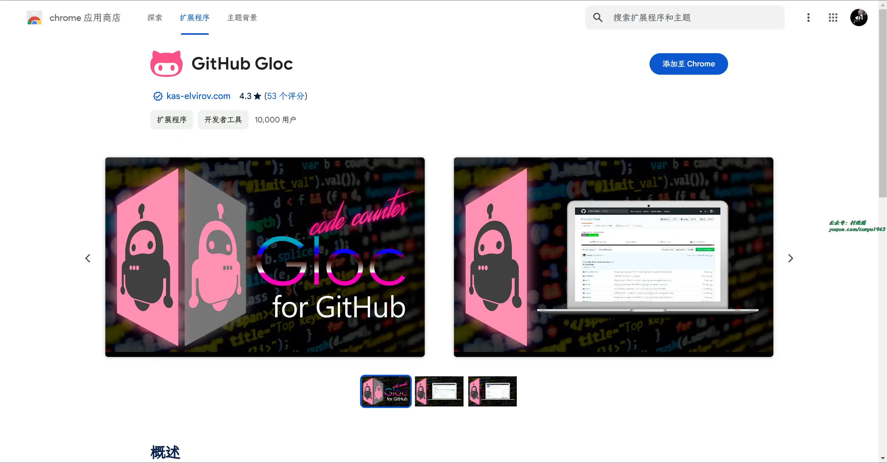
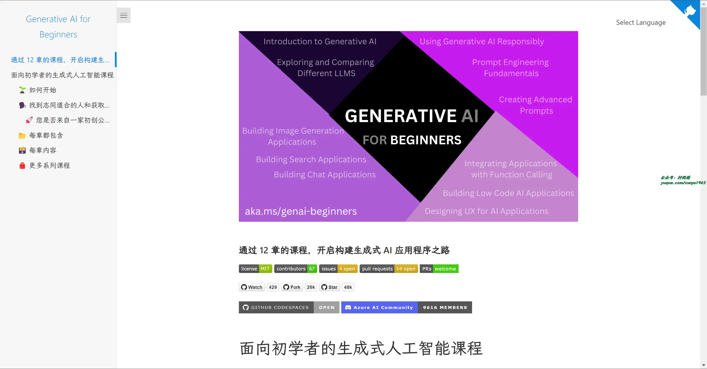
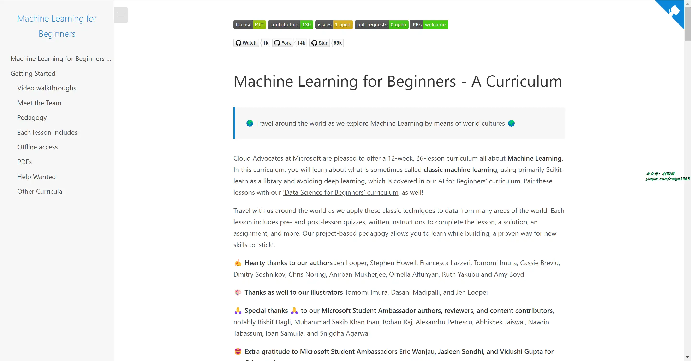

# 好物周刊#61：人工智能学习路线

> 作者：[村雨遥](https://github.com/cunyu1943)
> 
> 不要哀求，学会争取，若是如此，终有所获
> 
> 原文：https://mp.weixin.qq.com/s/TiJMFeNv04FbPsvZ-0ub7A

## 🎈 号外 

最近，公众号之外，建立了微信交流群，不定期会在群里分享各种资源（影视、IT 编程、考试提升……）&知识。如果有需要，可以**扫码或者后台添加小编微信备注入群**。进群后**优先看群公告**，**呼叫群中【资源分享小助手】**，还能免费帮找资源哦～

 

## 一、项目

### 1. [WxJava](https://github.com/Wechat-Group/WxJava)

微信 Java 开发工具包，支持包括微信支付、开放平台、公众号、企业微信、视频号、小程序等微信功能模块的后端开发。

### 2. [send](https://github.com/bitiful/send)

基于 Bitiful S4 对象存储的 “Simul-Transfer（即传即下）” 技术实现的大文件实时多人分享，可以当作是 Wetransfer 或奶牛快传的开源替代品。

### 3. [go-admin](https://github.com/go-admin-team/go-admin)

基于 Gin + Vue + Element UI OR Arco Design OR Ant Design 的前后端分离权限管理系统，系统初始化极度简单，只需要配置文件中，修改数据库连接，系统支持多指令操作，迁移指令可以让初始化数据库信息变得更简单，服务指令可以很简单的启动 api 服务。

## 二、软件

### 1. [AiPPT](https://www.aippt.cn/)

结合最新 AI 技术，为用户提供一键生成高质量 PPT 的解决方案。无论是职场展示、教育课件还是销售报告，AiPPT 均能快速生成符合需求的专业 PPT，简化设计流程，提升工作效率。

### 2. [Verse](https://verse.app.yinxiang.com/product)

新一代免费的 AI 生产力工具，支持多种场景内容智能生成，包括会议纪要、公文假条、小说作文、日报、新闻稿、广告创作等等高效产出。

### 3. [浮墨笔记](https://flomoapp.com/)

像发微博一样记笔记，记录你想法的川流。全平台覆盖，还支持微信服务号输入。不仅能帮你快速记录，还能帮你更好回顾。输入邀请码：NDk5OTk，即可免费获取 14 天高级会员。

## 三、网站

### 1. [中指云](https://www.cih-index.com/)

中指云为中指研究院官网，为房地产企业、物业公司、金融机构、政府机关、高校等用户提供专业的房地产数据查询和房地产市场研究服务。

### 2. [Reading Coach](https://coach.microsoft.com/)

微软出品的免费 AI 阅读教练，通过个性化的阅读联系，帮助学习者提高阅读理解能力。

### 3. [AI 大学堂](https://www.aidaxue.com/)

科大讯飞打造的 AI 在线学习平台，为各行业各领域的技术人才提供人工智能培训，人工智能学习，编程入门自学，计算机编程入门，Python 数据分析等课程，旨在为 AI 领域开发者、爱好者提供专业的课程、资源及服务支持。

## 四、插件

### 1. [NoFollow](https://chromewebstore.google.com/detail/nofollow/dfogidghaigoomjdeacndafapdijmiid)

安装后可用于检测 nofollow 和 noindex 元标签网页，同时自动为 nofollow 链接添加红色边框，还可以设置网站过滤和自定义外框 CSS 样式，可用于分析网站。

### 2. [Web Maker](https://chromewebstore.google.com/detail/web-maker/lkfkkhfhhdkiemehlpkgjeojomhpccnh)

专业且易用的网页开发编辑 & 预览插件，支持讲浏览器选项卡转换为 Web 编译器，支持离线工作、内置工作台，能实时保持并加载你的修改。

### 3. [Github Gloc](https://chromewebstore.google.com/detail/github-gloc/kaodcnpebhdbpaeeemkiobcokcnegdki)

安装该插件后，就可以在我们浏览 Github 仓库时，预估出仓库中的代码行数。

## 五、资料

### 1. [Generative AI for Beginners](https://github.com/Microsoft/generative-ai-for-beginners)

通过微软云技术布道师团队提供的十二章系列课程，了解构建生成式 AI 应用程序的基础知识。 每章都涵盖了生成式人工智能原理和应用程序开发的一个关键方面。 在整个系列课程中，我们将建立我们自己的生成式人工智能初创公司，以便您可以了解如何实现您的想法。

### 2. [ML-For-Beginners](https://github.com/Microsoft/ML-For-Beginners)

微软提供的为期 12 周、共 26 节课的机器学习课程。在本课程中，您将了解有时被称为经典机器学习的内容，主要使用 Scikit-learn 作为库，避免使用深度学习，对新手深入了解底层原理更加友好。

### 3. [人工智能学习路线](https://developer.aliyun.com/learning/roadmap/ai)

阿里云推出的算法原理、框架精讲、机器学习实战、图像识别实战、自然语言处理实战，人工智能技术一站式学习教程。

## ✍️ 说明

周刊专栏相关信息：

- **项目地址**：[Github](https://github.com/cunyu1943/weekly)，觉得不错麻烦给我一个**Star**，感谢 ❤️
- **浏览地址**：公众号 | [电子书](https://cunyu1943.github.io/weekly) | [语雀](https://yuque.com/cunyu1943/weekly)

如果你阅读到这里，说明我的工作没有白费。如果你想推荐项目/网站/软件/资源，欢迎提交 **[issue](https://github.com/cunyu1943/weekly/issues)** 或者添加我 **个人微信：coder_cunYu** 与我交流。

---

## ⏳ 联系

想解锁更多知识？不妨关注我的微信公众号：**村雨遥（id：JavaPark）**。

扫一扫，探索另一个全新的世界。

