# 好物周刊#62：文件快递柜

> 作者：[村雨遥](https://github.com/cunyu1943)
> 
> 不要哀求，学会争取，若是如此，终有所获
> 
> 原文：https://mp.weixin.qq.com/s/Jseax5QDMHxKabCNjVJ4QQ

## 🎈 号外 

最近，公众号之外，建立了微信交流群，不定期会在群里分享各种资源（影视、IT 编程、考试提升……）&知识。如果有需要，可以**扫码或者后台添加小编微信备注入群**。进群后**优先看群公告**，**呼叫群中【资源分享小助手】**，还能免费帮找资源哦～

 

## 一、项目

### 1. [waynboot-mall](https://github.com/wayn111/waynboot-admin)

一套全部开源的微商城项目，包含一个运营后台、h5 商城和后台接口。实现了一个商城所需的首页展示、商品分类、商品详情、商品搜索、加入购物车、结算下单、订单状态流转等一系列功能。

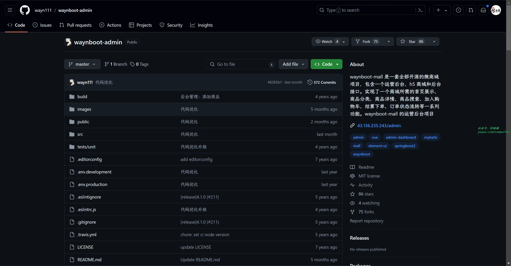

### 2. [FileCodeBox](https://github.com/vastsa/FileCodeBox)

匿名口令分享文本，文件，像拿快递一样取文件。

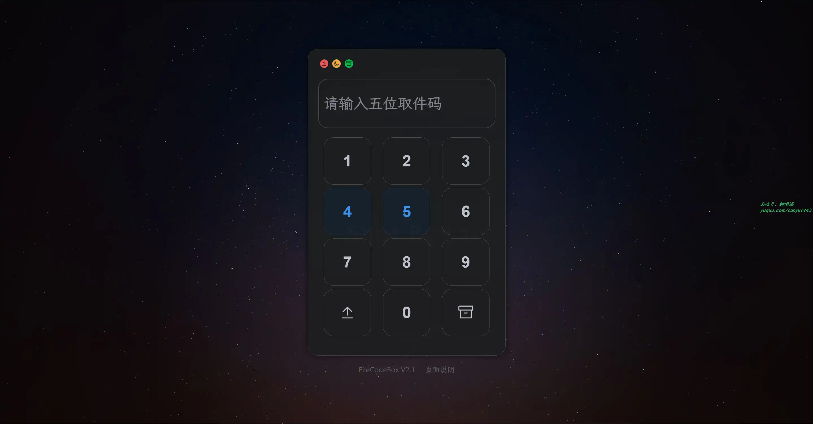

### 3. [小小商城系统](https://github.com/xenv/S-mall-ssm)

基于 SSM 的 JavaWEB 项目，仿天猫页面，功能齐全，实现了自动处理关联查询的通用 Mapper、抽象 BaseService 类、注解鉴权、参数注解校验等功能。

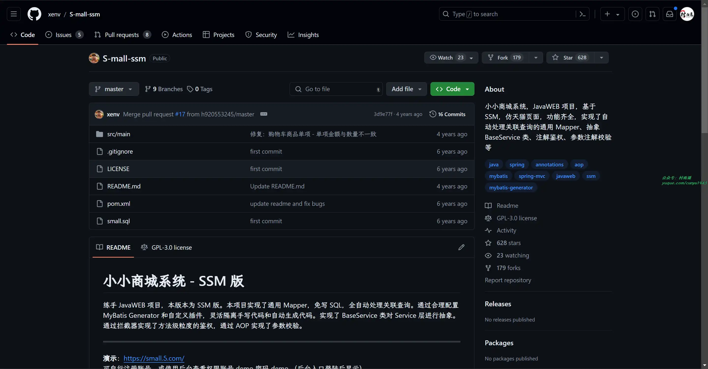

## 二、软件

### 1. [Uninstall Tool](https://crystalidea.com/uninstall-tool)

小巧、安全、快速、强大的软件卸载删除工具。

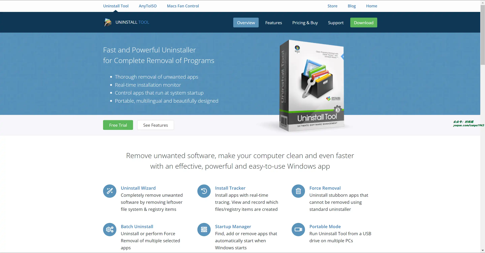

### 2. [泼辣](https://www.polaxiong.com/)

简单专业的图片和视频处理软件，探索无限滤镜和超群的修图工具。

### 3. [Zoommy](https://zoommyapp.com/)

一款跨平台的配图神器，支持从超过 50 家高质量图片网站中搜索超过 50000 张经授权的图片，并用于非商业用途。

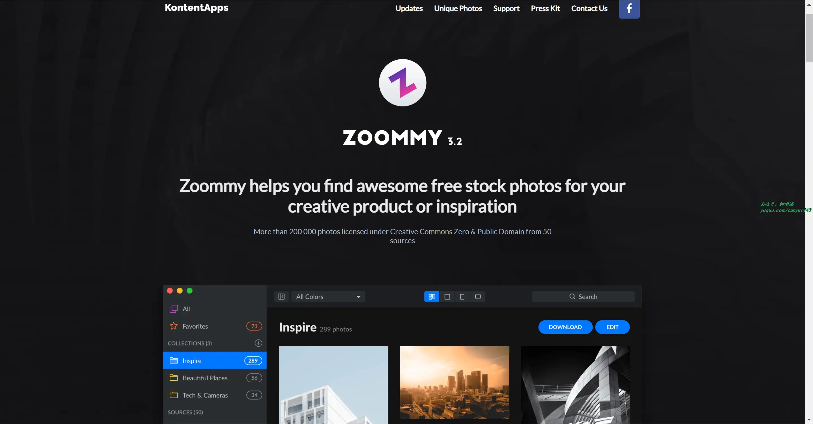

## 三、网站

### 1. [百度开发者搜索](https://kaifa.baidu.com/)

开发者搜索是一个面向开发者的知识搜索平台，专注于为开发者提供高效的技术搜索服务。

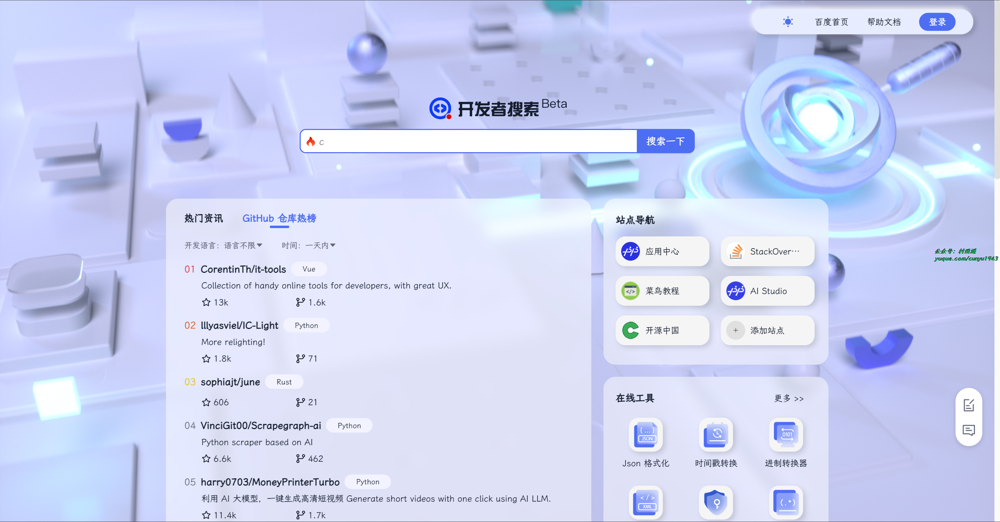

### 2. [沙沙野](https://www.ssyer.com/)

沙沙野是一个面向全球的高质量视觉素材平台，拥有百万素材。提供高清图片素材，网页素材，矢量图的免费下载服务。全站图片，视频素材均可在遵守平台规则的情况下直接下载并可商用。

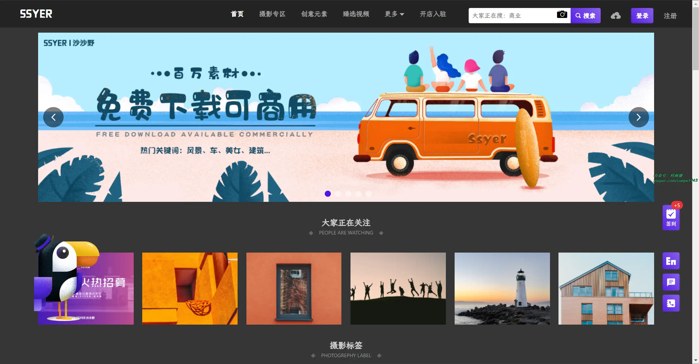

### 3. [优设网](https://www.uisdc.com/)

国内设计师入门到进阶的专业设计网站。AIGC 及设计内容全面及时，全网粉丝过千万。专注前沿设计趋势和设计方法论，拥有原创独家设计内容和设计师网站导航。提供 AIGC 教程、灵感素材、UI设计、平面设计、网页设计、电商设计、SDC 网站推荐。

## 四、插件

### 1. [歪脖子新标签页](https://chromewebstore.google.com/detail/ackimleclkemolnfcfajficenpbnaiba)

一款可以预防颈椎病的新标签页扩展。具有如下功能：

- 活动脖子，预防颈椎病
- 三种模式支持，强度自己选择
- 休息日指南，快速知晓下一个休息日
- 当季蔬果提示，健康饮食每一天
- 历史上的今天，回顾历史长河

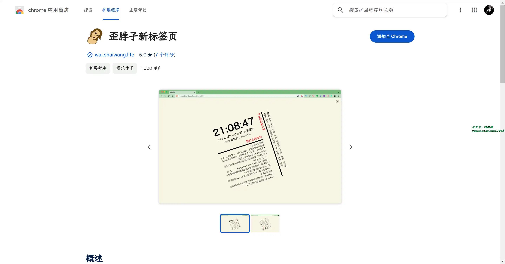

### 2. [深色模式](https://chromewebstore.google.com/detail/gjjbmfigjpgnehjioicaalopaikcnheo)

可以将网站切换为深色阅读器、夜间模式，几乎能在所有网站上启用。

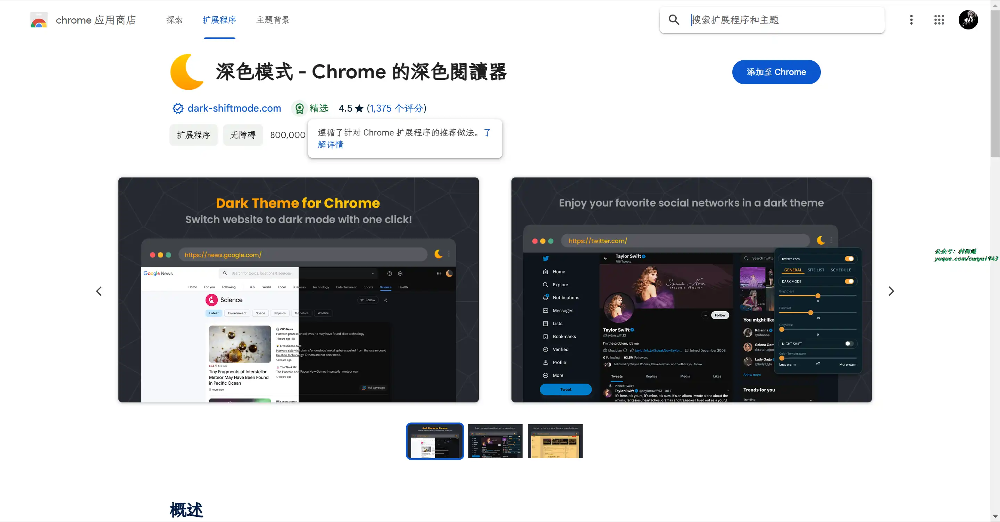

### 3. [冥想](https://chromewebstore.google.com/detail/andfohanhajengikbobaoblbdkmlkicp)

一款冥想计时器，可帮助您在任何地方进行冥想。简单、美观且易于使用。

## 五、资料

### 1. [TypeScript 入门教程](https://github.com/xcatliu/typescript-tutorial)

从 JavaScript 程序员的角度总结思考，循序渐进的理解 TypeScript。

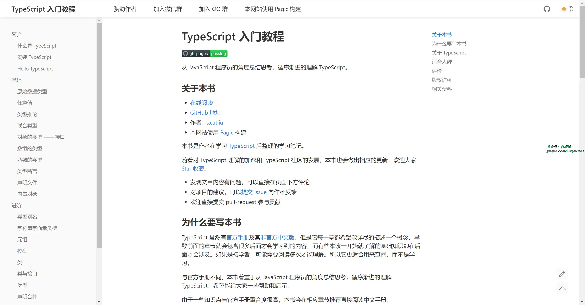

### 2. [ES6 入门教程](https://es6.ruanyifeng.com/)

一本开源的 JavaScript 语言教程，全面介绍 ECMAScript 6 新引入的语法特性。

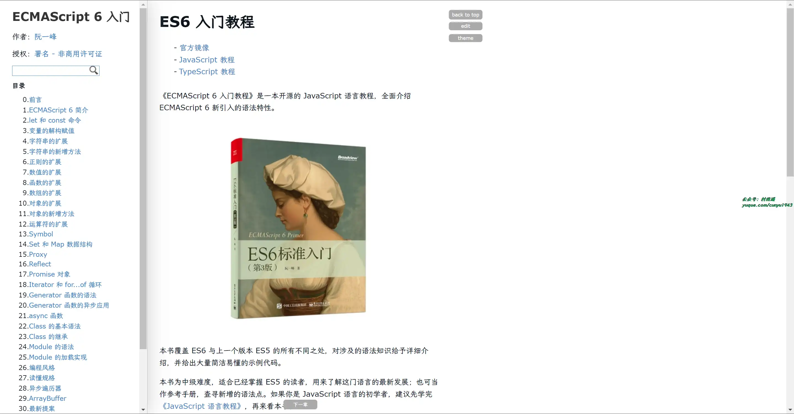

### 3. [项目规范](https://github.com/elsewhencode/project-guidelines)

JavaScript 工程项目的一系列最佳实践策略，主要包含 Git、文档、环境、依赖、测试、代码风格、结构与命名规则、日志等多方面。

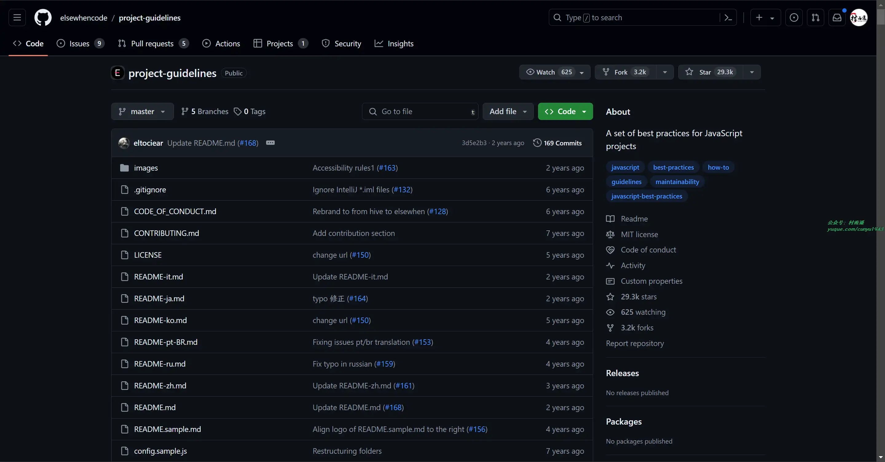

## ✍️ 说明

## ✍️ 说明

周刊专栏相关信息：

- **项目地址**：[Github](https://github.com/cunyu1943/weekly)，觉得不错麻烦给我一个**Star**，感谢 ❤️
- **浏览地址**：公众号 | [电子书](https://cunyu1943.github.io/weekly) | [语雀](https://yuque.com/cunyu1943/weekly)

如果你阅读到这里，说明我的工作没有白费。如果你想推荐项目/网站/软件/资源，欢迎提交 **[issue](https://github.com/cunyu1943/weekly/issues)** 或者添加我 **个人微信：coder_cunYu** 与我交流。

---

## ⏳ 联系

想解锁更多知识？不妨关注我的微信公众号：**村雨遥（id：JavaPark）**。

扫一扫，探索另一个全新的世界。

