# 好物周刊#63：智能编程助手

> 作者：[村雨遥](https://github.com/cunyu1943)
> 
> 不要哀求，学会争取，若是如此，终有所获
> 
> 原文：https://mp.weixin.qq.com/s/FWEbsX6aVsTJh-h4plfi6g

## 🎈 号外 

最近，公众号之外，建立了微信交流群，不定期会在群里分享各种资源（影视、IT 编程、考试提升……）&知识。如果有需要，可以**扫码或者后台添加小编微信备注入群**。进群后**优先看群公告**，**呼叫群中【资源分享小助手】**，还能免费帮找资源哦～

 

## 一、项目

### 1. [blog](https://github.com/iszhouhua/blog)

基于 SpringBoot 搭建的开源个人博客系统，模板引擎使用 thymeleaf。项目后台部分采用前后端分离模式开发。前台使用 Vue 和 element 完成。

### 2. [gptpdf](https://github.com/CosmosShadow/gptpdf)

使用视觉大语言模型（如 GPT-4o）将 PDF 解析为 markdown。虽然方法十分简单，但功能十分强大，能近乎完美解析排版、公式、表格、图片、图表等信息。

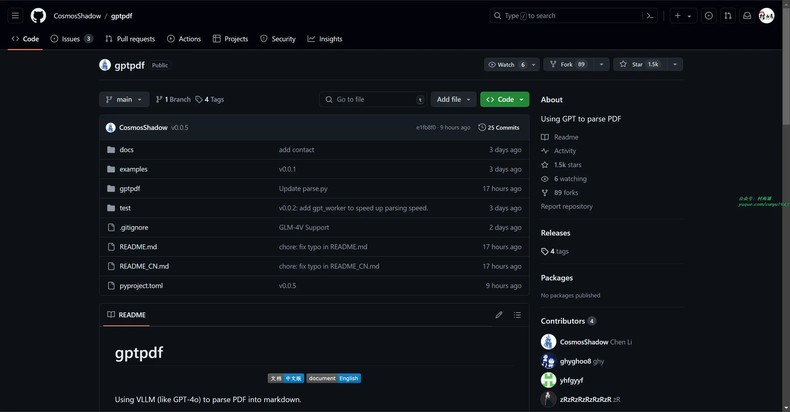

### 3. [carsale](https://github.com/Hitout/carsale)

项目基于 Spring Boot 以及 Vue 开发，前端实现基于开源后台项目 vue-element-admin 改造。

针对汽车销售提供客户信息、车辆信息、订单信息、销售人员管理、财务报表等功能，提供经理和销售两种角色进行管理。

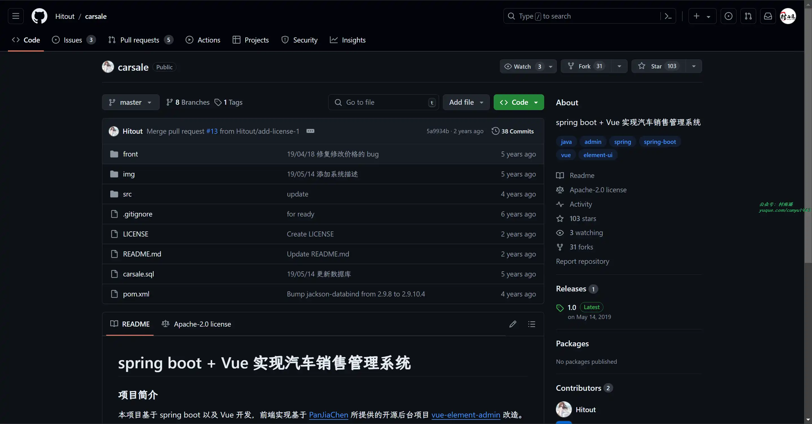

## 二、软件

### 1. [CodeGeeX](https://codegeex.cn/)

一个基于 AI 大模型的编程辅助工具，可以实现自动代码生成、代码翻译、自动编写注释等功能，支持 20 多种编程语言。

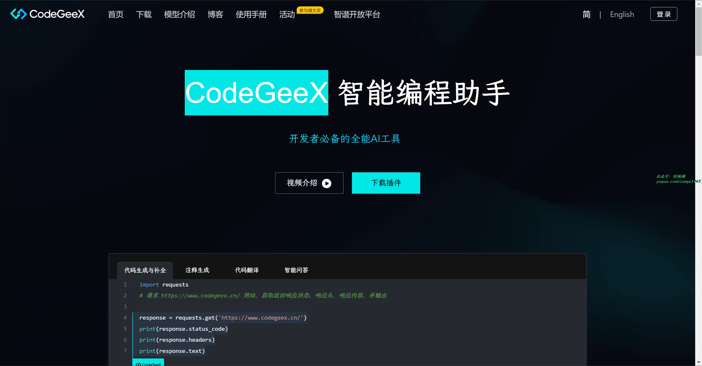

### 2. [Cursor](https://www.cursor.com/)

基于 GPT3.5 的 AI 代码编辑器，支持智能编码、聊天、自动生成测试和注释、查看代码 Diff 等功能。

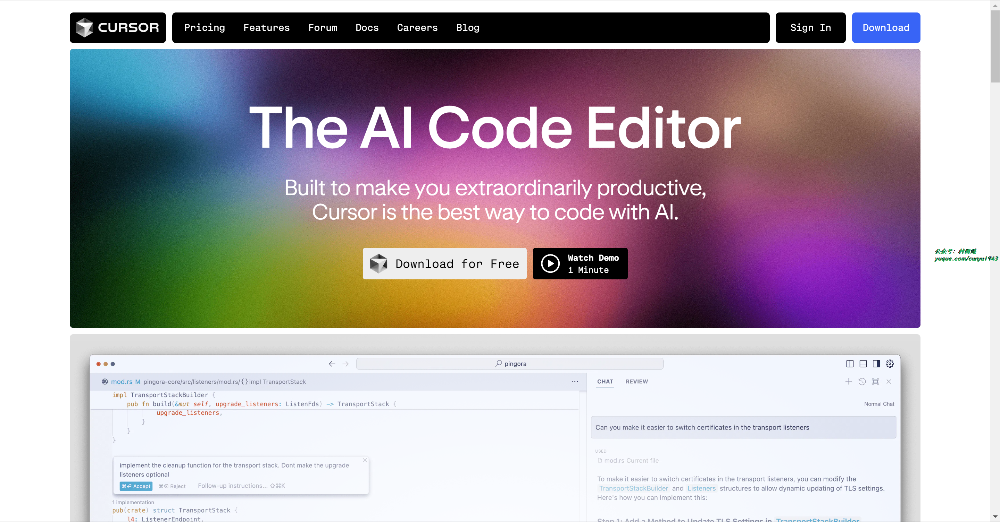

### 3. [通义灵码](https://tongyi.aliyun.com/lingma/)

你的智能编码助手，为开发者提供行级和函数级代码续写、单元测试生成、代码注释生成、研发智能问答等能力，助你高质高效地完成编码工作。

## 三、网站

### 1. [IP 查询](https://ipw.cn/)

简单好用的 IPv6 工具箱：支持 IPv6 地址查询、 IPv6 网络开通测试，支持 IPv6 在线 Ping 测试、IPv6 网站检测、IPv6 网站测速，致力于普及 IPv6 ,推进 IPv6 规模部署和应用。

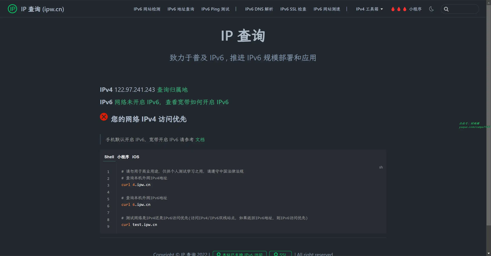

### 2. [在线字体转换器](http://www.akuziti.com/)

在线字体转换，支持各种字体之间的相互转换，仅需输入文字，即可将其转换为你想要的字体形式。用来设计个人签名十分有用。

### 3. [GIPHY](https://giphy.com/)

一个让你的世界充满活力的平台，在这里，你能找到各种 Gif 和贴纸，并将其用于用于你的社交场景，就像表情包一样。

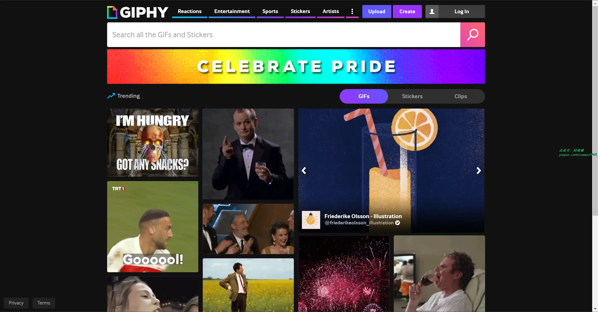

## 四、插件

### 1. [豆包](https://chromewebstore.google.com/detail/dbjibobgilijgolhjdcbdebjhejelffo)

AI 网页浏览小帮手，它能回答你的问题，总结网站，快速划词翻译，智能搜索，只要你能想到的，它基本都能帮你。

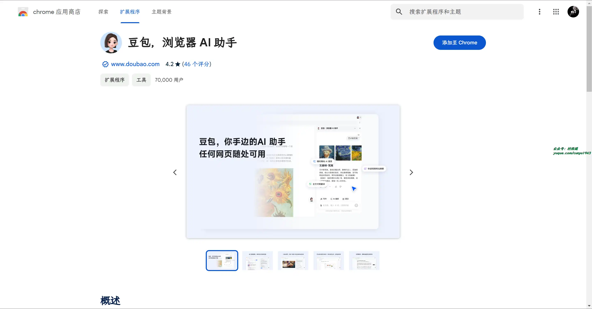

### 2. [Definer](https://chromewebstore.google.com/detail/noagjioaihamoljcbelhdlldnmlgnkon)

安装后，选中单词或短语，就能够显示出它的定义，并且实现翻译。

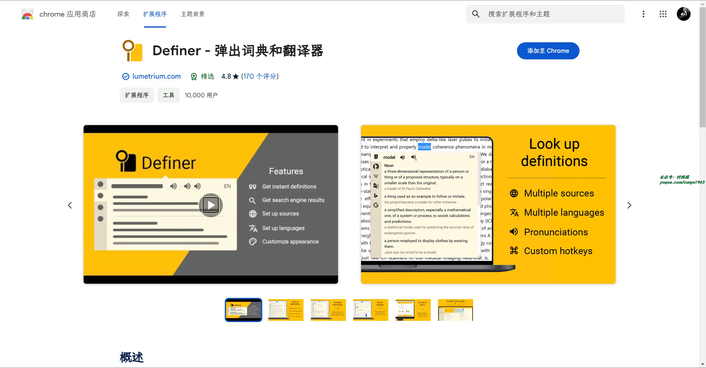

### 3. [start.me](https://chromewebstore.google.com/detail/cfmnkhhioonhiehehedmnjibmampjiab)

使用该插件，可以将 Chrome 新标签页转换为漂亮的个人信息中心，实现即时访问所有书签，新闻源，笔记和Web服务。

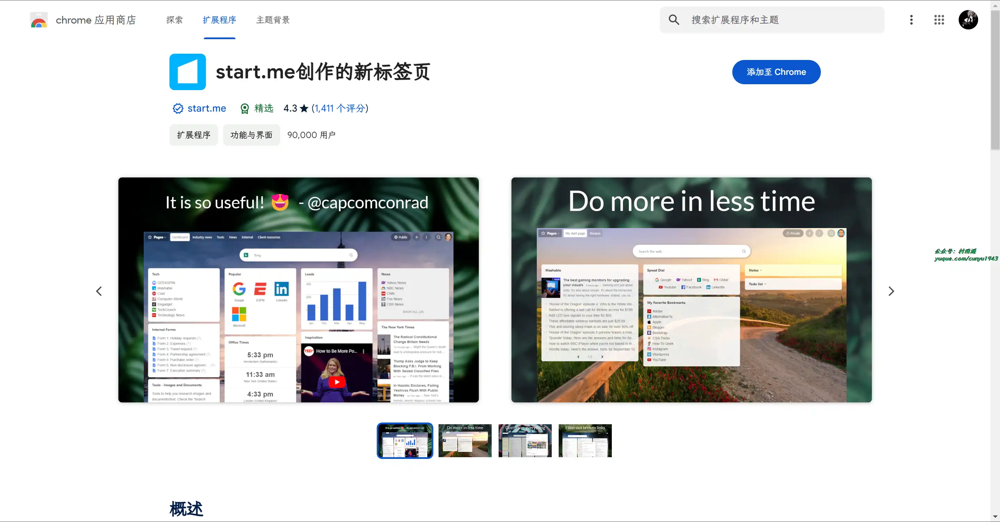

## 五、资料

### 1. [30-Days-Of-Python](https://github.com/Asabeneh/30-Days-Of-Python)

一份在 30 天内逐步学习 Python 编程语言的指南。当然，实际进行这项挑战可能需要 100 多天，请按照自己的节奏来。

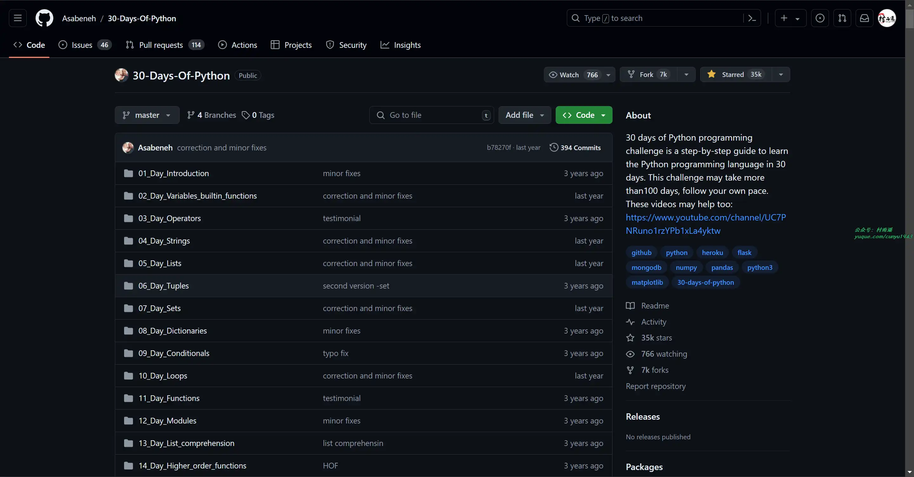

### 2. [深入架构原理与实践](https://github.com/isno/theByteBook)

深入讲解内核网络、Kubernetes、ServiceMesh、容器等云原生相关技术。经历实践检验的 DevOps、SRE 指南。

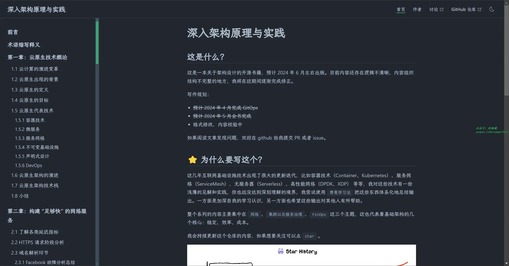

### 3. [Nginx 入门学习笔记](https://github.com/jaywcjlove/nginx-tutorial)

Nginx 安装维护入门学习笔记，以及各种实践操作实例。

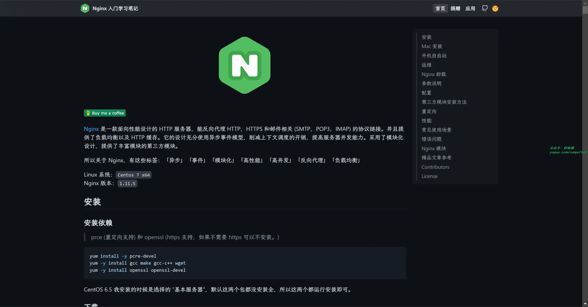

## ✍️ 说明

周刊专栏相关信息：

- **项目地址**：[Github](https://github.com/cunyu1943/weekly)，觉得不错麻烦给我一个**Star**，感谢 ❤️
- **浏览地址**：公众号 | [电子书](https://cunyu1943.github.io/weekly) | [语雀](https://yuque.com/cunyu1943/weekly)

如果你阅读到这里，说明我的工作没有白费。如果你想推荐项目/网站/软件/资源，欢迎提交 **[issue](https://github.com/cunyu1943/weekly/issues)** 或者添加我 **个人微信：coder_cunYu** 与我交流。

---

## ⏳ 联系

想解锁更多知识？不妨关注我的微信公众号：**村雨遥（id：JavaPark）**。

扫一扫，探索另一个全新的世界。

