# 好物周刊#64：国产 PhotoShop

> 作者：[村雨遥](https://github.com/cunyu1943)
> 
> 不要哀求，学会争取，若是如此，终有所获
> 
> 原文：https://mp.weixin.qq.com/s/QUSDHRD0vt72paTDK2rPgA

## 🎈 号外 

最近，公众号之外，建立了微信交流群，不定期会在群里分享各种资源（影视、IT 编程、考试提升……）&知识。如果有需要，可以**扫码或者后台添加小编微信备注入群**。进群后**优先看群公告**，**呼叫群中【资源分享小助手】**，还能免费帮找资源哦～

 

## 一、项目

### 1. [UndrawUI](https://github.com/readpage/undraw-ui)

Vue 评论组件，🔥基于 Vue3 的 UI 组件，主要功能有折叠，评论，锚点，搜索，聊天。

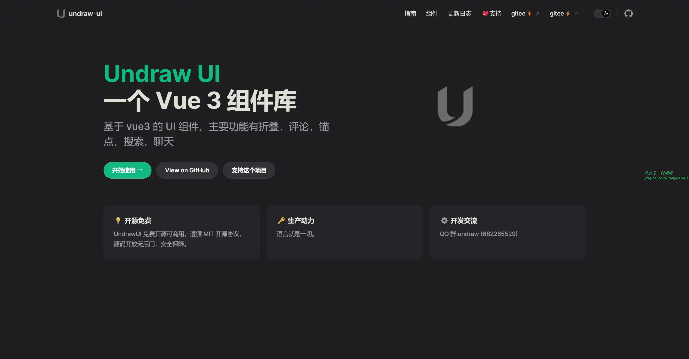

### 2. [商品管理系统](https://github.com/zaiyunduan123/springboot-manage)

基于 SpringBoot + Mybatis + Thymeleaf + Redis + MongoDB + MySQL 开发的商品管理系统。主要分为以下四个模块：

- 用户管理模块 ：用户登录、注册、密码找回（通过邮箱方式）、用户信息修改、密码修改。
- 仪表盘管理模块 ：展示当前月收入及其环比（环比 =（当前月收入 - 上个月收入）/ 上个月收入）、当前月订单数及其环比、网站访问量、当前月退单数及其环比、以条形图的形式 (使用 jquery 插件）展示最近 30 天每天的收入和订单数。
- 商品管理模块 ：商品增删改查、商品图片导入（存储在 MongoDB）、导出商品报表、商品分类增删改查、库存查改，库存不足和积货提醒、商品回收和恢复。
- 订单管理模块 ：订单查询查看、订单退款管理（查看和审批）、发货管理、物流公司管理、快递跟踪（调用快递 100 接口）。

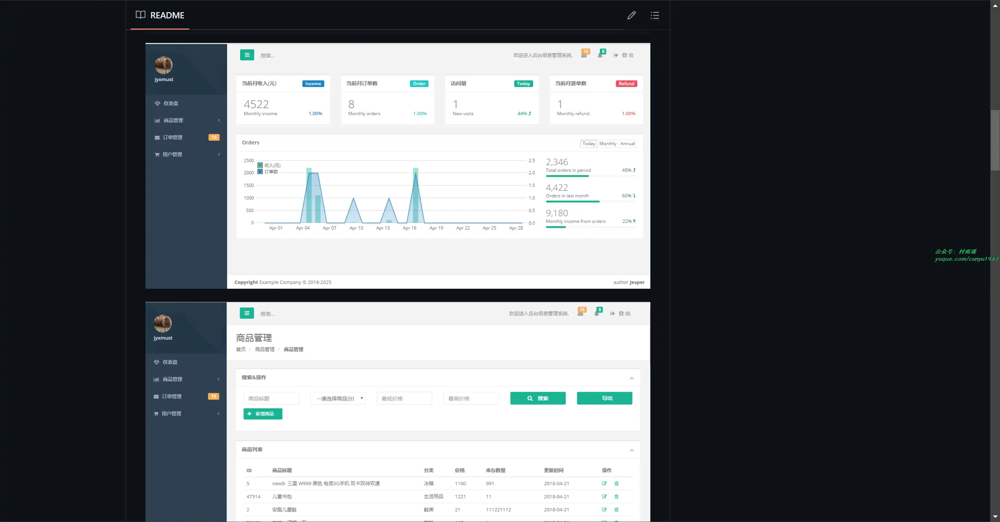

### 3. [积木报表](https://github.com/jeecgboot/JimuReport)

一款免费的数据可视化报表，含报表、仪表盘和大屏设计，像搭建积木一样在线设计报表！功能涵盖，数据报表、打印设计、图表报表、大屏设计等！

## 二、软件

### 1. [悟空图像](https://www.photosir.com)

国内一款可以替代 AdobePhotoShop 的专业图像处理软件，采用全新的设计理念和人工智能算法，让每个用户都能快速上手、快速出图。悟空图像支持 50 亿像素级超大图片处理，双向兼容 PS 文件格式，更支持全平台运行。悟空图像提供海量素材与模板，让你的创作不再从 “0” 开始；多达一百多种各类画笔，让创意设计更加得心应手；超多种组合特色功能，能够准确高效地实现用户办公需求。

### 2. [Librum](https://github.com/Librum-Reader/Librum)

一款旨在让每个人都能享受阅读乐趣并轻松阅读的应用程序。使用它可以管理自己的在线图书馆，并随时随地从任何设备访问它。它具有笔记记录、AI 工具和突出显示等功能，同时提供自定义功能，使其尽可能个性化！

同时，它还提供超 70000 本书籍供免费阅读。

### 3. [Postman](https://www.postman.com/)

一个用于构建和使用 API 的 API 平台。简化了 API 生命周期的每个步骤并简化了协作，方便我们更快地创建更好的 API。

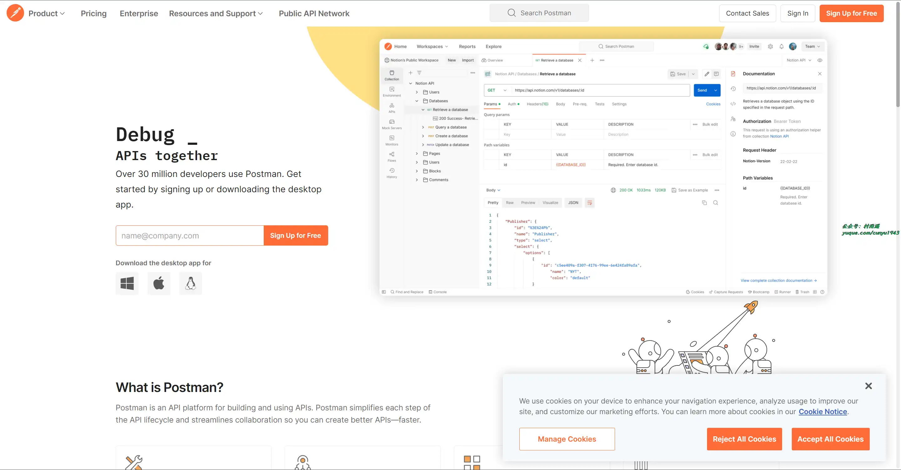

## 三、网站

### 1. [iPA 商店](https://ipa.store)

致力于 iOS8 以上的 iPA 资源下载和分享，包括游戏 iPA、软件应用 IPA、破解版 iPA、砸壳 iPA 等资源的分享和下载，做最稳定最优秀的 iPA 下载网站。

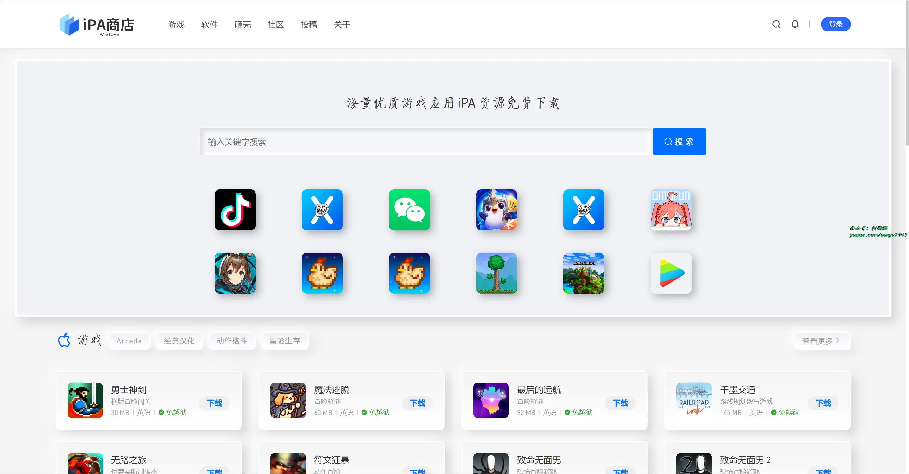

### 2. [NameBeta](https://namebeta.com/)

输入你想要的域名，即可实现搜索，注册，比价。

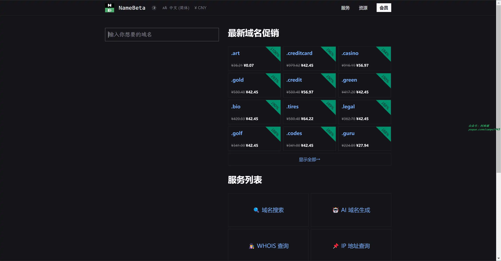

### 3. [用药助手](https://drugs.dxy.cn)

丁香园用药助手，靠谱的临床诊疗顾问，基于循证医学的临床诊疗决策工具，为临床医生提供专业、靠谱的疾病诊疗思路和用药方案，300万+ 专业用户都在用。

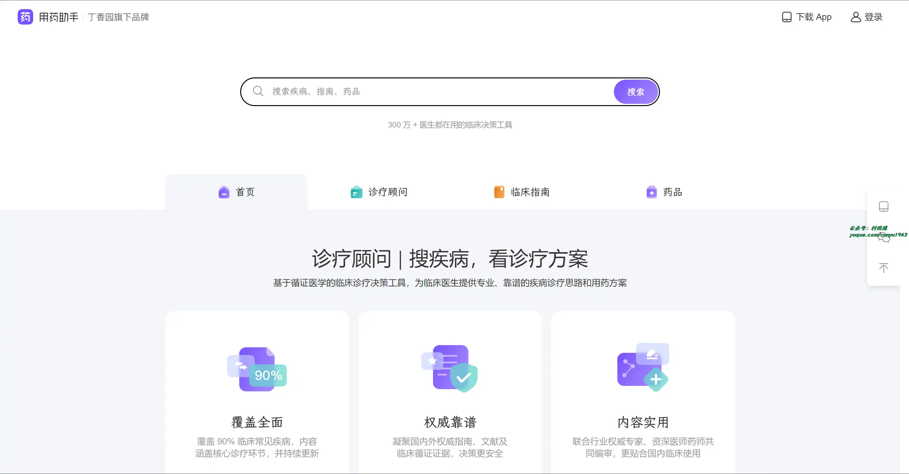

## 四、插件

### 1. [Custom Progress Bar for YouTube](https://chromewebstore.google.com/detail/custom-progress-bar-for-y/nbkomboflhdlliegkaiepilnfmophgfg?hl=zh-CN)

将 YouTube 上的进度条更改为我们有趣的自定义进度条集合中的自定义进度条。 让您的 YouTube 播放器可爱又棒！

用有趣酷炫的动画、颜色和渐变让 YouTube 播放器的进度条脱颖而出！

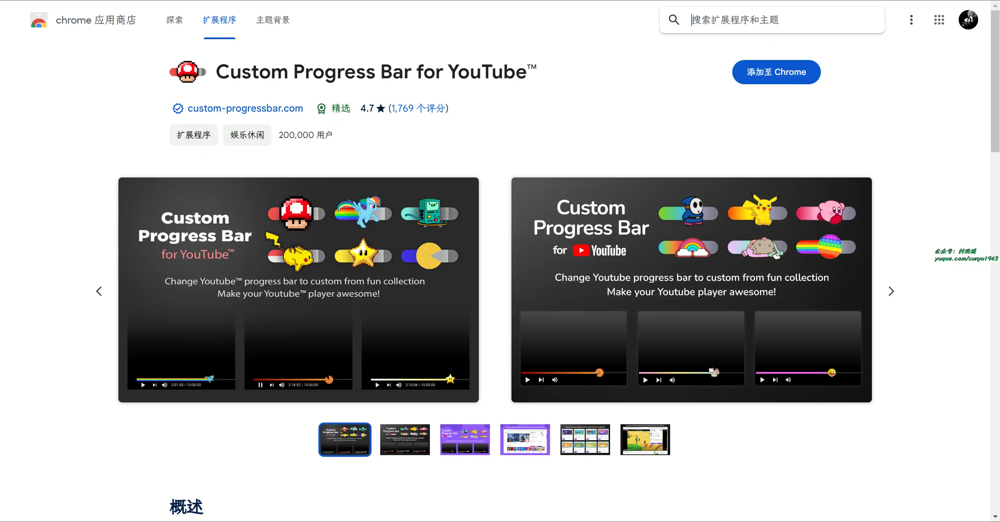

### 2. [Auto Refresh Plus](https://chromewebstore.google.com/detail/auto-refresh-plus-page-mo/hgeljhfekpckiiplhkigfehkdpldcggm)

对需要在特定时间自动刷新网页的用户非常有用，可以高效地执行此操作。它还提供内容检测支持，当监控包含在动态网页中的内容时非常有用。主要支持如下功能：

- 默认时间间隔
- 随机间隔
- 设置自定义刷新周期
- 在页面上显示可视化计时器
- 如果点击页面上的任何位置，自动停止刷新
- 倒计时计时器模式
- 强制刷新/绕过缓存
- 自动启动 URL
- 刷新预定义页面
- 活动标签列表
- 页面监视器（关键字查找/丢失）
- 刷新预定义文本关键字
- XHR 刷新（每次刷新时自动点击）
- 自定义、XPath 和正则表达式支持
- 自动点击链接
- 通过通知和电子邮件获得提醒
- 快捷键

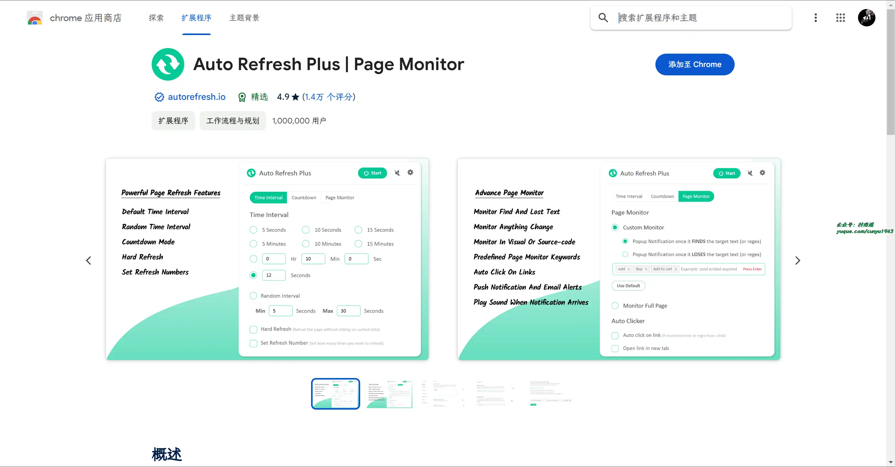

### 3. [画中画](https://chromewebstore.google.com/detail/nalkmonnmldhpfcpdlbdpljlaajlaphh)

在浏览器窗口外或任何其他应用程序上方的浮动窗口中观看视频画中画，用于增强您的视频观看体验。

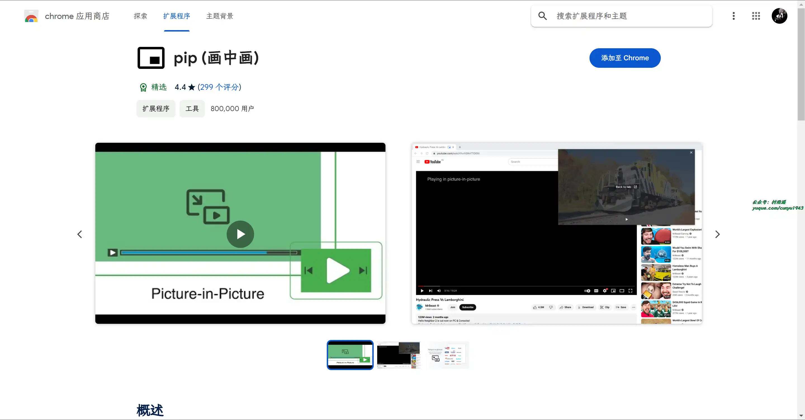

## 五、资料

### 1. [Effective-Resouirces](https://github.com/wususu/effective-resourses)

学习资源合集，主要包含大数据、Java、Python、JavaScript、PHP、网络、数据库、Linux 等方面的优秀博客、论文、电子书等资源。

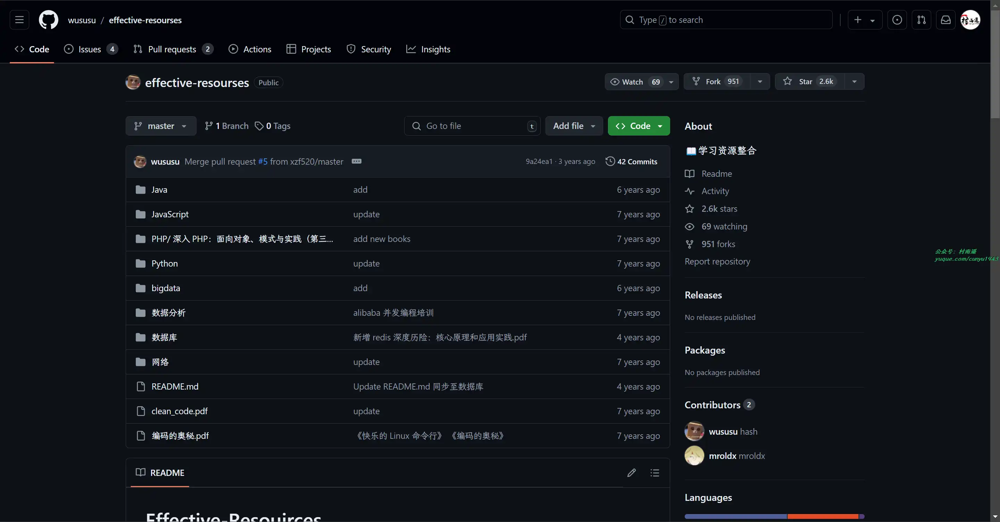

### 2. [北大课程资料](https://github.com/lib-pku/libpku)

民间收集的北大课程资料，主要有专业课、通选课、公选课、英语课等方面的内容。

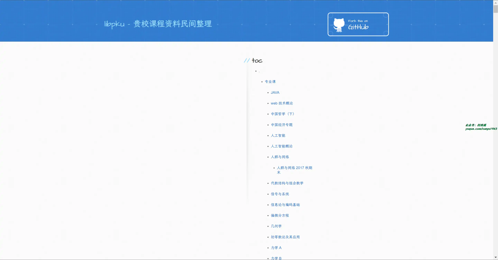

### 3. [Node.js 中文资料导航](https://github.com/youyudehexie/node123)

Node.js 中文资料导航，主要包括专业知识、业界新闻、经验分享等方面内容。

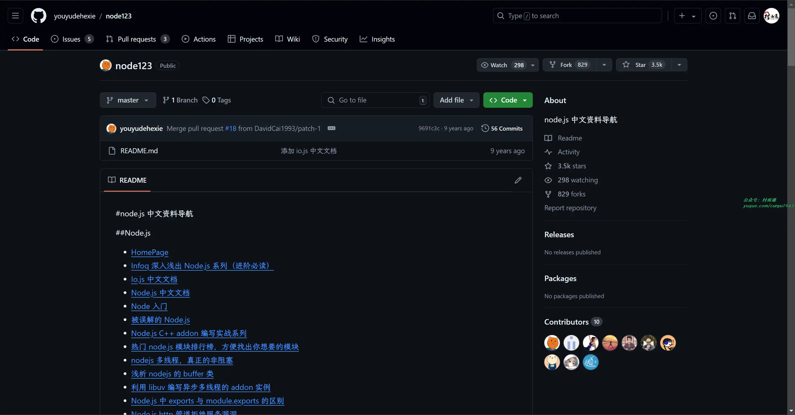

## ✍️ 说明

## ✍️ 说明

周刊专栏相关信息：

- **项目地址**：[Github](https://github.com/cunyu1943/weekly)，觉得不错麻烦给我一个**Star**，感谢 ❤️
- **浏览地址**：公众号 | [电子书](https://cunyu1943.github.io/weekly) | [语雀](https://yuque.com/cunyu1943/weekly)

如果你阅读到这里，说明我的工作没有白费。如果你想推荐项目/网站/软件/资源，欢迎提交 **[issue](https://github.com/cunyu1943/weekly/issues)** 或者添加我 **个人微信：coder_cunYu** 与我交流。

---

## ⏳ 联系

想解锁更多知识？不妨关注我的微信公众号：**村雨遥（id：JavaPark）**。

扫一扫，探索另一个全新的世界。

