# 好物周刊#65：通往 AGI 之路

> 作者：[村雨遥](https://github.com/cunyu1943)
> 
> 不要哀求，学会争取，若是如此，终有所获
> 
> 原文：https://mp.weixin.qq.com/s/kFSmIi0Gq-pcn0VAwzhXfw

## 一、项目

### 1. [JmalCloud](https://github.com/jamebal/jmal-cloud-server)

基于 SpringBoot 的网盘服务端，一款私有云存储网盘项目，能够简单安全管理您的云端文件。

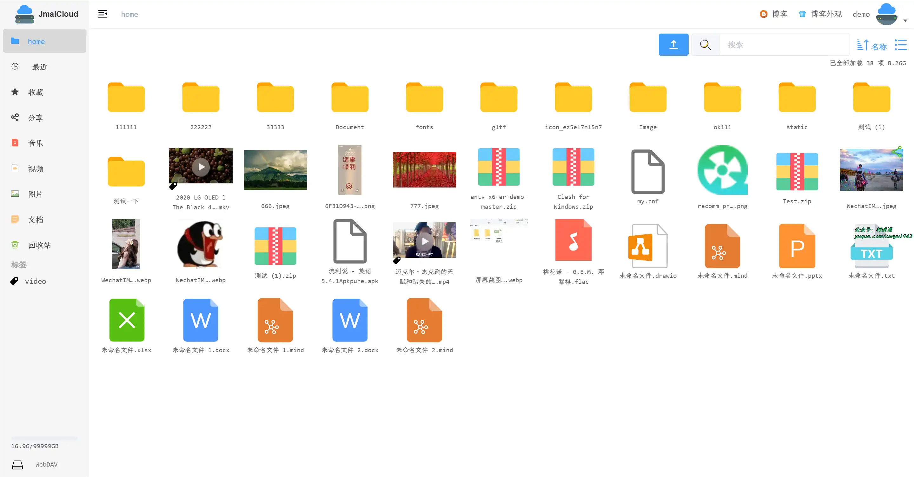

### 2. [JeeSite](https://gitee.com/thinkgem/jeesite-vue)

基于 Vue 3、Vite、Ant Design Vue 4.0、TypeScript、Vben Vue Admin，最先进的技术栈，让初学者能够更快的入门并投入到团队开发中去。包括模块如：组织机构、角色用户、菜单授权、数据权限、系统参数等。完整组件封装，数据驱动视图。为微小中大项目的开发，提供现成的开箱解决方案及丰富的示例。

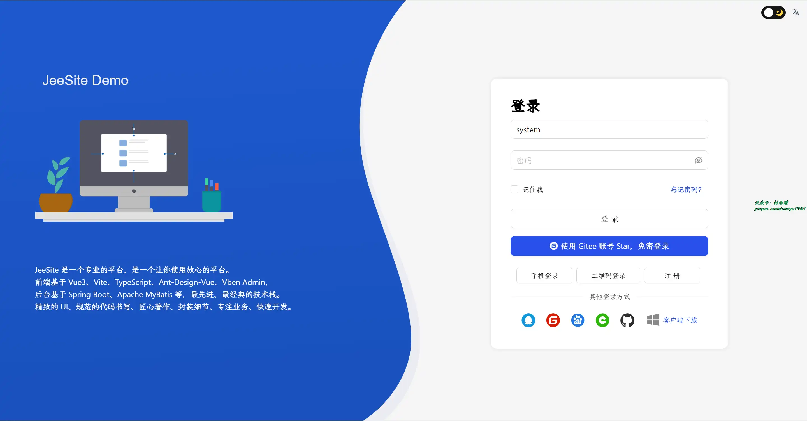

### 3. [DataRoom](https://gitee.com/gcpaas/DataRoom)

基于 Vue 的大屏可视化设计器，前后端一体化解决方案，几十种炫酷图表，支持多种数据来源接入，适用于大屏、低代码、BI 场景，使用简单，代码完全开源。

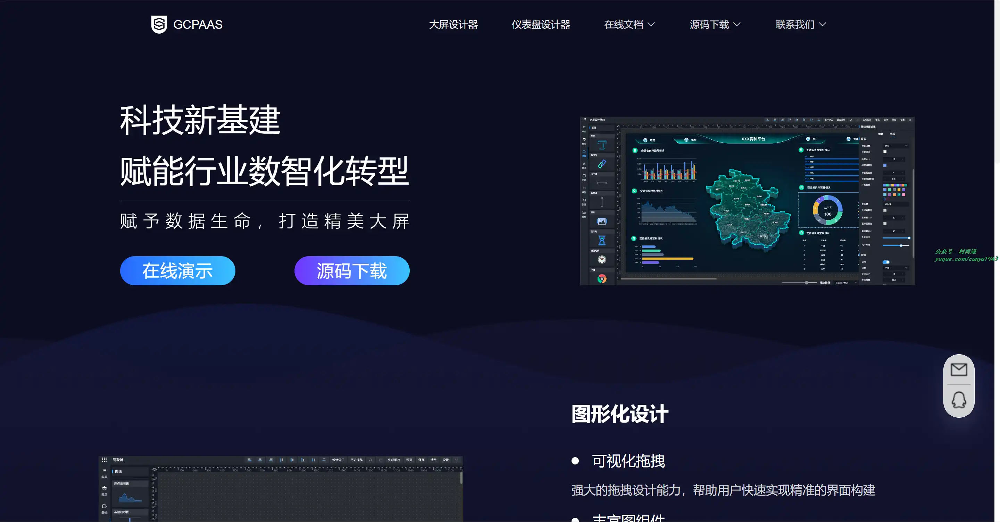

## 二、软件

### 1. [Sunny](https://github.com/XMuli/sunnypages)

一款简洁且漂亮的截图软件，支持 Windows、MacOS 和 Linux 系统，同时支持 OCR 和图片翻译。

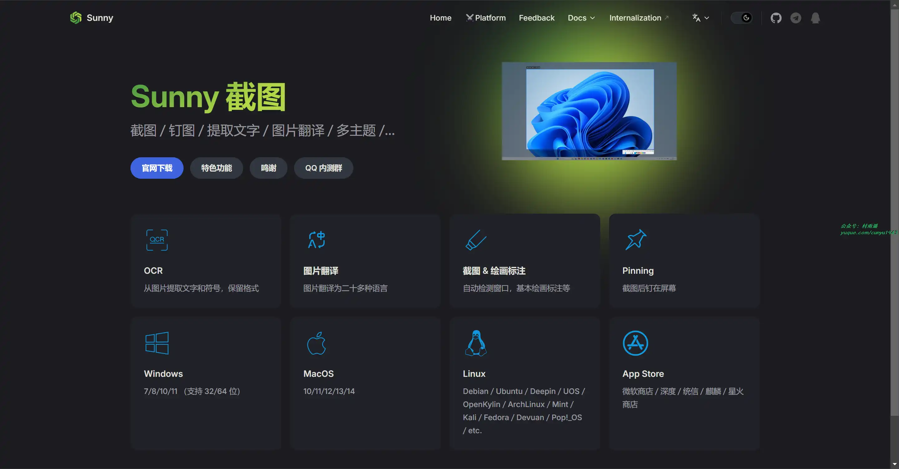

### 2. [UU 浏览器](https://www.uukei.com/)

面向大学生，上班族，老师和专业人士开发的具有高性能极速轻便，安全注重数据隐私，高效办公工具和丰富学习资料的一款纯净浏览器。相比 UC、Edge、Chrome 等有多种特色功能，支持全面屏皮肤，Mac 风格，侧边栏，Edge 扩展等。

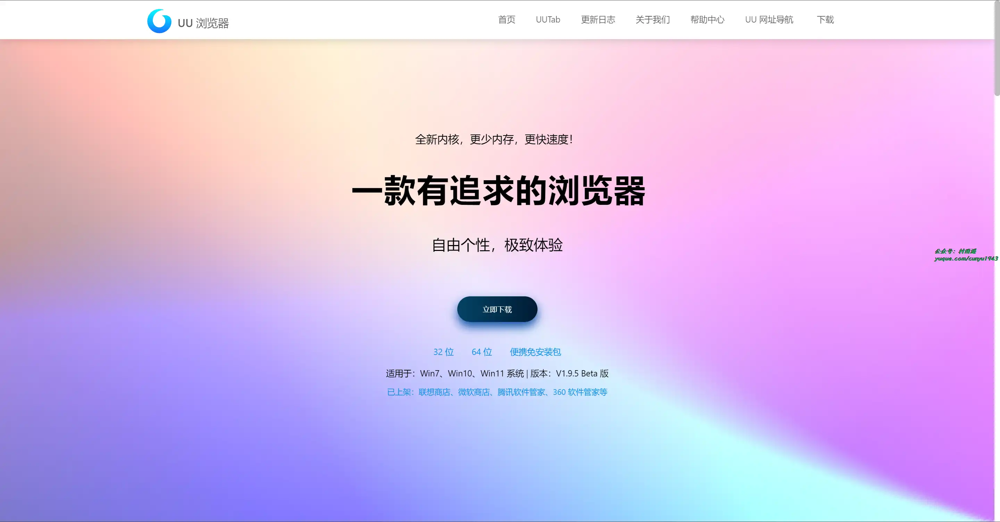

### 3. [Caesium Image Compressor](https://github.com/Lymphatus/caesium-image-compressor)

一款图像压缩软件，可帮助您存储，发送和共享数字图片，支持 JPG，PNG，WebP 和 TIFF 格式。

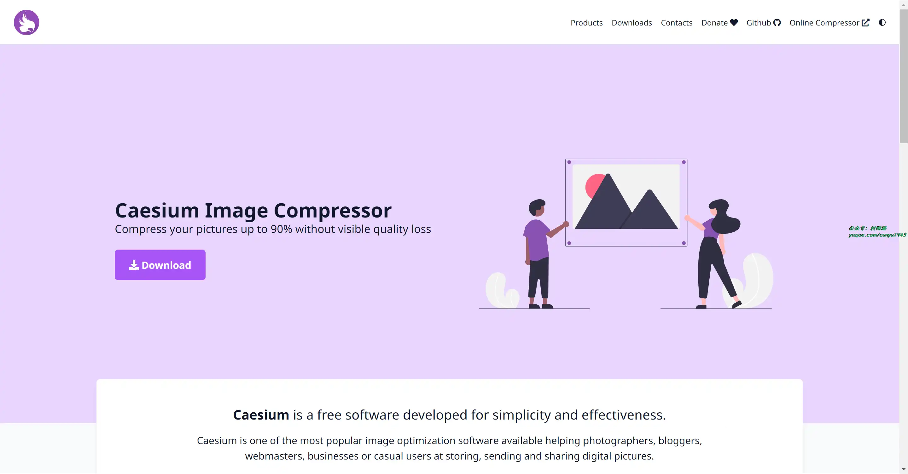

## 三、网站

### 1. [FindPng](https://www.findpng.com/)

基于 AI 驱动的透明 PNG 图像生成器，只要输入关键词就能生成透明的图像，最关键的是，它完全免费。

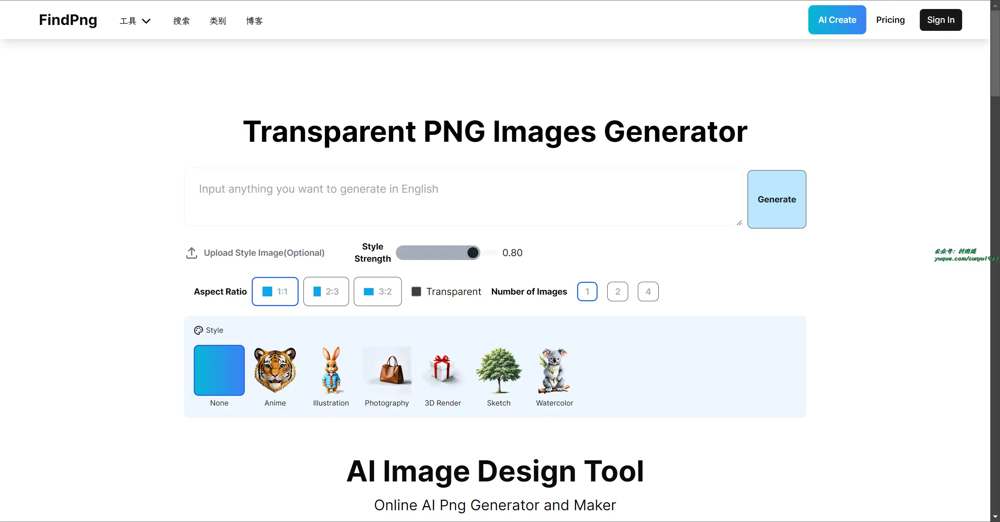

### 2. [最佳平替](https://www.pingti.app)

用更低价的搜索词购物，帮助你在京东、淘宝、拼多多等电商平台上，用更低价的关键词找到更便宜的商品。

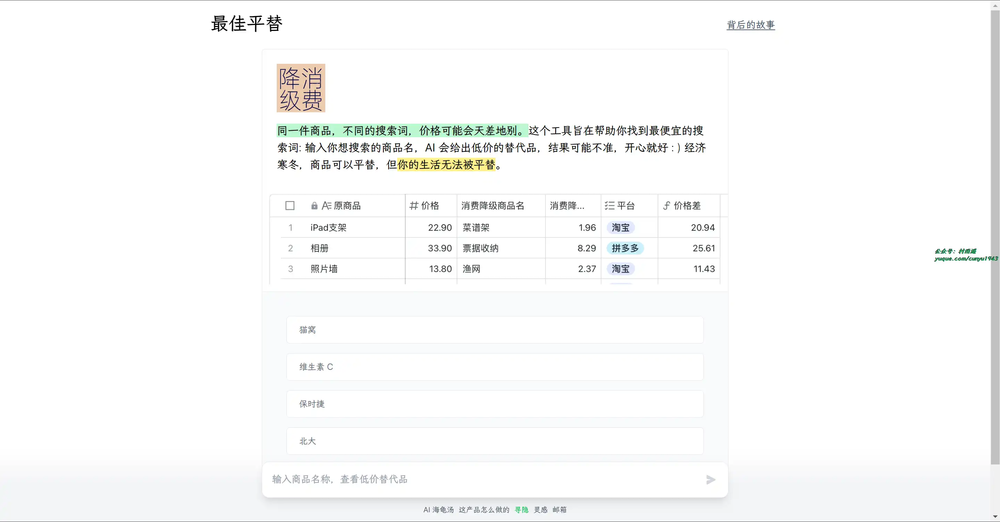

### 3. [通往 AGI 之路](https://www.waytoagi.com/)

最大最全面的 AI 知识库，汇聚上千个人工智能网站和工具，汇集最新的 AI 工具、GPT 应用和行业资讯。无论您是 AI 爱好者、研究者还是开发者。WaytoAGI 助力您在通往 AGI 的旅途中开启智能创新的未来。

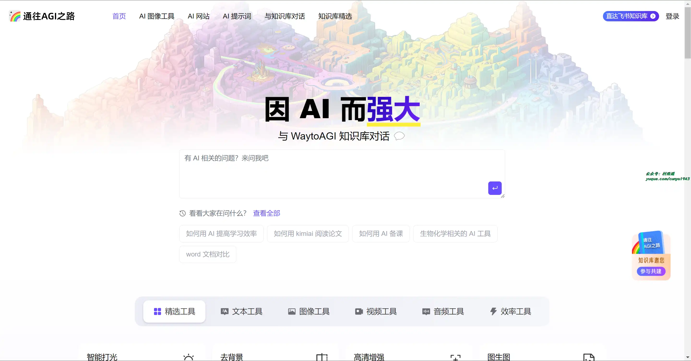

## 四、插件

### 1. [文字缩放与阅读模式](https://chromewebstore.google.com/detail/mamgplcihonkbopicdfhbadppehecgoahttps://chromewebstore.google.com/detail/mamgplcihonkbopicdfhbadppehecgoa)

根据自己的喜好定制浏览环境，从而提高可读性，减少干扰，优化加载速度。

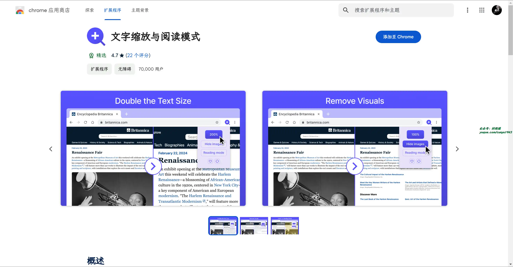

### 2. [Responsive Viewer](https://chromewebstore.google.com/detail/responsive-viewer/inmopeiepgfljkpkidclfgbgbmfcennb)

多屏幕响应式测试工具，通过内置屏幕截图和注释工具，帮助你在在多个屏幕上测试和预览您的网站。

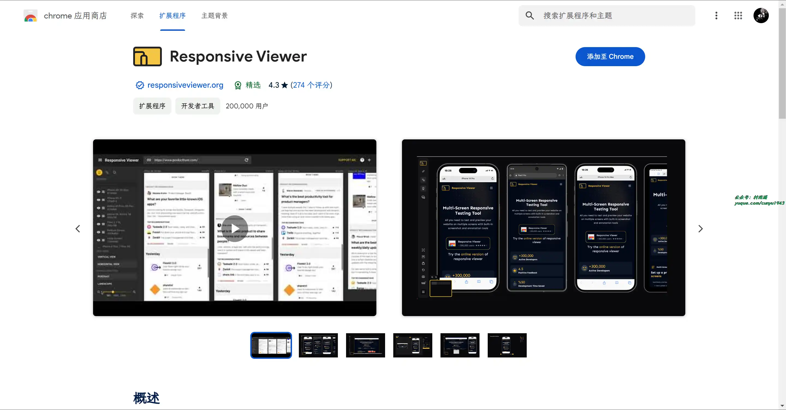

### 3. [Web Editor](https://chromewebstore.google.com/detail/web-editor/pdmlhckofhkhebmcplblcijijgjiakcm)

为您提供一种增强的方式来检查任何网站元素，更改其属性，插入内容，设计和可视化您想要看到它们的方式。无需掌握大量的技术知识，就可以通过该工具为您完成这项工作。

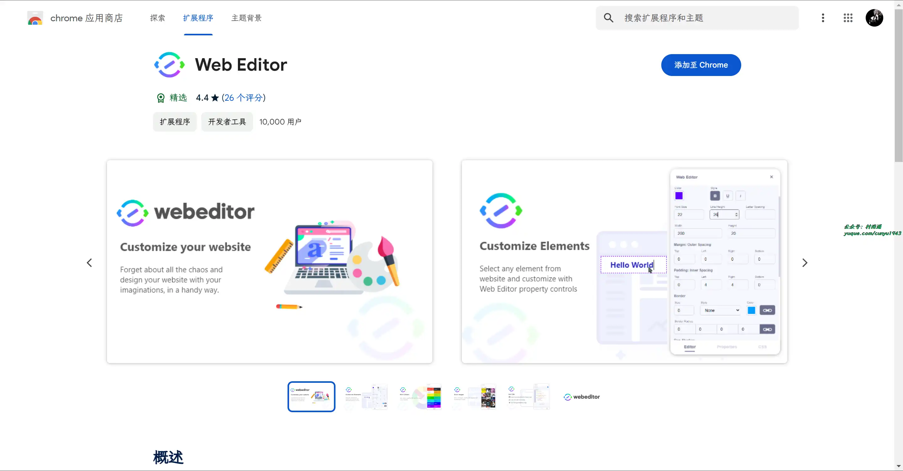

## 五、资料

### 1. [UXBAIKE](https://www.uxbaike.com/)

国内设计师入门到进阶的专业设计百科网站。AIGC 及设计内容全面及时，全网粉丝过千万。专注前沿设计趋势和设计方法论，拥有原创独家设计内容和设计师网站导航。提供 AIGC 教程、灵感素材、UI 设计、平面设计、网页设计、电商设计。

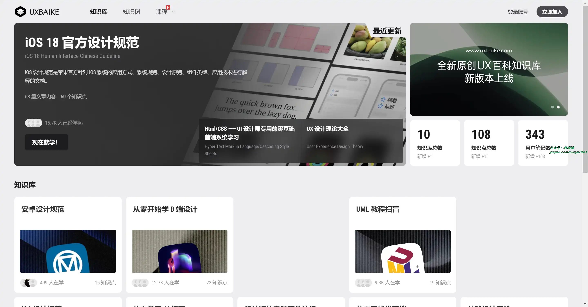

### 2. [Learn Next.js 中文教程](https://github.com/qufei1993/nextjs-learn-cn)

基于官方教程的一个中文翻译版本，同时作者在翻译、整理的过程中，对每个章节对应的 Example 代码，都进行了测试，还对其中有问题的部分进行了修改。

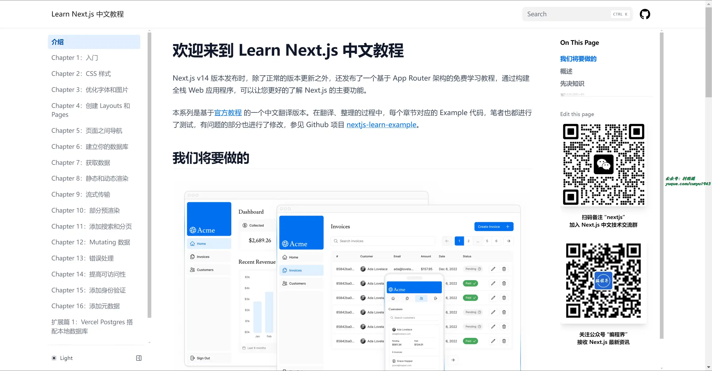

### 3. [DictionaryByGPT4](https://github.com/Ceelog/DictionaryByGPT4)

一本由 GPT4 生成的单词书，超过 8000 个单词分析，涵盖了词义、例句、词根词缀、变形、文化背景、记忆技巧和小故事。

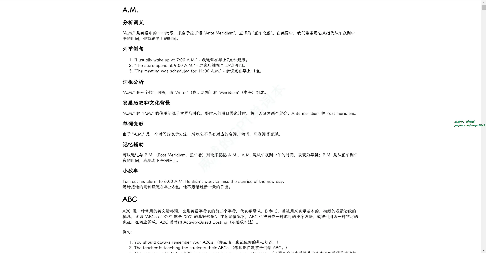

## ✍️ 说明

周刊专栏相关信息：

- **项目地址**：[Github](https://github.com/cunyu1943/weekly)，觉得不错麻烦给我一个**Star**，感谢 ❤️
- **浏览地址**：公众号 | [电子书](https://cunyu1943.github.io/weekly) | [语雀](https://yuque.com/cunyu1943/weekly)

如果你阅读到这里，说明我的工作没有白费。如果你想推荐项目/网站/软件/资源，欢迎提交 **[issue](https://github.com/cunyu1943/weekly/issues)** 或者添加我 **个人微信：coder_cunYu** 与我交流。

---

## ⏳ 联系

想解锁更多知识？不妨关注我的微信公众号：**村雨遥（id：JavaPark）**。

扫一扫，探索另一个全新的世界。

