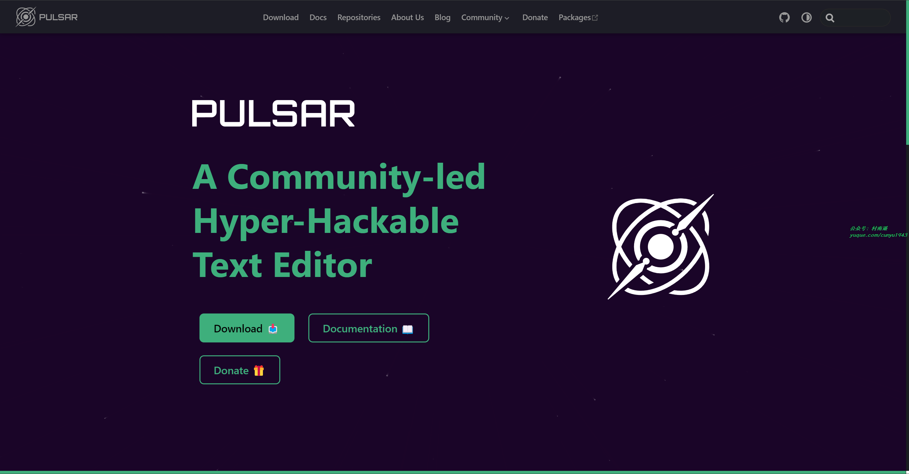

# 好物周刊#66：多合一书签管理器

> 作者：[村雨遥](https://github.com/cunyu1943)
> 
> 不要哀求，学会争取，若是如此，终有所获
> 
> 原文：https://mp.weixin.qq.com/s/nMXPrsa1dH_cbpc-nlv0pw

## 🎈 号外 

最近，公众号之外，建立了微信交流群，不定期会在群里分享各种资源（影视、IT 编程、考试提升……）&知识。如果有需要，可以**扫码或者后台添加小编微信备注入群**。进群后**优先看群公告**，**呼叫群中【资源分享小助手】**，还能免费帮找资源哦～

 

## 一、项目

### 1. [TeXMe](https://github.com/susam/texme)

一个轻量级的 JS 库，支持将 Markdown 自动渲染为网页内容。

### 2. [LapisCV](https://github.com/BingyanStudio/LapisCV)

开箱即用的 Obsidian / Typora 简历，基于 Markdown 格式，易于编辑，所见即所得。风格简洁正式，支持多页，适用于大部分求职 / 求学场景。

### 3. [Marker](https://github.com/VikParuchuri/marker)

支持将 PDF、EPUB、MOBI 文档转为 Markdown 文件的命令行工具，而且还支持 OCR 提取文本内容。

## 二、软件

### 1. [Pulsar](https://pulsar-edit.dev/)

基于 Atom 编辑器开发的跨平台文本编辑器。

### 2. [EcoPaste](https://github.com/ayangweb/EcoPaste)

一款开源的跨平台剪切板管理工具，方便你一端复制，多端使用。

### 3. [Raindrop](https://raindrop.io/)

多合一的跨平台网络书签管理器。

## 三、网站

### 1. [Starflare](https://starflare.app/)

通过 Github 登录，就能够高效管理你 star 过的内容。

### 2. [imageSearch](https://picfind.top)

号称最好用的以图搜图聚合站，支持以图搜索，反向图片搜索。

### 3. [SocialScreenshots](https://socialscreenshots.com/)

在线截图美化工具，通过自动捕获网站内容，为用户生成即时的截图编辑和生成服务。

## 四、插件

### 1. [Pintree](https://chromewebstore.google.com/detail/pintree-bookmarks-exporte/mjcglnkikjidokobpfdcdmcnfdicojce)

通过该插件，能够将浏览器的书签导出为 JSON 格式，然后再通过简单的几步操作，就能将书签转换为一个美观易用的导航网站。

### 2. [Image Downloader](https://chromewebstore.google.com/detail/image-downloader-save-pic/daeljdgmllhgmbdkpgnaojldjkdgkbjg)

一个可以帮助您找到发布在网页上的图像。这是一个免费的工具，无需注册，只需点击几下，就可以让图像在几秒钟内保存到您的本地。

### 3. [Denote](https://chromewebstore.google.com/detail/okieokifcnnigcgceookjighhplbhcip)

一键下载各种广告资料库的资源，包括 Facebook 广告资料库、Tiktok 广告资料库等，并且提供永久的云端存储，让你随时能够查看自己的广告库。

## 五、资料

### 1. [薄冰英语语法](https://oldwestenglish.github.io/grammar)

本书集中体现了作者的语法编写特点，以简明的语言、严谨的概念、地道而丰富的例句来阐明语法知识。“具有实用性” 是作者在编写本书时所遵循的宗旨。全书除了汇集作者多年研究语法的心得外，同时还注重结合当前大学英语教学教研的新进展，用一定的篇幅介绍了当代英语语法的最新成果和观点，使全书的知识结构更趋完整，内容更贴近时代，从而具有更高的参考价值。

### 2. [Understanding Deep Learning](https://udlbook.github.io/udlbook/)

深度学习入门教材，免费阅读的英文电子书，需要的小伙伴可以自行进行下载。

### 3. [DeepLearning-Interview-Awesome-2024](https://github.com/315386775/DeepLearing-Interview-Awesome-2024)

项目涵盖了大模型 (LLMs) 专题、计算机视觉与感知算法专题、深度学习基础与框架专题、自动驾驶、智慧医疗等行业垂域专题、手撕项目代码专题、优异开源资源推荐专题共计 6 大专题模块，项目持续整理汇总最新的面试题并详细解析这些题目，除面向面试的场景外项目的题目还来源于对最新学术论文创新点的思考，希望能成为大家学术科研、工作创新、offer 面试路上一份有效的辅助资料。

## ✍️ 说明

周刊专栏相关信息：

- **项目地址**：[Github](https://github.com/cunyu1943/weekly)，觉得不错麻烦给我一个**Star**，感谢 ❤️
- **浏览地址**：公众号 | [电子书](https://cunyu1943.github.io/weekly) | [语雀](https://yuque.com/cunyu1943/weekly)

如果你阅读到这里，说明我的工作没有白费。如果你想推荐项目/网站/软件/资源，欢迎提交 **[issue](https://github.com/cunyu1943/weekly/issues)** 或者添加我 **个人微信：coder_cunYu** 与我交流。

---

## ⏳ 联系

想解锁更多知识？不妨关注我的微信公众号：**村雨遥（id：JavaPark）**。

扫一扫，探索另一个全新的世界。

