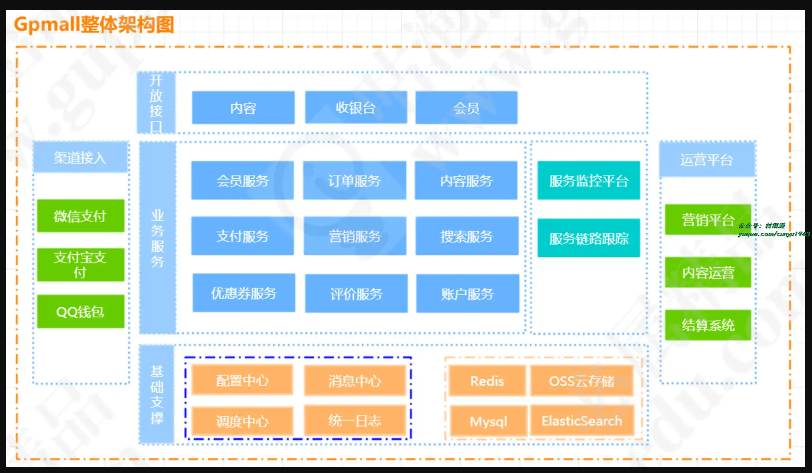
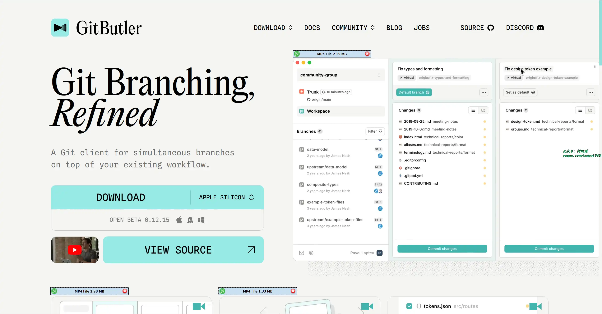
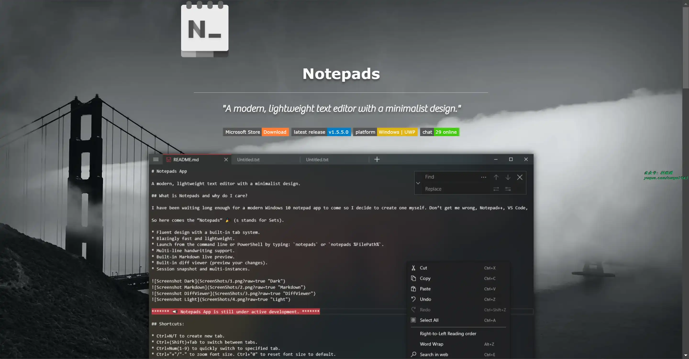
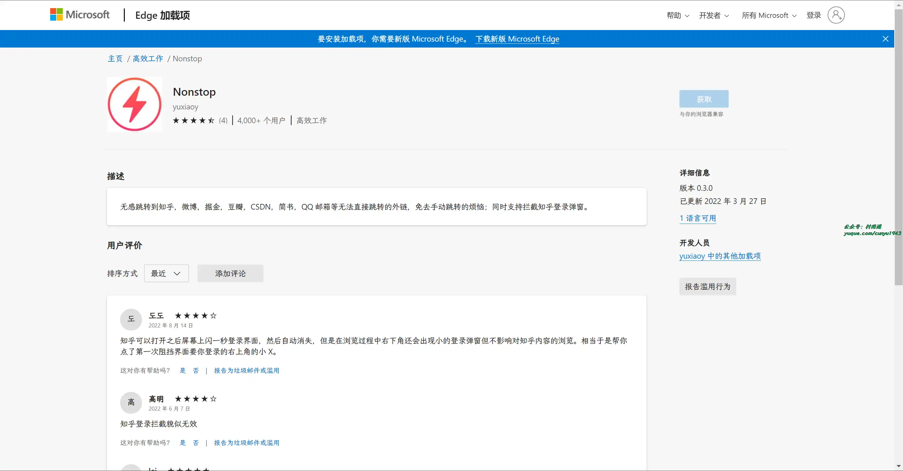
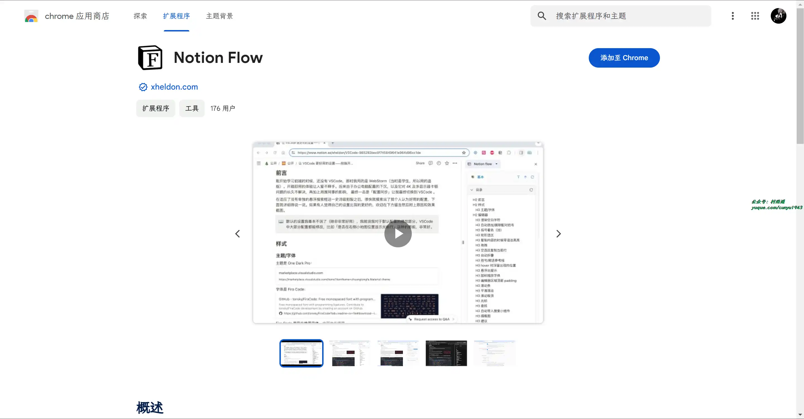
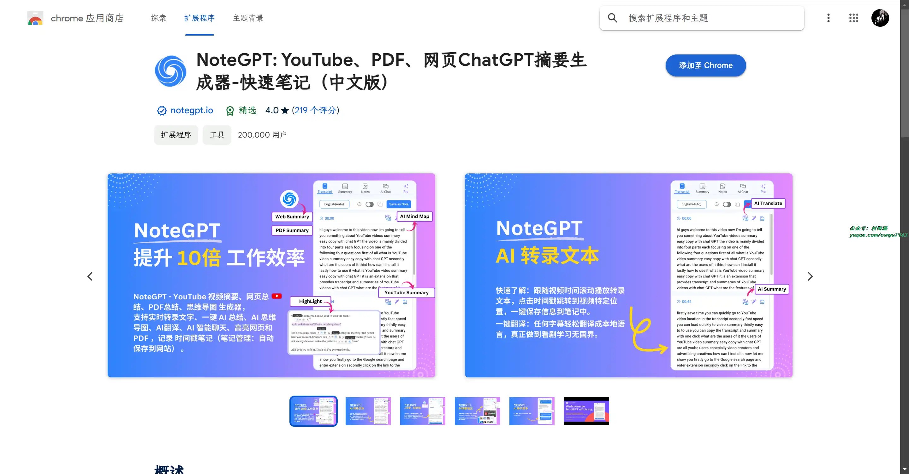
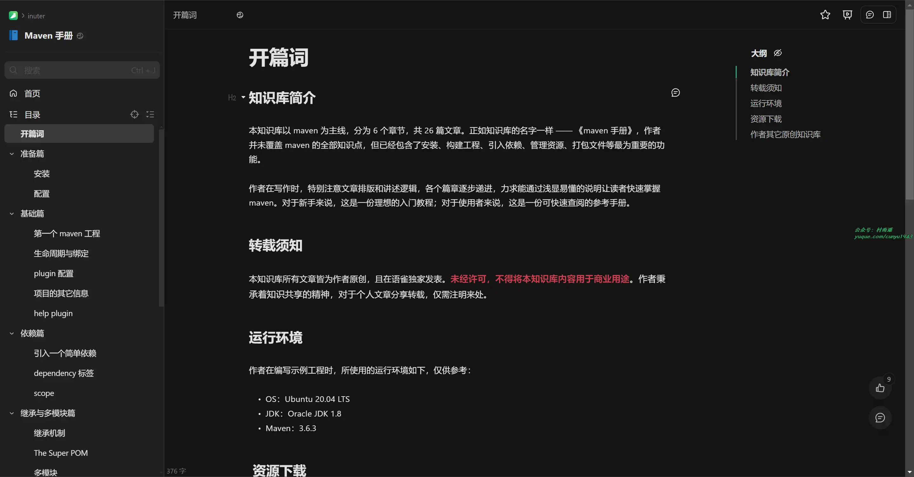
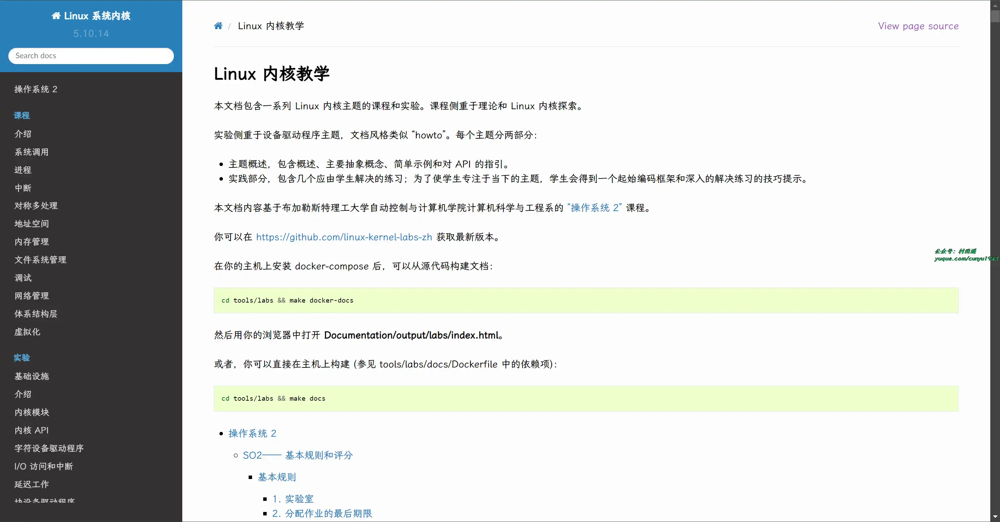
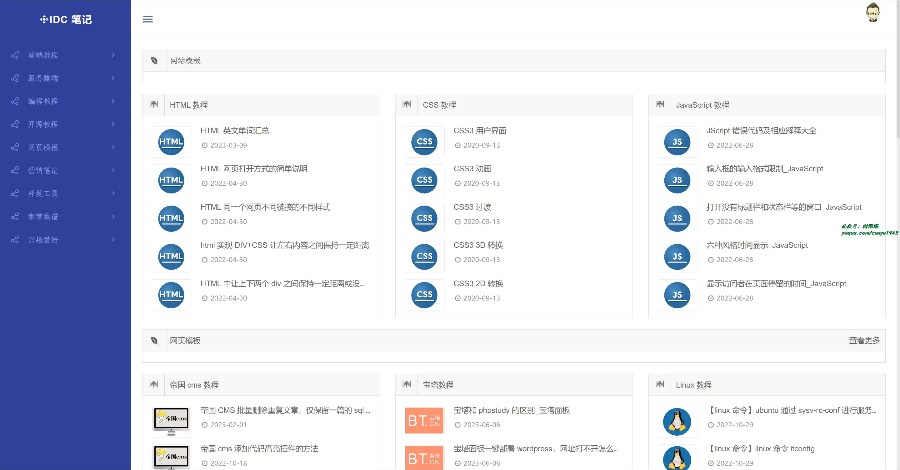

# 好物周刊#67：Linux 内核教学

> 作者：[村雨遥](https://github.com/cunyu1943)
> 
> 不要哀求，学会争取，若是如此，终有所获
> 
> 原文：https://mp.weixin.qq.com/s/Z1M7cbXiFqbi9KA85vXtnA

## 号外

最近，公众号之外，建立了微信交流群，不定期会在群里分享各种资源（影视、IT 编程、考试提升……）&知识。如果有需要，可以**扫码或者后台添加小编微信备注入群**。进群后**优先看群公告**，**呼叫群中【资源分享小助手】**，还能免费帮找资源哦～

 

## 一、项目

### 1. [咕泡学院](https://github.com/2227324689/gpmall)

基于 SpringBoot+Dubbo 构建的电商平台，包含了微服务架构、商城、电商、微服务、高并发、kafka、Elasticsearch 等一系列技术。

### 2. [MALL-VUE](https://github.com/PowerDos/Mall-Vue)

一个基于 VUE + VUEX + iView 做的一个电商网站前端项目。

### 3. [易采集](https://github.com/NaiboWang/EasySpider)

一个可视化浏览器自动化测试/数据采集/爬虫软件，可以无代码图形化的设计和执行爬虫任务。

## 二、软件

### 1. [GitButler](https://gitbutler.com/)

全新的 Git 版本管理工具，专为现代工作流而构建。支持自动化常见任务，提供实时更新和定制化更新。

### 2. [Notepads](https://www.notepadsapp.com/)

一款更加现代化轻量级的文本编辑器，以极简设计为初衷。

### 3. [OSSQ](https://ossq.cn/switching.html)

支持 Windows10、Windows11 全版本系统的切换，并且也支持批量切换版本，大大节约了运维的时间，全过程无须联网，静默模式切换，专业版，企业版，家庭版，教育版，G 企业版等版本互相切换。

## 三、网站

### 1. [Regexper](https://regexper.com/)

输入正则表达式，该网站将会把你的表达式转换为图片的形式进行解释。

### 2. [VideoSora](https://videosora.app/)

支持将文本或者语音转换相关图文视频的在线工具。

### 3. [在线文件批量重命名工具](https://github.com/JasonGrass/rename)

提供常用的文件批量重命名操作，无需下载安装，即用即走。

## 四、插件

### 1. [Nonstop](https://microsoftedge.microsoft.com/addons/detail/nonstop/ncjhljkmeagghpgekhdkaedcbippeaog?hl=zh-CN)

用于无感跳转到知乎，微博，掘金，豆瓣，CSDN，简书，QQ 邮箱等无法直接跳转的外链，免去手动跳转的烦恼；同时支持拦截知乎登录弹窗。

### 2. [Notion Flow](https://chromewebstore.google.com/detail/notion-flow/mcabmofnikepdpecekdlildkmffpmokh)

以非侵入式、纯前端方式实现的以 Notion + Github 为基础的博客发布浏览器插件。

### 3. [NoteGPT](https://chromewebstore.google.com/detail/baecjmoceaobpnffgnlkloccenkoibbb)

通过 ChatGPT 和 Claude3 一键总结 YouTube 视频、网络文章和 PDF，智能生成思维导图，与 NoteGPT AI 聊天。记录带有时间戳和截图的笔记。在任何网页上高亮文字，获得最佳释义和翻译，重点内容还可以分享到社媒中。

## 五、资料

### 1. [Maven 手册](https://www.yuque.com/inuter/bc7ikc/ngeqot)

知识库以 Maven 为主线，分 6 个章节，共 26 篇文章。包含了安装、构建工程、引入依赖、管理资源、打包文件等最为重要的功能。

### 2. [Linux 内核教学](https://linux-kernel-labs-zh.xyz)

包含一系列 Linux 内核主题的课程和实验。课程侧重于理论和 Linux 内核探索。

实验侧重于设备驱动程序主题，文档风格类似 “howto”。每个主题分两部分：

-   主题概述，包含概述、主要抽象概念、简单示例和对 API 的指引。
-   实践部分，包含几个应由学生解决的练习；为了使学生专注于当下的主题，学生会得到一个起始编码框架和深入的解决练习的技巧提示。

### 3. [IDC 笔记](https://www.idcnote.com/)

一个面向开发者的技术笔记网站。自创建以来，一直致力并专注于为开发者打造一个技术分享区，通过互联网分享知识，从而让更多开发者从中受益。

## ✍️ 说明

周刊专栏相关信息：

- **项目地址**：[Github](https://github.com/cunyu1943/weekly)，觉得不错麻烦给我一个**Star**，感谢 ❤️
- **浏览地址**：公众号 | [电子书](https://cunyu1943.github.io/weekly) | [语雀](https://yuque.com/cunyu1943/weekly)

如果你阅读到这里，说明我的工作没有白费。如果你想推荐项目/网站/软件/资源，欢迎提交 **[issue](https://github.com/cunyu1943/weekly/issues)** 或者添加我 **个人微信：coder_cunYu** 与我交流。

---

## ⏳ 联系

想解锁更多知识？不妨关注我的微信公众号：**村雨遥（id：JavaPark）**。

扫一扫，探索另一个全新的世界。

