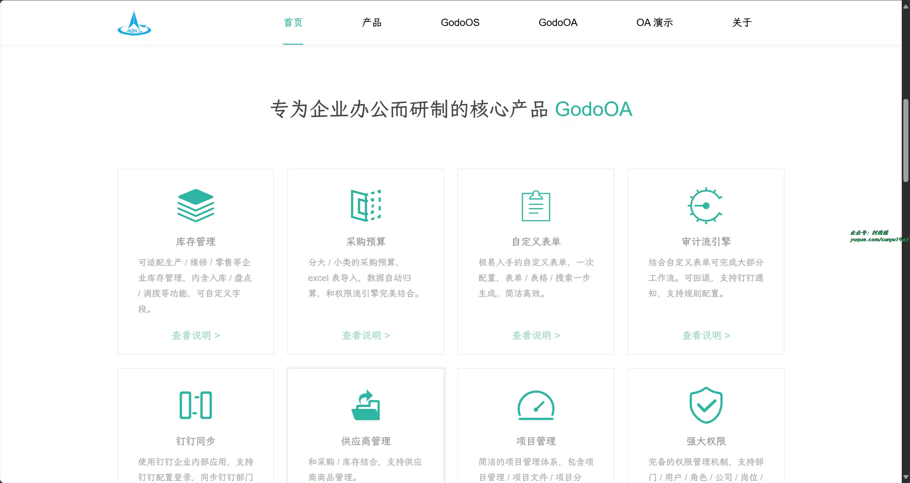
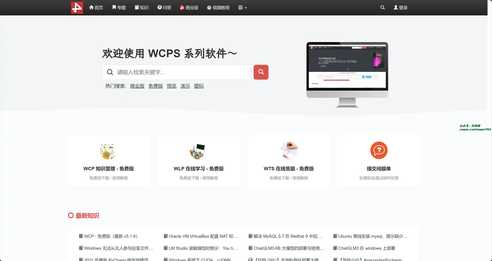
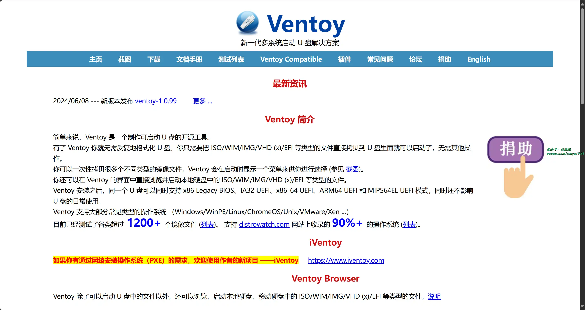
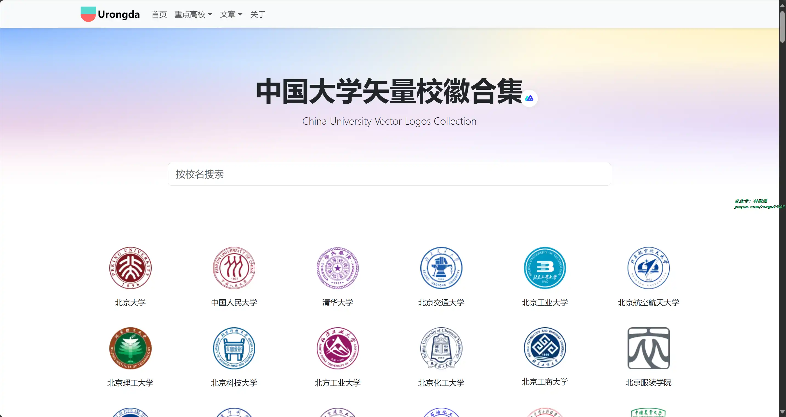
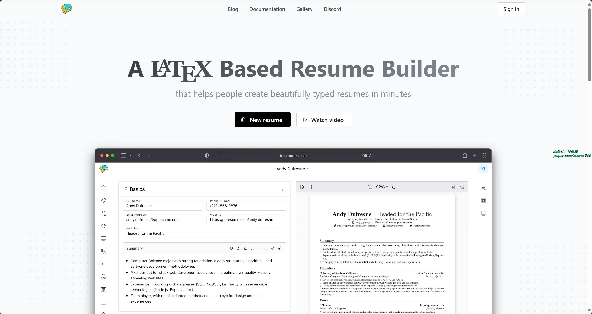
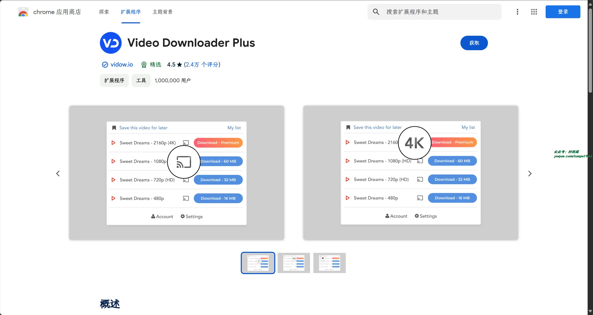
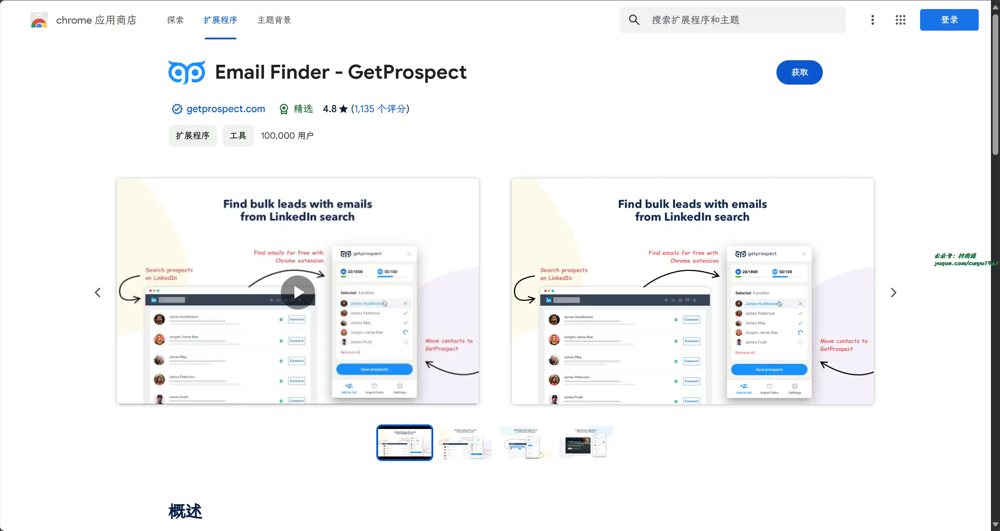
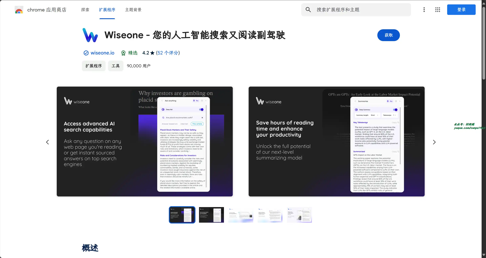
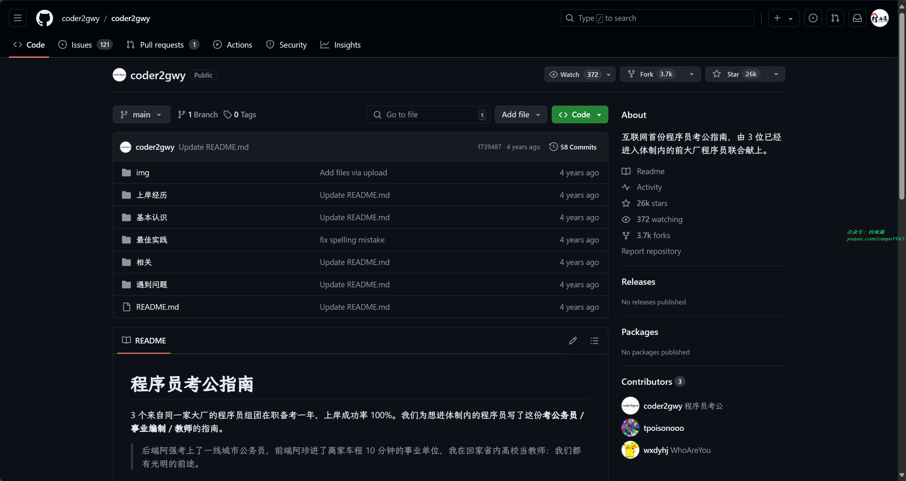
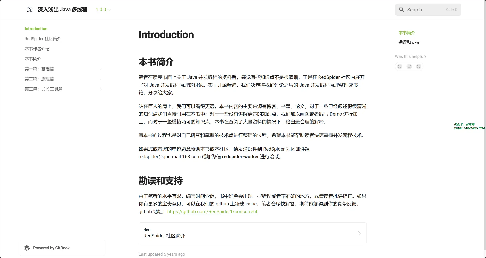

# 好物周刊#68：程序员考公指南

> 作者：[村雨遥](https://github.com/cunyu1943)
> 
> 不要哀求，学会争取，若是如此，终有所获
> 
> 原文：https://mp.weixin.qq.com/s/2shKtjl23ZkHuNoj-LLVWw

## 🎈 号外 

最近，公众号之外，建立了微信交流群，不定期会在群里分享各种资源（影视、IT 编程、考试提升……）&知识。如果有需要，可以**扫码或者后台添加小编微信备注入群**。进群后**优先看群公告**，**呼叫群中【资源分享小助手】**，还能免费帮找资源哦～

 

## 一、项目

### 1. [Dax-Pay](https://gitee.com/dromara/dax-pay)

一款免费开源的支付系统，支持支付宝、微信、云闪付等通道，提供收单、退款、聚合支付、对账、分账等功能。通过 HTTP 方式进行调用，不与其他系统产生耦合关联，提供可视化界面进行管理。

### 2. [GodoOS](https://gitee.com/ruitao_admin/godoos)

一款高效的内网办公操作系统，内含 Word/Excel/ppt/pdf/内网聊天/白板/思维导图等多个办公系统工具，支持原生文件存储。平台界面精仿 Windows 风格，操作简便，同时保持低资源消耗和高性能运行。无需注册即可自动连接内网用户，实现即时通讯和文件共享。灵活高配置的应用商店，可无限扩展。

### 3. [WCP 知识档案管理系统](https://gitee.com/macplus/WCP)

一套 BS 架构的开源知识管理系统、知识库系统。它能提供团队知识库建设的一整套功能，从知识创建、知识更新、知识推送到知识评价、知识激励、知识统计以及基于以上功能权限控制等功能。

## 二、软件

### 1. [Brave](https://brave.com/)

一款快速、私密且安全的网络浏览器，适用于 PC、Mac 和移动设备。立即下载即可享受更快的无广告浏览体验，并通过阻止跟踪软件来节省数据和电池寿命。

### 2. [Filmly](https://filmly.163.com/)

一款具有刮削功能的视频播放器，支持阿里云盘、百度网盘等，支持 WebDAV 协议。可聚合电影、电视剧、综艺、MV、课程录像等影视资源，自动匹配海报、评分、简介等媒体信息，自动归类合集，搭建私人影视库。支持手机、电视、平板、电脑等多终端跨平台观影，同步影视资源及播放记录。

### 3. [Ventoy](https://www.ventoy.net/)

一个制作可启动 U 盘的开源工具，有了它就无需反复地格式化 U 盘，你只需要把 ISO/WIM//VHD (x)/EFI 等类型的文件直接拷贝到 U 盘里面就可以启动了，无需其他操作。

## 三、网站

### 1. [中国大学矢量校徽合集](https://www.urongda.com/)

中国大学矢量校徽合集，按教育部公布的全国高等学校名单学校识别码从小到大排序，共有 534 个。

### 2. [PPResum](https://ppresume.com/)

一个基于 LaTeX 的简历生成器，只要掌握了 LaTex 语法，就能帮助你在几分钟内即可创建漂亮的简历。

### 3. [识典古籍](https://www.shidianguji.com/)

## 四、插件

### 1. [Video Downloader Plus](https://chromewebstore.google.com/detail/video-downloader-plus/hkdmdpdhfaamhgaojpelccmeehpfljgf)

下载视频的最佳方式，无广告，简单快捷。允许从许多热门视频网站下载高清、标清及 4K 的多个版本。

### 2. [Email Finder](https://chromewebstore.google.com/detail/email-finder-getprospect/bhbcbkonalnjkflmdkdodieehnmmeknp)

LinkedIn 的免费电子邮件查找器，在几秒钟内找到电子邮件地址。支持在任意网站上搜索电子邮件并获得 B2B 潜在客户。

### 3. [Wiseone](https://chromewebstore.google.com/detail/paodpkkacimmkacaecjmhdncjgjepcai)

提高网络搜索和提升阅读效率的终极人工智能工具，探索网络，同时确保独特而高效的体验，让您节省时间、提高工作效率并扩展知识。

## 五、资料

### 1. [语法俱乐部](https://github.com/llwslc/grammar-club)

《语法俱乐部》电子化的项目，与扫描版略有不同，作者加入了自己的标注，删减与本土化，但也有一些错误。

### 2. [程序员考公指南](https://github.com/coder2gwy/coder2gwy)

互联网首份程序员考公指南，由 3 位已经进入体制内的前大厂程序员联合献上。

### 3. [concurrent](https://github.com/RedSpider1/concurrent)

RedSpider 社区成员原创与维护的 Java 多线程系列文章。

## ✍️ 说明

周刊专栏相关信息：

- **项目地址**：[Github](https://github.com/cunyu1943/weekly)，觉得不错麻烦给我一个**Star**，感谢 ❤️
- **浏览地址**：公众号 | [电子书](https://cunyu1943.github.io/weekly) | [语雀](https://yuque.com/cunyu1943/weekly)

如果你阅读到这里，说明我的工作没有白费。如果你想推荐项目/网站/软件/资源，欢迎提交 **[issue](https://github.com/cunyu1943/weekly/issues)** 或者添加我 **个人微信：coder_cunYu** 与我交流。

---

## ⏳ 联系

想解锁更多知识？不妨关注我的微信公众号：**村雨遥（id：JavaPark）**。

扫一扫，探索另一个全新的世界。

