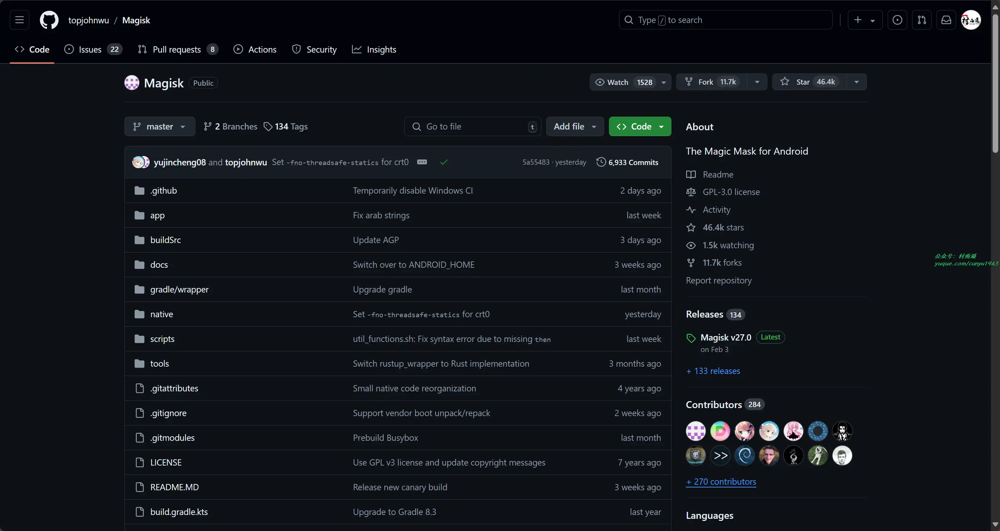
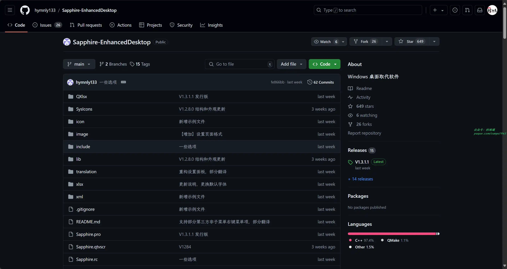
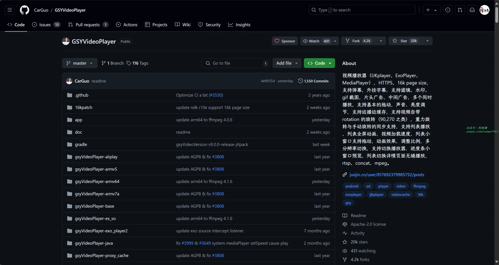
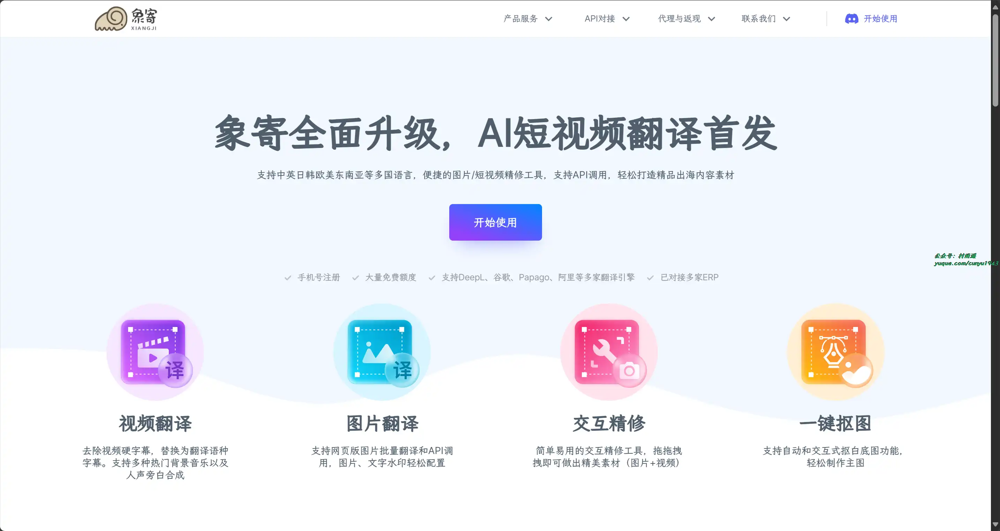
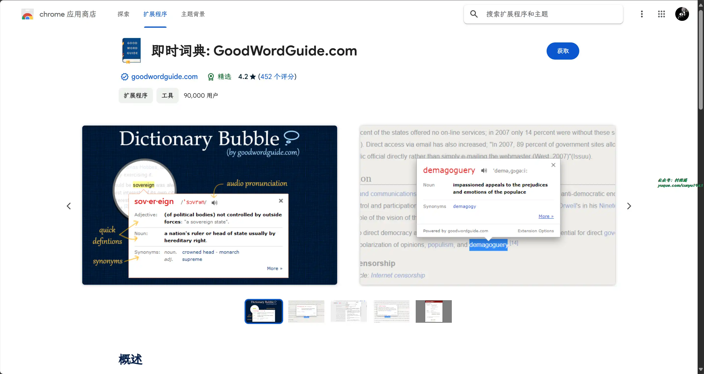
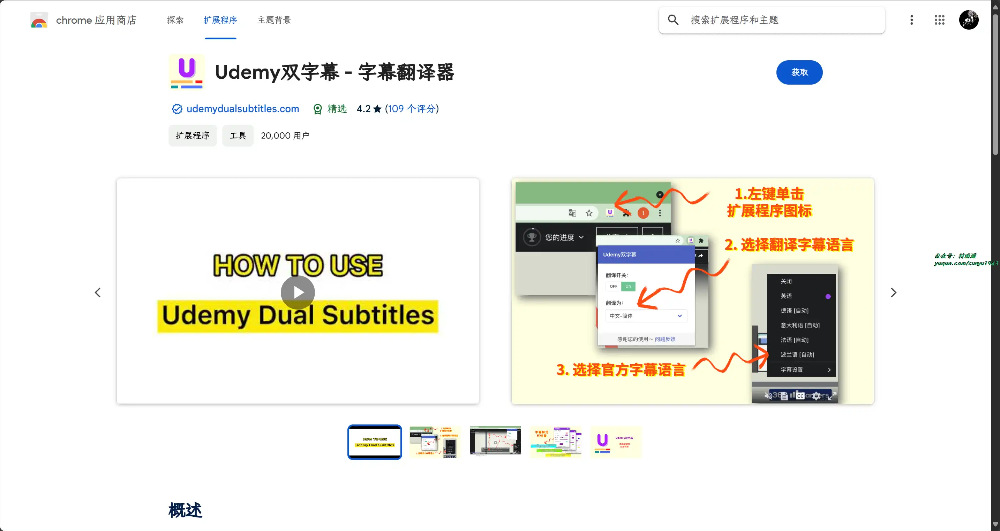
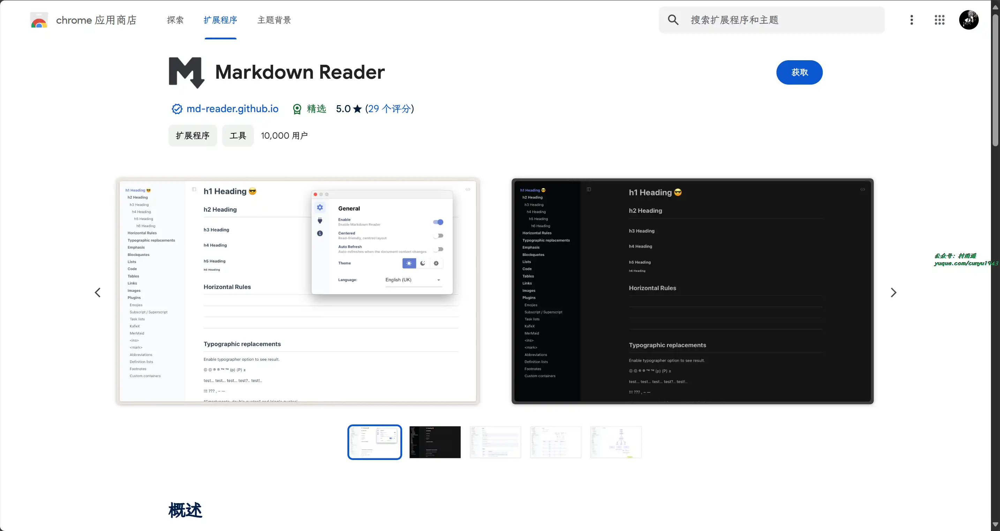
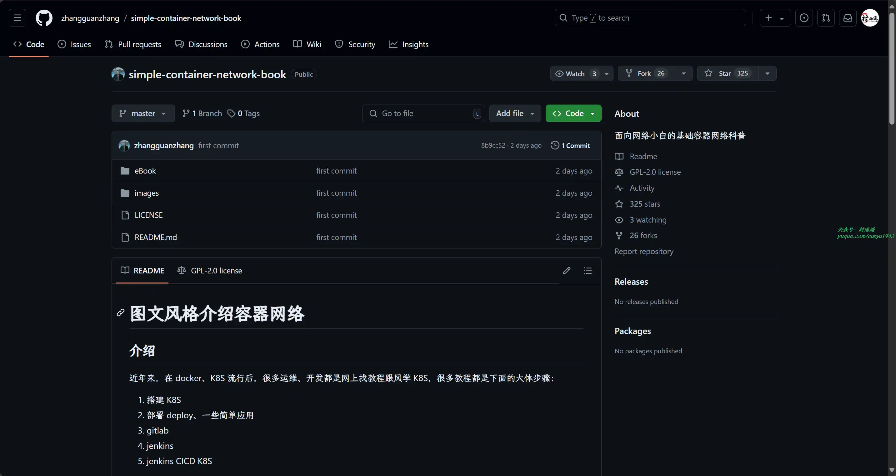
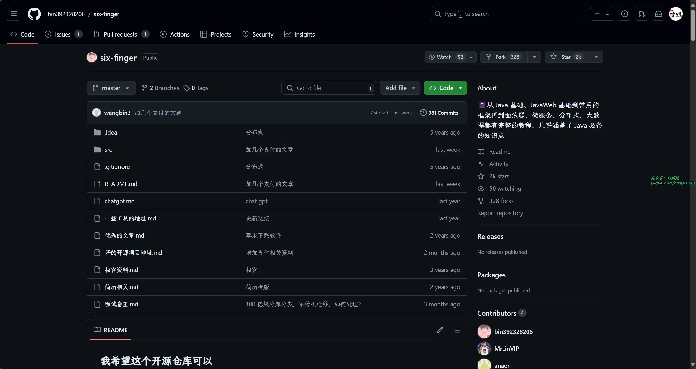
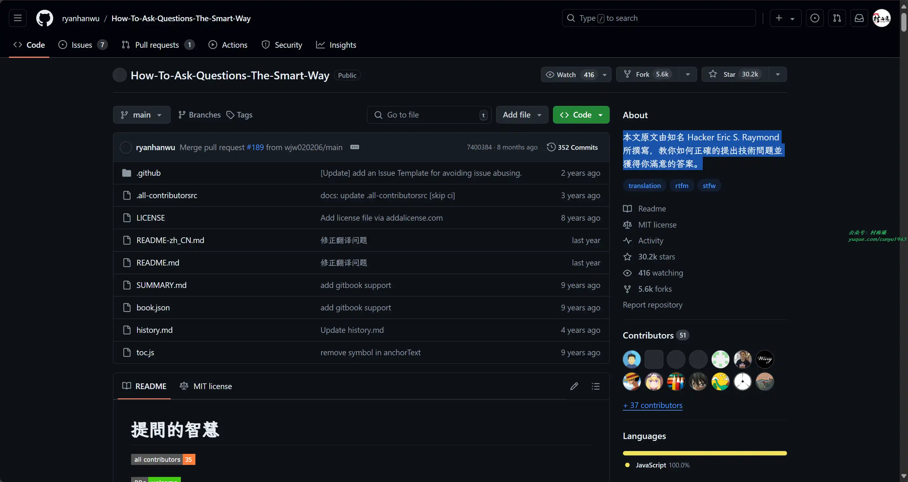

# 好物周刊#69：提问的智慧

> 作者：[村雨遥](https://github.com/cunyu1943)
> 
> 不要哀求，学会争取，若是如此，终有所获
> 
> 原文：https://mp.weixin.qq.com/s/2PdDJUGK8rhUBRHBMXNoXA

## 一、项目

### 1. [Magisk](https://github.com/topjohnwu/Magisk)

一款用于 Android 设备的工具，允许用户快速、无痛地获取超级用户权限，具有强大的模块化功能，让用户能够自定义其设备外观与功能。

### 2. [Vapor](https://github.com/vapor/vapor)

一个流行的 Swift 语言 Web 框架，基于非阻塞事件驱动库 SwiftNIO 构建。它提供了 ORM、模板引擎、用户身份验证等模块，使得开发者能够快速创建网站、接口等服务。

### 3. [NextUI](https://github.com/nextui-org/nextui)

一个美观、快速且现代的 React UI 库，提供了丰富的 UI 组件，帮助开发者快速构建页面内容。

## 二、软件

### 1. [Sapphire](https://github.com/hymnly133/Sapphire-EnhancedDesktop)

现代化的 Windows 桌面增强软件，具有如下特点：

- 系统级别的植入和事件处理。
- 符合直觉和使用习惯的交互。
- 无学习成本、即开即用。
- 模块化设计，统一管理。
- 灵活的动态布局管理解决方案。
- 可自定义的外观。
- 美观、高级、精致、可选的外观特效。
- 方便开发的设计。

### 2. [GSYVideoPlayer](https://github.com/CarGuo/GSYVideoPlayer)

一款视频播放器，支持弹幕，外挂字幕，支持滤镜、水印、gif 截图，片头广告、中间广告，多个同时播放，支持基本的拖动，声音、亮度调节，支持边播边缓存，支持视频自带 rotation 的旋转，重力旋转与手动旋转的同步支持，支持列表播放 ，列表全屏动画，视频加载速度，列表小窗口支持拖动，动画效果，调整比例，多分辨率切换，支持切换播放器，进度条小窗口预览，列表切换详情页面无缝播放

### 3. [jpgHD](https://jpghd.com/)

人工智能老照片无损修复，利用 2024 年最先进人工智能 AI 将老照片无损高清修复（支持老照片修复、老照片上色和魔法动态照片）。

## 三、网站

### 1. [象寄](https://www.xiangjifanyi.com/)

图片翻译专家，支持中英日韩欧美东南亚等多国语言，便捷的图片/短视频精修工具，支持 API 调用，轻松打造精品出海内容素材。

支持DeepL、谷歌、Papago、阿里云等文本引擎，基于深度学习的图片翻译模型，翻译精准高效。覆盖横向文字，纵斜向文字，复杂背景等图片场景，文本引擎可自由根据语种选择。

### 2. [美图云修](https://yunxiu.meitu.com/)

美图公司旗下一站式 AI 修图软件解决方案，商业摄影行业领先的影楼智能修图软件，功能齐全操作便捷一键精修完成后期工作。

### 3. [库宝 AI 写作](https://588tool.com/)

千库网推出的一站式 AI 创意服务平台，拥有 AI 写作、AI 对话、智能聊天机器人、AI 绘画、AI 图像处理、AI 智能设计等 200+ 场景的 AI 工具，注册账号即可免费试用库宝AI工具集，满足企业日常工作中的各种办公需求，助力企业办公提效。

## 四、插件

### 1. [即时词典](https://chromewebstore.google.com/detail/mfembjnmeainjncdflaoclcjadfhpoim)

词典泡泡（即时词典），在您浏览网页时，快速查找带有音频发音的词定义。

### 2. [Udemy 双字幕](https://chromewebstore.google.com/detail/mpedooclpiggpfamidjeemfjoeakebce)

Udemy 字幕翻译器，将原始 Udemy 字幕扩展为双语字幕。一旦你选择了一种特定的语言并打开开关，它就会翻译官方字幕，并与官方字幕一起显示翻译的字幕。

### 3. [Markdown Reader](https://chromewebstore.google.com/detail/markdown-reader/medapdbncneneejhbgcjceippjlfkmkg)

一个可以使 Chrome 预览 markdown 文件的浏览器扩展，内置了多种语法插件、代码高亮、文档热更新和亮色/暗色主题。

## 五、资料

### 1. [容器网络](https://github.com/zhangguanzhang/simple-container-network-book)

面向网络小白的基础容器网络科普，以作者从小白到现在的经历，积累的经验总结而来。

### 2. [six-finger](https://github.com/bin392328206/six-finger)

从 Java 基础、JavaWeb 基础到常用的框架再到面试题、微服务、分布式、大数据都有完整的教程，几乎涵盖了 Java 必备的知识点。

### 3. [提问的智慧](https://github.com/ryanhanwu/How-To-Ask-Questions-The-Smart-Way)

本文原文由知名 Hacker Eric S. Raymond 所撰写，教你如何正确的提出技术问题并获得你满意的答案。

## ✍️ 说明

周刊专栏相关信息：

- **项目地址**：[Github](https://github.com/cunyu1943/weekly)，觉得不错麻烦给我一个**Star**，感谢 ❤️
- **浏览地址**：公众号 | [电子书](https://cunyu1943.github.io/weekly) | [语雀](https://yuque.com/cunyu1943/weekly)

如果你阅读到这里，说明我的工作没有白费。如果你想推荐项目/网站/软件/资源，欢迎提交 **[issue](https://github.com/cunyu1943/weekly/issues)** 或者添加我 **个人微信：coder_cunYu** 与我交流。

---

## ⏳ 联系

想解锁更多知识？不妨关注我的微信公众号：**村雨遥（id：JavaPark）**。

扫一扫，探索另一个全新的世界。

