# 好物周刊#71：帮小忙

> 作者：[村雨遥](https://github.com/cunyu1943)
> 
> 不要哀求，学会争取，若是如此，终有所获
> 
> 原文：https://mp.weixin.qq.com/s/1CqobcYfvE2QkZczmk8bxA

## 🎈 号外 

最近，公众号之外，建立了微信交流群，不定期会在群里分享各种资源（影视、IT 编程、考试提升……）&知识。如果有需要，可以**扫码或者后台添加小编微信备注入群**。进群后**优先看群公告**，**呼叫群中【资源分享小助手】**，还能免费帮找资源哦～

 

## 一、项目

### 1. [VitePress Sidebar](https://github.com/jooy2/vitepress-sidebar)

VitePress 的一个第三方插件，可以通过简单的设置自动配置和管理页面的侧边栏。

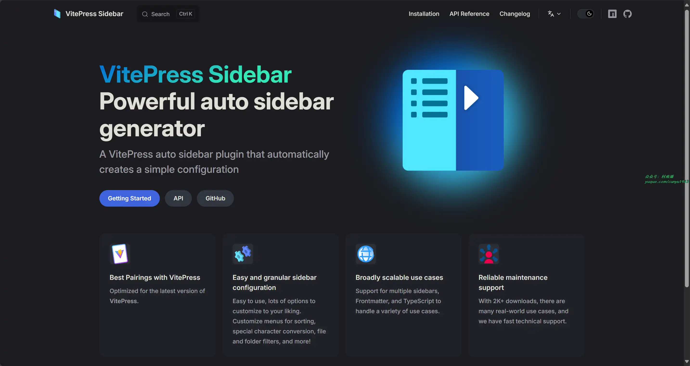

### 2. [Minimalist Web Notepad](https://github.com/pereorga/minimalist-web-notepad)

开源极简在线笔记本，采用 PHP 编写，提供在线编辑、自动保存功能，适合临时记录场景。

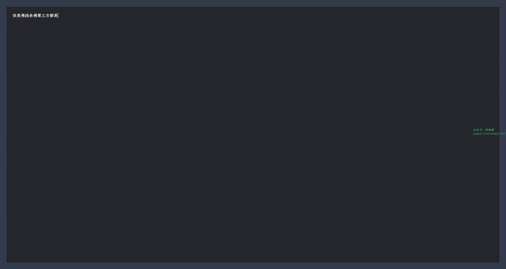

### 3. [linkding](https://github.com/sissbruecker/linkding)

浏览器书签管理平台，基于 Django 构建，支持搜索、标签分类、批量编辑和稍后阅读等功能。

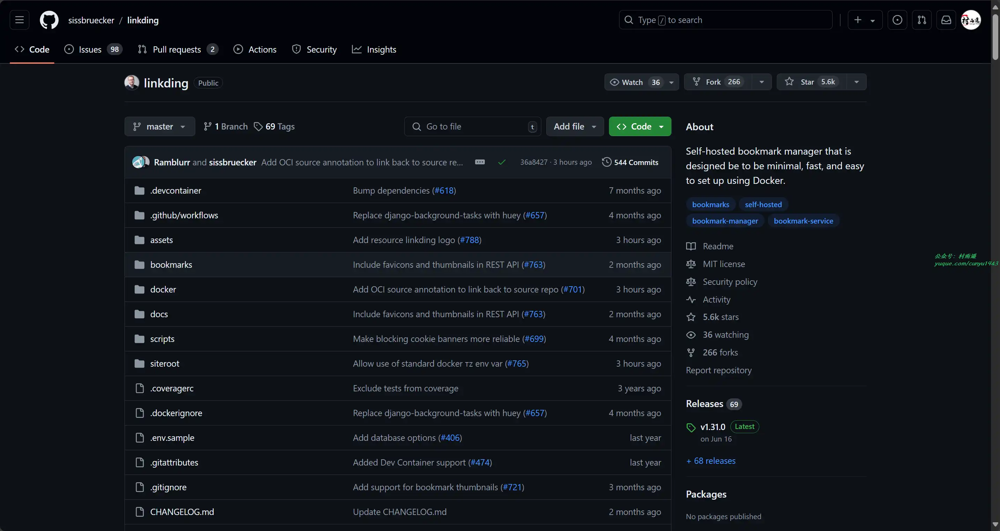

## 二、软件

### 1. [PasteBar](https://github.com/PasteBar/PasteBarApp)

管理 Mac 和 Windows 剪贴板的免费开源工具。

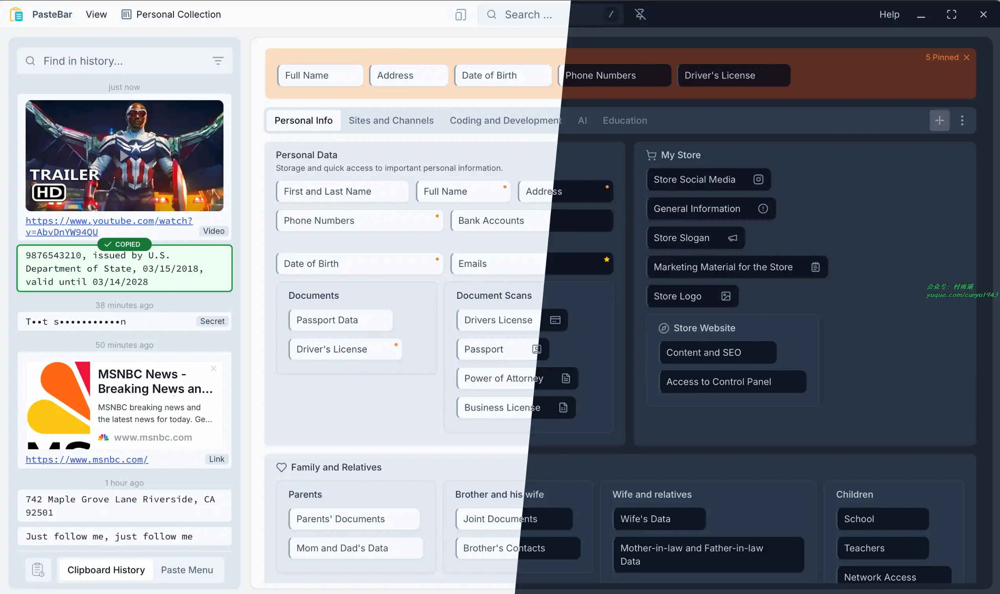

### 2. [Arc](https://arc.net/)

支持多空间，自动收起过期标签页，颜值高，支持全屏的一款免费的网络浏览器。

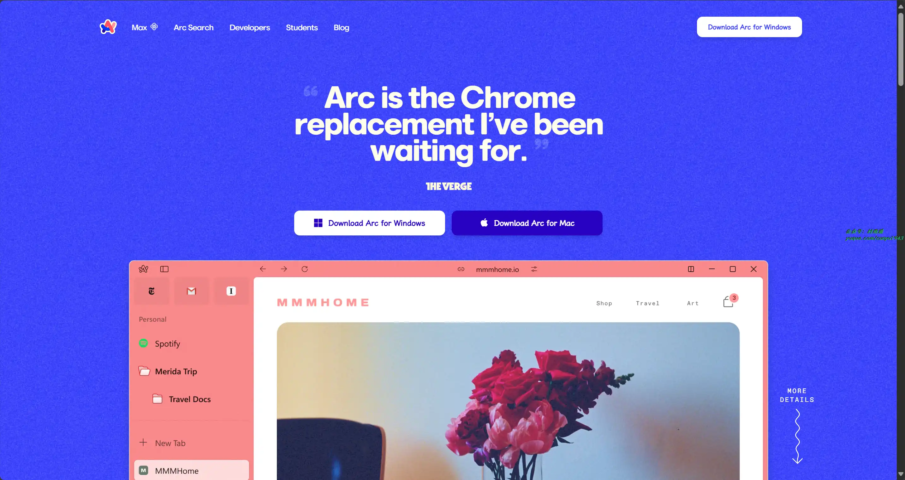

### 3. [Revezone](https://github.com/revezone/revezone)

一款以图形为中心、轻量级、本地优先的用于构建第二大脑的效率工具。支持 Excalidraw、Tldraw 白板和类 Notion 笔记。

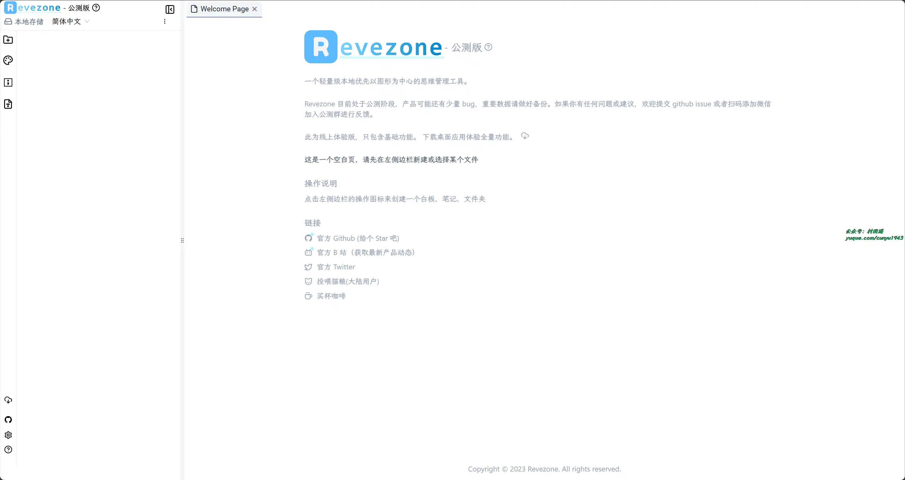

## 三、网站

### 1. [帮小忙](https://tool.browser.qq.com)

腾讯 QQ 浏览器在线工具箱平台，提供证件照生成，表情包制作，PDF转换，文字提取，二维码生成，数据校验、照片修复、插件安装等在线服务，让你无忧生活。 

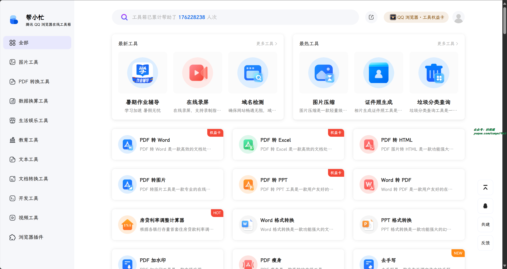

### 2. [查询网](https://www.ip138.com)

手机号码查询归属地、邮政编码查询、iP 地址归属地查询、身份证号码验证在线查询网。

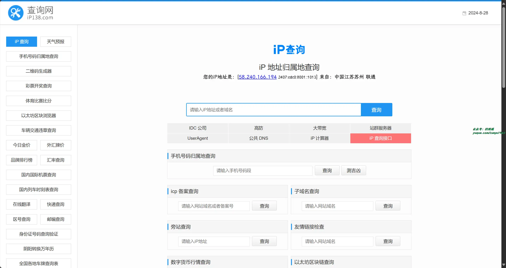

### 3. [中国医药信息查询平台](https://www.dayi.org.cn)

中国权威医药数据库之一，建有海量的医学和药学内容。包括疾病、症状、药品、医生、医院、中药材、食品营养、针炙穴位、医美等 30+ 数据库。拥有百科、视频、问答、病例、预约、咨询、便民购药等板块。为大众提供了专业、科学、可靠、实用的健康科普知识，让大众面对医疗健康信息不再迷茫。

## 四、插件

### 1. [Kimi 浏览器助手](https://chromewebstore.google.com/detail/caejcfciegnnnepdhaopdogngbmojodl)

Kimi 官方的浏览器助手，划线解答疑问，快速摘要长文，文档提供灵感。

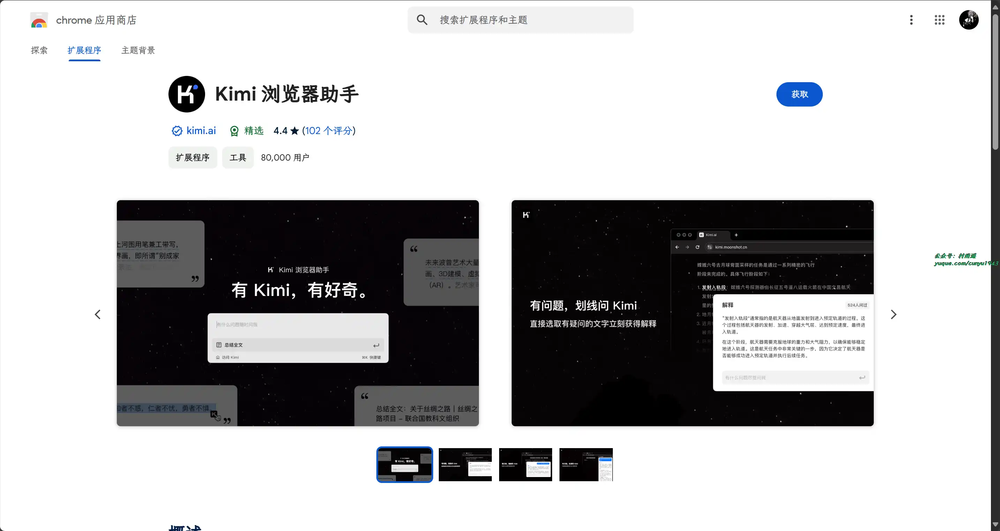

### 2. [1688 AIBUY](https://chromewebstore.google.com/detail/ecpkhbhhpfjkkcedaejmpaabpdgcaegc)

一款专为全球买家设计的浏览器插件，旨在提升您在 1688 平台上的国际采购体验。

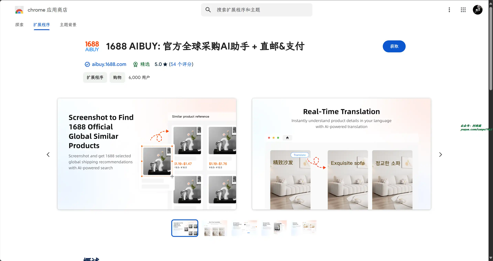

### 3. [字体检测器](https://chromewebstore.google.com/detail/kjgeglpblmplmceadclemoechgnonlnf?hl=zh-CN)

使用字体检测器，通过鼠标光标识别网页上的任何字体，并使用高级字体匹配工具轻松，能够轻松检测任何网站上使用的字体！

该插件是在线识别字体的终极工具。无论您是设计师、开发人员，还是对排版感兴趣，此扩展程序都将帮助您快速准确地检测网页上使用的字体。

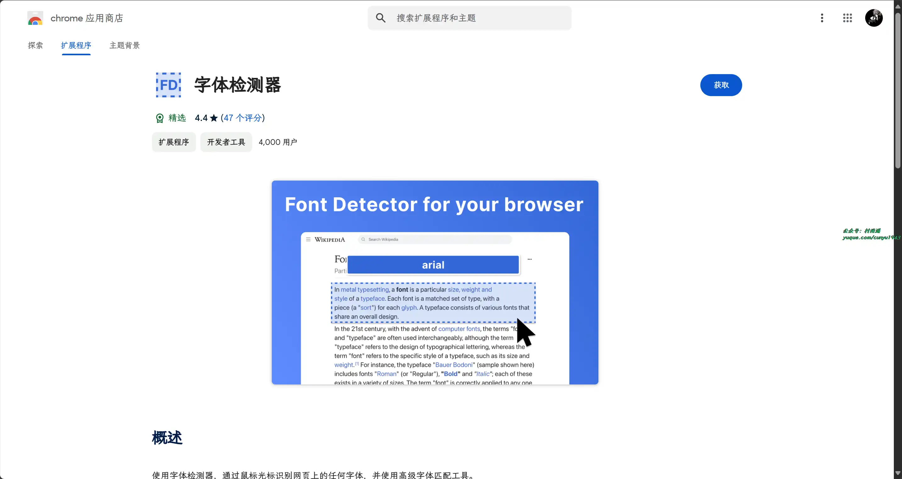

## 五、资料

### 1. [Nodejs 学习笔记](https://github.com/chyingp/nodejs-learning-guide)

Nodejs 学习过程中的一些总结，分为基础和进阶部分。基础部分包含核心模块常用 API 的使用、注意事项。进阶部分则主要包括：项目实战经验总结，含常用框架、库介绍，从编码到服务端部署运维等内容。

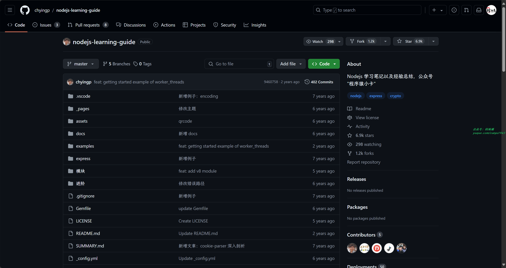

### 2. [Node.js 包教不包会](https://github.com/alsotang/node-lessons)

书中提供了更多的 Node.js 实战机会，通过每一节精心安排的课程目标，让 Node.js 的初学者们可以循序渐进地，有目的有挑战地开展 Node.js 的学习。

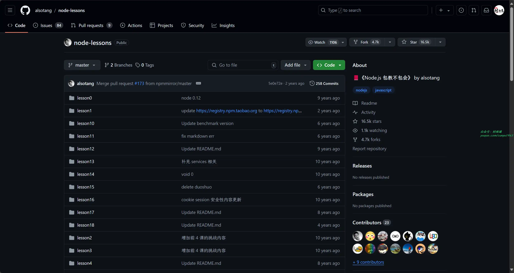

### 3. [PHP 之道](https://github.com/codeguy/php-the-right-way)

循序渐进的 PHP 入门书，收集了现有的 PHP 最佳实践、编码规范和权威学习指南，方便 PHP 开发者阅读和查找。

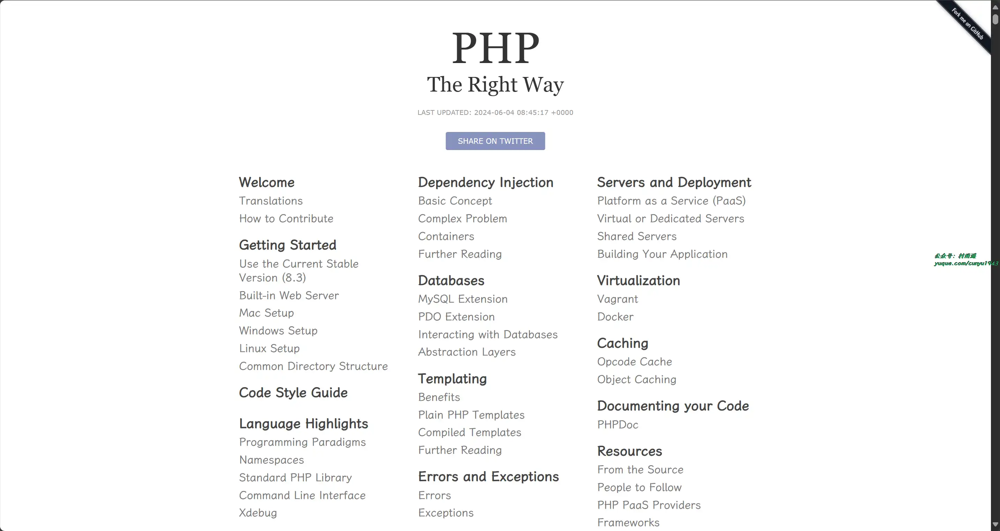

## 

## ✍️ 说明

周刊专栏相关信息：

- **项目地址**：[Github](https://github.com/cunyu1943/weekly)，觉得不错麻烦给我一个**Star**，感谢 ❤️
- **浏览地址**：公众号 | [电子书](https://cunyu1943.github.io/weekly) | [语雀](https://yuque.com/cunyu1943/weekly)

如果你阅读到这里，说明我的工作没有白费。如果你想推荐项目/网站/软件/资源，欢迎提交 **[issue](https://github.com/cunyu1943/weekly/issues)** 或者添加我 **个人微信：coder_cunYu** 与我交流。

---

## ⏳ 联系

想解锁更多知识？不妨关注我的微信公众号：**村雨遥（id：JavaPark）**。

扫一扫，探索另一个全新的世界。

