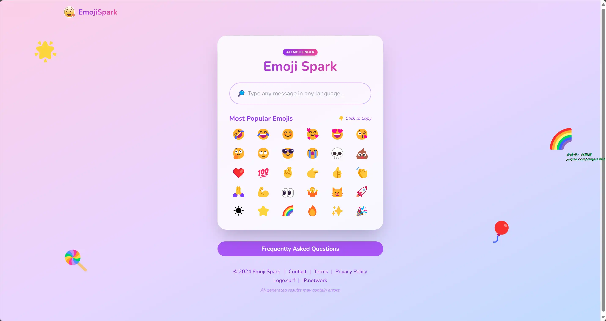
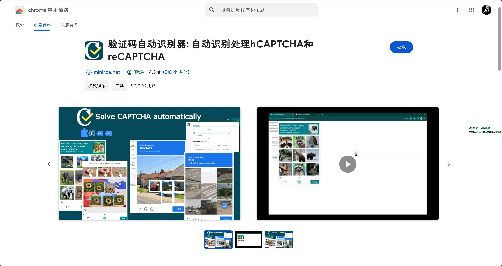

# 好物周刊#72：黑神话悟空妖怪平生录

> 作者：[村雨遥](https://github.com/cunyu1943)
> 
> 不要哀求，学会争取，若是如此，终有所获
> 
> 原文：https://mp.weixin.qq.com/s/vNAG59anVyycpza0BvT-Cg

## 🎈 号外 

最近，公众号之外，建立了微信交流群，不定期会在群里分享各种资源（影视、IT 编程、考试提升……）&知识。如果有需要，可以**扫码或者后台添加小编微信备注入群**。进群后**优先看群公告**，**呼叫群中【资源分享小助手】**，还能免费帮找资源哦～

 

## 一、项目

### 1. [SmartSql](https://github.com/dotnetcore/SmartSql)

 一款方便快捷的数据库文档查询、导出工具！借鉴了 MyBatis 的思想，使用 XML 来管理 SQL 。它不仅支持数据库文档导出，还支持 SQL 查询、代码生成、结构比较、数据分组、工具箱等多种功能。

### 2. [Zolo](https://github.com/Sanix-Darker/zzollo)

开源项目搜索引擎，支持从 Github、Gitlab 以及 Bitbucket 搜索信息。 

### 3. [DdddOcr](https://github.com/sml2h3/ddddocr)

通过大批量生成随机数据后进行深度网络训练，通用验证码识别 OCR。

## 二、软件

### 1. [MooTool](https://github.com/rememberber/MooTool)

开发者常备小工具，支持 macOS、Windows、Linux 平台。

### 2. [影刀](https://www.yingdao.com/)

一款 RPA 自动化软件，致力于为各行业客户提供 RPA 自动化机器人产品与解决方案。影刀 RPA 能实现 PC、手机上的任何软件自动化操作。积木式流程搭建，0 编程基础快速入门，人人都能轻松上手，是上万家企业信赖之选。

### 3. [字由](https://www.hellofont.cn/)

免费的字体管理工具，为您提供 900+ 字体免费商用，支持在 PS、AI、ID、XD、Figma、Sketch、CDR 等设计软件中一键应用字体，提供 AI 识字、字体特效等实用功能，为您的设计提质加速。

## 三、网站

### 1. [微博嘴替](https://zuiti.app)

使用 AI 分析微博账号，了解账号的性格特点，

### 2. [EmojiSpark](https://emojispark.com)

支持搜索，复制和粘贴表情包快速。即时找到任何信息的完美表情符号，解析表情符号的含义，丰富你想要表达的信息。

### 3. [一证通查](https://getsimnum.caict.ac.cn/)

四大运营商联合中国通信院推出的全国移动电话卡“一证通查”便民服务，用户凭居民身份证即可查询个人名下登记电话卡数量。

## 四、插件

### 1. [VideoPlayer](https://chromewebstore.google.com/detail/videoplayer-mpdm3u8m3uepg/opmeopcambhfimffbomjgemehjkbbmji)

使用 DASH (mpd)、HLS (m3u8) 格式和 M3U 列表的视频播放器提供支持，当访问 .mpd 或 .m3u8 视频文件或 .m3u 列表的链接时，播放器将自动打开。

### 2. [迷你派采集器](https://chromewebstore.google.com/detail/ojaffphbffmdaicdkahnmihipclmepok)

技术小白网页采集器，无需注册即可立即开启免费体验。最简单数据采集、网页采集、网页爬虫、浏览器自动化插件。最少点击 3 次即可轻松完成多页自动采集爬取，强大的多级网页采集，无需任何编码。

### 3. [验证码自动识别器](https://chromewebstore.google.com/detail/hlifkpholllijblknnmbfagnkjneagid)

使用人工智能自动识别处理网页上出现的 hCAPTCHA 和 reCAPTCHA，与迷你派采集器无缝集成，实现丝滑的数据采集。

## 五、资料

### 1. [黑神话悟空妖怪平生录](https://github.com/meethigher/black-wukong-youji)

仓库记录了黑神话：悟空游戏中 203个妖怪的妖生故事，带你去看妖怪的众生相。

### 2. [Calculus with Julia](https://github.com/jverzani/CalculusWithJuliaNotes.jl)

最简单的极限开始介绍微积分，使用 Julia 来学习微积分，对于既需要学习微积分，有需要学习 Julia 语言的读者很实用。

### 3. [Learn-Vim](https://github.com/wsdjeg/Learn-Vim_zh_cn)

Vim 学习之道翻译版本，初学者和高级用户均可适用。从简单的概念入手，然后落在特殊的、进阶的技巧上。

## ✍️ 说明

周刊专栏相关信息：

- **项目地址**：[Github](https://github.com/cunyu1943/weekly)，觉得不错麻烦给我一个**Star**，感谢 ❤️
- **浏览地址**：公众号 | [电子书](https://cunyu1943.github.io/weekly) | [语雀](https://yuque.com/cunyu1943/weekly)

如果你阅读到这里，说明我的工作没有白费。如果你想推荐项目/网站/软件/资源，欢迎提交 **[issue](https://github.com/cunyu1943/weekly/issues)** 或者添加我 **个人微信：coder_cunYu** 与我交流。

---

## ⏳ 联系

想解锁更多知识？不妨关注我的微信公众号：**村雨遥（id：JavaPark）**。

扫一扫，探索另一个全新的世界。

