# 好物周刊#73：框框大学

> 作者：[村雨遥](https://github.com/cunyu1943)
> 
> 不要哀求，学会争取，若是如此，终有所获
> 
> 原文：https://mp.weixin.qq.com/s/0Iey9tDGeQo81T_4DmRUww

## 号外

最近，公众号之外，建立了微信交流群，不定期会在群里分享各种资源（影视、IT 编程、考试提升……）&知识。如果有需要，可以**扫码或者后台添加小编微信备注入群**。进群后**优先看群公告**，**呼叫群中【资源分享小助手】**，还能免费帮找资源哦～

 

## 一、项目

### 1. [Certimate](https://github.com/usual2970/certimate)

开源的 SSL 证书管理工具，可以帮助你申请 SSL 证书，自动续期 SSL 证书。具有以下特点：

- 支持私有部署：部署方法简单，只需下载二进制文件并执行即可完成安装。
- 数据安全：由于是私有部署，所有数据均存储在本地，不会保存在服务商的服务器上，确保数据的安全性。
- 操作方便：通过简单的配置即可轻松申请 SSL 证书，并且在证书即将过期时自动续期，无需人工干预。

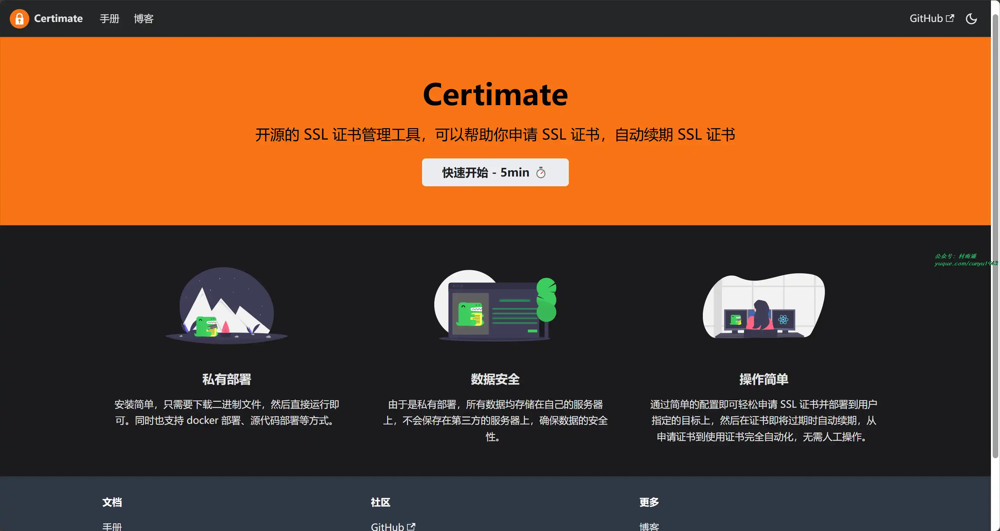

### 2. [MyRPCFromZero](https://github.com/he2121/MyRPCFromZero)

从零开始，手写一个 RPC，跟随着作者，从文档以及数个迭代版本的代码，由简陋到逐渐完备，让所有人都能看懂并且写出一个 RPC 框架。

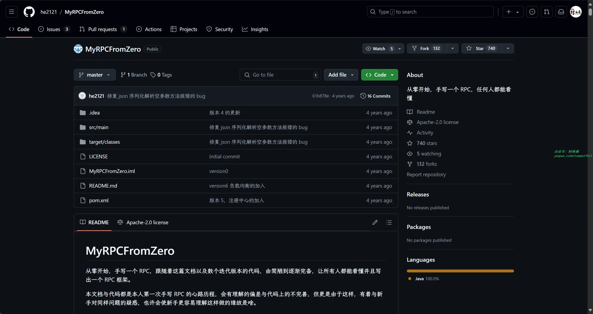

### 3. [Plate](https://github.com/udecode/plate)

基于 React 开发的富文本编辑器。

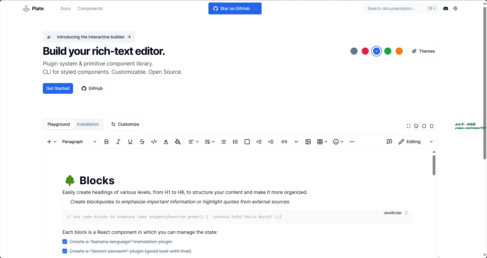

## 二、软件

### 1. [文颜](https://github.com/caol64/wenyan)

一款全自动的文章排版美化工具，专为简化您的内容发布工作而设计。它可以将 Markdown 格式的文章快速转换为适合微信公众号、今日头条、知乎等平台的排版格式，从而省去因平台差异带来的繁琐调整。

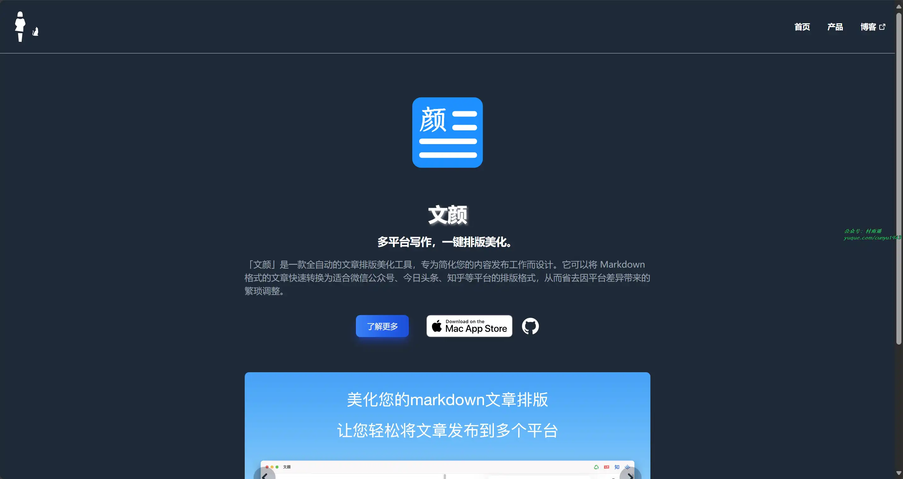

### 2. [ImFile](https://imfile.io/)

基于 Motrix 开发，一款顺畅、高速、强大而便捷的下载工具，支持下载 HTTP、FTP、BitTorrent、Magnet 等。

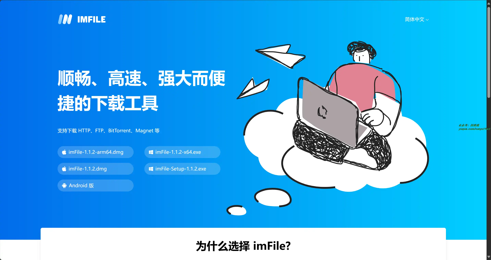

### 3. [UPDF](https://www.updf.cn/)

新一代 AI 智能 PDF 编辑器，具备 PDF 文档编辑、注释、转换、OCR、翻译、AI 对话等功能。

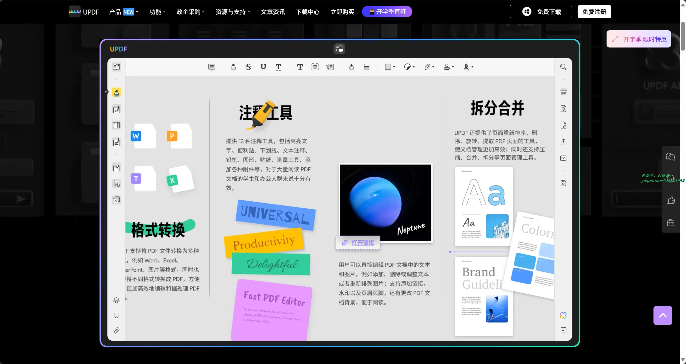

## 三、网站

### 1. [Get 笔记](https://www.biji.com/)

新一代 AI 笔记工具，帮你实现高效记录、深度思考。通过智能记录、整理，让知识流动起来。

### 2. [框框大学](https://www.kkdaxue.com/)

免费的知识经验共享平台，专注于为大学生提供学习建议和行业洞察。汇聚了超过 9300 条来自各专业前辈的学习建议和经验分享，旨在帮助大学生们避免常见误区，获取宝贵的知识和指导。

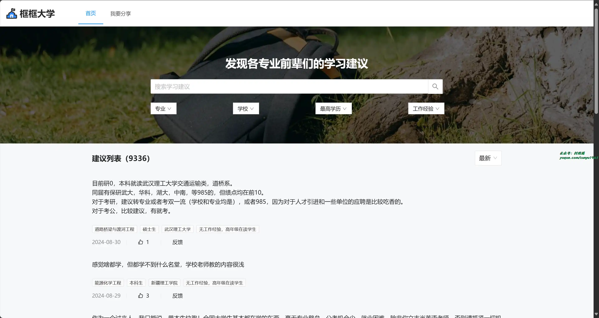

### 3. [包图网](https://ibaotu.com)

包图网汇集了各种视觉冲击力强的原创广告图片设计、电商淘宝、企业办公模板、视频、配乐、音效、字体、插画动图、装饰装修等素材，由顶尖的设计师供稿，符合各个行业的商用需求。

## 四、插件

### 1. [Readecho](https://chromewebstore.google.com/detail/ibinnfpnfbcfdblmjpmjjmffcjlcadig)

只需几步轻松获取并保存微信读书笔记，自定义你的笔记回顾方式，不错过每一个阅读瞬间。通过安装该浏览器插件，一键将微信读书的读书笔记同步和导出。

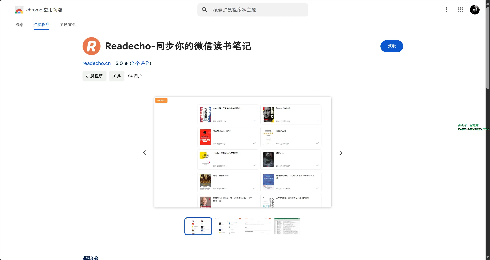

### 2. [新标签页日历与 ChatGPT](https://chromewebstore.google.com/detail/cmfhopmhaagcfnjflfppceclmkenjkpc)

最佳新标签页浏览器扩展，集成了 Google 日历、ChatGPT、Gmail 等功能。

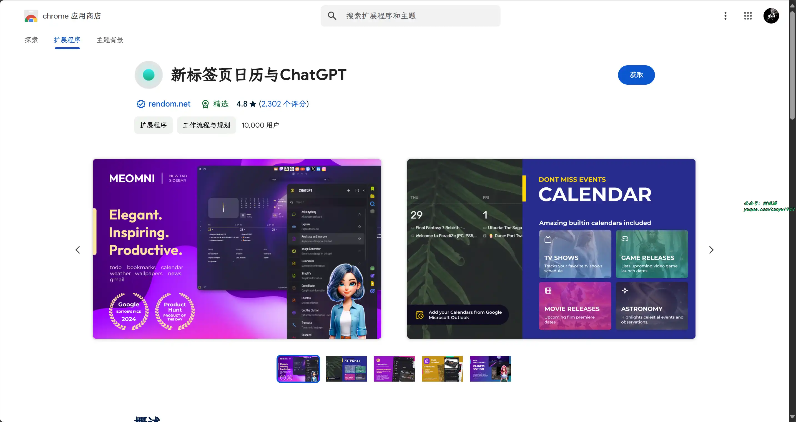

### 3. [JetBrains Grazie](https://chromewebstore.google.com/detail/jetbrains-grazie-ai-writi/fonaoompfjljjllgccccgjnhnoghohgc)

Grazie 是一款面向科技专业人士的人工智能写作助手，由 JetBrains 开发支撑，帮助你提高你的写作与校对，摘要，自动完成，重新措辞的能力。

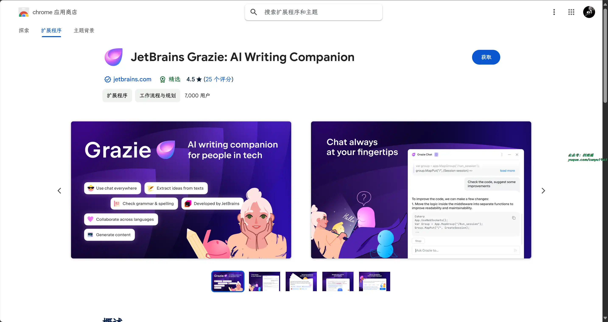

## 五、资料

### 1. [算法通关手册](https://github.com/itcharge/LeetCode-Py)

超详细的「算法与数据结构」基础讲解教程，从零基础开始学习算法知识，850+ 道「LeetCode 题目」详细解析，200 道「大厂面试热门题目」。

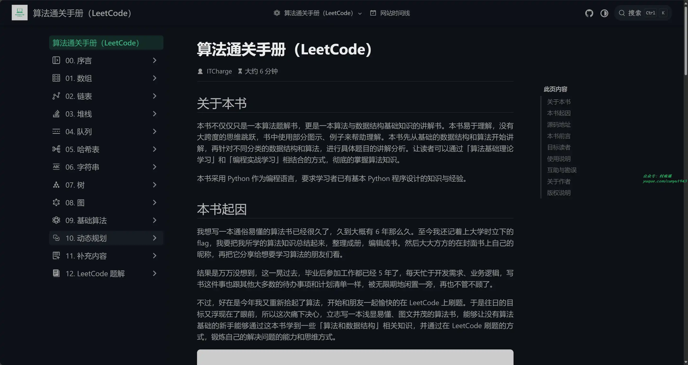

### 2. [计算机教育中缺失的一课](https://missing-semester-cn.github.io/)

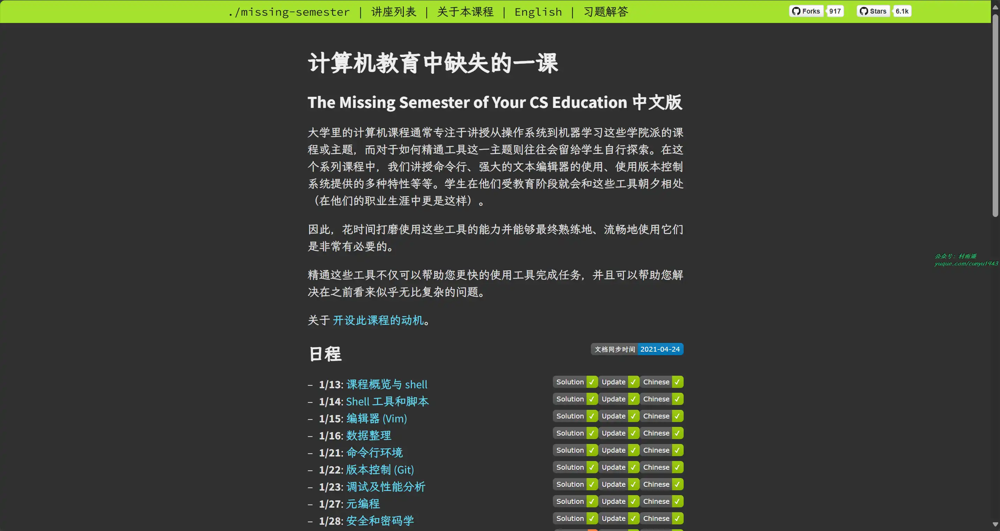

### 3. [出海网站经验总结](https://github.com/princehuang/overseas-website-note)

分享在开发海外网站过程中积累的经验。无论您是刚开始计划将业务拓展到海外，还是已经在这个领域有所尝试，这里的内容都能为您提供有价值的参考。

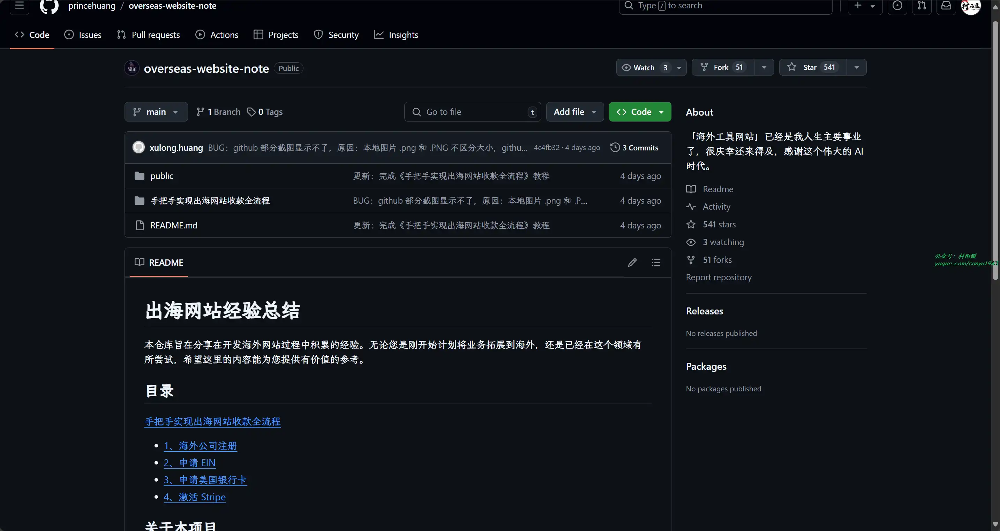

## ✍️ 说明

周刊专栏相关信息：

- **项目地址**：[Github](https://github.com/cunyu1943/weekly)，觉得不错麻烦给我一个**Star**，感谢 ❤️
- **浏览地址**：公众号 | [电子书](https://cunyu1943.github.io/weekly) | [语雀](https://yuque.com/cunyu1943/weekly)

如果你阅读到这里，说明我的工作没有白费。如果你想推荐项目/网站/软件/资源，欢迎提交 **[issue](https://github.com/cunyu1943/weekly/issues)** 或者添加我 **个人微信：coder_cunYu** 与我交流。

---

## ⏳ 联系

想解锁更多知识？不妨关注我的微信公众号：**村雨遥（id：JavaPark）**。

扫一扫，探索另一个全新的世界。

