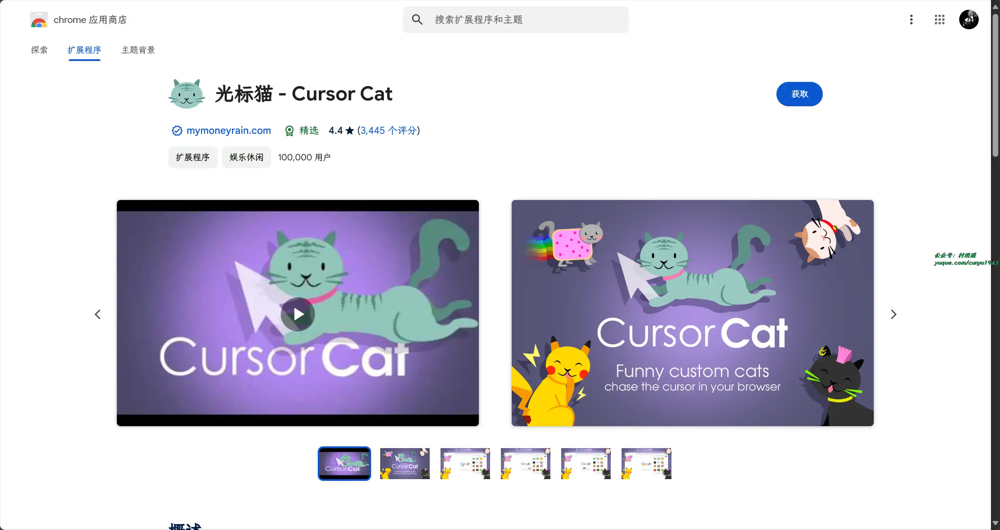

# 好物周刊#74：搞快点

> 作者：[村雨遥](https://github.com/cunyu1943)
> 
> 不要哀求，学会争取，若是如此，终有所获
> 
> 原文：https://mp.weixin.qq.com/s/7xn9jKiQVtU7yAW8kc52Ug

## 🎈 号外 

最近，公众号之外，建立了微信交流群，不定期会在群里分享各种资源（影视、IT 编程、考试提升……）&知识。如果有需要，可以**扫码或者后台添加小编微信备注入群**。进群后**优先看群公告**，**呼叫群中【资源分享小助手】**，还能免费帮找资源哦～

 

## 一、项目

### 1. [OPSLI 快速开发平台](https://github.com/hiparker/opsli-boot)

基于 SpringBoot、Vue、Element-ui ，项目采用前后端分离架构，热插拔式业务模块与插件扩展性高，代码简洁，功能丰富，开箱即用。

### 2. [SpEL Validator](https://github.com/stick-i/spel-validator)

一个强大的 Java 参数校验包，基于 SpEL 实现，扩展自 javax.validation 包，用于简化参数校验，几乎支持所有场景下的参数校验。

### 3. [KotlinMvp](https://github.com/git-xuhao/KotlinMvp)

Kotlin + MVP + Retrofit + RxJava + Glide 等架构实现短视频类小项目，代码风格简约，并带有详细注释。

## 二、软件

### 1. [bujuan](https://github.com/2697a/bujuan)

一个基于 Flutter  开发，支持 Android、iOS、MacOS、Windows、Linux 的三方网易云播放器。

### 2. [DPanel](https://github.com/donknap/dpanel)

Docker 可视化面板系统，提供完善的 Docker 管理功能。

### 3. [GKD](https://github.com/gkd-kit/gkd/)

GKD，搞快点的首字母缩写。基于无障碍 + 高级选择器 + 订阅规则的自定义屏幕点击 APP，帮助你自动跳过开屏广告、微信自动抢红包等任务。

## 三、网站

### 1. [Quail](https://quail.ink/zh)

现代化、AI 助力的 Newsletter 服务。用 Quail 建立一个会员社区，与你的追随者保持连接，为你的创作筹集资金。

### 2. [PostgreSQL Online](https://pgplayground.com/)

网站提供免费的 PostgreSQL 实例，可以让我们在网页进行各种数据库测试，帮助掌握 PostgreSQL 的相关语法。

### 3. [轻松游牧](https://easynomad.cn/)

一个远程工作聚合平台，收录了多个论坛和社交媒体上的远程招聘信息，包括全职和兼职，都是支持国内远程的岗位。同时，你也能轻松地在这里找到大量支持国内远程的公司的信息。

## 四、插件

### 1. [光标样式](https://chromewebstore.google.com/detail/bmjmipppabdlpjccanalncobmbacckjn)

用于 Chrome 的炫酷、可爱和有趣的光标，有数百个选项供您选择，为我们的浏览器设置自定义光标，让它更加酷炫。

### 2. [习惯追踪器](https://chromewebstore.google.com/detail/ncokhechhpjgjonhjnlaneglmdkfkcbj)

使用在线习惯追踪器进行日常习惯追踪，帮助您养成积极习惯，实现个人成长和生活改善的目标。通过设计的功能，无缝过渡从不太理想的习惯到更有益的习惯，提升生活方式，增强日常例行活动。

### 3. [光标猫](https://chromewebstore.google.com/detail/aeehekhncjhhmchjolinnihgdpapmljk)

为 Chrome 获取一只有趣的宠物，可爱的小猫会在不同网站上追逐您的鼠标光标。使用此扩展程序，您可以享受各种动画小猫的陪伴，它们栩栩如生，与您的光标嬉戏互动。有着多种小猫宠物供您选择，比如绿巨人猫、蝙蝠猫、蜘蛛猫、圣诞猫等。

## 五、资料 

### 1. [Waking-Up](https://github.com/wolverinn/Waking-Up)

主要涉及计算机基础（计算机网络 / 操作系统 / 数据库 / Git...）面试问题全面总结，包含详细的 follow-up question 以及答案；全部采用【问题 + 追问 + 答案】的形式，即拿即用，直击互联网大厂面试；可用于模拟面试、面试前复习、短期内快速备战面试。

### 2. [FunRec](https://github.com/datawhalechina/fun-rec/)

教程主要是针对具有机器学习基础并想找推荐算法岗位的同学。教程内容由推荐系统概述、推荐算法基础、推荐系统实战和推荐系统面经四个部分组成。对于入门推荐算法的同学来说，可以从推荐算法的基础到实战再到面试，形成一个闭环。

### 3. [英语提升指南](https://vvyst0z7tes.feishu.cn/wiki/HQuawZepyiwNiNkImw6c00IXnmc)

采用南加州大学的荣休教授斯蒂芬。克拉申（Stephen D.Krashen）博士的假说理论，为不同基础的英语学习者提供结构化的学习路径。

## ✍️ 说明

周刊专栏相关信息：

- **项目地址**：[Github](https://github.com/cunyu1943/weekly)，觉得不错麻烦给我一个**Star**，感谢 ❤️
- **浏览地址**：公众号 | [电子书](https://cunyu1943.github.io/weekly) | [语雀](https://yuque.com/cunyu1943/weekly)

如果你阅读到这里，说明我的工作没有白费。如果你想推荐项目/网站/软件/资源，欢迎提交 **[issue](https://github.com/cunyu1943/weekly/issues)** 或者添加我 **个人微信：coder_cunYu** 与我交流。

---

## ⏳ 联系

想解锁更多知识？不妨关注我的微信公众号：**村雨遥（id：JavaPark）**。

扫一扫，探索另一个全新的世界。

