# 好物周刊#75：退休倒计时

> 作者：[村雨遥](https://github.com/cunyu1943)
> 
> 不要哀求，学会争取，若是如此，终有所获
> 
> 原文：https://mp.weixin.qq.com/s/bchsXOoaZawqvDQFipfgBA

## 一、项目

### 1. [MapStruct](https://github.com/mapstruct/mapstruct)

一个基于注解处理器的类转换器，它具有类型安全、高性能、没有其他依赖实现对象转换的特点。

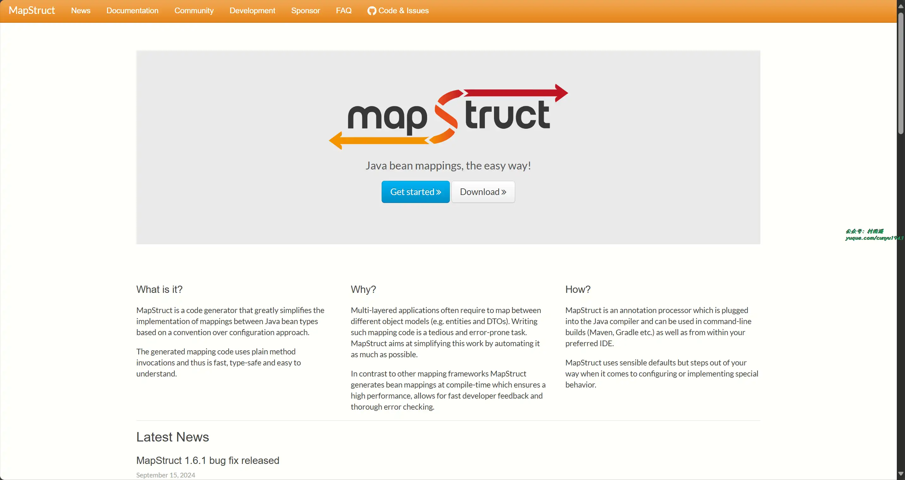

### 2. [MapStruct Plus](https://github.com/linpeilie/mapstruct-plus)

自称可能是最简单最强大的 Java Bean 转换工具。Mapstruct Plus 是 Mapstruct 的增强工具，在 Mapstruct 的基础上，实现了自动生成 Mapper 接口的功能，并强化了部分功能，使 Java 类型转换更加便捷、优雅。

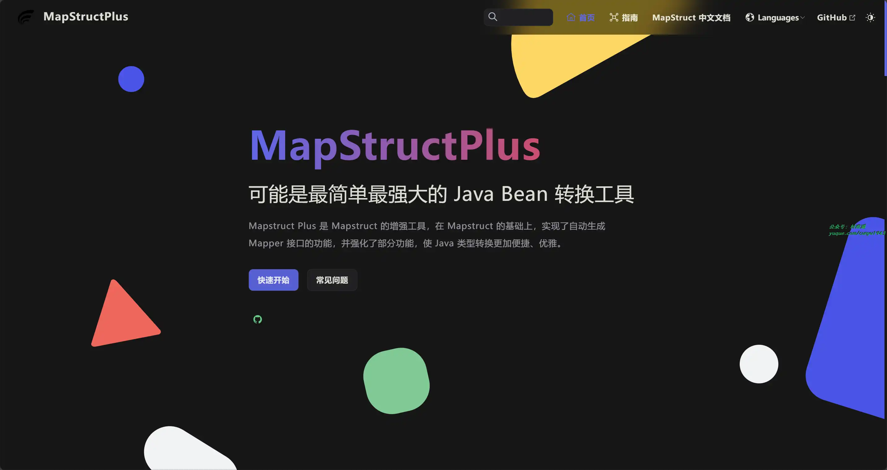

### 3. [APIJSON](https://github.com/Tencent/APIJSON)

一种专为 API 而生的 JSON 网络传输协议 以及 基于这套协议实现的 ORM 库。为各种增删改查提供了完全自动化的万能通用接口，零代码实时满足千变万化的各种新增和变更需求。大幅降低开发和沟通成本，简化开发流程，缩短开发周期。适合中小型前后端分离的项目，尤其是创业项目、内部项目、低代码/零代码、小程序、BaaS、Serverless 等。

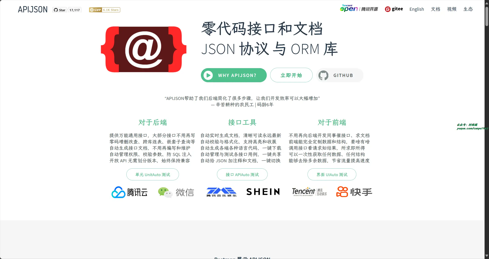

## 二、软件

### 1. [Container Desktop](https://github.com/iongion/container-desktop)

一个熟悉的图形化的容器管理器软件，免费开源。

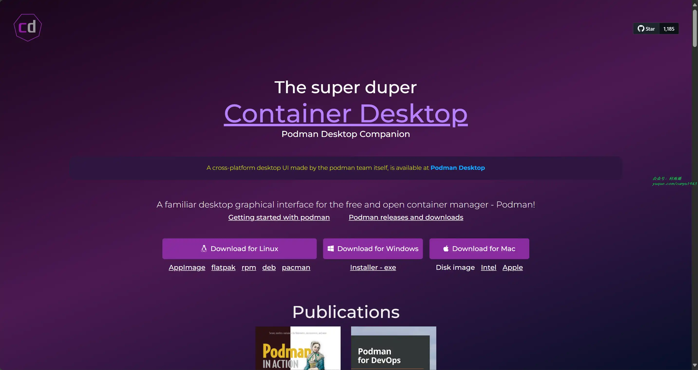

### 2. [f.lux](https://justgetflux.com/)

一款可以根据时间自动调整频幕色温的护眼软件，软件将帮你自动调整到让你眼睛舒服的状态。

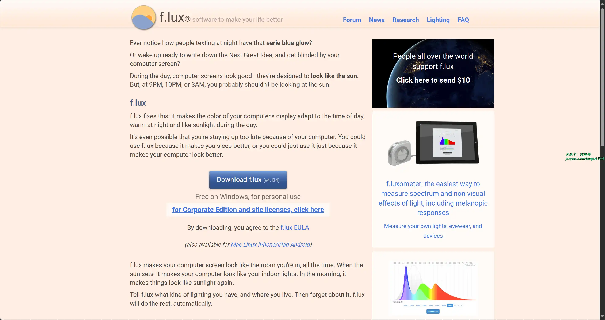

### 3. [Ditto](https://ditto-cp.sourceforge.io/)

一款开源、免费、强大的剪贴板增强工具，可以将复制过的所有内容（HTML、文本、图像等）保存起来，供后续使用。

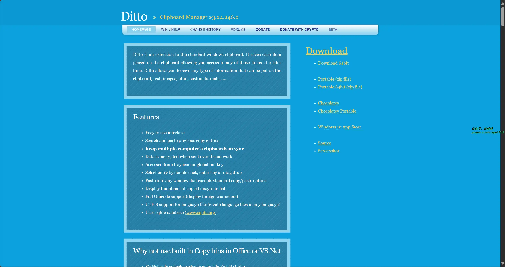

## 三、网站

### 1. [cvbee.ai](https://cvbee.ai/zh-CN)

您的智能简历助手，使用 AI 技术，轻松创建、优化您的简历，为你的求职保驾护航。

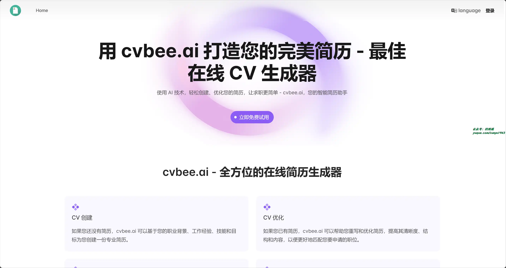

### 2. [退休计算器](https://daojishi.fun)

输入出生日期，即可精确计算您的法定退休年龄，并可视化您距离退休的时间。提供全屏显示、屏保模式、数据保存和深色模式等功能。助您提前规划，从容迎接退休生活。适用于各行业、各年龄段的中国工作者。

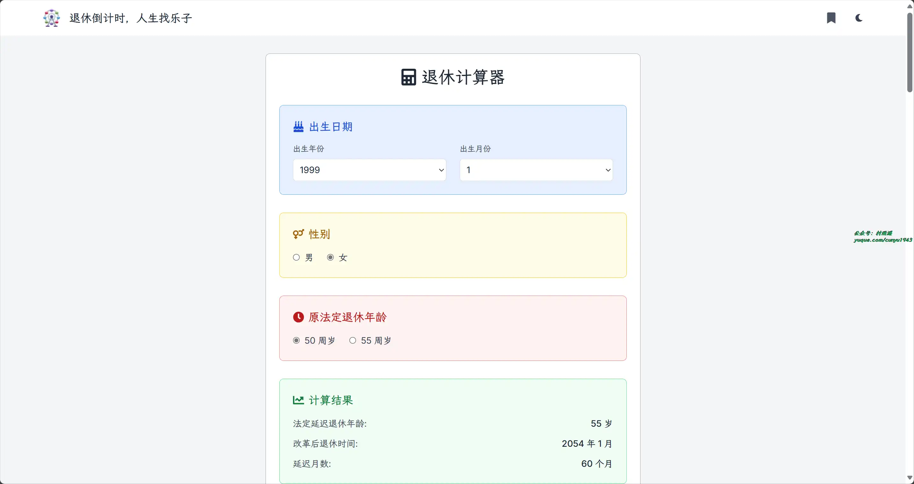

### 3. [小纸条](https://ali.gitcafe.ink/)

开放纯粹的资源分享网站，汇聚各种影视、音乐、文档、软件等资源。

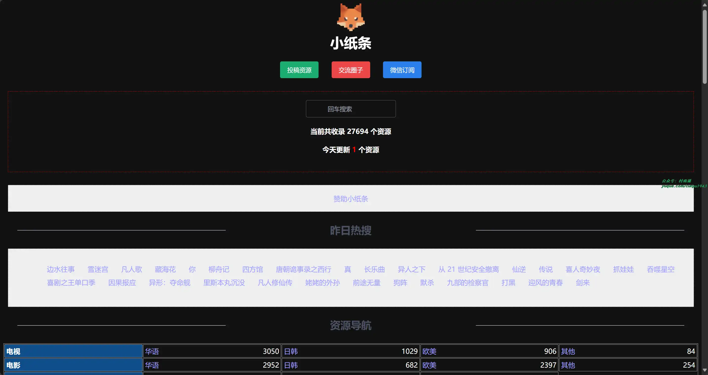

## 四、插件

### 1. [Material Icons for Github](https://chromewebstore.google.com/detail/material-icons-for-github/bggfcpfjbdkhfhfmkjpbhnkhnpjjeomc)

替换 GitHub, Azure, Bitbucket 等网站项目仓库中的默认图标，实现以 Material Icons 形式呈现。帮助我们一目了然地快速识别文件类型、配置文件和项目脚手架。

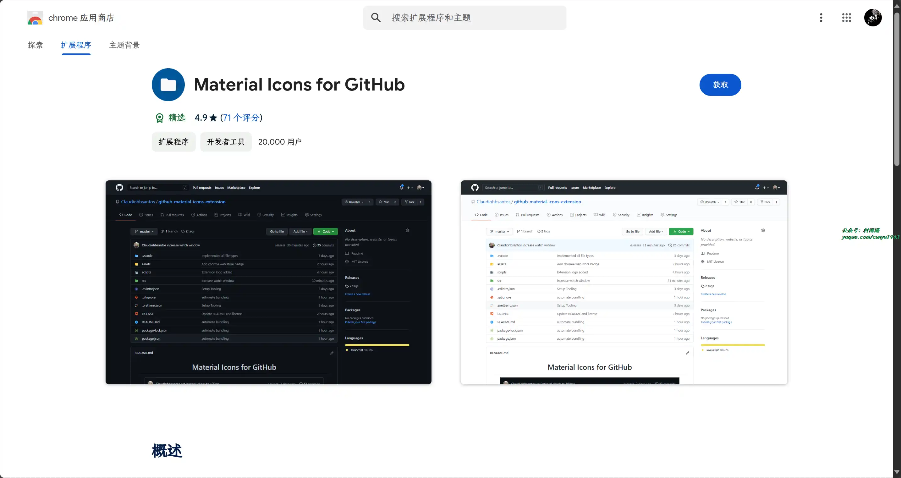

### 2. [Base64 Encoder and Decoder](https://chromewebstore.google.com/detail/base64-encoder-and-decode/hmndaanmnneonjcekcbeeedioimiffpj)

通过该插件，可以轻松实现纯文本和 Base64 之间的互相编解码，而且所有功能均支持离线使用。

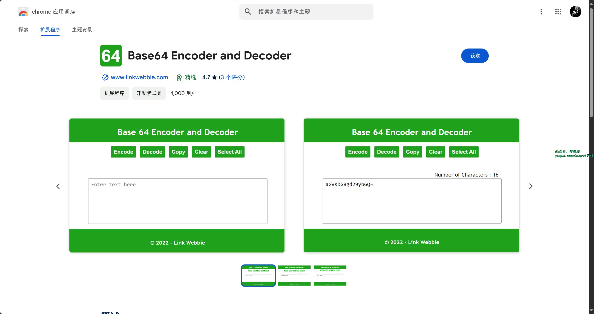

### 3. [d3coder](https://chromewebstore.google.com/detail/d3coder/gncnbkghencmkfgeepfaonmegemakcol)

编码/解码插件，支持包括 base64，rot13 或 unix timestamp 编码的转换。

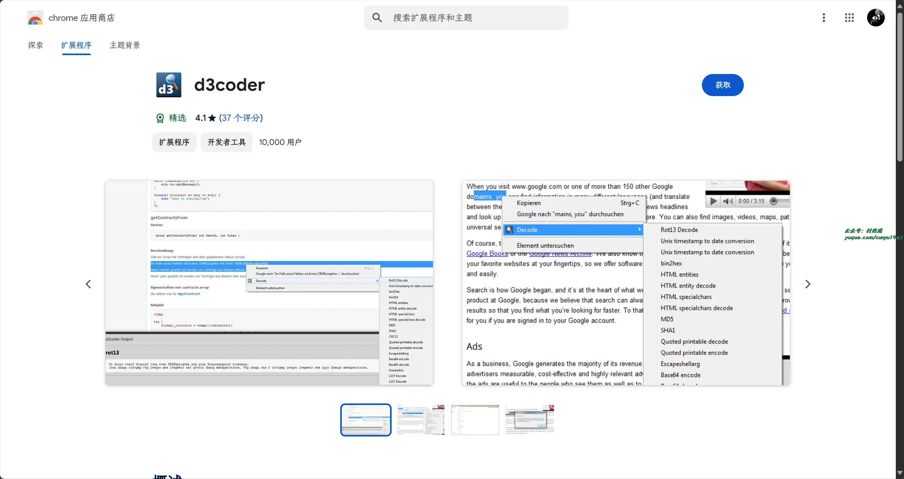

## 五、资料

### 1. [高并发的哲学](https://github.com/johnlui/PPHC)

文章从动静分离讲起，一步步深入 Apache、Nginx、epoll、虚拟机、k8s、异步非阻塞、协程、应用网关、L4/L7 负载均衡器、路由器 (网关)、交换机、LVS、软件定义网络 (SDN)、Keepalived、DPDK、ECMP、全冗余架构、用户态网卡、集中式存储、分布式存储、PCIe 5.0、全村的希望 CXL、InnoDB 三级索引、内存缓存、KV 数据库、列存储、内存数据库、Shared-Nothing、计算存储分离、Paxos、微服务架构、削峰、基于地理位置拆分、高可用等等等等。

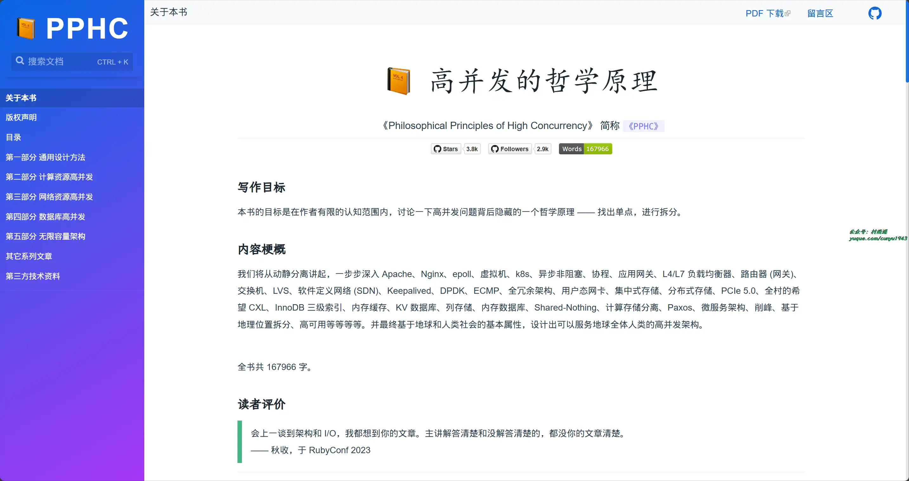

### 2. [前端内参](https://github.com/coffe1891/frontend-hard-mode-interview/)

关于 JavaScript、编程范式、设计模式、软件开发的艺术等大前端范畴内的知识分享，旨在帮助前端工程师们夯实技术基础以通过一线互联网企业技术面试。

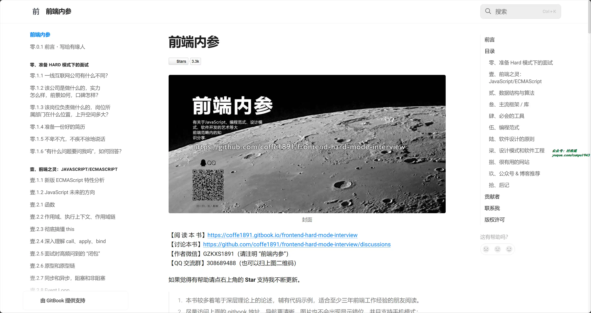

### 3. [IOT-Technical-Guide](https://github.com/IoT-Technology/IOT-Technical-Guide)

从零搭建高性能物联网平台及物联网解决方案和 Thingsboard 源码分析。

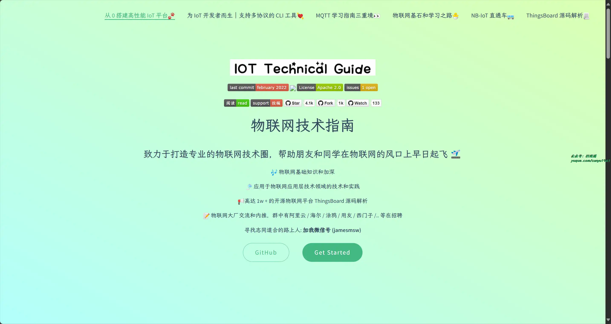

## ✍️ 说明

周刊专栏相关信息：

- **项目地址**：[Github](https://github.com/cunyu1943/weekly)，觉得不错麻烦给我一个**Star**，感谢 ❤️
- **浏览地址**：公众号 | [电子书](https://cunyu1943.github.io/weekly) | [语雀](https://yuque.com/cunyu1943/weekly)

如果你阅读到这里，说明我的工作没有白费。如果你想推荐项目/网站/软件/资源，欢迎提交 **[issue](https://github.com/cunyu1943/weekly/issues)** 或者添加我 **个人微信：coder_cunYu** 与我交流。

---

## ⏳ 联系

想解锁更多知识？不妨关注我的微信公众号：**村雨遥（id：JavaPark）**。

扫一扫，探索另一个全新的世界。

