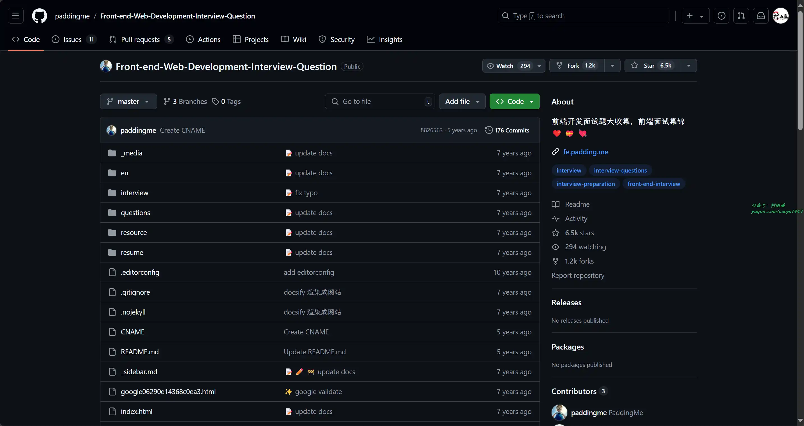

# 好物周刊#76：追番神器

> 作者：[村雨遥](https://github.com/cunyu1943)
> 
> 不要哀求，学会争取，若是如此，终有所获
> 
> 原文：https://mp.weixin.qq.com/s/5B4ErTsMZPsAhSBO6XdXDQ

## 号外

最近，公众号之外，建立了微信交流群，不定期会在群里分享各种资源（影视、IT 编程、考试提升……）&知识。如果有需要，可以**扫码或者后台添加小编微信备注入群**。进群后**优先看群公告**，**呼叫群中【资源分享小助手】**，还能免费帮找资源哦～

 

## 一、项目

### 1. [i 茅台](https://github.com/oddfar/campus-imaotai)

i 茅台 app 自动预约，每日自动预约，支持 docker 一键部署。

### 2. [酒店管理系统](https://github.com/FreeeBird/hotel)

基于 SpringBoot 开发的酒店管理系统。

### 3. [wangEditor](https://github.com/wangeditor-team/wangEditor)

开源 Web 富文本编辑器，开箱即用，配置简单，支持 JS、Vue、React。

## 二、软件

### 1. [Blossom](https://github.com/blossom-editor/blossom)

一个支持私有部署的云端双链笔记软件，你可以将你的笔记，图片，个人计划安排保存在自己的服务器中，并在任意设备之间实时同步。同时还是一个动态博客。支持 Windows，Mac，网页客户端，网页移动端。

### 2. [OpenScanner](https://github.com/pencilresearch/OpenScanner)

一款适用于 iPhone 的免费文档扫描工具，用 Swift 编写，完全免费，没广告且无内购。它可以扫描收据、合同、笔记等，支持自动识别文本、编辑扫描件、签名和导出 PDF 文件等功能。

### 3. [LenovoLegionToolkit](https://github.com/BartoszCichecki/LenovoLegionToolkit)

为联想拯救者系列笔记本打造的轻量化工具箱。可实现原来联想软件如 Lenovo Vantage、Legion Zone、联想电脑管家才可实现的功能，不过本软件仅适配拯救者系列。

## 三、网站

### 1. [橘子动漫](https://www.mgnacg.com/)

橘子动漫拥有高清晰画质的在线动漫，最新电影，观看完全免费、高速播放、更新及时在线，致力于为所有动漫迷们提供最好看的动漫。

### 2. [AnFuns](https://www.anfuns.org/)

站点提供1080P、720P、BDRIP 动漫资源收集整理，是一个专门提供海量的高质量高画质的在线动漫资源的网站门户。

### 3. [西野动漫](https://www.xiyedm.com/)

小而美的追番网站，一个提供最新最快的高清全集动漫下载及在线观看动漫资源、高速播放、更新及时的专业在线动漫网站。

## 四、插件

### 1. [JSON Formatter](https://chromewebstore.google.com/detail/json-formatter/bcjindcccaagfpapjjmafapmmgkkhgoa)

开源 JSON 格式化工具，支持黑暗模式，安装后在浏览器选项卡中加载 JSON 时将自动格式化 。

### 2. [SheetsGPT](https://chromewebstore.google.com/detail/sheetsgpt-ai-google-sheet/gniilafaobndflnfkjofaecaapicnhhg)

AI 赋能的表格处理工具，旨在改变我们与表格的交互方式。能够帮助我们分析梳理，在线共享管理，此外还具有以下特点：

-   自然语言处理：仅需输入你想要的结果，就会帮我们扩展完成其余工作，无需再为复杂公式语法而烦恼。
-   即时转换：处理速度极快，基本能实现实时转换。
-   准确高效：利用先进的算法，确保我们的只能能够被正确解析。

### 3. [Save Emails as PDF by cloudHQ](https://chromewebstore.google.com/detail/save-emails-as-pdf-by-clo/dngbhajancmfmdnmhhdknhooljkddgnk?hl=zh-CN)

该扩展支持将 Gmail 电子邮件导出、转换和保存为 PDF 文件，仅需简单的三步即可完成。

## 五、资料 

### 1. [前端笔试面试题](https://github.com/paddingme/Front-end-Web-Development-Interview-Question)

前端开发面试题大收集，收集了坐着做过的所有的前端面试笔试题，并根据自己的理解提供解答，以及一些关于前端找工作方面的经验等。

### 2. [前端面试题目清单](https://github.com/pwstrick/daily)

一份搜集的前端面试题目清单、面试相关以及各类学习的资料（不局限于前端）。经过作者梳理分类以及文字加工，力求做到覆盖面广、可读性高。题目不仅涉及到了目前流行的 HTML5、ES6、React、Webpack 等内容，还包括通用的网络和软技能。

### 3. [90DaysOfDevOps](https://github.com/MichaelCade/90DaysOfDevOps)

仓库最初是作者自己开源的一个公共学习项目，但现在已经成为社区中许多人的结构化学习路线。内容涵盖了 DevOps 的所有内容，包括远离、过程、工具和用例。

## ✍️ 说明

周刊专栏相关信息：

- **项目地址**：[Github](https://github.com/cunyu1943/weekly)，觉得不错麻烦给我一个**Star**，感谢 ❤️
- **浏览地址**：公众号 | [电子书](https://cunyu1943.github.io/weekly) | [语雀](https://yuque.com/cunyu1943/weekly)

如果你阅读到这里，说明我的工作没有白费。如果你想推荐项目/网站/软件/资源，欢迎提交 **[issue](https://github.com/cunyu1943/weekly/issues)** 或者添加我 **个人微信：coder_cunYu** 与我交流。

---

## ⏳ 联系

想解锁更多知识？不妨关注我的微信公众号：**村雨遥（id：JavaPark）**。

扫一扫，探索另一个全新的世界。

