# 好物周刊#79：码力全开

> 作者：[村雨遥](https://github.com/cunyu1943)
> 
> 不要哀求，学会争取，若是如此，终有所获
> 
> 原文：https://mp.weixin.qq.com/s/kYYmHfG7sBGs9-N_pzckIA

## 🎈 号外 

最近，公众号之外，建立了微信交流群，不定期会在群里分享各种资源（影视、IT 编程、考试提升……）&知识。如果有需要，可以**扫码或者后台添加小编微信备注入群**。进群后**优先看群公告**，**呼叫群中【资源分享小助手】**，还能免费帮找资源哦～

 

## 一、项目

### 1. [forum](https://github.com/cp3geek/forum)

大学校园交流论坛，前后端分离，采用 SpringBoot + Vue 开发。

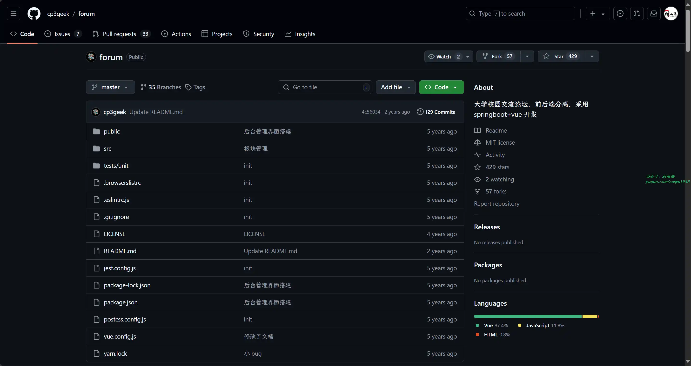

### 2. [Firefly](https://github.com/yangjianxin1/Firefly)

一站式大模型训练工具，一个开源的大模型训练项目，支持对主流的大模型进行预训练、指令微调和 DPO，包括但不限于 Qwen2、Yi-1.5、Llama3、Gemma、Qwen1.5、MiniCPM、Llama、InternLM、Baichuan、ChatGLM、Yi、Deepseek、Qwen、Orion、Ziya、Xverse、Mistral、Mixtral-8x7B、Zephyr、Vicuna、Bloom 等。支持全量参数训练、LoRA、QLoRA 高效训练，支持预训练、SFT、DPO。

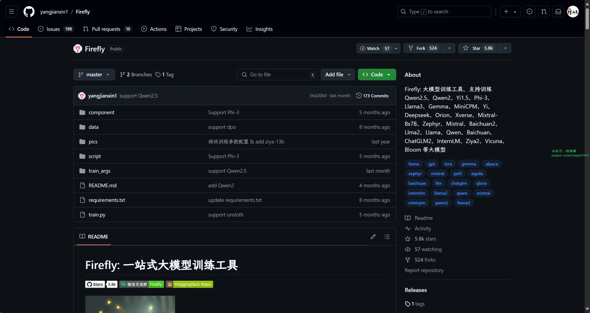

### 3. [MaxKB](https://github.com/1Panel-dev/MaxKB)

一款基于大语言模型和 RAG 的开源知识库问答系统，广泛应用于企业内部知识库、客户服务、学术研究与教育等场景。

## 二、软件

### 1. [1Remote](https://github.com/1Remote/1Remote)

一款现代化的个人远程会话管理员和启动器，使用它你可以管理从一个入口管理多种远程会话。

### 2. [EcoPaste](https://github.com/EcoPasteHub/EcoPaste)

开源免费的跨平台剪切板管理工具，适用于 Windows、MacOS 和 Linux。

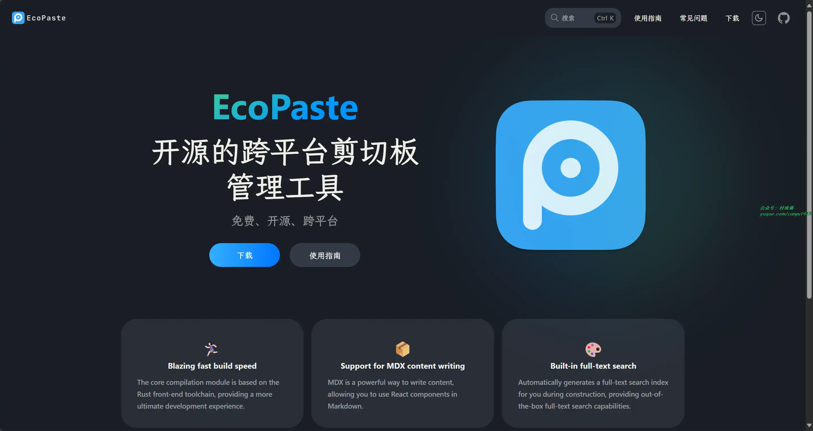

### 3. [卡巴斯基](https://www.kaspersky.com.cn/free-antivirus)

下载适用于 PC 、Android 和 iOS 的卡巴斯基安全云免费反病毒软件，并获得强大的保护，以防范病毒、勒索软件、间谍软件、网络钓鱼、木马和危险网站。畅享安全上网体验！

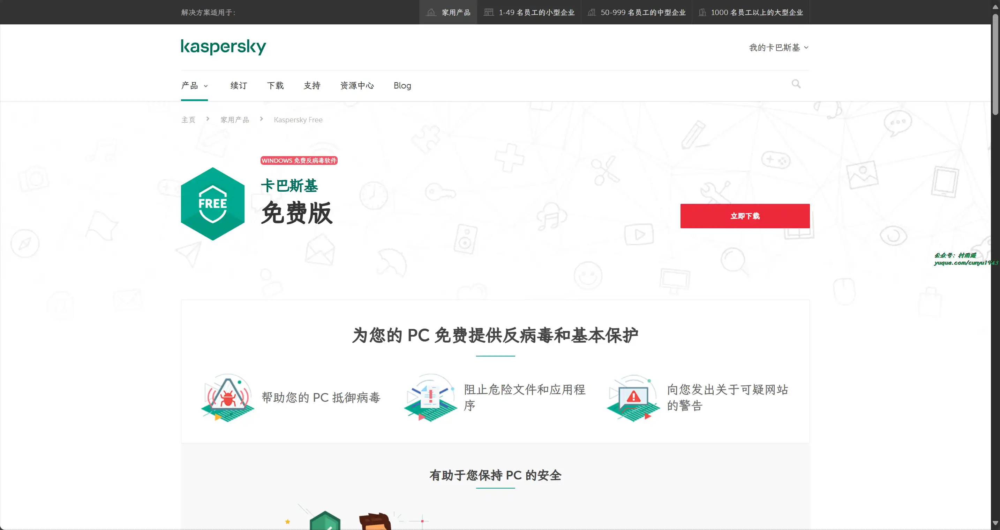

## 三、网站

### 1. [Spring 中文论坛](https://forum.springdoc.cn/)

由 Spring 爱好者共同创建维护的一个技术社区。在这里你可以自由地进行任何相关的探讨和分享。

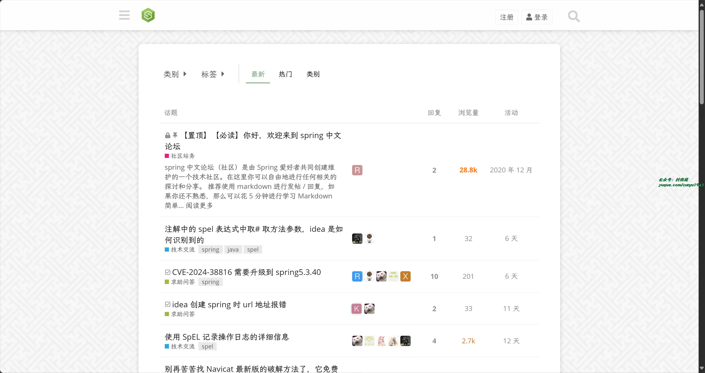

### 2. [码力全开](https://maliquankai.com/)

全职独立开发者的产品日常和设计分享。

### 3. [搜图导航](https://www.91sotu.com)

精选及整理国内外优秀的设计行业网站,并且提供一站式快速搜索图像服务支持全网正版图片搜索。拥有以图搜图、智能配色、字体生成、个性定制等功能。给你带来更好的搜图体验,并且收录了十几类设计相关网站包括高清图库、灵感创意、素材资源、教程文章、设计工具、绘画涂鸦、建模贴图、设计社区、字体下载、图标下载等网站。

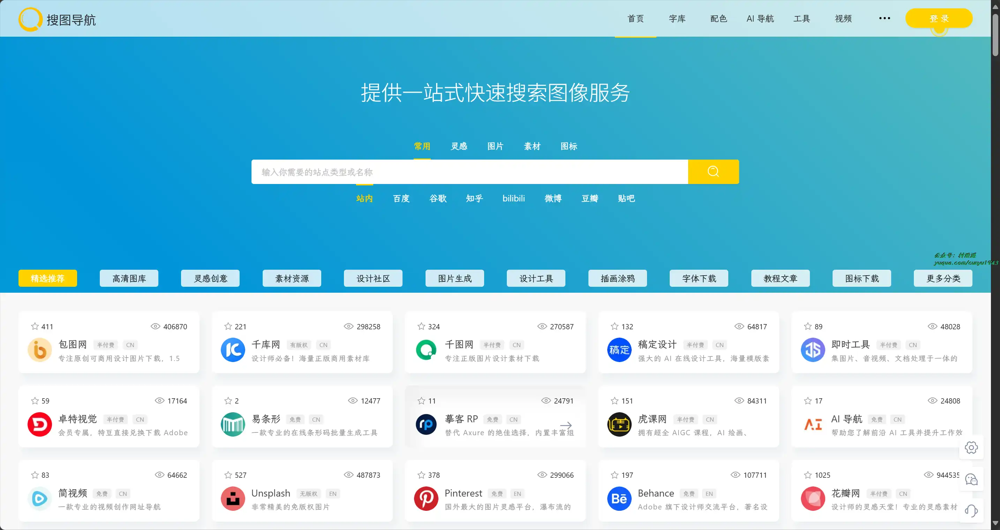

## 四、插件

### 1. [Page load time](https://chromewebstore.google.com/detail/page-load-time/fploionmjgeclbkemipmkogoaohcdbig?hl=zh-CN)

实时感知网站加载速度，既能开发人员快速了解网页的加载性能，找出可能影响加载速度的因素加以优化，也让客户能更好了解网页加载速度，让他们能自由选择速度更快的网站。

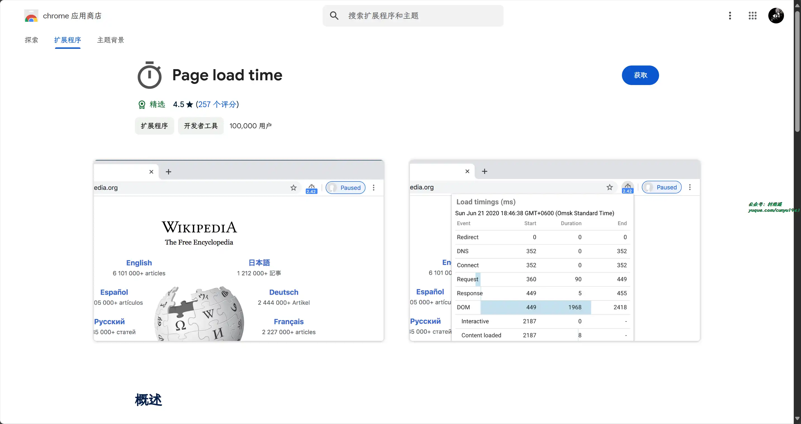

### 2. [Chrome 清理大师](https://chromewebstore.google.com/detail/chrome清理大师：一键清理浏览器垃圾，让你的c/eagiakjmjnblliacokhcalebgnhellfi)

一键清理您的浏览器缓存和垃圾，保护您的隐私，并使您的浏览器更快，更高效。

### 3. [Best Cookier](https://chromewebstore.google.com/detail/best-cookier/eijnnomioacbbnkffmhnbpbocoajcage)

 一款集颜值、操作、功能于一体的高质量 Cookie 管理器。

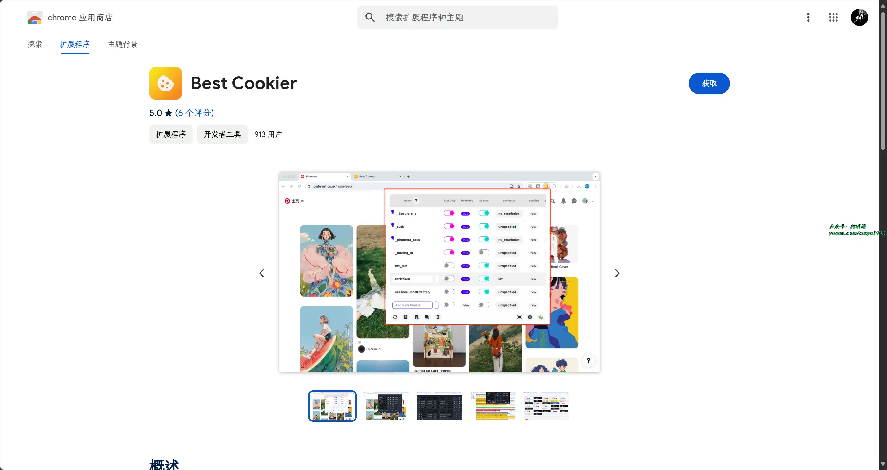

## 五、资料

### 1. [Cmake 中文实战教程](https://github.com/BrightXiaoHan/CMakeTutorial)

项目以代码讲用法，旨在帮助初学者学习 CMake 的基本用法，也会结合实际开发经验将最核心最常用的用法使用实际的代码案例进行讲解。

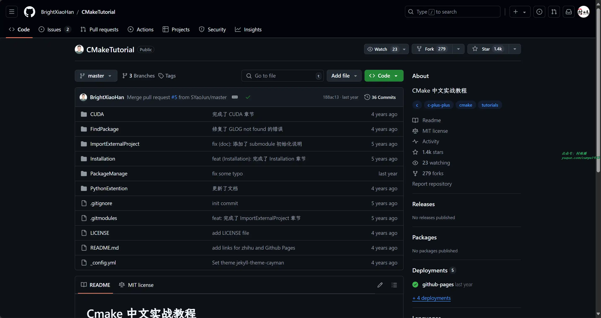

### 2. [Kubernetes 完全教程](https://github.com/jolestar/kubernetes-complete-course)

一个公开系列课程，共计包含 8 课（包含一节预备课），包含了 Kubernetes 的相关知识点。

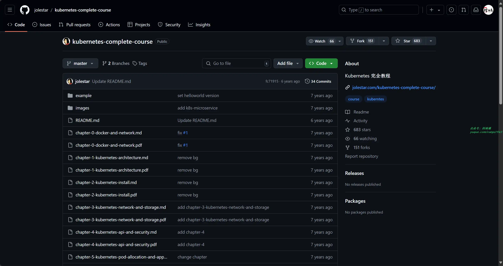

### 3. [Blog.Core](https://github.com/anjoy8/Blog.Core)

前后端分离之 ASP.NET Core 后端全家桶框架！前后端分离后端接口，Vue 教程姊妹篇。

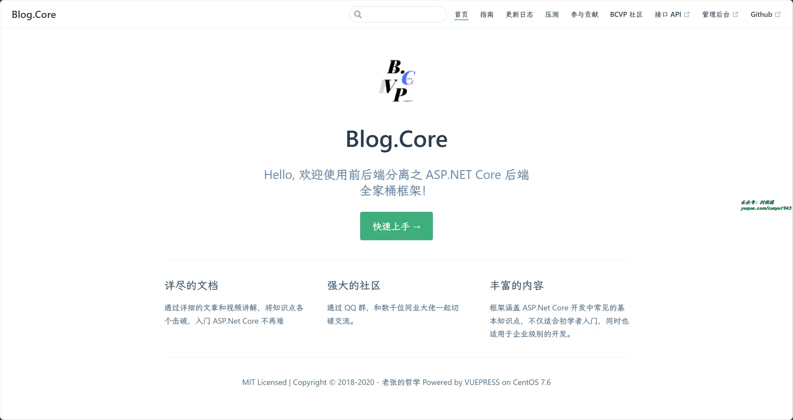

## ✍️ 说明

周刊专栏相关信息：

- **项目地址**：[Github](https://github.com/cunyu1943/weekly)，觉得不错麻烦给我一个**Star**，感谢 ❤️
- **浏览地址**：公众号 | [电子书](https://cunyu1943.github.io/weekly) | [语雀](https://yuque.com/cunyu1943/weekly)

如果你阅读到这里，说明我的工作没有白费。如果你想推荐项目/网站/软件/资源，欢迎提交 **[issue](https://github.com/cunyu1943/weekly/issues)** 或者添加我 **个人微信：coder_cunYu** 与我交流。

---

## ⏳ 联系

想解锁更多知识？不妨关注我的微信公众号：**村雨遥（id：JavaPark）**。

扫一扫，探索另一个全新的世界。

