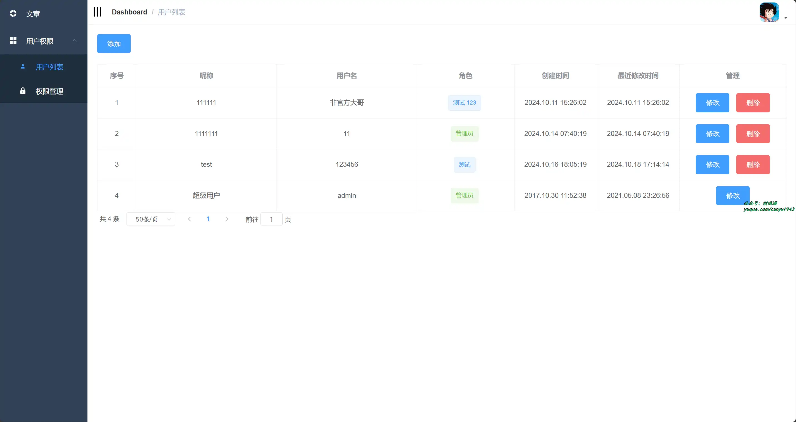
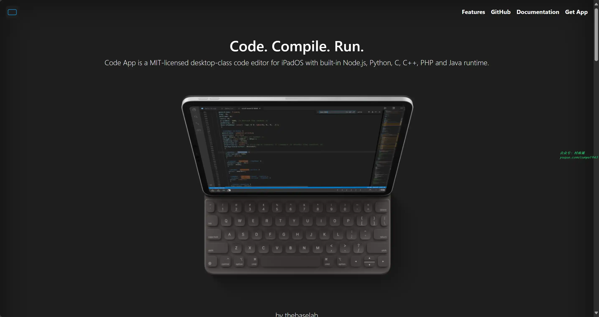
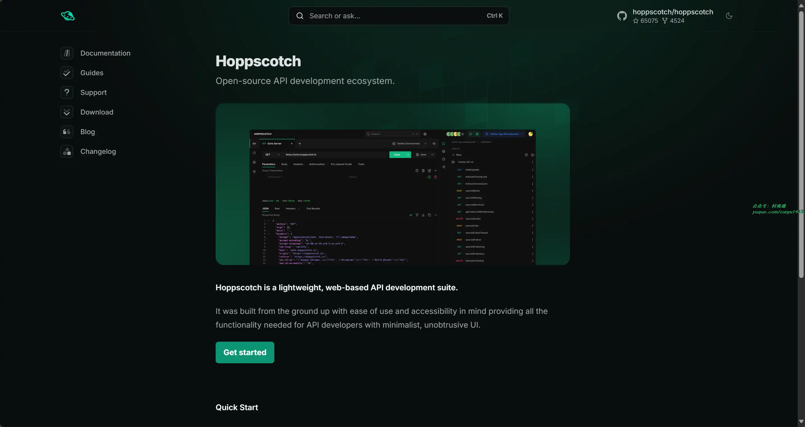
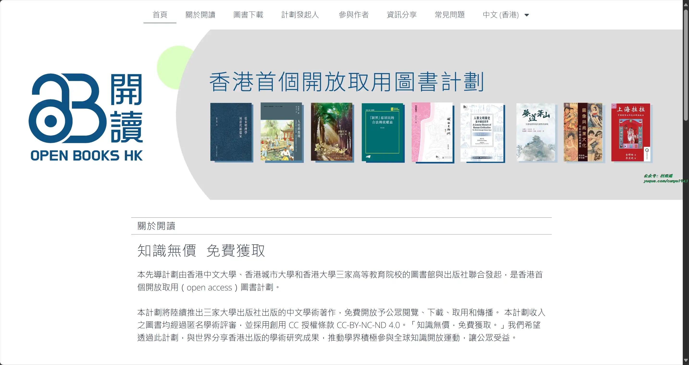
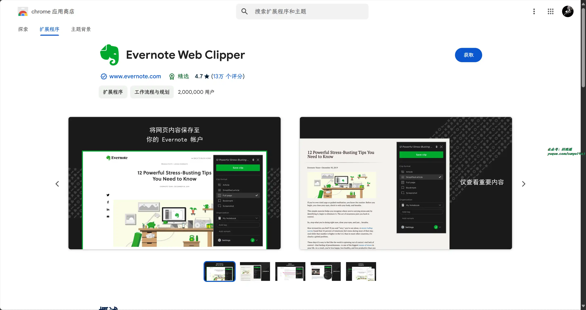
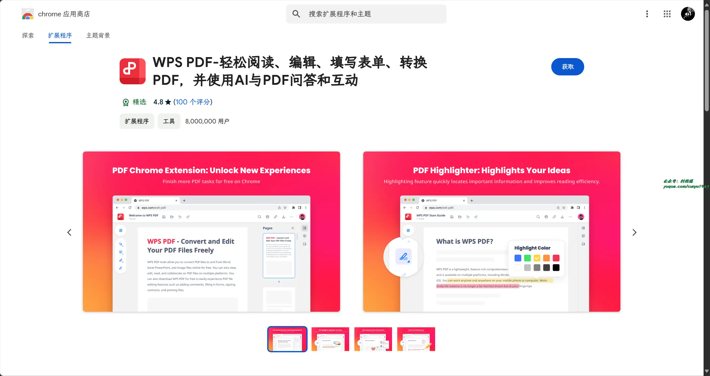
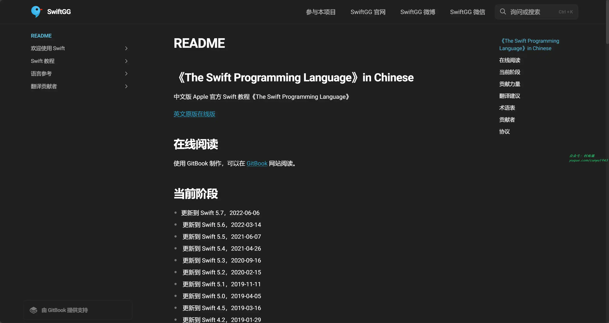
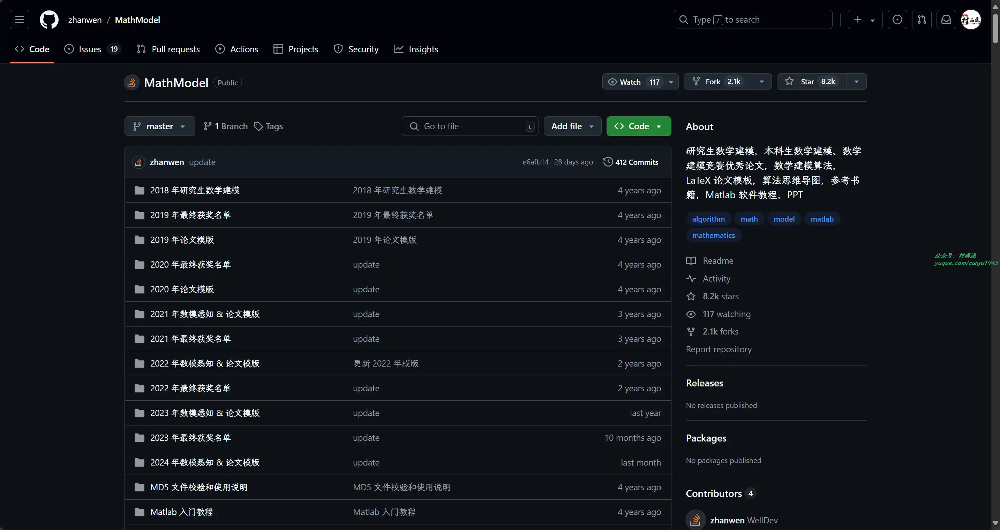

# 好物周刊#80：玩机手册

> 作者：[村雨遥](https://github.com/cunyu1943)
> 
> 不要哀求，学会争取，若是如此，终有所获
> 
> 原文：https://mp.weixin.qq.com/s/06l4esFcy44JAKMUmPX4Eg

## 🎈 号外 

最近，公众号之外，建立了微信交流群，不定期会在群里分享各种资源（影视、IT 编程、考试提升……）&知识。如果有需要，可以**扫码或者后台添加小编微信备注入群**。进群后**优先看群公告**，**呼叫群中【资源分享小助手】**，还能免费帮找资源哦～

 

## 一、项目

### 1. [莫提网盘](https://github.com/373675032/moti-cloud)

一个基于 SpringBoot 开发的标准 Java Web 项目。存储模式支持 FTP、阿里云 OSS 对象存储。项目选题新颖，完成度较高，前后端不分离的单体架构，非常适合刚刚接触学习 SpringBoot 的技术小白学习，也非常适合学校中的项目答辩或者毕业设计。

### 2. [Spring Boot-Shiro-Vue](https://github.com/Heeexy/SpringBoot-Shiro-Vue)

提供一套基于 Spring Boot-Shiro-Vue 的权限管理思路。前后端都加以控制，做到按钮 / 接口级别的权限。

### 3. [暹罗点餐](https://github.com/siam1026/siam-server)

一款 Java 餐饮点餐系统，适用于多门店的连锁品牌，对标蜜雪冰城、瑞幸咖啡。该系统包含用户端、商家端、配送端以及总管理后台，美食下单、外卖配送、连锁餐饮和扫码点餐等核心功能，同时提供积分商城、会员中心和邀请好友注册返现等增值服务，以拓展客源。基于 Spring Boot + MyBatis Plus + Vue & Element + uni-app 技术栈进行开发。

## 二、软件

### 1. [CodeApp](https://github.com/thebaselab/codeapp)

适用于 iPad 的代码编辑软件，具有以下特性：

- 多种语言支持
- 集成版本控制
- SSH 远程连接
- 强大的编辑功能

### 2. [Hoppscotch](https://github.com/hoppscotch/hoppscotch)

一款开源的 API 开发协作平台，它为开发者提供了便捷的方式来测试和开发 API，具有以下功能：

- API 测试
- 环境管理
- 团队协作
- 插件系统

### 3. [Krisp](https://krisp.ai/)

提供 AI 语音消噪功能，支持任何在线会议 App，记录、转录和总结会议和通话内容，增强沟通体验。

## 三、网站

### 1. [设计秀](https://shejishow.cn/)

设计秀工具箱，免费公益网站！探索最新的设计软件、资源，涵盖 Adobe 全家桶、Mac 和 Windows 平台。免费下载各种设计资源，包括 PS、PR 等专业工具、字体等、助你激发创意，畅享设计之旅！

### 2. [玩机手册](https://www.rjsos.com)

整合软件安装教程：Office、PS、PR、AE、C4D、Axure、CAD、3DMax 等常用办公、平面设计、室内设计软件等商业软件激活，提供 Windows 和 Mac 版本免费下载资源、安装使用教程分享。

### 3. [openbookshongkong](https://openbookshongkong.com/)

由香港中文大学、香港城市大学和香港大学三家高等教育院校的图书馆与出版社联合发起，是香港首个开放取用图书计划。后续将陆续推出三家大学出版社出版的中文学术著作，免费开放予公众阅览、下载、取用和传播。

## 四、插件

### 1. [Evernote Web Clipper](https://chromewebstore.google.com/detail/evernote-web-clipper/pioclpoplcdbaefihamjohnefbikjilc)

随时随地轻松管捕捉想法和灵感。将文章、网页和屏幕截图直接保存至 Evernote。

### 2. [WPS PDF](https://chromewebstore.google.com/detail/wps-pdf-轻松阅读、编辑、填写表单、转换pd/kdpelmjpfafjppnhbloffcjpeomlnpah)

便捷 PDF 工具，可在浏览器中对 PDF 文件进行查看、编辑、转换、填充、添加电子签名等。

### 3. [Ubersuggest](https://chromewebstore.google.com/detail/ubersuggest-seo与关键词神器/nmpgaoofmjlimabncmnmnopjabbflegf)

一款免费的 Chrome 扩展程序、强大的 SEO 工具，为您显示关键词每月搜索量、CPC 以及竞争对手数据。

## 五、资料

### 1. [The Swift Programming Language](https://github.com/SwiftGGTeam/the-swift-programming-language-in-chinese)

中文版 Apple 官方 Swift 教程《The Swift Programming Language》。

### 2. [learn_python3_spider](https://github.com/wistbean/learn_python3_spider)

Python 爬虫教程系列、从 0 到 1 学习 Python 爬虫，包括浏览器抓包，手机 APP 抓包，如 fiddler、mitmproxy，各种爬虫涉及的模块的使用，如：requests、beautifulSoup、selenium、appium、scrapy 等，以及 IP 代理，验证码识别，Mysql，MongoDB 数据库的 Python 使用，多线程多进程爬虫的使用，css 爬虫加密逆向破解，JS 爬虫逆向，分布式爬虫，爬虫项目实战实例等。

### 3. [数学建模资源](https://github.com/zhanwen/MathModel)

仓库收集了研究生数学建模，本科生数学建模、数学建模竞赛优秀论文，数学建模算法，LaTeX 论文模板，算法思维导图，参考书籍，Matlab 软件教程，PPT 等相关资料。

## ✍️ 说明

周刊专栏相关信息：

- **项目地址**：[Github](https://github.com/cunyu1943/weekly)，觉得不错麻烦给我一个**Star**，感谢 ❤️
- **浏览地址**：公众号 | [电子书](https://cunyu1943.github.io/weekly) | [语雀](https://yuque.com/cunyu1943/weekly)

如果你阅读到这里，说明我的工作没有白费。如果你想推荐项目/网站/软件/资源，欢迎提交 **[issue](https://github.com/cunyu1943/weekly/issues)** 或者添加我 **个人微信：coder_cunYu** 与我交流。

---

## ⏳ 联系

想解锁更多知识？不妨关注我的微信公众号：**村雨遥（id：JavaPark）**。

扫一扫，探索另一个全新的世界。

