# 好物周刊#81：力扣 101

> 作者：[村雨遥](https://github.com/cunyu1943)
> 
> 不要哀求，学会争取，若是如此，终有所获
> 
> 原文：https://mp.weixin.qq.com/s/RJf4mumjoj-w8P7VlFq0Sg

## 🎈 号外 

最近，公众号之外，建立了微信交流群，不定期会在群里分享各种资源（影视、IT 编程、考试提升……）&知识。如果有需要，可以**扫码或者后台添加小编微信备注入群**。进群后**优先看群公告**，**呼叫群中【资源分享小助手】**，还能免费帮找资源哦～

 

## 一、项目

### 1. [wechat-article-exporter](https://github.com/jooooock/wechat-article-exporter)

在线批量导出微信公众号文章，支持内嵌的音视频导出，无需搭建任何环境，可 100% 还原文章样式，支持私有部署。

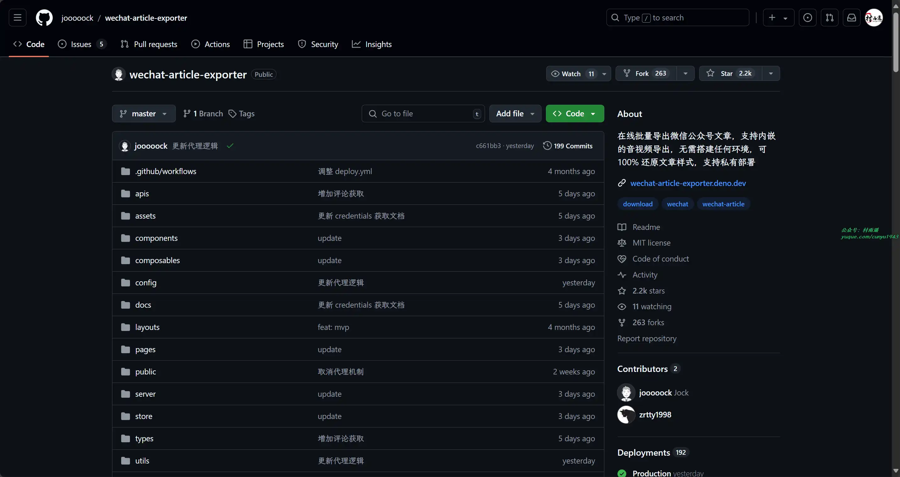

### 2. [SpringAll](https://github.com/wuyouzhuguli/SpringAll)

循序渐进，学习 Spring Boot、Spring Boot & Shiro、Spring Batch、Spring Cloud、Spring Cloud Alibaba、Spring Security & Spring Security OAuth2 等相关框架源码。

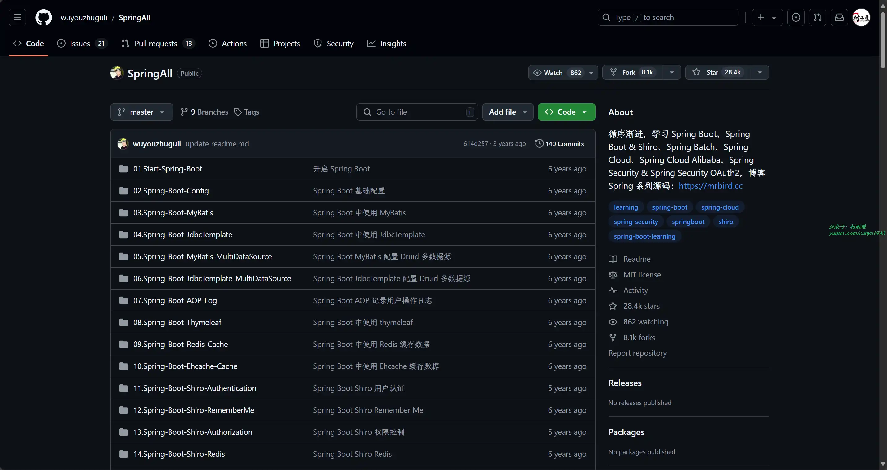

### 3. [二手书交易系统](https://github.com/DanielLin07/bookshop)

功能简单，使用 Spring + Spring MVC + Mybatis 搭建的二手书交易系统。

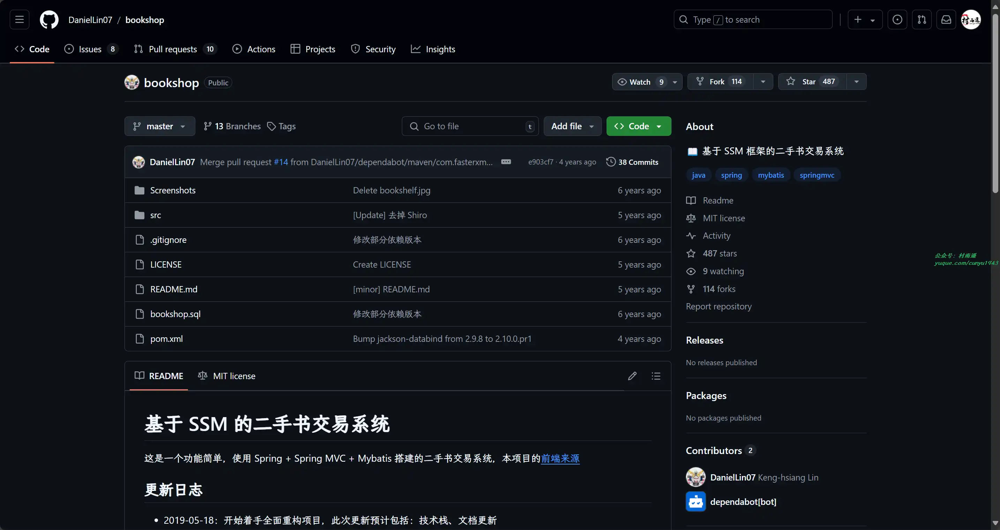

## 二、软件

### 1. [ToastFish](https://github.com/Uahh/ToastFish)

一个利用 Windows 通知栏背单词的软件，可以让你在上班、上课等恶劣环境下安全隐蔽地背单词，简直就是摸鱼神器。

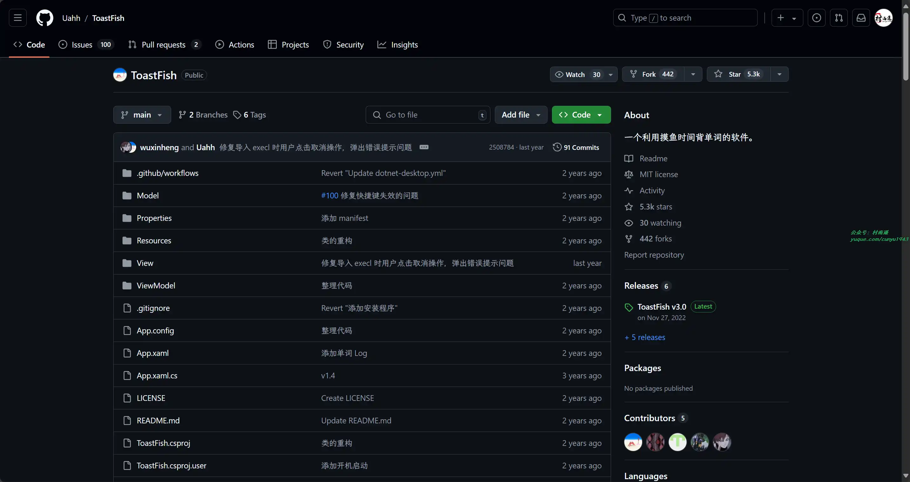

### 2. [LinkAndroid](https://github.com/modstart-lib/linkandroid)

一个全能手机连接助手，方便快捷的连接 Android 和电脑，连接手机后可投屏、GIF/MP4 录屏、截屏、文件管理、手机操作等功能。

### 3. [钱迹](https://qianjiapp.com/)

一个强大的个人记账软件。它主要为您提供：个人理财产品——钱迹相关的 IPhone、Android、鸿蒙客户端。让您随时随地记账，查账。同时可以帮您分析开销的走向和比例，通过预算功能还可以有效的减少乱花钱的习惯！

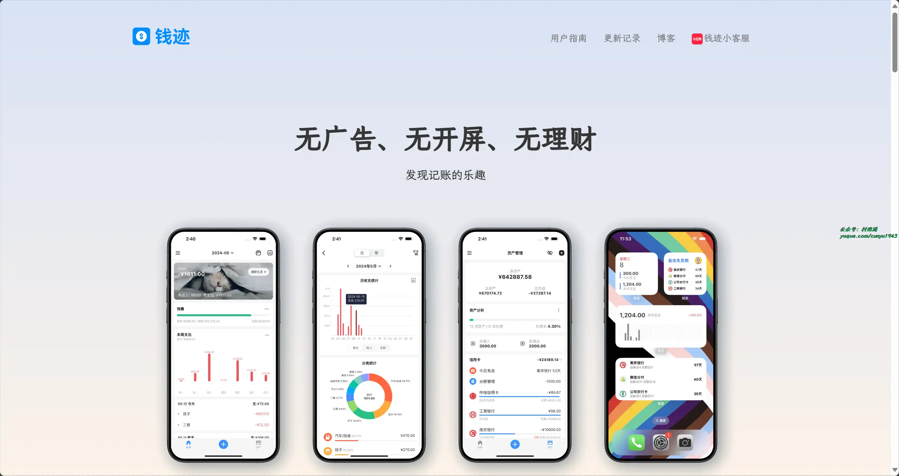

## 三、网站

### 1. [AI 工具集](https://ai-bot.cn)

收录了国内外数百多个不同类型的 AI 工具，而且每日更新。除此之外，还推荐了 AI 学习开发的常用网站、框架和模型，帮助你加入人工智能浪潮，自动化高效完成任务。

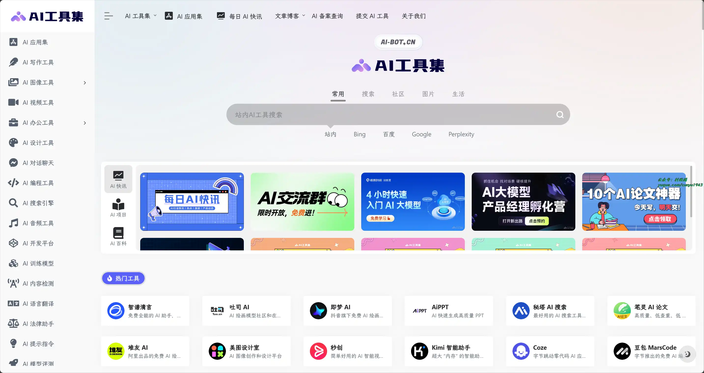

### 2. [TTSMaker](https://ttsmaker.cn)

一款免费的文本转语音工具，提供语音合成服务，支持多种语言，包括中文、英语、日语、韩语、法语、德语、西班牙语、阿拉伯语等 50 多种语言，以及超过 300 种语音风格。您可以用它制作视频配音，也可用于有声书朗读，或下载音频文件用于商业用途

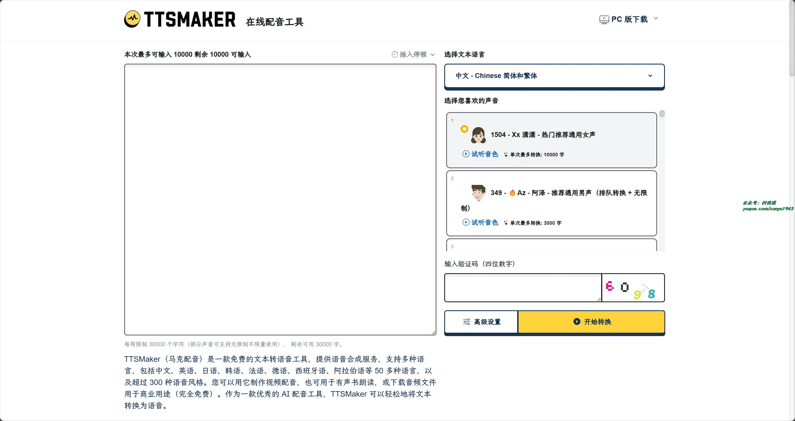

### 3. [阿里翻译](https://translate.alibaba.com)

由阿里巴巴提供的多语种在线实时翻译网站，支持多种领域、覆盖 200+ 语言的智能机器翻译服务。阿里翻译还支持文档翻译、图片翻译、视频翻译、语音翻译等多模态翻译能力。

## 四、插件

### 1. [B 站空降助手](https://chromewebstore.google.com/detail/b站空降助手/eaoelafamejbnggahofapllmfhlhajdd)

带你精准空降到赞助广告结束或者高能时刻，自动跳过视频中的赞助广告、订阅提醒等片段。你也可以亲自标记视频中的广告并上传，让其他人从您的贡献中受益。

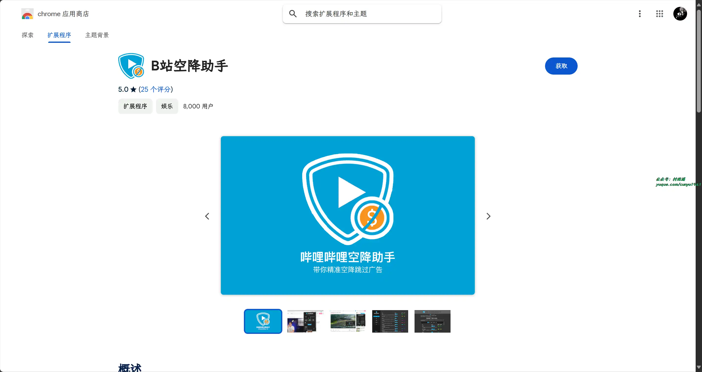

### 2. [Wikiwand](https://chromewebstore.google.com/detail/wikiwand-wikipedia-and-be/emffkefkbkpkgpdeeooapgaicgmcbolj)

基于 Wiki 已有的数据进行页面优化，相当于 Wiki 的增强主题，给用户带来更好的阅读体验。

### 3. [Get Favicon](https://chromewebstore.google.com/detail/get-favicon/gpipahagclehninhhjkhbkliinfofnhe)

一键获取网站的 favicon 信息，扩展显示当前网站的 favicon 以及 favicon的下载 URL 和尺寸大小。

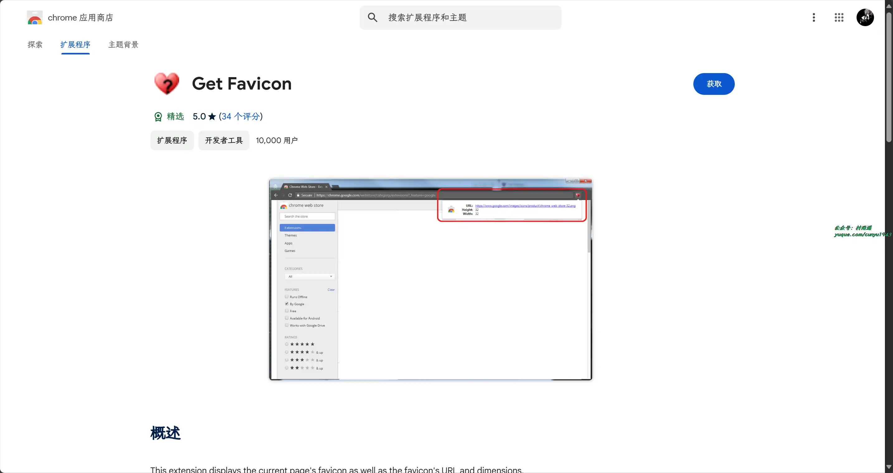

## 五、资料

### 1. [我的世界开发者中文指南](https://github.com/mouse0w0/MinecraftDeveloperGuide)

我的世界开发者中文指南，库里包含了开发相关教程、资料、文档、类库等各类资料。

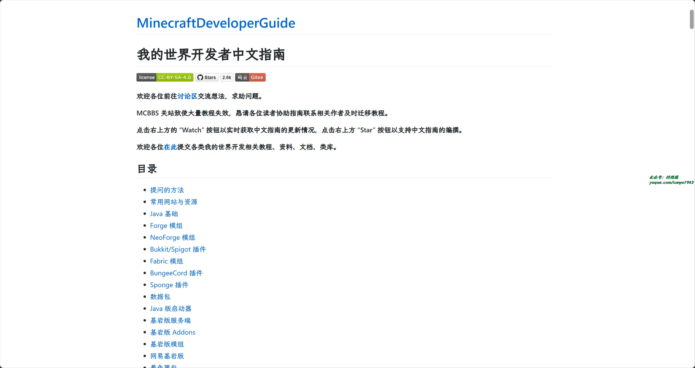

### 2. [prometheus-book](https://github.com/yunlzheng/prometheus-book)

Prometheus 操作指南，全书分为三卷，分别从基础、进阶、实战来带领你学习 Prometheus。

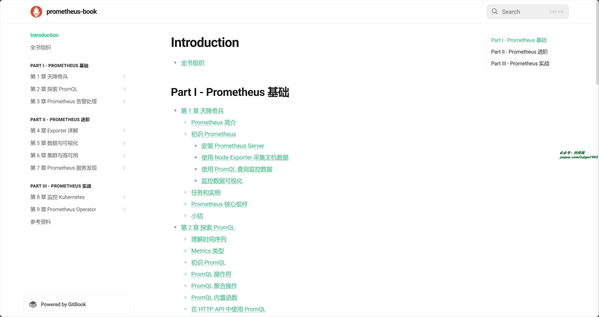

### 3. [LeetCode 101](https://github.com/changgyhub/leetcode_101)

LeetCode 刷题指南， 一个面向有一定的编程基础，但缺乏刷题经验的读者的教科书和工具书，提供 C++ 和 Python 双题解。

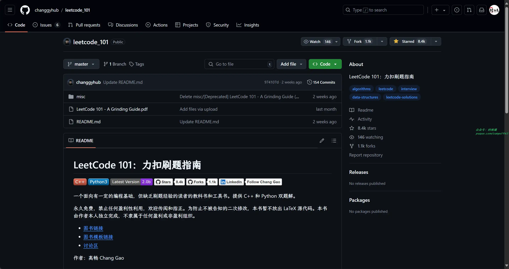

## ✍️ 说明

周刊专栏相关信息：

- **项目地址**：[Github](https://github.com/cunyu1943/weekly)，觉得不错麻烦给我一个**Star**，感谢 ❤️
- **浏览地址**：公众号 | [电子书](https://cunyu1943.github.io/weekly) | [语雀](https://yuque.com/cunyu1943/weekly)

如果你阅读到这里，说明我的工作没有白费。如果你想推荐项目/网站/软件/资源，欢迎提交 **[issue](https://github.com/cunyu1943/weekly/issues)** 或者添加我 **个人微信：coder_cunYu** 与我交流。

---

## ⏳ 联系

想解锁更多知识？不妨关注我的微信公众号：**村雨遥（id：JavaPark）**。

扫一扫，探索另一个全新的世界。

