# 好物周刊#82：远程游戏专家

> 作者：[村雨遥](https://github.com/cunyu1943)
> 
> 不要哀求，学会争取，若是如此，终有所获
> 
> 原文：https://mp.weixin.qq.com/s/chZThCfziIC9c8pL-o-lGw

## 🎈 号外 

最近，公众号之外，建立了微信交流群，不定期会在群里分享各种资源（影视、IT 编程、考试提升……）&知识。如果有需要，可以**扫码或者后台添加小编微信备注入群**。进群后**优先看群公告**，**呼叫群中【资源分享小助手】**，还能免费帮找资源哦～

 

## 一、项目

### 1. [办公自动化系统](https://github.com/BerserkerHercules/OfficeAutomatic-System)

基于 Spring Boot + Vue + Element UI 的办公自动化系统设计，主要功能有：

- 统一信息发布平台
- 统一文件管理平台
- 办公自动化

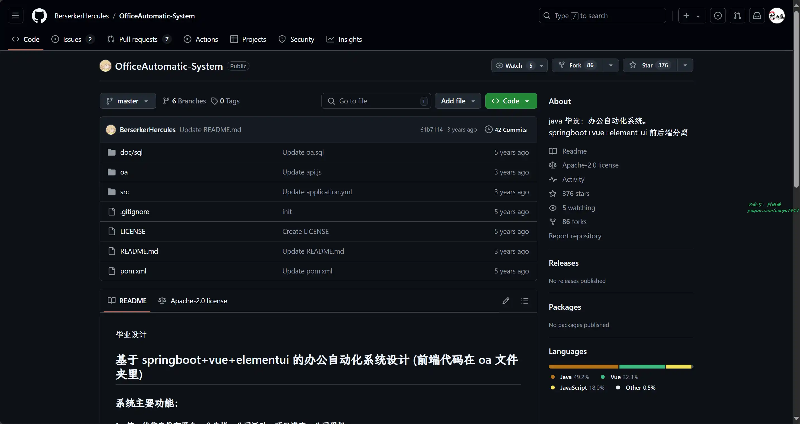

### 2. [BallCat](https://github.com/ballcat-projects/ballcat)

一个快速开发脚手架，快速搭建企业级后台管理系统，并提供多种便捷 starter 进行功能扩展。主要功能包括前后台用户分离，菜单权限，数据权限，定时任务，访问日志，操作日志，异常日志，统一异常处理，XSS 过滤，SQL 防注入，国际化等多种功能。

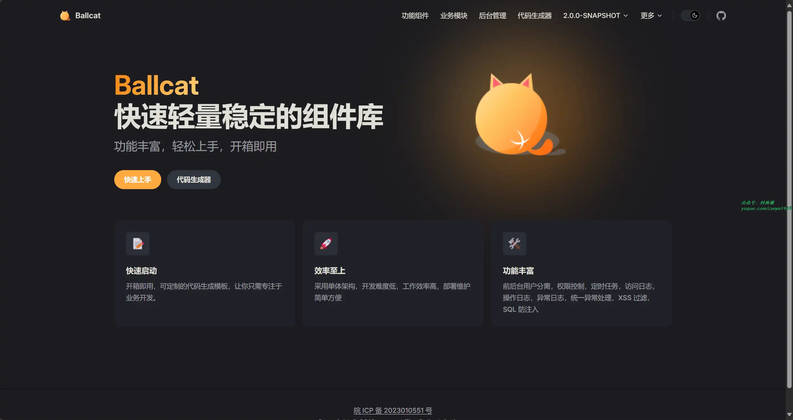

### 3. [SMS4J](https://gitee.com/dromara/SMS4J)

SMS4J 为短信聚合框架，帮您轻松集成多家短信服务，解决接入多个短信 SDK 的繁琐流程。 目前已接入数家常见的短信服务商，后续将会继续集成。

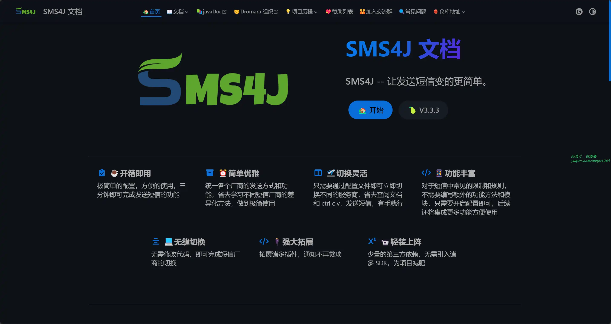

## 二、软件

### 1. [雨燕输入法](https://github.com/gurecn/YuyanIme)

一款基于 Rime 定制开发的九键、全拼、双拼、手写、火星文等方案、支持悬浮、单手、数字行等键盘模式的中文输入法。

### 2. [Mu Mu 模拟器](https://mumu.163.com/)

搭载行业领先的安卓 12 操作系统，兼容更多游戏及应用的同时，运行稳定流畅！完美运行热门手游如《明日方舟》、《梦幻西游》、《阴阳师》、《光遇》等，凭借最高 240 帧及电影级画质表现，在众多模拟器中脱颖而出。轻量化的产品界面速度更快、稳定性更高、资源占用低，玩游戏流畅不卡顿。多开、同步操作、操作录制、智能键鼠、录屏、虚拟定位等功能满足你不同的游戏需求，让你享受到电脑玩手游的快乐！

### 3. [GameViewer](https://gv.163.com/)

一款远程游戏工具，可通过手机随时随地快速连接电脑，也支持多端设备登录进行远程操控，为广大游戏玩家创造“与游戏跨空间、跨平台连接”的乐趣。当前已经支持远程操控 MuMu 模拟器，为用户提供高效、稳定的私有云手机服务，用 PC 的非凡性能畅玩手游。

## 三、网站

### 1. [在线生成身份证正反面](https://www.socarchina.com/m/sfz/index.php)

支持在线制作身份证正反面图片，用于我们日常的测试工作，免去反复 P 图的烦恼。

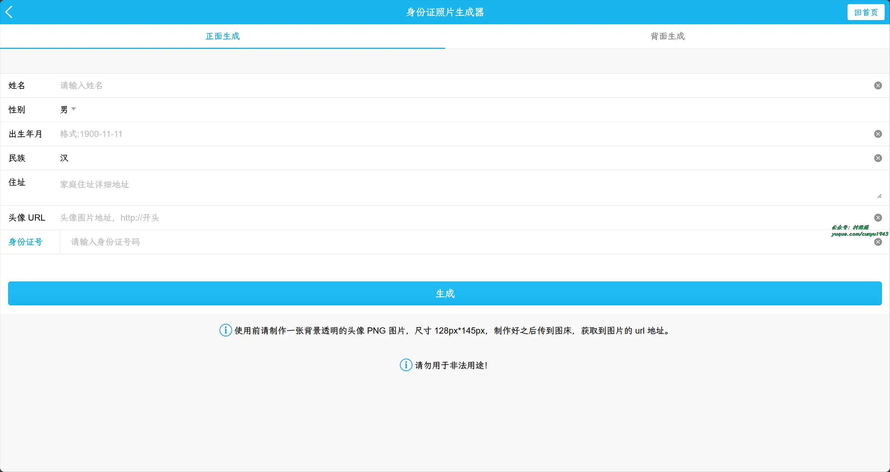

### 2. [Mini-Cover](https://github.com/JLinMr/Mini-Cover)

简洁的在线生成封面网站，专为博客、短视频、社交媒体等生成个性化封面。

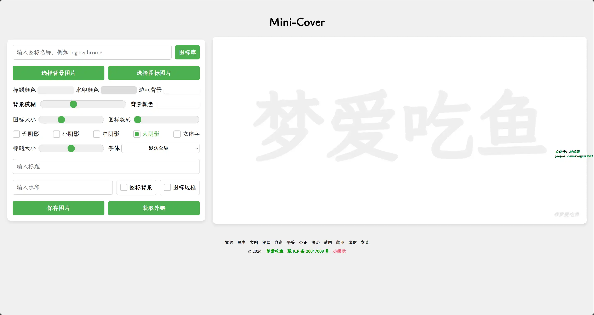

### 3. [Yesicon](https://yesicon.app)

汇聚来自全球顶尖设计团队的  240,517 枚高品质矢量图标。共有 185 组开源、免费的图标库。是开发者和设计师的 CV 好帮手。

## 四、插件

### 1. [AG 智能助手](https://chromewebstore.google.com/detail/ag智能助手-gpt聊天，绘图，vision，联网/cpggpmmbmacgemcffkapmeadpnfnmkbm)

由GPT-4 Turbo/GPT-4 O 等模型驱动的私人 AI 工作助手！支持 GPT 联网、PDF 分析、GPT-4 Vision、SD 绘图、dall·e3 绘图等多种功能为一体，是您最强大的 AI 工作助手！

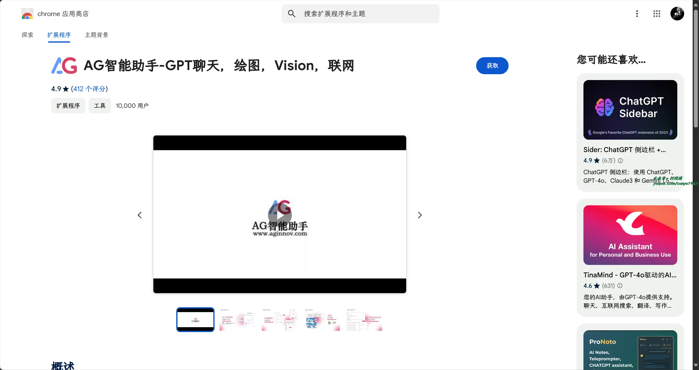

### 2. [URL Auto Redirector](https://chromewebstore.google.com/detail/url-auto-redirector/mckfcfnegaimgcgepikhdnajpkkhdnkn)

一个让你通过自定义跳转规则，跳过特定网页的工具。它支持完全匹配和正则表达式匹配。插件初始预设了一些规则作为演示，也可以根据自己的需要自行添加规则。

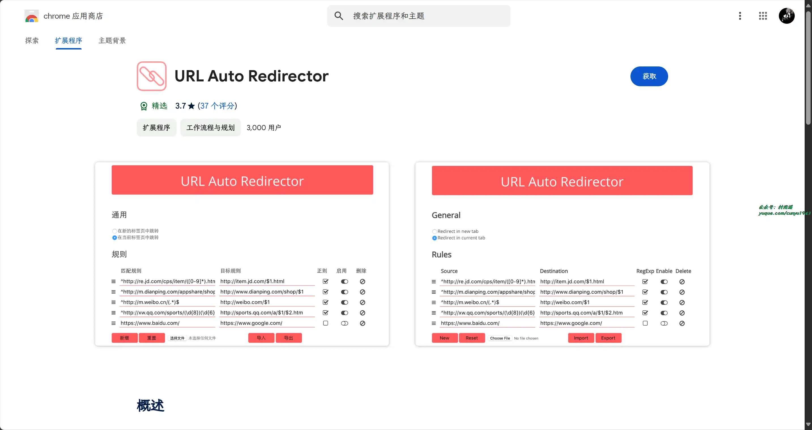

### 3. [Speech Translator](https://chromewebstore.google.com/detail/speech-translator/jodfjmaiakpnmeddgpeflpafebmlhppn)

插件使用由 Google 提供支持的语音识别技术，将来自任何来源的语音转换为文本，然后使用所选服务将文本从一种语言翻译成另一种语言。

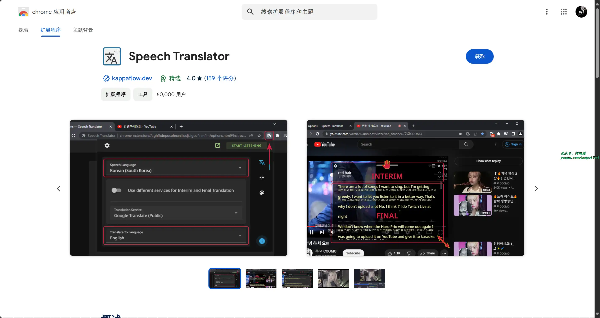

## 五、资料

### 1. [中国历朝代历史视频讲解](https://github.com/liujuntao123/chines-history-video)

汇聚了 B 站上综合数据（点赞，播放，投币，收藏）最高的一个 / 几个视频。

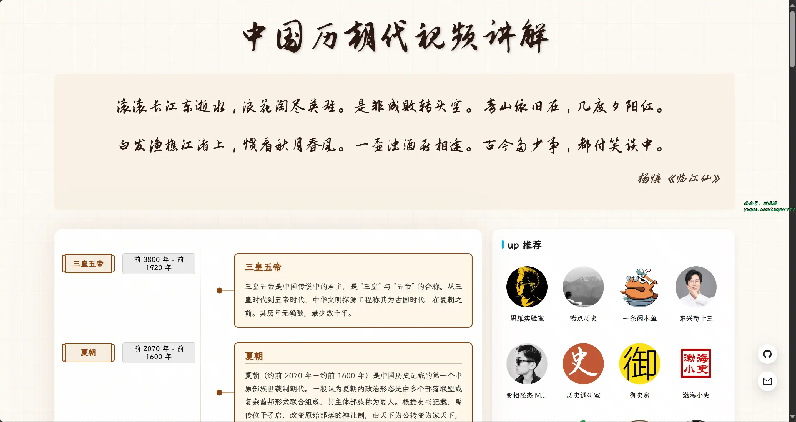

### 2. [系统设计面试：内幕指南](https://github.com/Admol/SystemDesign)

《System Design Interview: An Insider's Guide》的中文翻译版，书中介绍了如何设计不同目的的软件系统，可用于面试准备。

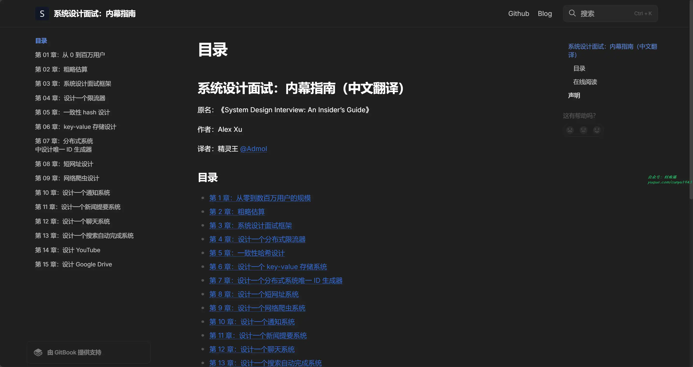

### 3. [软考中级教程](https://github.com/luckyzhz/Software-Designer)

一份“软件设计师”的学习路径，含有 APP、真题、课本、参考文档等内容。

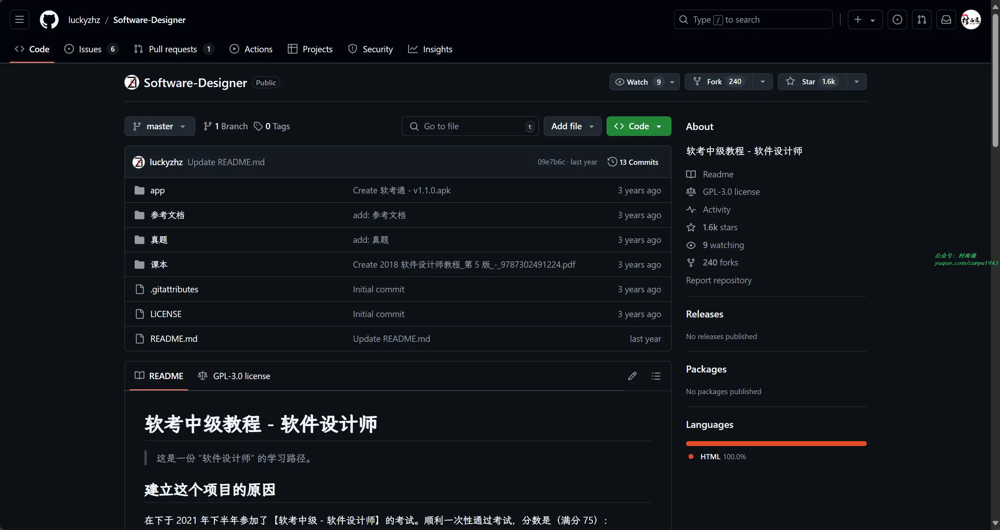

## ✍️ 说明

周刊专栏相关信息：

- **项目地址**：[Github](https://github.com/cunyu1943/weekly)，觉得不错麻烦给我一个**Star**，感谢 ❤️
- **浏览地址**：公众号 | [电子书](https://cunyu1943.github.io/weekly) | [语雀](https://yuque.com/cunyu1943/weekly)

如果你阅读到这里，说明我的工作没有白费。如果你想推荐项目/网站/软件/资源，欢迎提交 **[issue](https://github.com/cunyu1943/weekly/issues)** 或者添加我 **个人微信：coder_cunYu** 与我交流。

---

## ⏳ 联系

想解锁更多知识？不妨关注我的微信公众号：**村雨遥（id：JavaPark）**。

扫一扫，探索另一个全新的世界。

