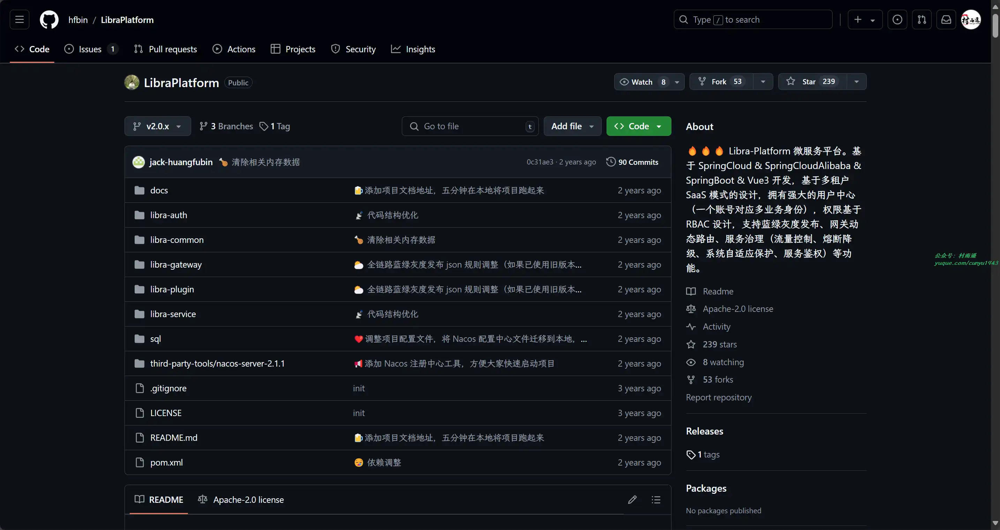

# 好物周刊#84：什么值得读

> 作者：[村雨遥](https://github.com/cunyu1943)
> 
> 不要哀求，学会争取，若是如此，终有所获
> 
> 原文：https://mp.weixin.qq.com/s/RPYo0xnrX1R-hndVS6Kjkw

## 号外

最近，公众号之外，建立了微信交流群，不定期会在群里分享各种资源（影视、IT 编程、考试提升……）&知识。如果有需要，可以**扫码或者后台添加小编微信备注入群**。进群后**优先看群公告**，**呼叫群中【资源分享小助手】**，还能免费帮找资源哦～

 

## 一、项目

### 1. [Sequoia 选股系统](https://github.com/sngyai/Sequoia)

A 股自动选股程序，实现了海龟交易法则、缠中说禅牛市买点，以及其他若干种技术形态。

### 2. [Seckill](https://github.com/hfbin/Seckill)

基于 SpringBoot + Mybatis + Redis + RabbitMQ 搭建的秒杀系统。

### 3. [LibraPlatform](https://github.com/hfbin/LibraPlatform)

基于 SpringCloud & SpringCloudAlibaba & SpringBoot & Vue3 开发，基于多租户 SaaS 模式的设计，拥有强大的用户中心（一个账号对应多业务身份），权限基于 RBAC 设计，支持蓝绿灰度发布、网关动态路由、服务治理（流量控制、熔断降级、系统自适应保护、服务鉴权）等功能。

## 二、软件

### 1. [4DDiG DLL Fixer](https://4ddig.tenorshare.com/dll-fixer.html)

一款专为修复 Windows 操作系统中丢失或损坏的 DLL（动态链接库）文件而设计的软件工具。DLL 文件是 Windows 系统和应用程序运行时的重要组件，损坏或丢失的 DLL 文件会导致系统错误、应用程序崩溃或某些功能无法正常使用。软件通过自动检测和修复这些问题，帮助用户恢复系统和应用程序的正常运行。

### 2. [Tai](https://github.com/Planshit/Tai)

在 Windows 上统计软件使用时长和网站浏览时长，帮助你了解自己把时间花在了什么地方，从而更好地做一些计划。或者，为了每周回顾自己的摸鱼成果。

### 3. [Reqable](https://reqable.com/)

新一代 API 开发工具，集代理调试 + 请求测试的一站式解决方案。有了它，就相当于同时拥有了 Fiddler + Charles + Postman。

## 三、网站

### 1. [简单设计](https://jiandan.link/)

一款专业强大的在线设计工具，图片处理工具，包含海报设计、封面图片设计、LOGO 设计、图片压缩、图片裁剪、图片格式转换等功能，是一款良心好用的设计神器。

### 2. [什么值得读](https://book.jiandan.link/)

专注于书单的好书推荐网站，内容包括书单、视频书、电子书下载导航、专栏好文。网站持续更新优质书单、读书笔记、读书心得、创业思考、资源网站等内容，包含名人推荐书单、知乎豆瓣高分好书、高分小说等。当你不知道读什么的时候，就来什么值得读吧，这里有高质量书籍推荐，也有超过 10万人的读书社群！在这里，你可以发现真正值得读的内容，找到你想读的那本书。

### 3. [希赛网](https://www.educity.cn)

集软件水平考试（软考）、PMP、通信工程师、一级建造师、二级建造师、经济师、金融、考研、考博英语等考试培训及企业内训辅导机构，提供软考（信息系统项目管理师、系统集成项目管理工程师、网络工程师等软考所有级别科目）、PMP、通信工程师、一建和二建、经济师等考试的报名时间及入口、成绩查询入口、历年真题库及答案、直播课堂、面授培训、出版辅导教材、视频教程和讲师答疑等于一体的在线职业教育服务平台。

## 四、插件

### 1. [GS Helper](https://chromewebstore.google.com/detail/gs-helper-谷歌搜索和谷歌学术助手/jknbccibkbeiakegoengboimefmadcpn)

专为科研人员、学术组织、高校学生提供科学研究、学术查询，进行论文、文献、期刊等资料查询、研究学习的一款免费工具。

### 2. [酷学术](https://chromewebstore.google.com/detail/酷学术/angphjdghkpkjdbljdfabiphhkolenbn)

智能在线辅助工具是专业的自主学习和学术研究辅助工具，该工具可以实现智能化的文献检索、即时翻译服务以及高效的引用管理功能适用于多种学习和研究应用场景。

### 3. [CCFrank](https://chromewebstore.google.com/detail/ccfrank/pfcajmbenomfbjnbjhgbnbdjmiklnkie)

会添加一个网页标记，以便用户可以从 dblp、Google 学术、Connected Papers、Semantic Scholar 和 Web of Science 轻松查询学术文章的类别，在结果中显示中国计算机学会推荐的会议和期刊排名。

## 五、资料

### 1. [AI 绘画最全资料合集](https://github.com/hua1995116/awesome-ai-painting)

AI 绘画资料合集（包含国内外可使用平台、使用教程、参数教程、部署教程、业界新闻等等）。

### 2. [简单粗暴 TensorFlow 2](https://tf.wiki/zh_hans/)

一本简明的 TensorFlow 2 入门指导手册，基于 Keras 和即时执行模式（Eager Execution），力图让具备一定机器学习及 Python 基础的开发者们快速上手 TensorFlow 2。

### 3. [程序员快看](https://cxykk.com/)

程序员编程资料站，网站涵盖了 Java 核心、J2EE 框架、ORM 框架、前端框架、安全框架、API 网关、消息队列、作业调度、注册中心、配置中心、链路追踪、服务保障、搜索引擎、容器服务、开发工具、监控工具、设计模式、架构设计、工作流框架、服务器框架、大数据框架、分布式事务、缓存 - 数据库、数据库连接池、数据库中间件、XML 语言等教程。

## ✍️ 说明

周刊专栏相关信息：

- **项目地址**：[Github](https://github.com/cunyu1943/weekly)，觉得不错麻烦给我一个**Star**，感谢 ❤️
- **浏览地址**：公众号 | [电子书](https://cunyu1943.github.io/weekly) | [语雀](https://yuque.com/cunyu1943/weekly)

如果你阅读到这里，说明我的工作没有白费。如果你想推荐项目/网站/软件/资源，欢迎提交 **[issue](https://github.com/cunyu1943/weekly/issues)** 或者添加我 **个人微信：coder_cunYu** 与我交流。

---

## ⏳ 联系

想解锁更多知识？不妨关注我的微信公众号：**村雨遥（id：JavaPark）**。

扫一扫，探索另一个全新的世界。

