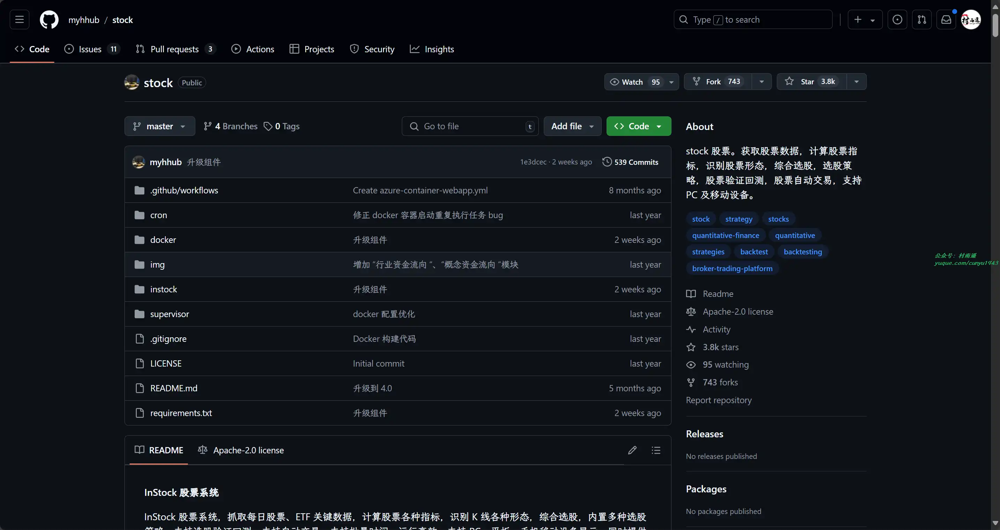
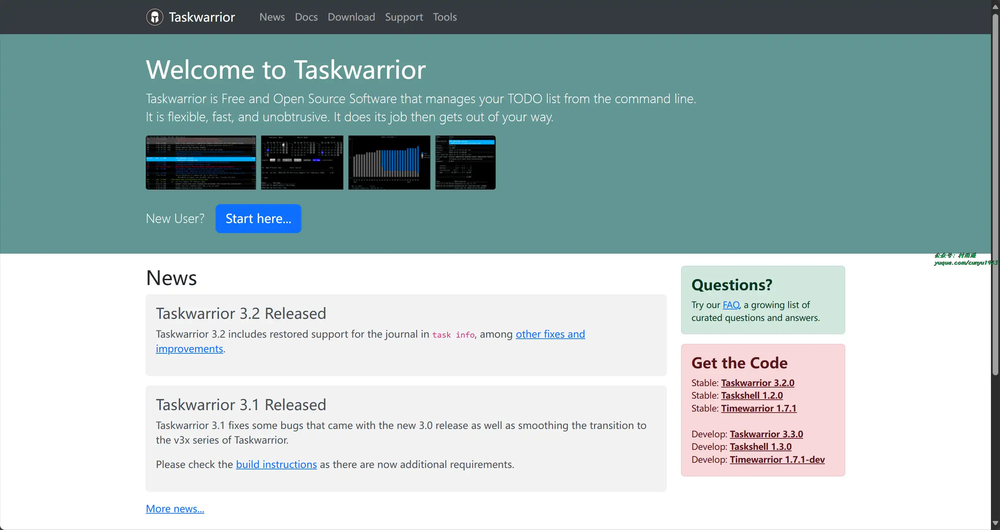
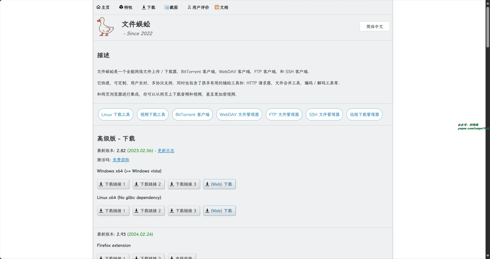
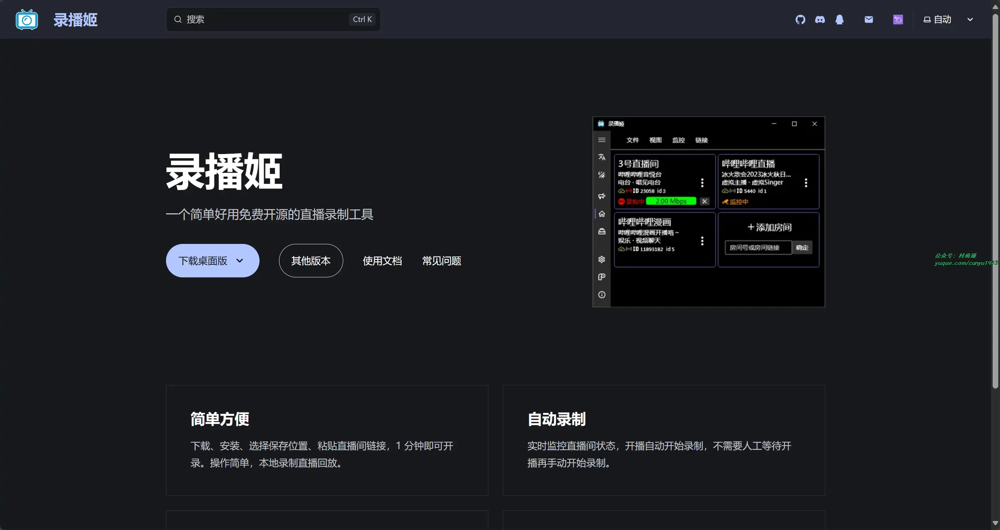
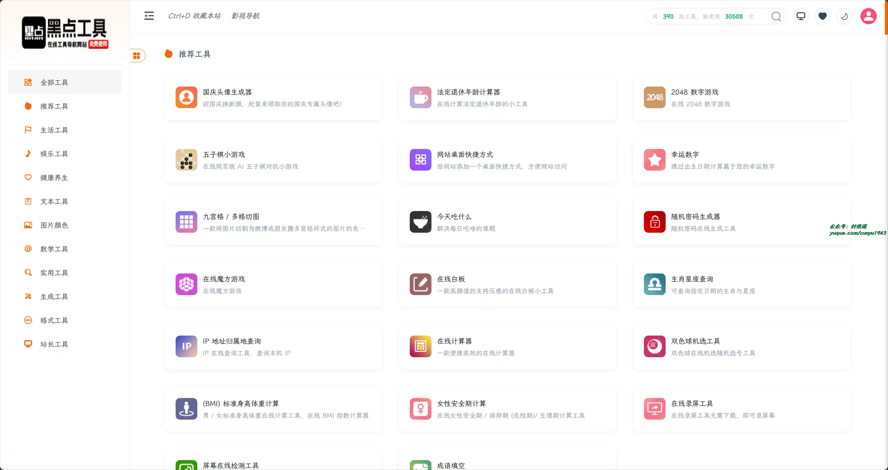
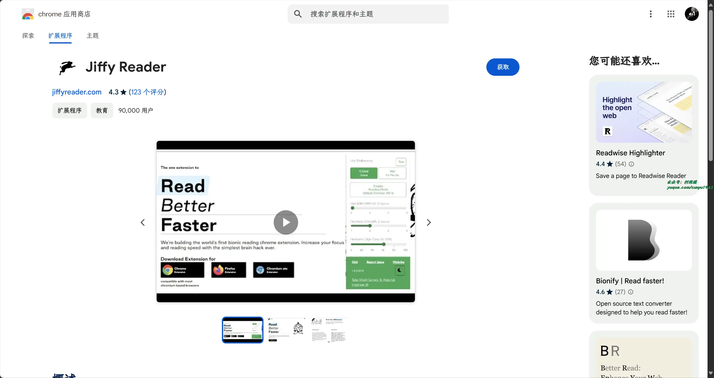
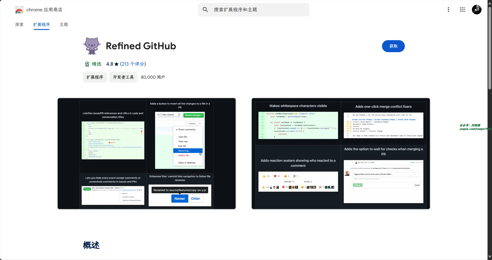
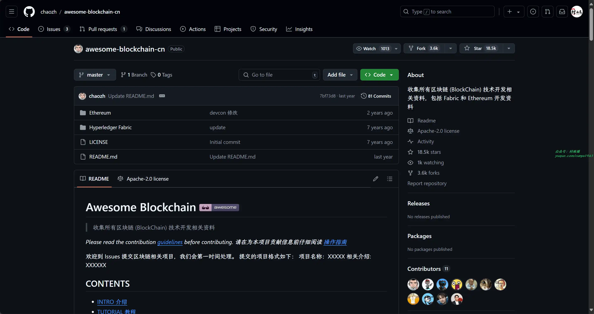
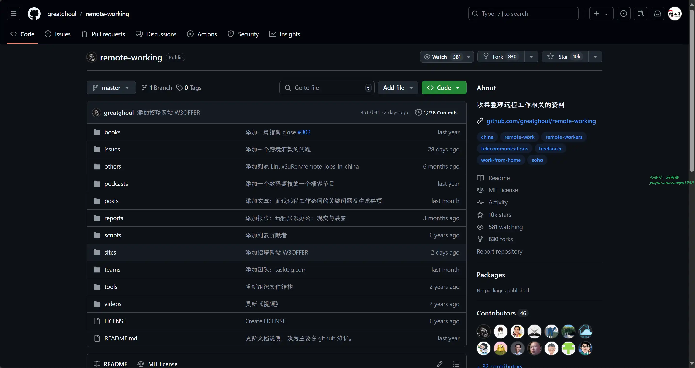
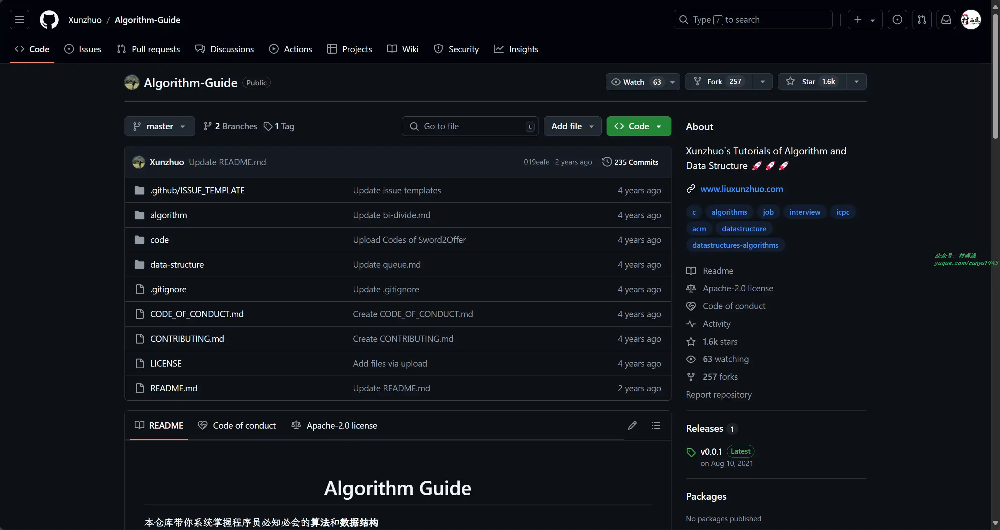

# 好物周刊#85：文件蜈蚣

> 作者：[村雨遥](https://github.com/cunyu1943)
> 
> 不要哀求，学会争取，若是如此，终有所获
> 
> 原文：https://mp.weixin.qq.com/s/kD2xcVoaYPmwa_ppuYiR_A

## 🎈 号外 

最近，公众号之外，建立了微信交流群，不定期会在群里分享各种资源（影视、IT 编程、考试提升……）&知识。如果有需要，可以**扫码或者后台添加小编微信备注入群**。进群后**优先看群公告**，**呼叫群中【资源分享小助手】**，还能免费帮找资源哦～

 

## 一、项目

### 1. [InStock 股票系统](https://github.com/myhhub/stock)

抓取每日股票、ETF 关键数据，计算股票各种指标，识别 K 线各种形态，综合选股，内置多种选股策略，支持选股验证回测，支持自动交易，支持批量时间，运行高效，支持 PC、平板、手机移动设备显示，同时提供 Docker 镜像方便安装，是量化投资的好帮手。

### 2. [ApiHug](https://apihug.com/)

API 设计 & 开发 新范式，一体化 分发、 监控、 管理 您的 API 资产。具有以下特点：

- 统一设计，实现，测试，管理，发布 API
- DSL 模块化设计
- 可视化设计
- 工具链集成
- 代码生成

### 3. [XIAOJUSURVEY](https://github.com/didi/xiaoju-survey)

一套轻量、安全的调研系统，提供面向个人和企业的一站式产品级解决方案，用于构建各类问卷、考试、测评和复杂表单，快速满足各类线上调研场景。

## 二、软件

### 1. [Taskwarrior](https://github.com/GothenburgBitFactory/taskwarrior)

一款开源跨平台的时间和任务管理工具，用于跟踪和处理任务。

### 2. [文件蜈蚣](https://www.filecxx.com/)

一个全能网络文件上传 / 下载器，BitTorrent 客户端，WebDAV 客户端，FTP 客户端，和 SSH 客户端。

它快速，可定制，用户友好，多协议支持，同时也包含了很多有用的辅助工具如: HTTP 请求器，文件合并工具，编码 / 解码工具等。

和网页浏览器进行集成，你可以从网页上下载音频和视频，甚至是加密视频。

### 3. [录播姬](https://github.com/BililiveRecorder/BililiveRecorder)

一个简单好用免费开源的直播录制工具，支持如下功能：

- 主播开播后自动开始录制
- 同时录制多个直播间
- 自动修复 mikufans 直播服务器导致的各种问题
- 工具箱模式，用于修复旧版录播姬或其他软件录的视频文件
- 纯 C# 实现，无 ffmpeg 等 native 依赖 

## 三、网站

### 1. [海外兔](https://osjobs.net)

海内外工作的经验交流，信息分享。主要包含求职课程、高频面试题、求职指南、经验采访、系统设计课程、失信学员名单等模块内容。

### 2. [今日热榜](https://rebang.today/)

今日热榜汇聚全网热搜：知乎热榜、微博热搜、百度热搜、IT之家、36氪、少数派、豆瓣、小红书、百度贴吧、虎扑、虎嗅、天涯、哔哩哔哩、小众软件、抖音、吾爱破解、GitHub 等各大站点的头条，实属效率神器。

### 3. [黑点工具](https://hddtool.com/)

在线工具导航网站，免费使用无需注册，快速使用无门槛。提供多达 387 款在线工具，无论你是自媒体、设计师、运营人员还是学生，都能满足你在不同场景下的需求。

## 四、插件

### 1. [Jiffy Reader](https://chromewebstore.google.com/detail/jiffy-reader/lljedihjnnjjefafchaljkhbpfhfkdic)

插件通过对单词的首字母部分进行加粗，从而提高阅读效率，实现更轻松、快速地浏览英文网站、文章等内容。

### 2. [Material You NewTab](https://chromewebstore.google.com/detail/material-you-newtab/glloabhodjfmeoccmdngmhkpmdlakfbn)

一款受 Google 的 Material 设计语言启发的新标签页浏览器插件，注重简约和实用，拒绝花里胡哨。为用户提供了一个清新美观的浏览器新标签页，支持多种主题和实用工具。

### 3. [Refined GitHub](https://chromewebstore.google.com/detail/refined-github/hlepfoohegkhhmjieoechaddaejaokhf)

一个简化 GitHub 界面，并添加了移除页面多余元素、空白字符可见、一键合并修复冲突和放弃 PR 中某个文件的所有修改等实用功能的插件，进一步提升了 GitHub 的使用体验。

## 五、资料

### 1. [Awesome Blockchain](https://github.com/chaozh/awesome-blockchain-cn)

收集所有区块链 (BlockChain) 技术开发相关资料，包括 Fabric 和 Ethereum 开发资料的一个资源开源库。

### 2. [remote-working](https://github.com/greatghoul/remote-working)

收集整理远程工作相关的资料，用于整理中国国内的资源或者对国内受众友好的国外资源。

### 3. [Algorithm Guide](https://github.com/Xunzhuo/Algorithm-Guide)

仓库带你系统掌握程序员必知必会的算法和数据结构，主要分为两部分内容：

- 算法和数据结构的教程
- 算法和数据结构的资料

## ✍️ 说明

周刊专栏相关信息：

- **项目地址**：[Github](https://github.com/cunyu1943/weekly)，觉得不错麻烦给我一个**Star**，感谢 ❤️
- **浏览地址**：公众号 | [电子书](https://cunyu1943.github.io/weekly) | [语雀](https://yuque.com/cunyu1943/weekly)

如果你阅读到这里，说明我的工作没有白费。如果你想推荐项目/网站/软件/资源，欢迎提交 **[issue](https://github.com/cunyu1943/weekly/issues)** 或者添加我 **个人微信：coder_cunYu** 与我交流。

---

## ⏳ 联系

想解锁更多知识？不妨关注我的微信公众号：**村雨遥（id：JavaPark）**。

扫一扫，探索另一个全新的世界。

