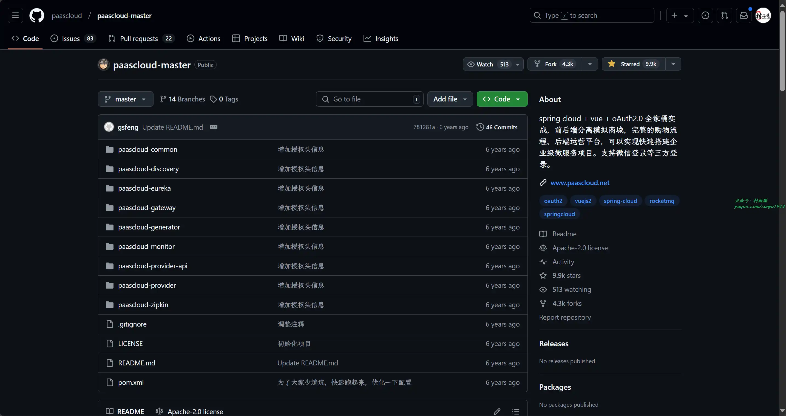
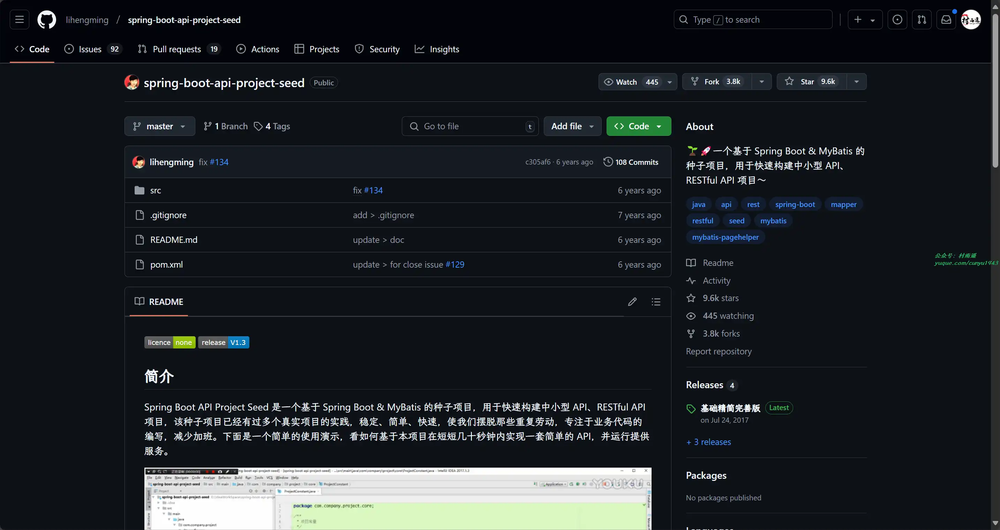
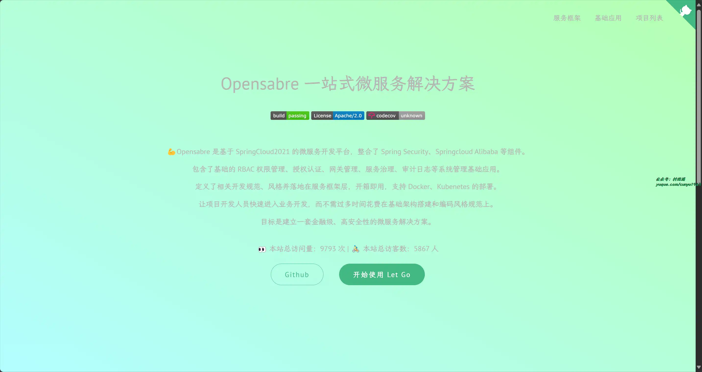
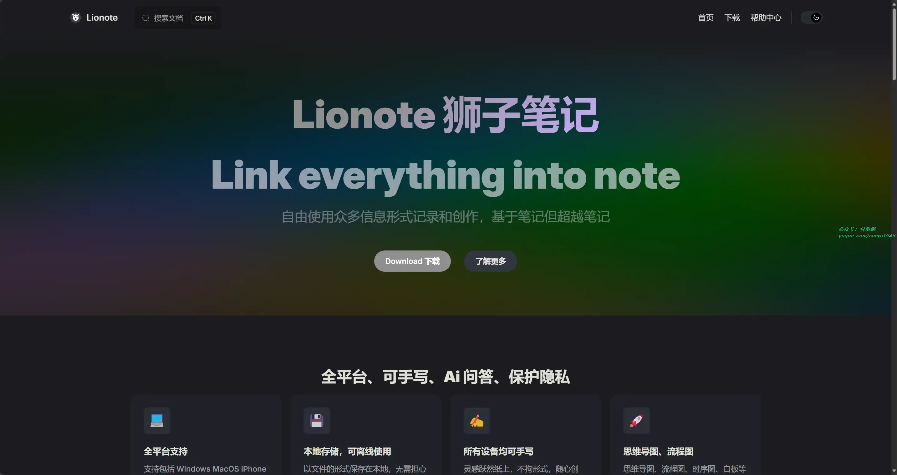
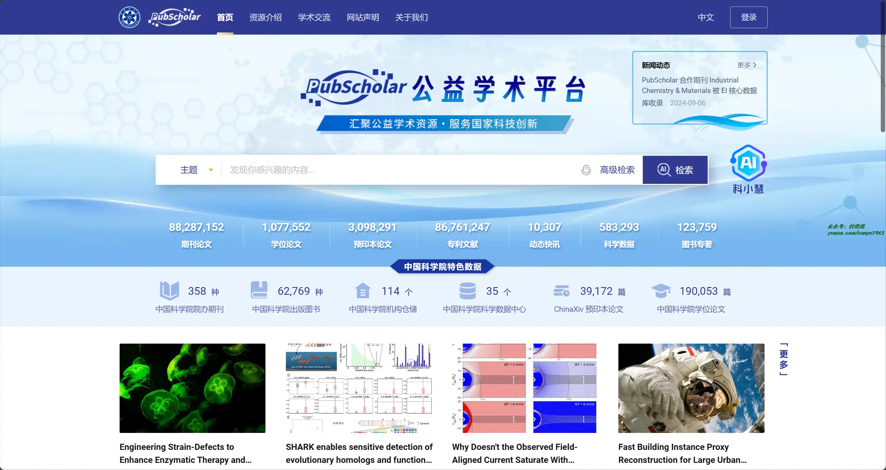
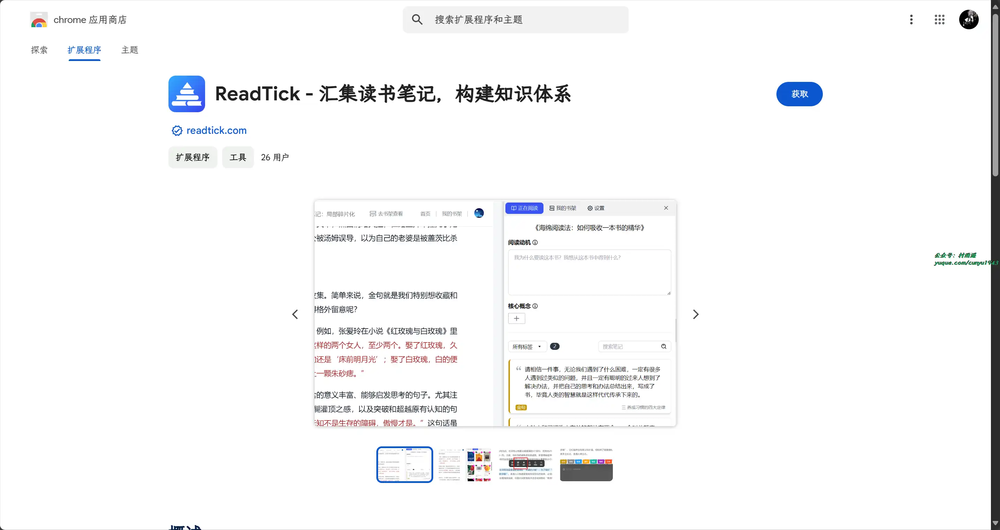
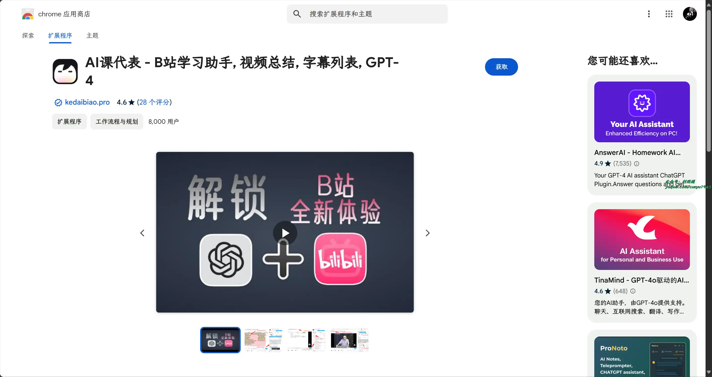
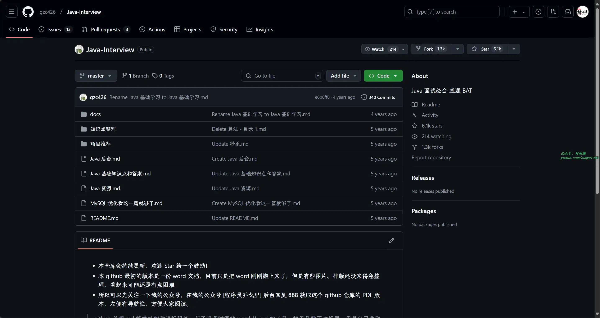
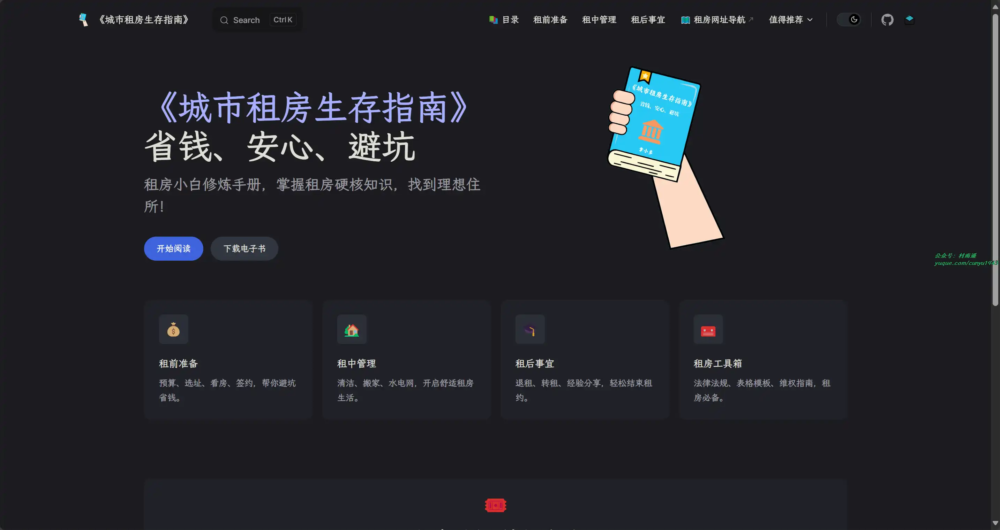

# 好物周刊#86：打工人租房指南

> 作者：[村雨遥](https://github.com/cunyu1943)
> 
> 不要哀求，学会争取，若是如此，终有所获
> 
> 原文：https://mp.weixin.qq.com/s/Rskx9wXp0RakBQL1FZ8qOg

## 🎈 号外 

最近，公众号之外，建立了微信交流群，不定期会在群里分享各种资源（影视、IT 编程、考试提升……）&知识。如果有需要，可以**扫码或者后台添加小编微信备注入群**。进群后**优先看群公告**，**呼叫群中【资源分享小助手】**，还能免费帮找资源哦～

 

## 一、项目

### 1. [paascloud-master](https://github.com/paascloud/paascloud-master)

Spring Cloud + Vue + oAuth2.0 全家桶实战，前后端分离模拟商城，完整的购物流程、后端运营平台，可以实现快速搭建企业级微服务项目。支持微信登录等三方登录。

### 2. [Spring Boot API Project Seed](https://github.com/lihengming/spring-boot-api-project-seed)

一个基于 Spring Boot & MyBatis 的种子项目，用于快速构建中小型 API、RESTful API 项目，该种子项目已经有过多个真实项目的实践，稳定、简单、快速，使我们摆脱那些重复劳动，专注于业务代码的编写，减少加班。下面是一个简单的使用演示，看如何基于本项目在短短几十秒钟内实现一套简单的 API，并运行提供服务。

### 3. [Opensabre ](https://github.com/opensabre/opensabre-framework)

基于 SpringCloud2021 的微服务开发平台，整合了 Spring Security、Springcloud Alibaba 等组件。 包含了基础的 RBAC 权限管理、授权认证、网关管理、服务治理、审计日志等系统管理基础应用。 定义了相关开发规范、风格并落地在服务框架层，开箱即用，支持 Docker、Kubenetes 的部署。 让项目开发人员快速进入业务开发，而不需过多时间花费在基础架构搭建和编码风格规范上。 目标是建立一套金融级、高安全性的微服务解决方案。

## 二、软件	

### 1. [狮子笔记](https://www.lionote.com/)

是一款全平台、可手写、Ai问答、保护隐私的笔记软件。自由使用众多信息形式记录和创作（文字、手写白板、思维导图、流程图、时序图、Markdown、AI问答、录音、图片、文件等），基于笔记但超越笔记。支持本地存储、可离线使用、所有设备自动加密同步、任何人都无法看到您的笔记。满足学习、工作、日记加密、教学、演示、备忘录、待办等场景。

### 2. [汉王扫描王](https://www.hanvonscanner.com/)

汉王扫描王，让工作学习更高效。汉王扫描王解决了很多用户在学习或办公中的一个痛点，就是将一些无法复制的图片文字信息，更快地转化为文档，大大节约了人力和时间成本。此外还提供多种文档模式供用户选择（文档扫描、表格提取、文字识别、版式分析、PDF 格式转换等）。

### 3. [布丁扫描](https://www.budingscan.com/)

一款专业的扫描 APP，具有识别准、处理快、无广告、无水印的特点。

## 三、网站

### 1. [PubScholar](https://pubscholar.cn/)

PubScholar 公益学术平台是中国科学院作为国家战略科技力量的主力军，履行学术资源保障“国家队”职责，为满足全国科技界和全社会科技创新的学术资源基础保障需求，建设的提供公益性学术资源的检索发现、内容获取和交流共享等服务的平台。平台在尊重知识产权和国际通行规范的前提下，发挥中国科学院自身拥有丰富且高质量学术资源的优势，带动国内外的学术资源机构积极合作，最大限度地开放优质学术资源。目前，平台整合集成了中国科学院的科技成果资源、科技出版资源和学术交流资源；OA环境下允许集成服务的学术资源；以及通过协议授权或其它合作共建模式获得授权许可的学术资源。

### 2. [Note.Re](https://note.re/)

一个打开即用的在线记事本。

### 3. [Azure Text to Speech](https://tts.femoon.top/)

Azure 提供的在线文字转语音工具，支持多种语言、男女不同音色，多种风格随意切换，甚至还能调整语速语调。

## 四、插件

### 1. [ReadTick](https://chromewebstore.google.com/detail/readtick-汇集读书笔记，构建知识体系/jglnmkgipeainmikejfmhpjkpknedfbj)

ReadTick 支持从外部读书软件中导入笔记，集中组织与回顾，帮您将碎片化的笔记转化为完整的知识体系！与流行的读书软件进行集成，从各处汇集您的读书笔记，将“海绵阅读法”应用于数字化阅读。

### 2. [AI 课代表](https://chromewebstore.google.com/detail/ai课代表-b站学习助手-视频总结-字幕列表-gp/jgilkmapjeaikiboajahmeiadceioobc)

Bilibili 视频总结插件，您在 B 站最专业的人工智能助手。基于 GPT4 的知识提问 + 视频总结 + 字幕搜索。

### 3. [AI 伴读卡片](https://chromewebstore.google.com/detail/ai伴读卡片/eacddhhclhfopgdecadpdonpfemndaeo)

借助先进的 AI 技术，自动提取音视频或者网页文章内容，生成个性化卡片，助您高效整理结构化知识。

## 五、资料

### 1. [Java-Interview](https://github.com/gzc426/Java-Interview)

Java 面试必知必会知识点总结，直通 BAT 面试现场。

### 2. [城市租房指南](https://zufang.ababtools.com)

省钱、安心、避坑是宗旨，一份租房小白修炼手册，掌握租房硬核知识，帮助我们找到理想住所！

### 3. [1000UserGuide](https://github.com/naxiaoduo/1000UserGuide)

对独立开发者和创业者来说，找到前 1000 个早期用户太关键了。这里精心整理了 300 多个国内外渠道，适合独立开发者和创业者推广产品的渠道。

## 

## ✍️ 说明

周刊专栏相关信息：

- **项目地址**：[Github](https://github.com/cunyu1943/weekly)，觉得不错麻烦给我一个**Star**，感谢 ❤️
- **浏览地址**：公众号 | [电子书](https://cunyu1943.github.io/weekly) | [语雀](https://yuque.com/cunyu1943/weekly)

如果你阅读到这里，说明我的工作没有白费。如果你想推荐项目/网站/软件/资源，欢迎提交 **[issue](https://github.com/cunyu1943/weekly/issues)** 或者添加我 **个人微信：coder_cunYu** 与我交流。

---

## ⏳ 联系

想解锁更多知识？不妨关注我的微信公众号：**村雨遥（id：JavaPark）**。

扫一扫，探索另一个全新的世界。

