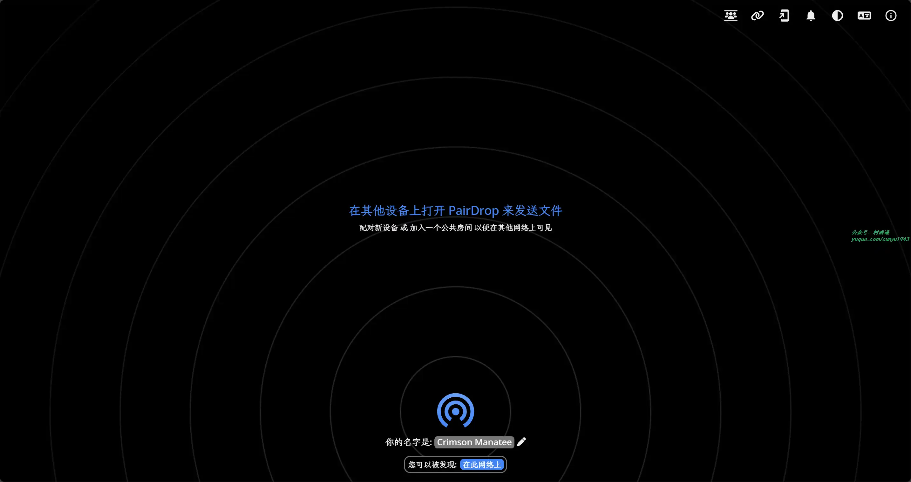
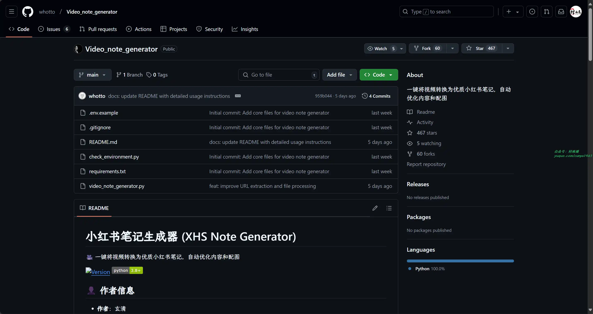
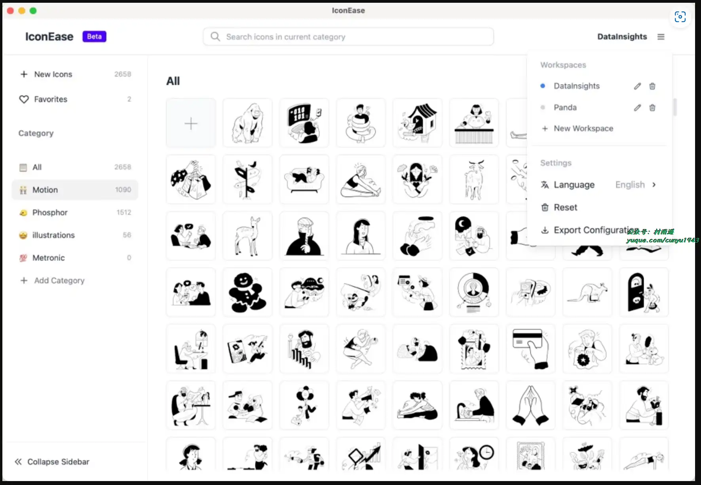
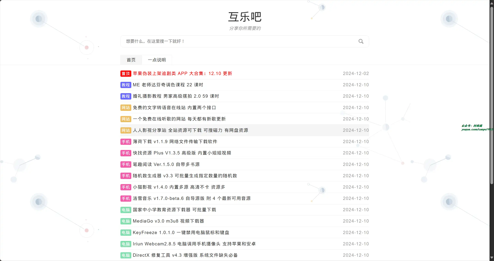
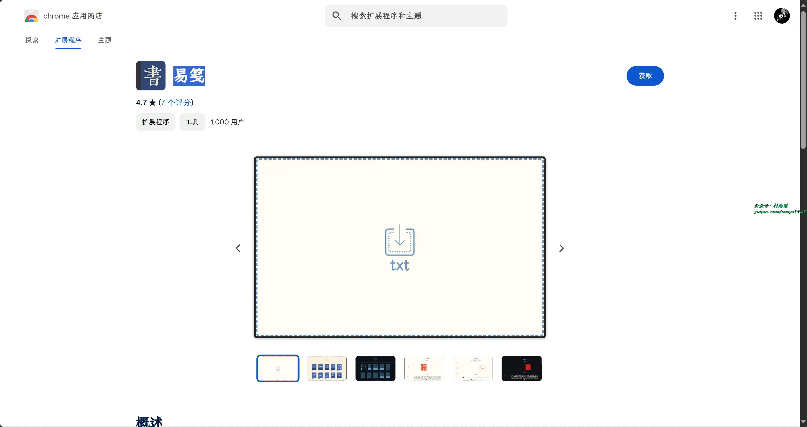
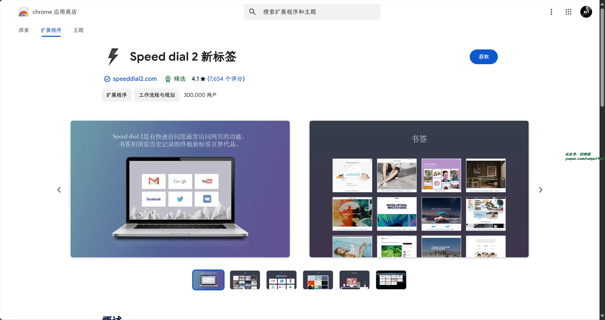
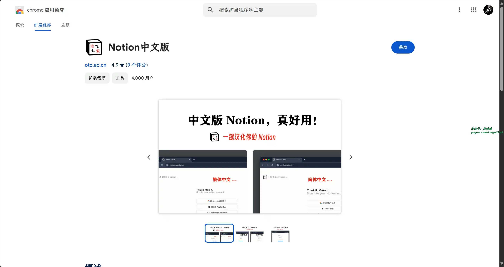
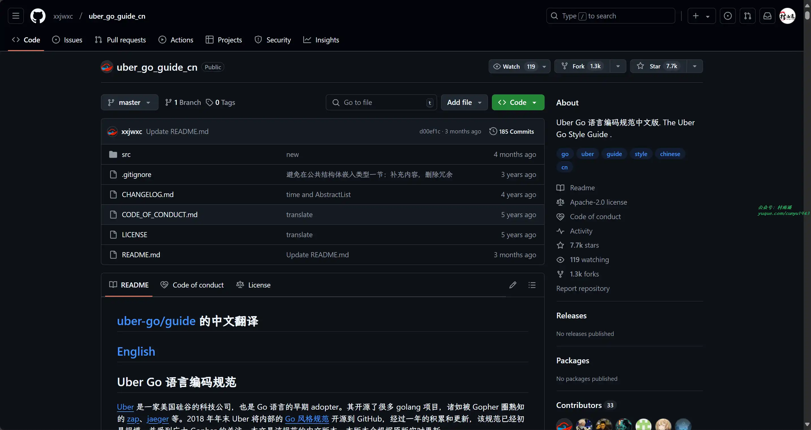
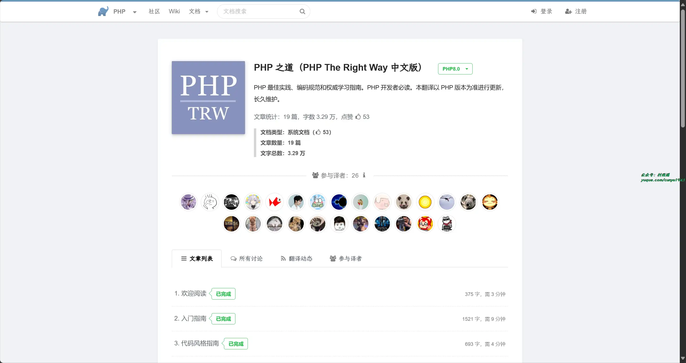

# 好物周刊#87：颜人颜语

> 作者：[村雨遥](https://github.com/cunyu1943)
> 
> 不要哀求，学会争取，若是如此，终有所获
> 
> 原文：https://mp.weixin.qq.com/s/Qa-9YCN5QT8bkE07rP1tlQ

## 🎈 号外 

最近，公众号之外，建立了微信交流群，不定期会在群里分享各种资源（影视、IT 编程、考试提升……）&知识。如果有需要，可以**扫码或者后台添加小编微信备注入群**。进群后**优先看群公告**，**呼叫群中【资源分享小助手】**，还能免费帮找资源哦～

 

## 一、项目

### 1. [PairDrop](https://github.com/schlagmichdoch/PairDrop)

无需下载任何软件，也无需登录即可实现跨平台之间的文件共享，不过需要传输文件的设备之间处于同一局域网。

### 2. [WatchAlert](https://github.com/opsre/WatchAlert)

基于 Go + React 实现，一款为云原生环境量身打造的轻量级监控告警引擎，专注于可观测稳定性主题，提供全面的监控与告警支持。

### 3. [小红书笔记生成器](https://github.com/whotto/Video_note_generator)

一键将视频转换为优质小红书笔记，自动优化内容和配图。

## 二、软件

### 1. [IconEase](https://github.com/JiuRanYa/IconEase)

一款现代化的图标管理桌面应用程序，用于组织和管理您的图标集合。专为需要快速访问图标库的设计师、开发者和数字艺术家打造。

### 2. [BlueStacks Air](https://www.bluestacks.com/tw/mac)

转为苹果公司 M 系列芯片打造的安卓模拟器，让你在 Mac 上也能运行安卓 App。

### 3. [Yōkai](https://github.com/null2264/yokai)

一款免费开源的安卓漫画阅读器，漫画爱好者的福音。

## 三、网站

### 1. [法行宝](https://ailegal.baidu.com/)

您的免费 AI 律师，作为专业法律助手，它可以解释法律法规、解答法律问题，根据您的问题，给出专业的法律意见。

### 2. [颜语](https://yan.ognai.com/)

可以生成精美的卡片，用于书摘/笔记/备忘的分享，仅需在输入框中输入内容，即可实时生效预览。

### 3. [互乐吧](https://huleba.com/)

在这里分享各种免费的资源，包括但不限于：工具、网站、教程、游戏、素材等。

## 四、插件

### 1. [易笺](https://chromewebstore.google.com/detail/易笺/dbanahlbopbjpgdkecmclbbonhpohcaf)

支持秒开本地的所有 txt 文件，自动排版，自动分页，自动生成目录，记录阅读进度。

### 2. [Speed dial 2](https://chromewebstore.google.com/detail/speed-dial-2-新标签/jpfpebmajhhopeonhlcgidhclcccjcik?hl=zh-CN)

一个简单、快速、直观的新标签页，支持保存和组织收藏的网站。彻底改进的新标签页！利用独特的工具提升我们的工作空间，使得更高效。还能根据我们的喜好来改造和定制新标签页体验。

### 3. [Notion 中文版](https://chromewebstore.google.com/detail/notion中文版/ljlhpcabhpjdlcjhbmgjigfceppgabmk)

一键即可汉化你的 Notion，同时安装插件还可以免费使用 Notion AI。

## 五、资料

### 1. [Uber Go 语言编码规范中文版](https://github.com/xxjwxc/uber_go_guide_cn)

2018 年年末 Uber 将内部的 Go 风格规范开源，经过一年的积累和更新，该规范已经初具规模，并受到广大 Gopher 的关注，本仓库即为该规范的中文版本。

### 2. [看见概率论](https://probability.visualized.fun)

让概率论变得可见且有趣，通过直观的交互式演示，深入理解概率论中的经典定理， 让抽象的数学概念变得生动有趣。

### 3. [PHP 之道](https://learnku.com/docs/php-the-right-way)

PHP 最佳实践、编码规范和权威学习指南，PHP 开发者必读。

## ✍️ 说明

周刊专栏相关信息：

- **项目地址**：[Github](https://github.com/cunyu1943/weekly)，觉得不错麻烦给我一个**Star**，感谢 ❤️
- **浏览地址**：公众号 | [电子书](https://cunyu1943.github.io/weekly) | [语雀](https://yuque.com/cunyu1943/weekly)

如果你阅读到这里，说明我的工作没有白费。如果你想推荐项目/网站/软件/资源，欢迎提交 **[issue](https://github.com/cunyu1943/weekly/issues)** 或者添加我 **个人微信：coder_cunYu** 与我交流。

---

## ⏳ 联系

想解锁更多知识？不妨关注我的微信公众号：**村雨遥（id：JavaPark）**。

扫一扫，探索另一个全新的世界。

