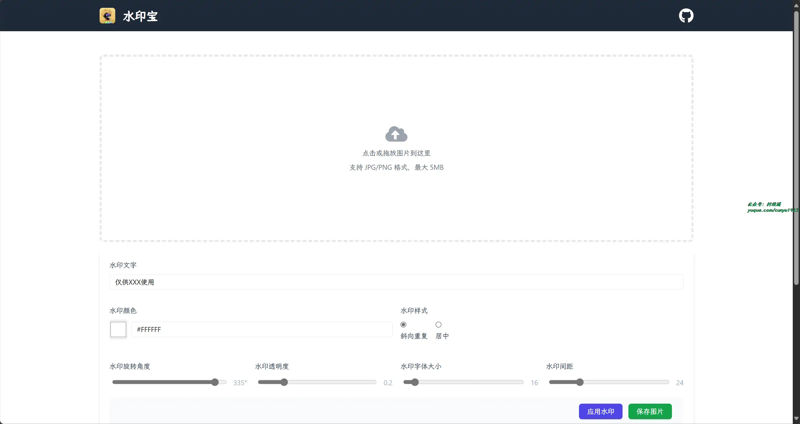
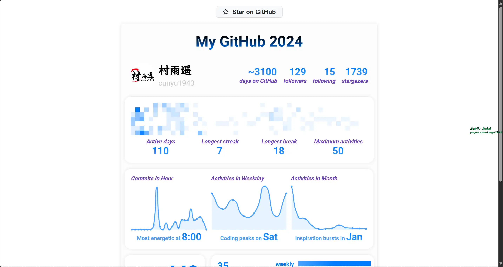
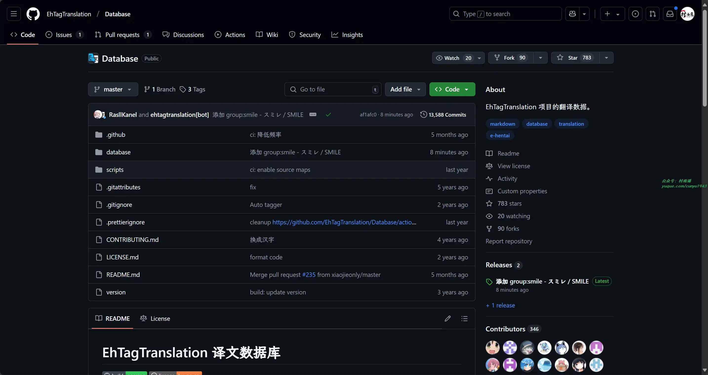
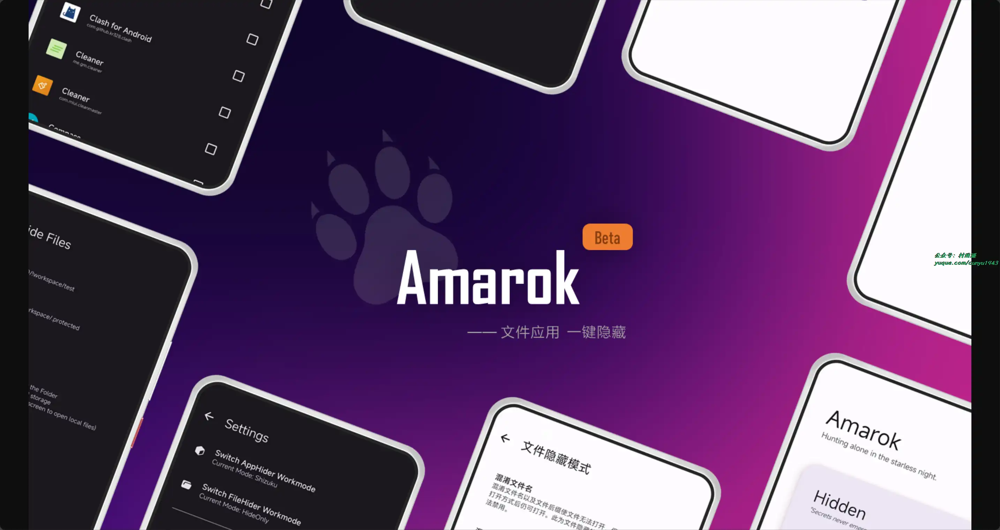
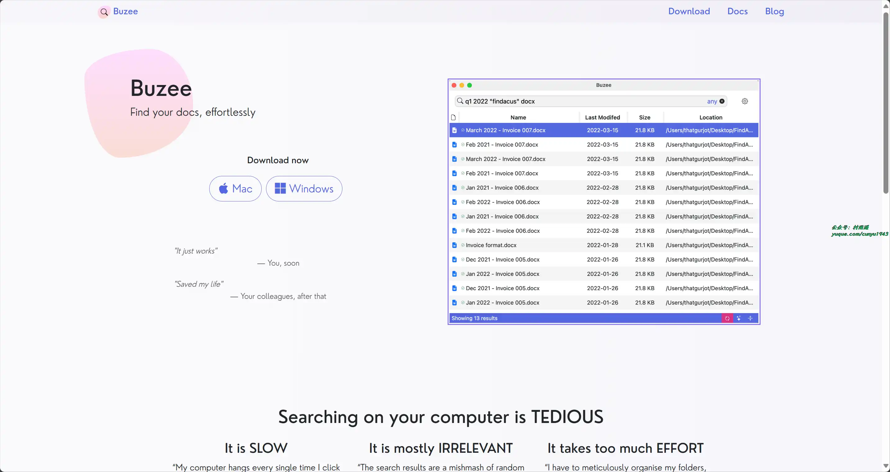
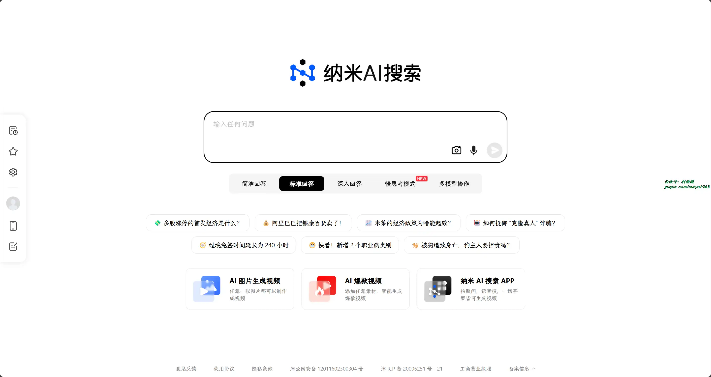
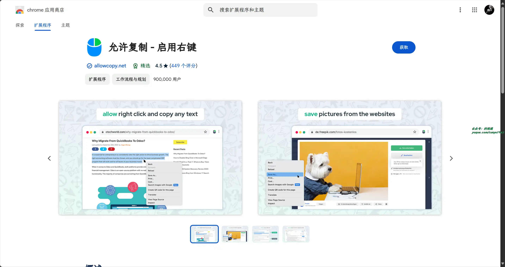
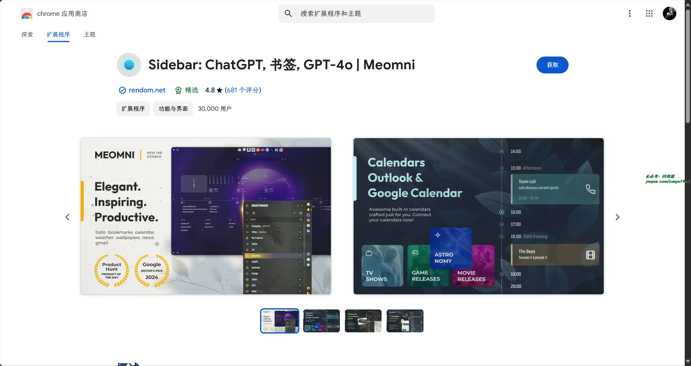
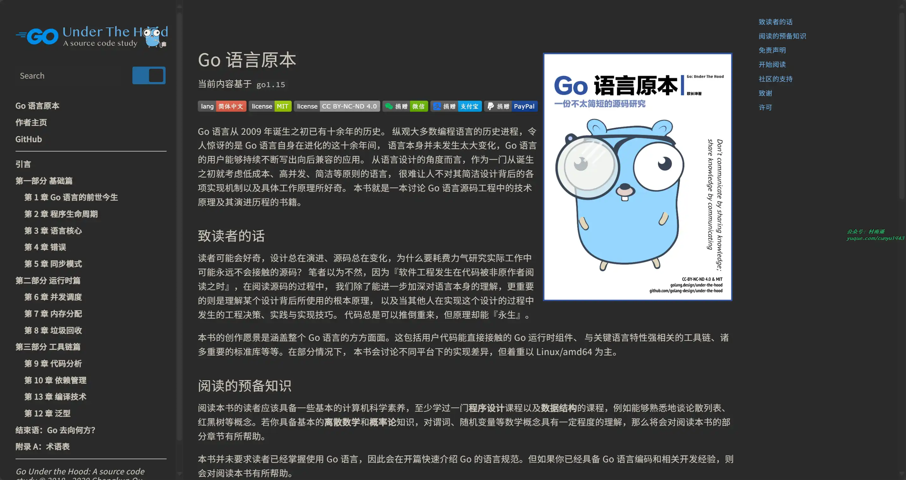
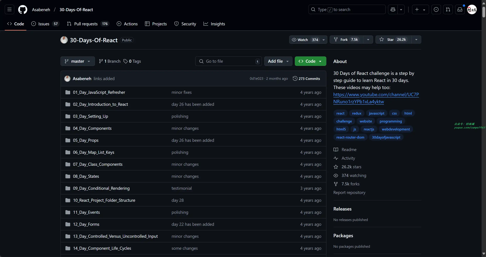

# 好物周刊#88：Github 2024 年度总结

> 作者：[村雨遥](https://github.com/cunyu1943)
> 
> 不要哀求，学会争取，若是如此，终有所获
> 
> 原文：https://mp.weixin.qq.com/s/AWebQe3qfWgm-UPXTmdQTQ

## 🎈 号外 

最近，公众号之外，建立了微信交流群，不定期会在群里分享各种资源（影视、IT 编程、考试提升……）&知识。如果有需要，可以**扫码或者后台添加小编微信备注入群**。进群后**优先看群公告**，**呼叫群中【资源分享小助手】**，还能免费帮找资源哦～

 

## 一、项目

### 1. [水印宝](https://github.com/chilohwei/watermark-tool)

专业的在线图片水印工具。

### 2. [My Github 2024](https://github.com/WCY-dt/my-github-2024)

登录你的 Github 并授权，即可统计 2024 年你在 GitHub 上的活动。

### 3. [EhTagTranslation 译文数据库](https://github.com/EhTagTranslation/Database)

EhTagTranslation 项目的翻译数据。

## 二、软件

### 1. [Tran](https://github.com/Borber/Tran)

一个跨桌面的简洁，快速，划词翻译软件。

### 2. [Amarok-Hider](https://github.com/deltazefiro/Amarok-Hider)

一款轻量级隐私保护工具，一键隐藏你的隐私文件和应用，具有以下特点：

- 简单易用: 文件应用，一键隐藏。
- 高速大文件隐藏: 只混淆文件名和文件签名，文件大小并不影响隐藏速度。
- 免 Root 应用隐藏: 从桌面隐藏应用程序。目前支持 Root、Shizuku、Dhizuku 和 DSM 模式。
- 老板键: 在紧急情况下使用浮动按钮隐藏应用和文件。
- 快捷开关: 控制中心开关，无需打开应用即可隐藏。
- 赏心悦目的界面: 简洁干净的 Material3 设计。

### 3. [Buzee](https://github.com/gsidhu/buzee-tauri)

支持对本地文件的全文搜索功能，支持 Mac 和 Windows 平台。

## 三、网站

### 1. [BYLO AI](https://bylo.ai)

免费 AI 文本生成图像，使用 Bylo.ai 的高级 AI 图像生成器，将您的想法转化为高质量图像，而且免费快速，支持定制化。

### 2. [纳米 AI 搜索](https://www.n.cn/)

新一代智能答案引擎，值得信赖的智能搜索伙伴，为复杂搜索提供专业支持，解锁更相关、更全面的答案。AI 对用户提问进行精准语义分析，并通过追问获取更多有价值信息，将问题拆分为多组关键词后再进行搜索引擎检索，深度阅读网页内容，最终呈现逻辑清晰、准确无误的答案。

### 3. [智客翻译](https://zhike.in/)

一个基于谷歌翻译的在线翻译工具，翻译结果实时同步自 Google Translate，它支持超过 100 种语言，能为用户提供准确的翻译结果。

## 四、插件

### 1. [CouponBirds](https://chromewebstore.google.com/detail/couponbirds-smartcoupon-c/pnedebpjhiaidlbbhmogocmffpdolnek?hl=zh-CN)

自动寻找优惠券，并推荐适合你的优惠券，为你的网上购物省钱。

### 2. [允许复制](https://chromewebstore.google.com/detail/允许复制-启用右键/mmpljcghnbpkokhbkmfdmoagllopfmlm)

在受保护的网站上启用复制：允许右键，解锁上下文菜单，启用文本高亮并允许复制。

### 3. [Sidebar](https://chromewebstore.google.com/detail/sidebar-chatgpt-书签-gpt-4o/fnfdomooadjpfohbepiaonnbdmkdjiog)

终极侧边栏 ChatGPT 助理，人工智能帮助你整理书签，规划日常任务。

## 五、资料

### 1. [SQL 样式指南](https://www.sqlstyle.guide/)

教你如何写出规范的 SQL 语句，用于规范项目中代码的一致性，使得代码简单、可读和易于维护，从一定程度上提高代码质量。

### 2. [Go 语言原本](https://github.com/golang-design/under-the-hood)

一本讨论 Go 语言源码工程中的技术原理及其演进历程的书籍。

### 3. [30 Days Of React](https://github.com/Asabeneh/30-Days-Of-React)

30 天学会系列之 React 篇，一份免费的开源教程，值得一看。

## ✍️ 说明

周刊专栏相关信息：

- **项目地址**：[Github](https://github.com/cunyu1943/weekly)，觉得不错麻烦给我一个**Star**，感谢 ❤️
- **浏览地址**：公众号 | [电子书](https://cunyu1943.github.io/weekly) | [语雀](https://yuque.com/cunyu1943/weekly)

如果你阅读到这里，说明我的工作没有白费。如果你想推荐项目/网站/软件/资源，欢迎提交 **[issue](https://github.com/cunyu1943/weekly/issues)** 或者添加我 **个人微信：coder_cunYu** 与我交流。

---

## ⏳ 联系

想解锁更多知识？不妨关注我的微信公众号：**村雨遥（id：JavaPark）**。

扫一扫，探索另一个全新的世界。

