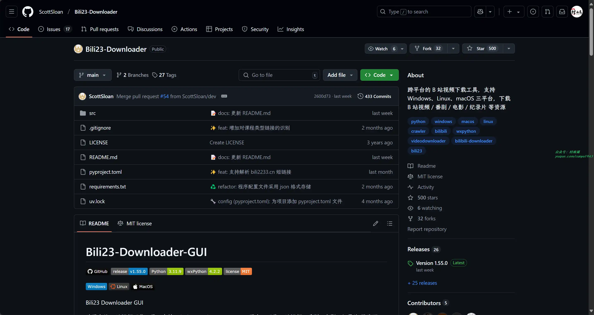
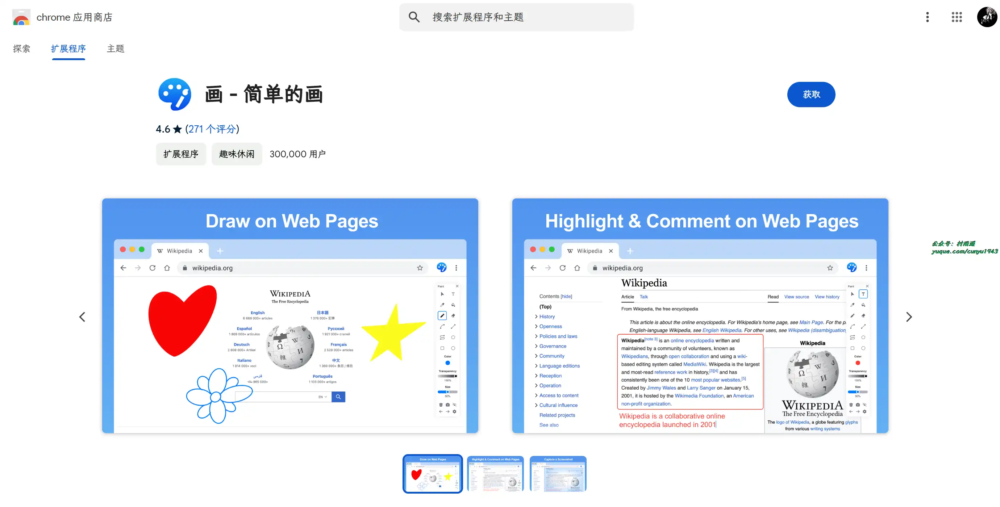
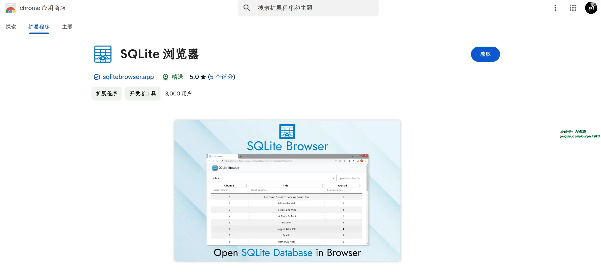
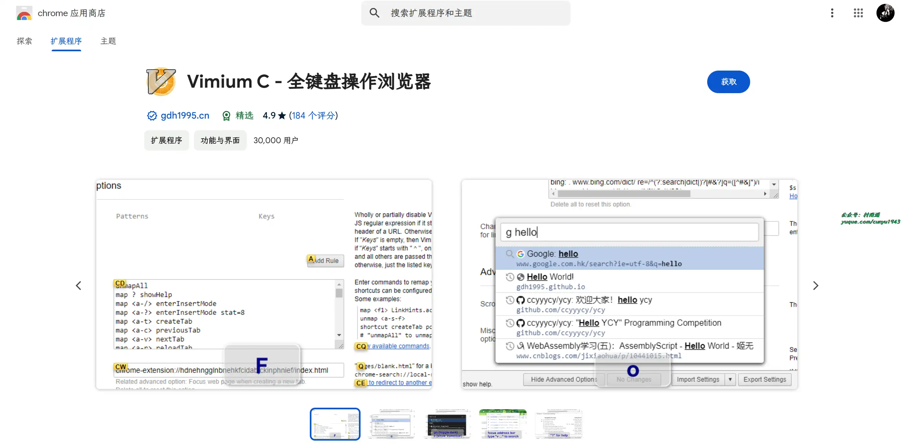
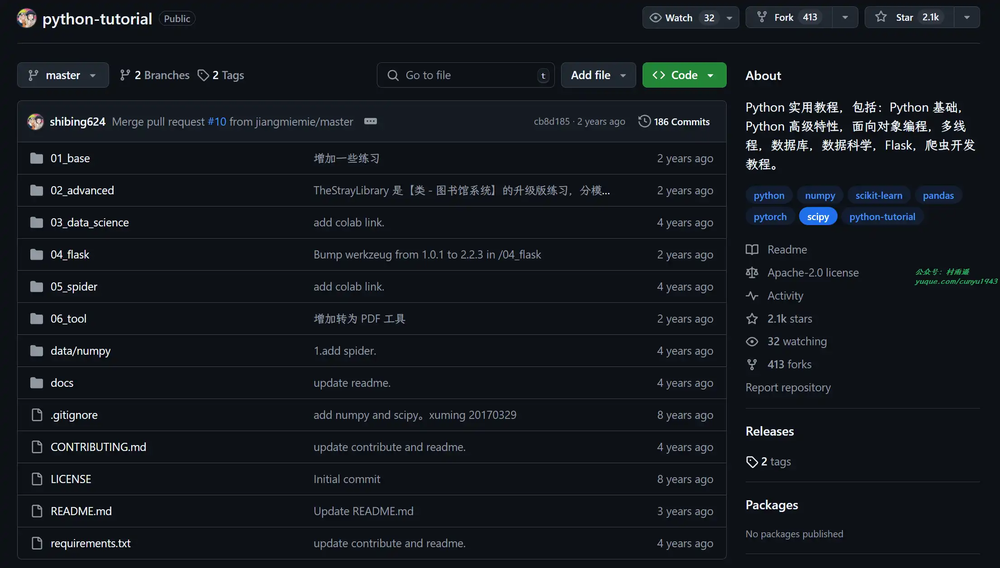

# 好物周刊#92：闪电藤

> 作者：[村雨遥](https://github.com/cunyu1943)
> 
> 不要哀求，学会争取，若是如此，终有所获
> 
> 原文：https://mp.weixin.qq.com/s/I5lxqBzZrcF4EcTvTF_sAg

## 🎈 号外 

最近，公众号之外，建立了微信交流群，不定期会在群里分享各种资源（影视、IT 编程、考试提升……）&知识。如果有需要，可以**扫码或者后台添加小编微信备注入群**。进群后**优先看群公告**，**呼叫群中【资源分享小助手】**，还能免费帮找资源哦～

 

## 一、项目

### 1. [mybatis-plus-generator-ui](https://github.com/davidfantasy/mybatis-plus-generator-ui)

提供交互式的 Web UI 用于生成兼容 mybatis-plus 框架的相关功能代码，包括 Entity、Mapper、Mapper.xml、Service、Controller 等 ，可以自定义模板以及各类输出参数，也可通过 SQL 查询语句直接生成代码。

### 2. [Bili23-Downloader-GUI](https://github.com/ScottSloan/Bili23-Downloader)

跨平台的 B 站视频下载工具，支持 Windows、Linux、macOS 三平台，下载 B 站视频/番剧/电影/纪录片 等资源。

### 3. [stock](https://github.com/Rockyzsu/stock)

30 天掌握量化交易，帮助你更好的炒股。

## 二、软件

### 1. [闪电藤](https://sdt.zishu.life/)

基于 LocalSend 的二次开发产品，在原有局域网文件传输基础上，增加了 webdav 传输和云传输的能力，是一个万能的文件传输助手。目前已支持安卓、iOS、Mac、Windows 和 Linux。

### 2. [一叶日记](https://www.oneleaf.fun/)

一款操作简单、界面简洁但又不失美感的极简卡片日记软件。

### 3. [享咖小记](https://coffee-note.xiangshikeji.com/)

从咖啡豆、冲煮器具、研磨器三个基础数据再配合上冲煮过程中使用的各个器材的设置、水温、时长、注水量等参数，系统的记录下每一杯咖啡的冲煮过程。

## 三、网站

### 1. [Mapify](https://mapify.so/)

AI 思维导图总结工具，仅需几秒即可将 YouTube、PDF、文档、网址、长邮件、会议录音 总结成思维导图。

### 2. [讯飞智文](https://zhiwen.xfyun.cn/)

由科大讯飞推出的一键生成 PPT/Word 产品。根据一句话、长文本、音视频等指令智能生成文档，同时支持在线编辑、美化、排版、导出、一键动效、自动生成演讲稿等功能，让 AI 全流程服务到底。

### 3. [扣扣图](https://www.koukoutu.com/)

永久免费在线抠图、免费在线批量抠图，无需专业设计技能，只需轻点鼠标，智能算法即刻为您精准识别图像边缘， 无论是复杂背景还是细腻发丝，都能轻松剥离.

## 四、插件

### 1. [画 - 简单的画](https://chromewebstore.google.com/detail/画-简单的画/doiiaejbgndnnnomcdhefcbfnbbjfbib?hl=zh-CN)

使用画图扩展进行简单的绘图，该工具允许在屏幕上描绘并使用截图功能捕捉。

### 2. [SQLite 浏览器](https://chromewebstore.google.com/detail/sqlite-浏览器/iclckldkfemlnecocpphinnplnmijkol)

在浏览器中即可实现轻松管理 SQLite 数据库。

### 3. [Vimium C - 全键盘操作浏览器](https://chromewebstore.google.com/detail/vimium-c-全键盘操作浏览器/hfjbmagddngcpeloejdejnfgbamkjaeg)

一款开源、免费的键盘增强类浏览器扩展，支持为多种多样的命令任意设置快捷键。只要有一个键盘，您就能自由点击网页中的链接和按钮、选择和复制文字和网址，也能轻松操作浏览器标签页，还能在一个便捷的搜索框中随意搜索历史记录、收藏夹或打开的标签等等。

## 五、资料

### 1. [1000 行代码的操作系统](https://github.com/nuta/operating-system-in-1000-lines)

本书从零开始一步一步去构建一个小型操作系统，用 C 语言来实现基础的上下文切换、分页、用户态、命令行 shell、磁盘驱动以及文件读写操作，而且仅有 1000 代码！

### 2. [springcloud-learning](https://github.com/macrozheng/springcloud-learning)

2024 最新微服务实战教程，Spring Cloud 组件、微服务项目实战、Kubernetes 容器化部署全方位解析。

### 3. [Python 实用教程](https://github.com/shibing624/python-tutorial)

基于 Python 3 实现，内容包括 Python 基础，Python 高级特性，面向对象编程，多线程，数据库，数据科学，Flask，爬虫开发教程。同时教程中包含了一些范例，涵盖了大多数 Python 日常脚本任务，是入门 Python 的学习资料，也可以作为工作中编写 Python 脚本的参考实现。

## ✍️ 说明

周刊专栏相关信息：

- **项目地址**：[Github](https://github.com/cunyu1943/weekly)，觉得不错麻烦给我一个**Star**，感谢 ❤️
- **浏览地址**：公众号 | [电子书](https://cunyu1943.github.io/weekly) | [语雀](https://yuque.com/cunyu1943/weekly)

如果你阅读到这里，说明我的工作没有白费。如果你想推荐项目/网站/软件/资源，欢迎提交 **[issue](https://github.com/cunyu1943/weekly/issues)** 或者添加我 **个人微信：coder_cunYu** 与我交流。

---

## ⏳ 联系

想解锁更多知识？不妨关注我的微信公众号：**村雨遥（id：JavaPark）**。

扫一扫，探索另一个全新的世界。

