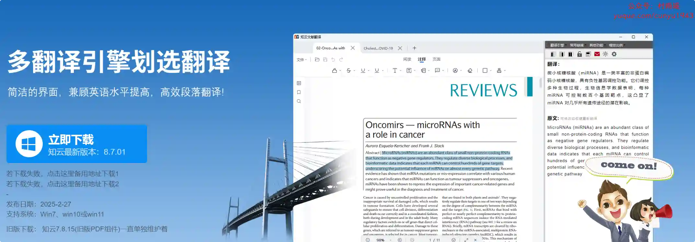
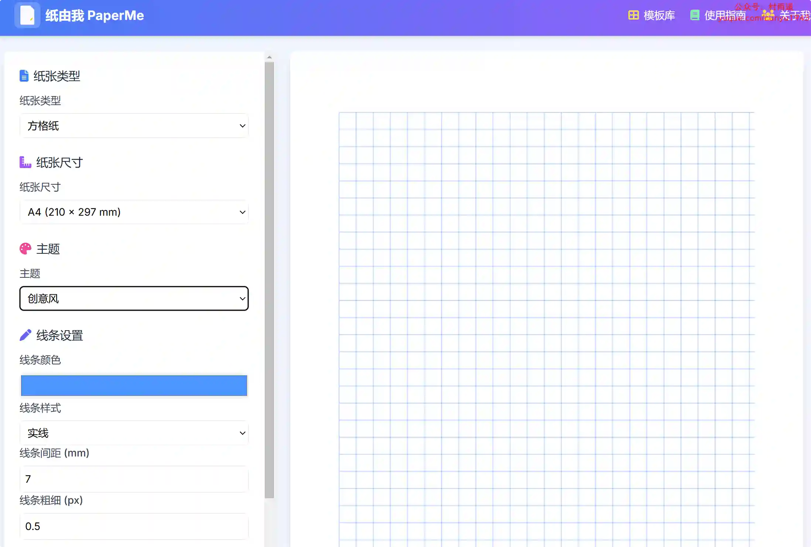
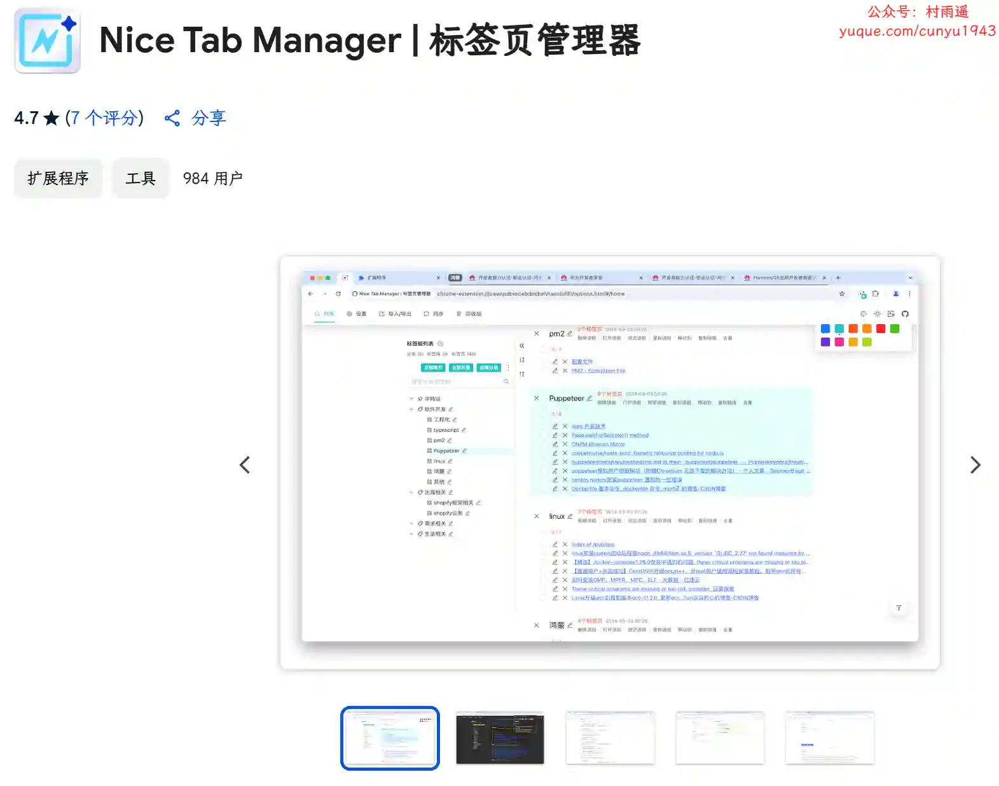
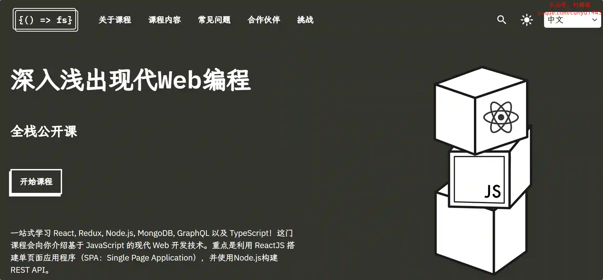

# 好物周刊#97：SCI 文献阅读

> 作者：[村雨遥](https://github.com/cunyu1943)
> 
> 不要哀求，学会争取，若是如此，终有所获
> 
> 原文：https://mp.weixin.qq.com/s/8YncnfvZTiKHlUITW6qklw

## 🎈 号外 

最近，公众号之外，建立了微信交流群，不定期会在群里分享各种资源（影视、IT 编程、考试提升……）&知识。如果有需要，可以**扫码或者后台添加小编微信备注入群**。进群后**优先看群公告**，**呼叫群中【资源分享小助手】**，还能免费帮找资源哦～

 

## 一、项目

### 1. [hexo-bilibili-bangumi](https://github.com/HCLonely/hexo-bilibili-bangumi)

通过简单配置，即可为 Hexo 博客添加哔哩哔哩/Bangumi 追番/追剧页面，让你的博客不再单调。

### 2. [story-flicks](https://github.com/alecm20/story-flicks)

输入一个故事主题，使用大语言模型生成故事视频，视频中包含大模型生成的图片、故事内容，以及音频和字幕信息。项目后端技术栈为 Python + Fastapi 框架，前端为 React + Antd + Vite。

### 3. [中秋贺卡](https://github.com/xiaoli1999/moon-card)

支持定制中秋贺卡，上传你的头像以及自定义文案，然后再将做好的贺卡分享给你的朋友们。

## 二、软件

### 1. [Vivetool](https://github.com/thebookisclosed/ViVe)

一款可用于强制开启 Windows 测试版的工具，适合喜欢捣腾的朋友。

### 2. [小绿鲸英文文献阅读器](https://www.xljsci.com?regCode=7dOjVN)

一款集翻译、笔记、文献管理、文献汇报、写作功能于一体的云端英文文献阅读器，专注提高英文文献阅读效率，专为科研人员阅读文献而准备。

### 3. [知云文献翻译](https://www.zhiyunwenxian.cn/)

一款 Windows 平台下的划选翻译软件，自带 PDF 阅读器同时包含几乎所有主流翻译引擎，支持中英互译，帮助提高您的英语科研文献或书籍阅读效率！

## 三、网站

### 1. [全球艺术天气](https://todayaiweather.com/)

每小时更新几个城市的艺术天气，从 250+ 国家的 15w+ 城市中筛选，根据当地天气情况生成实时艺术天气图像。

### 2. [心晴网](http://www.ixinqing.com)

专注于心理学入门与自我成长，与 66546 名心理学爱好者分享、交流心理学入门学习心得。当前共有心理学书籍 7595 本，而且还在不断增长中。

### 3. [纸由我](https://paperme.toolooz.com/)

包含常用的纸张模板，比如横线纸、方格纸、点阵纸等，而且支持自定义，无论你是学生、教师、设计师还是办公人士，都能找到或创建最适合自己需求的纸张。

## 四、插件

### 1. [Nice Tab Manager | 标签页管理器](https://chromewebstore.google.com/detail/nice-tab-manager-标签页管理器/fonflmjnjbkigocpoommgmhljdpljain)

一个方便快捷管理浏览器标签页的浏览器插件，可以当做 OneTab、Toby、N-Tab、KepTab 等扩展的升级替代品，功能丰富易用。

### 2. [改写工具](https://chromewebstore.google.com/detail/改写工具/chpmagmpblpebnbpegbcllmgijcgflgo)

您的AI写作助手，可以即时改写，轻松简化、增强和改写文本！专为赋能作家、学生和专业人士而设计。

### 3. [TextCortex](https://chromewebstore.google.com/detail/textcortex：个人ai助手ai作家/hahkojdegblcccihngmgndhdfheheofe)

一款旨在了解您和您的写作需求的 AI 伴侣：它会主动提供有关如何使您的内容更真实的选项，并从头到尾在您的创作过程中为您提供帮助。是专业人士、营销人员、作家、开发人员和学生的理想选择。

## 五、资料

### 1. [awesome-mongodb](https://github.com/ramnes/awesome-mongodb)

关于 MongoDB 的免费学习向导，含有学习资源、第三方库以及各种工具资源。

### 2. [计算机体系结构基础](https://github.com/foxsen/archbase)

龙芯团队胡伟武老师等人编写的《计算机体系结构基础》（第三版）的开源版本，作者从微处理器设计的角度出发，充分考虑计算机体系结构的学科完整性，强调体系结构、基础软件、电路和器件的融会贯通。全书共分 12  章，包括指令系统结构、计算机硬件结构、CPU 微结构、并行处理结构、计算机性能分析等主要内容，重点放在作为软硬件界面的指令系统结构，以及包含 CPU、GPU、南北桥协同的计算机硬件结构。本书可作为高等学校“计算机体系结构”课程的本科生教材，同时也适合相关专业研究生或计算机技术人员参考阅读。

### 3. [深入浅出现代 Web 编程全栈公开课](https://fullstackopen.com/)

一站式学习 React, Redux, Node.js, MongoDB, GraphQL 以及 TypeScript！这门课程会向你介绍基于 JavaScript 的现代 Web 开发技术。重点是利用 ReactJS 搭建单页面应用程序（SPA：Single Page Application），并使用Node.js构建REST API。

## ✍️ 说明

周刊专栏相关信息：

- **项目地址**：[Github](https://github.com/cunyu1943/weekly)，觉得不错麻烦给我一个**Star**，感谢 ❤️
- **浏览地址**：公众号 | [电子书](https://cunyu1943.github.io/weekly) | [语雀](https://yuque.com/cunyu1943/weekly)

如果你阅读到这里，说明我的工作没有白费。如果你想推荐项目/网站/软件/资源，欢迎提交 **[issue](https://github.com/cunyu1943/weekly/issues)** 或者添加我 **个人微信：coder_cunYu** 与我交流。

---

## ⏳ 联系

想解锁更多知识？不妨关注我的微信公众号：**村雨遥（id：JavaPark）**。

扫一扫，探索另一个全新的世界。

