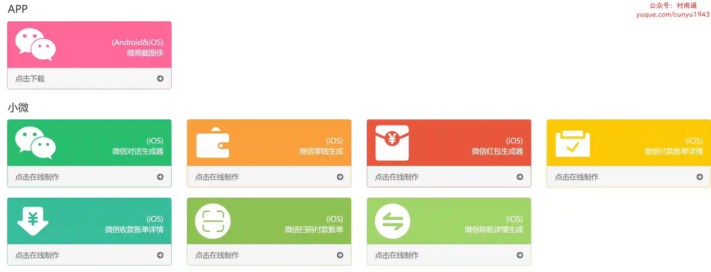
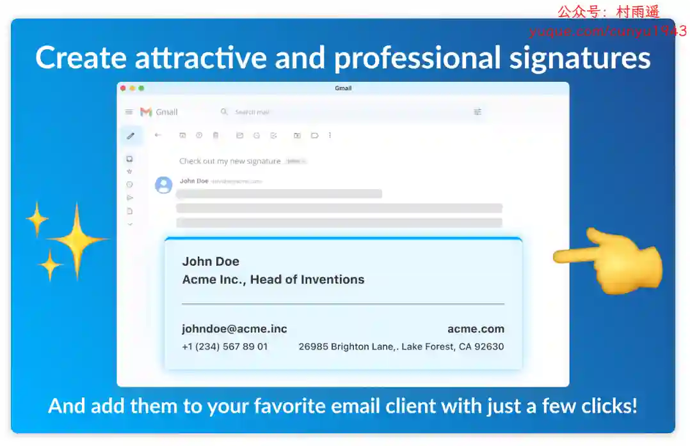
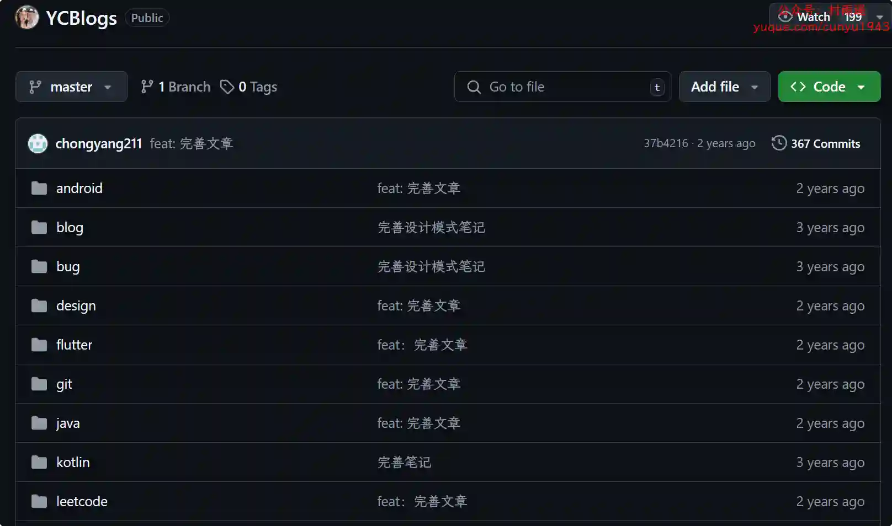
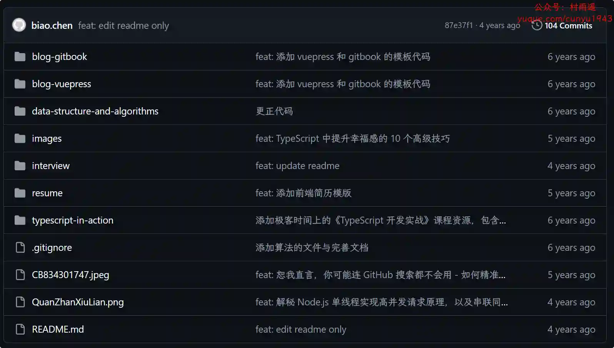
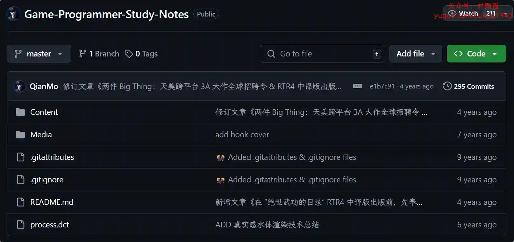

# 好物周刊#101：截图侠

> 作者：[村雨遥](https://github.com/cunyu1943)
> 
> 不要哀求，学会争取，若是如此，终有所获
> 
> 原文：https://mp.weixin.qq.com/s/POc91kcEuWFBTfd_AW6eZg

## 🎈 号外 

最近，公众号之外，建立了微信交流群，不定期会在群里分享各种资源（影视、IT 编程、考试提升……）&知识。如果有需要，可以**扫码或者后台添加小编微信备注入群**。进群后**优先看群公告**，**呼叫群中【资源分享小助手】**，还能免费帮找资源哦～

 

## 一、项目 

### 1. [sg-exam](https://github.com/wells2333/sg-exam)

基于 Spring Boot、Vue 构建的高效教学管理平台，专为便捷与美学设计，无缝融合多租户体系与精细权限管理，涵盖在线考试、日常练习、互动学习等核心功能。

### 2. [weimai-wetapp](https://github.com/xierongwkhd/weimai-wetapp)

微麦电影购票小程序，基于 Spring Boot + Vue 开发，共分为三部分：小程序端、商家（影院）后台与官方后台。

### 3. [在线考试系统](https://github.com/lsgwr/spring-boot-online-exam)

基于 Spring Boot 的在线考试系统，前后端分离，前段组件化，方便二次开发。支持如下功能：

-   支持单选题、多选题、判断题
-   支持学生 (student)、教师 (teacher)、管理员 (admin) 三种角色

-   学生：参加考试和查看我的考试
-   教师：学生的所有权限 + 创建 / 编辑题目 + 创建 / 编辑考试
-   管理员：教师的所有权限 + 管理用户

## 二、软件

### 1. [狐猴浏览器](https://www.lemurbrowser.com/)

支持谷歌、微软扩展插件的浏览器，不论是 Chrome，Edge 还是 Tampermonkey，统统收录其中。

### 2. [FlyEnv](https://github.com/xpf0000/FlyEnv)

一款专为现代开发人员设计的一体化环境管理工具。它通过提供快速的多版本切换、全栈技术支持和无缝的跨平台体验来简化开发。无论您使用的是 PHP、NodeJS、Java、Go 还是 Python，FlyEnv 都可以通过一个命令集成所有必要的工具，消除配置难题。 

### 3. [微商截图侠](https://www.wsjtxia.com)

在线制作微信对话生成器和支付宝转账，微信聊天记录生成，免费微信对话在线制作，微信转账，支付宝聊天，微信余额，微信零钱，微信红包等截图，一款微商截图神器。

## 三、网站

### 1. [菜鸟图标](https://icon.sucai999.com/)

免费商用矢量图标库，共有 20,0000+ 个高品质矢量图标，是设计师与开发者的灵感宝藏。一站式解决你的图标需求，提升效率的小助手！

### 2. [爱校对](https://www.ijiaodui.com)

依托于清华大学计算机智能人机交互实验室的技术成果，致力于以人为中心的创新交互技术实现信息无障碍，融合交互设计、智能感知和识别算法，提供移动、穿戴、IoT（物联网）的智能交互方案，解决消费者和行业痛点。

### 3. [番喜导航](https://fxsh.com)

专注职场与效率的垂直网址导航，一键直达热门工具、资源网站。每日精选优质站点，助您高效工作与学习，发现更实用的互联网世界！

## 四、插件

### 1. [电子邮件提取器](https://chromewebstore.google.com/detail/电子邮件提取器：从网站抓取电子邮件/joflojehbdajphljkcggpmajnoibdaio)

强大的网络电子邮件抓取工具自动访问网站，高效批量提取电子邮件和社交媒体资料。它可以帮助您轻松地从网站上抓取电子邮件和联系页面，并找到大量的电子邮件数据。

### 2. [电子邮件签名生成器](https://chromewebstore.google.com/detail/电子邮件签名生成器/pkklhocebkkoglfnghnfnpokjanbbcfo)

创建个性化和专业的电子邮件页脚的完美工具，它能充分展示您的身份并在您发送的每封邮件中留下深刻的印象。凭借用户友好的界面和一系列可定制的功能，提升您的邮件沟通体验。

### 3. [Gmail 重复发送邮件](https://chromewebstore.google.com/detail/gmail重复发送邮件/nfkkaahokibjkbmoieakdcihjkifhfdo)

一款注重隐私的 Chrome 扩展，允许您通过 Gmail 延迟发送您的邮件，一次或每 X 个小时/天/月/年重复发送。无追踪、无广告、无横幅和无臃肿软件。

## 五、资料

### 1. [YCBlogs](https://github.com/yangchong211/YCBlogs)

技术博客笔记大汇总，包括 Java 基础，线程，并发，数据结构；Android 技术博客等等；常用设计模式；常见的算法；网络协议知识点；部分 flutter 笔记；还包括平时开发中遇到的 bug 汇总，当然也在工作之余收集了大量的面试题。

### 2. [blog](https://github.com/biaochenxuying/blog)

大前端技术内容为主，其次还有博主的读书笔记、随笔、理财方面的内容。

### 3. [游戏程序员的读书笔记](https://github.com/QianMo/Game-Programmer-Study-Notes)

作者作为游戏程序员生涯的读书笔记合辑，涉及游戏开发中的图形学、实时渲染、编程实践、GPU 编程、设计模式、软件工程等内容。

## 

## ✍️ 说明

周刊专栏相关信息：

- **项目地址**：[Github](https://github.com/cunyu1943/weekly)，觉得不错麻烦给我一个**Star**，感谢 ❤️
- **浏览地址**：公众号 | [电子书](https://cunyu1943.github.io/weekly) | [语雀](https://yuque.com/cunyu1943/weekly)

如果你阅读到这里，说明我的工作没有白费。如果你想推荐项目/网站/软件/资源，欢迎提交 **[issue](https://github.com/cunyu1943/weekly/issues)** 或者添加我 **个人微信：coder_cunYu** 与我交流。

---

## ⏳ 联系

想解锁更多知识？不妨关注我的微信公众号：**村雨遥（id：JavaPark）**。

扫一扫，探索另一个全新的世界。

