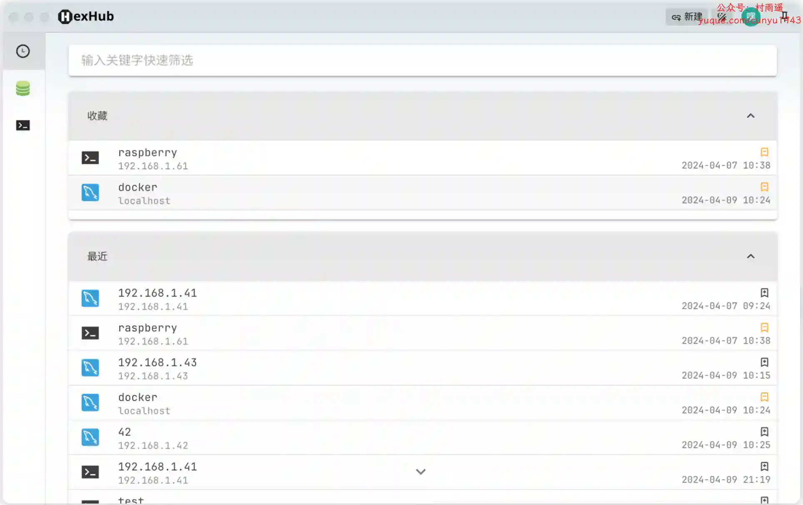
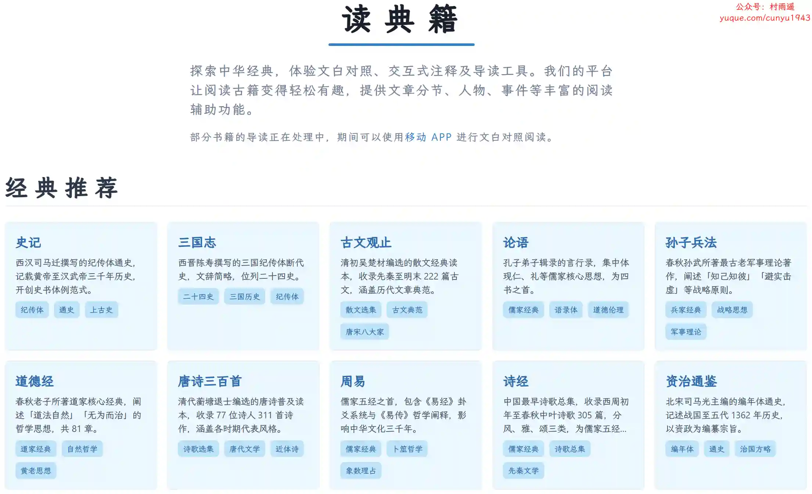
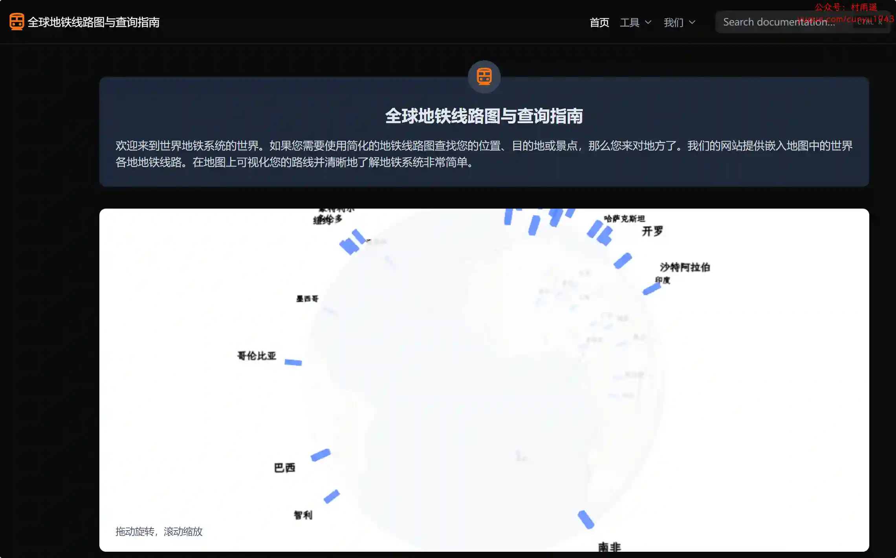
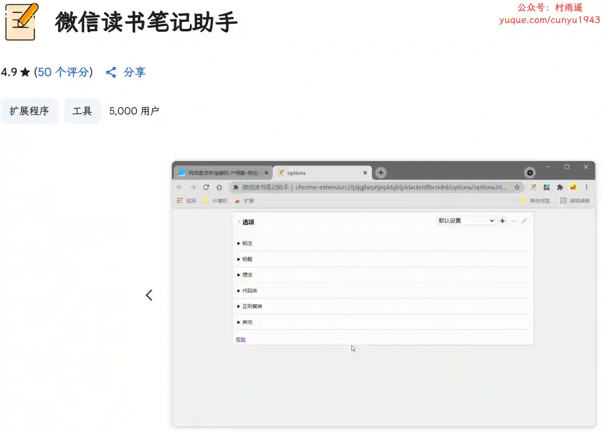
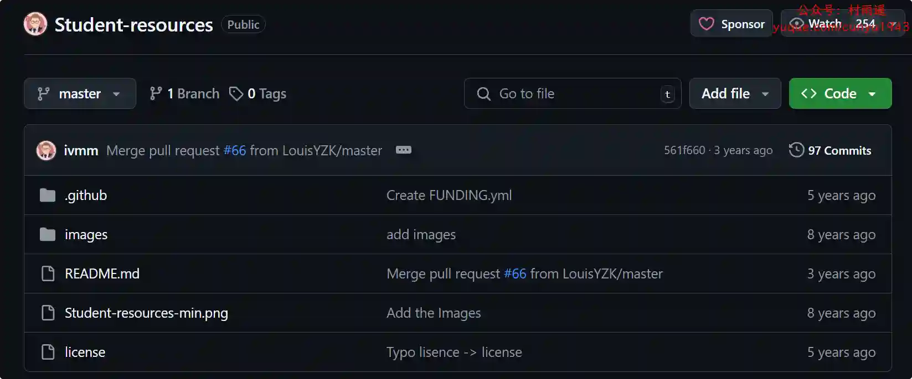
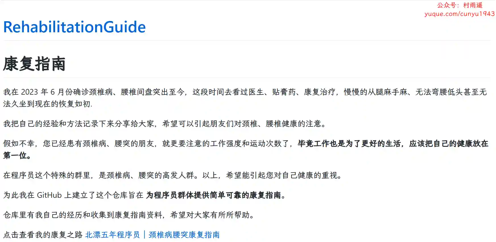

# 好物周刊#104：星球视频

> 作者：[村雨遥](https://github.com/cunyu1943)
> 
> 不要哀求，学会争取，若是如此，终有所获
> 
> 原文：https://mp.weixin.qq.com/s/je2Ok9qWuv-TK8CD7uNyEg

## 🎈 号外 

最近，公众号之外，建立了微信交流群，不定期会在群里分享各种资源（影视、IT 编程、考试提升……）&知识。如果有需要，可以**扫码或者后台添加小编微信备注入群**。进群后**优先看群公告**，**呼叫群中【资源分享小助手】**，还能免费帮找资源哦～

 

## 一、项目

### 1. [SnowAdmin](https://github.com/WANG-Fan0912/SnowAdmin)

一个清新优雅、高颜值且功能强大的后台管理模板，基于最新的前端技术栈，包括 Vue3, Vite5, TypeScript, Pinia。它内置了丰富的主题配置和组件，代码规范严谨，实现了自动化的文件路由系统。SnowAdmin 提供了一站式的后台管理解决方案，无需额外配置，开箱即用。

### 2. [Univer](https://github.com/dream-num/univer)

一个前后端同构的全栈开发框架，可以在 web 端和服务端创建、编辑电子表格、文档以及幻灯片。

### 3. [Kirara AI](https://github.com/lss233/kirara-ai)

一款支持主流大语言模型、主流聊天平台的聊天的机器人！支持快速接入微信、 QQ、Telegram 等聊天平台。支持 DeepSeek、Grok、Claude、Ollama、Gemini、OpenAI 等大模型，具备工作流系统、网页搜索、AI 画图、人设调教、虚拟女仆、语音对话等功能。

## 二、软件

### 1. [极狐加速器](https://jihujiasuqi.com)

采用开源，可以说是安全性拉满，专门针对网络游戏延迟优化，一键因网络问题造成的游戏卡顿、延迟、掉线、加载缓慢等一系列问题，完全免费无套路，游戏体验提升 1000%，永久免费加速，为你提供更好的游戏操作体验，为游戏玩家解决延迟、掉线、卡机，高 ping 等网络问题，有效提升网络稳定性，极致降低延迟。

### 2. [星球视频](https://xq123321.buzz)

还在为下载各个影视 APP 而烦恼么，聚合各大平台高清影视资源。引爆视觉，横扫剧荒，人手一星球，追剧真上头！

### 3. [HexHub](https://www.hexhub.cn)

为程序员和运维人员量身打造的一站式开发运维利器，先进的数据库、Docker、SSH、SFTP 桌面 GUI 工具。

## 三、网站

### 1. [读典籍](https://dudianji.com)

提供丰富的中华经典阅读体验，包括文白对照、交互式注释及导读工具。平台让阅读古籍变得轻松有趣，提供文章分节、人物、事件等丰富的阅读辅助功能。

### 2. [蚂蚁 PPT](https://www.antppt.com)

一个 AI 在线智能生成 PPT 的平台，主要功能包括：AI 智能写 PPT，PPT 在线编辑、修改和导出，提供根据主题，文档，文本等多种方式生成ppt。

### 3. [全球地铁线路图与查询指南](https://www.metrolinehub.com/)

如果您需要使用简化的地铁线路图查找您的位置、目的地或景点，那么你一定需要它。网站提供嵌入地图中的世界各地地铁线路，让我们能够在地图上可视化路线并清晰地了解地铁系统。

## 四、插件

### 1. [Fleeting Notes](https://chromewebstore.google.com/detail/fleeting-notes/gcplhmogdjioeaenmehmapbdonklmdnc?hl=zh-CN)

快速，高效，安全的笔记的最终解决方案。无论您是在使用手机、平板电脑还是浏览网页，都可以在瞬间捕捉到您的想法，使它们保持有序和可访问，同时保持对数据的控制，搭配 Obsidian 使用更高效。

### 2. [GoodPlan](https://chromewebstore.google.com/detail/goodplan-每日笔记作为新标签页/icokiikdmaaecdehkchflilmbmmedpga)

把你的日常待办事项列表，变成你的浏览器新标签页。

### 3. [微信读书笔记助手](https://chromewebstore.google.com/detail/微信读书笔记助手/cmlenojlebcodibpdhmklglnbaghpdcg?hl=zh-CN)

一个还不错的微信读书笔记工具，方便你导出书本标注等内容，尤其对常使用 Markdown 做笔记的用户比较有帮助。

## 五、资料

### 1. [Student-resources](https://github.com/ivmm/Student-resources)

主要介绍利用学生、教职工身份可以享受到的相关学生优惠、教育优惠或教师优惠的权益。

### 2. [颈椎病康复指南](https://github.com/AnsonZnl/RehabilitationGuide)

颈椎病腰突康复指南，为程序员群体提供简单可靠的康复指南，希望以此能唤醒大家对颈椎、腰椎健康的注意。

### 3. [Jest 实践指南](https://github.com/haixiangyan/jest-tutorial)

结合了作者自身实践、Kent C. Dodds 文章、StackOverflow、Github Issue 以及别的博客最终总结出来的一套实践指南。主要包括基础实践、测试思路、项目实践方面的内容。

 

## ✍️ 说明

周刊专栏相关信息：

- **项目地址**：[Github](https://github.com/cunyu1943/weekly)，觉得不错麻烦给我一个**Star**，感谢 ❤️
- **浏览地址**：公众号 | [电子书](https://cunyu1943.github.io/weekly) | [语雀](https://yuque.com/cunyu1943/weekly)

如果你阅读到这里，说明我的工作没有白费。如果你想推荐项目/网站/软件/资源，欢迎提交 **[issue](https://github.com/cunyu1943/weekly/issues)** 或者添加我 **个人微信：coder_cunYu** 与我交流。

---

## ⏳ 联系

想解锁更多知识？不妨关注我的微信公众号：**村雨遥（id：JavaPark）**。

扫一扫，探索另一个全新的世界。

