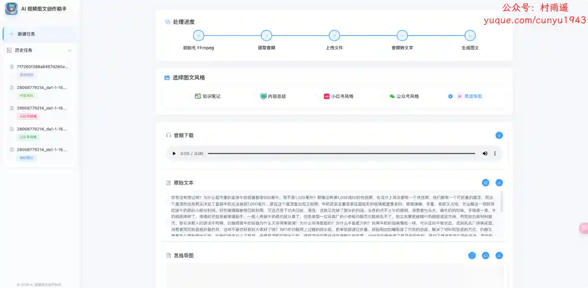
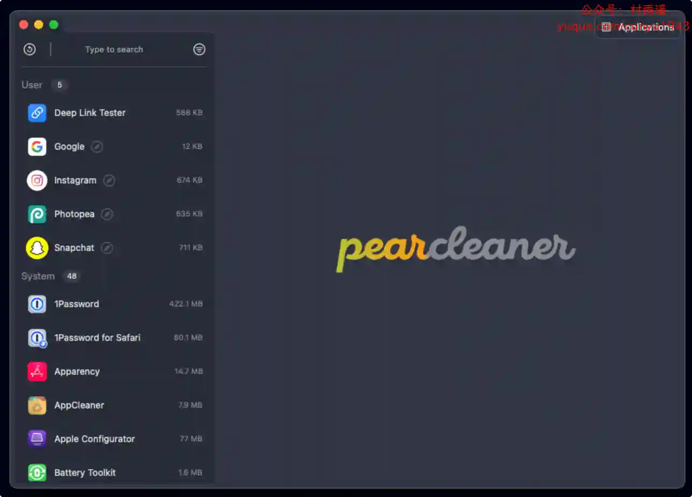
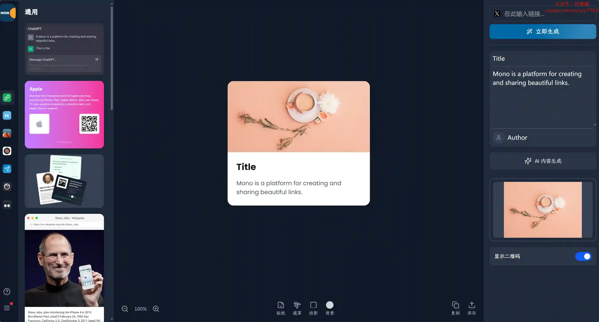
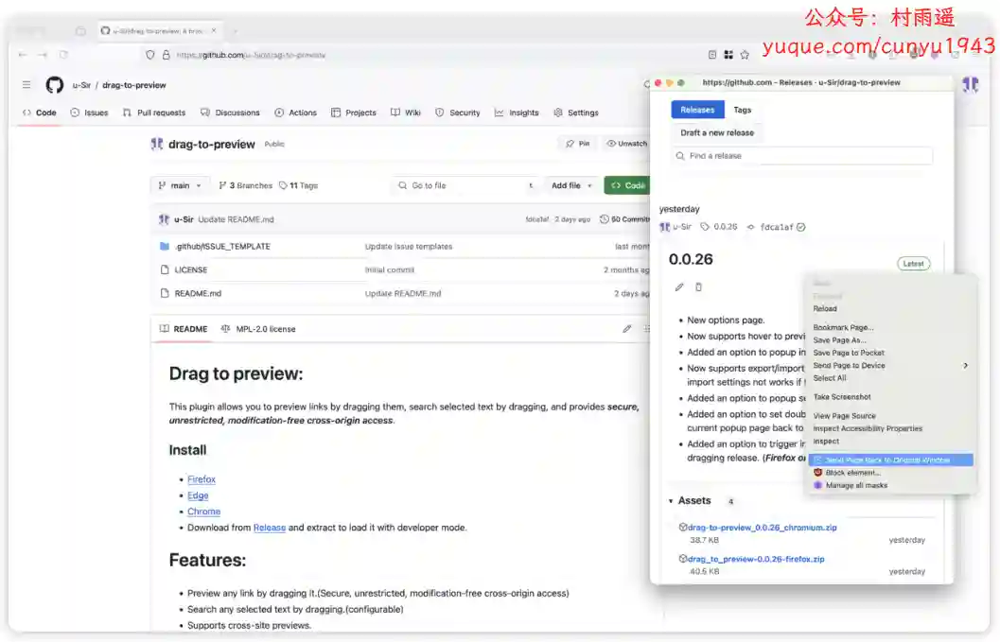
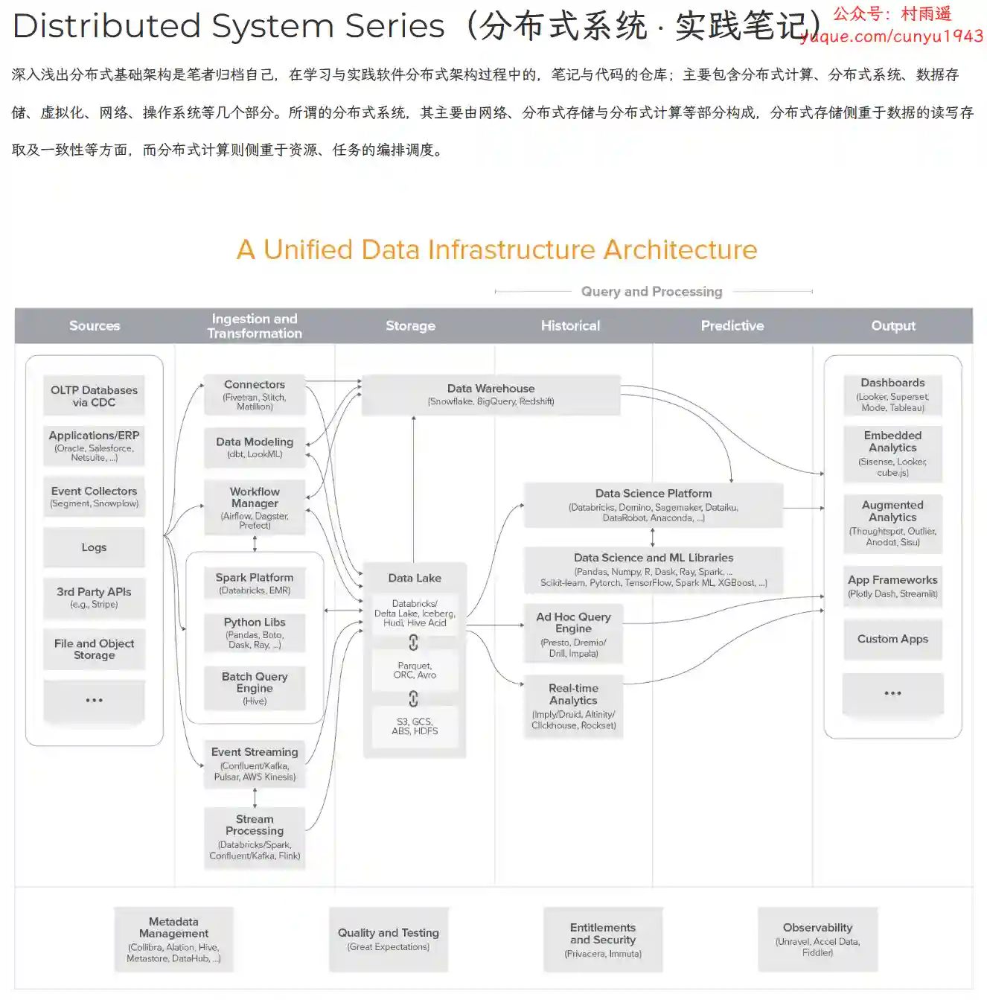

# 好物周刊#105：视频图文创作助手

> 作者：[村雨遥](https://github.com/cunyu1943)
> 
> 不要哀求，学会争取，若是如此，终有所获
> 
> 原文：https://mp.weixin.qq.com/s/8AHg7McS5VFzkpCa6afzxg

## 🎈 号外 

最近，公众号之外，建立了微信交流群，不定期会在群里分享各种资源（影视、IT 编程、考试提升……）&知识。如果有需要，可以**扫码或者后台添加小编微信备注入群**。进群后**优先看群公告**，**呼叫群中【资源分享小助手】**，还能免费帮找资源哦～

 

## 一、项目

### 1. [DeepWiki-Open](https://github.com/AsyncFuncAI/deepwiki-open)

开源 DeepWiki，用于 GitHub/Gitlab/Bitbucket 仓库的人工智能 Wiki 生成器。

### 2. [AI 视频图文创作助手](https://github.com/hanshuaikang/AI-Media2Doc)

一键将视频和音频转化为小红书/公众号/知识笔记/思维导图等各种风格的文档。

### 3. [SiteProxy](https://github.com/netptop/siteproxy)

一个功能强大的在线代理工具，采用了最新的技术，提升了代理的稳定性和兼容性。致力于提供 简单、高效、安全的代理服务，为用户提供最佳的互联网访问体验。

## 二、软件

### 1. [Pearcleaner](https://github.com/alienator88/Pearcleaner)

一个免费的，开源的 Mac 应用程序清洁器，灵感来自 Freemacsoft 的 AppCleaner。项目的诞生原因是想要更多地了解 macOS 如何处理应用程序的安装/卸载，并获得更多的 Swift 经验。

### 2. [Leawo 免费屏幕录像机](https://www.leawo.org/zh-CN/free-screen-recorder/)

免费屏幕录像机组合，可记录屏幕活动、记录网络摄像头内容、记录系统声音和/或麦克风声音，以保存为屏幕截图、音频和/或最多 4K 免费无水印的屏幕录制视频。

### 3. [烽翎](https://fengling.nocmt.com/)

跨系统同步剪贴板与管理云端文件，一触即达的云端文件管理工具。

## 三、网站

### 1. [物言卡片](https://mono.cards/)

将任何内容转化为精美的视觉卡片，在社交媒体上更出众、更抓眼，包括链接、音乐、文章、文字、代码等。

### 2. [FolderPort](https://folderport.com)

基于 P2P 技术，让你随时随地快速、安全地分享文件夹。无需安装任何软件，突破文件大小限制，告别文件分割烦恼，轻松传输任意大小文件，打开浏览器即可开始分享。

### 3. [数字素养网](https://szsyw.cn/)

提升个人在学习工作生活中利用数字技术获取、加工、使用、管理和评价数字信息和资源，发现、分析和解决问题的一系列素质与能力的学习社区。

## 四、插件

### 1. [TabBoost](https://chromewebstore.google.com/detail/tabboost/pnpabkdhbbjmahfnhnfhpgfmhkkeoloe)

为 Chrome 带来了受 Arc 浏览器启发的最佳标签管理功能，使您的浏览更加高效和愉快，帮助更高效地管理标签页。

### 2. [Peek Pop](https://chromewebstore.google.com/detail/peek-pop/fjllepdpgikphekgbinhpdkalliiejdh?hl=zh-CN)

一个开源插件，可在弹窗中预览、搜索和收集链接以供稍后阅读，可以通过以下方式触发：拖拽、悬停、点击、长按。

### 3. [ChatX](https://chromewebstore.google.com/detail/chatx-你的智能网页浏览助手/mfkfdcmahjobmohdhpgbhflegccgnmec)

基于人工智能的网页浏览助手，在所有网站都可用。能够回答任何复杂问题，还可以帮你自动化的总结网页、翻译内容以及增强搜索体验。

## 五、资料

### 1. [Developer-Zero-To-Mastery](https://github.com/wx-chevalier/Developer-Zero-To-Mastery)

包含程序员的技术视野、知识管理与职业规划，提高个人与团队的研发效能等方面的内容。

### 2. [Web-Notes](https://github.com/wx-chevalier/Web-Notes)

现代 Web 开发语法基础与工程实践，涵盖 Web 开发基础、前端工程化、应用架构、性能与体验优化、混合开发、React 实践、Vue 实践、WebAssembly 等多方面。

### 3. [深入浅出分布式基础架构](https://github.com/wx-chevalier/DistributedSystem-Notes)

笔者归档自己在学习与实践软件分布式架构过程中的笔记与代码，主要包含分布式计算、分布式系统、数据存储、虚拟化、网络、操作系统等几个部分。

## ✍️ 说明

周刊专栏相关信息：

- **项目地址**：[Github](https://github.com/cunyu1943/weekly)，觉得不错麻烦给我一个**Star**，感谢 ❤️
- **浏览地址**：公众号 | [电子书](https://cunyu1943.github.io/weekly) | [语雀](https://yuque.com/cunyu1943/weekly)

如果你阅读到这里，说明我的工作没有白费。如果你想推荐项目/网站/软件/资源，欢迎提交 **[issue](https://github.com/cunyu1943/weekly/issues)** 或者添加我 **个人微信：coder_cunYu** 与我交流。

---

## ⏳ 联系

想解锁更多知识？不妨关注我的微信公众号：**村雨遥（id：JavaPark）**。

扫一扫，探索另一个全新的世界。

