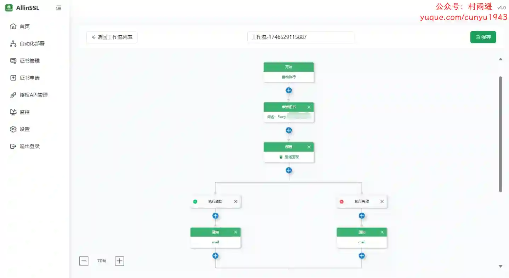
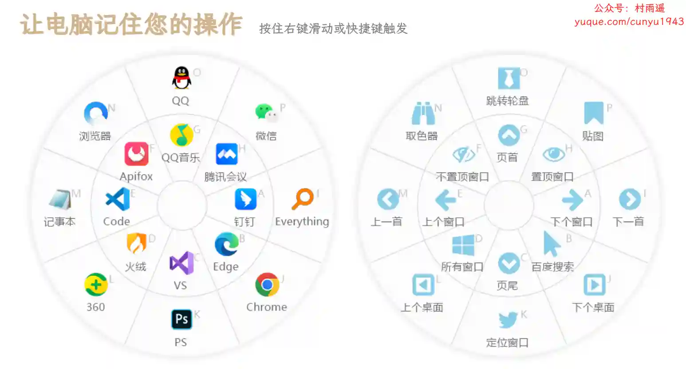
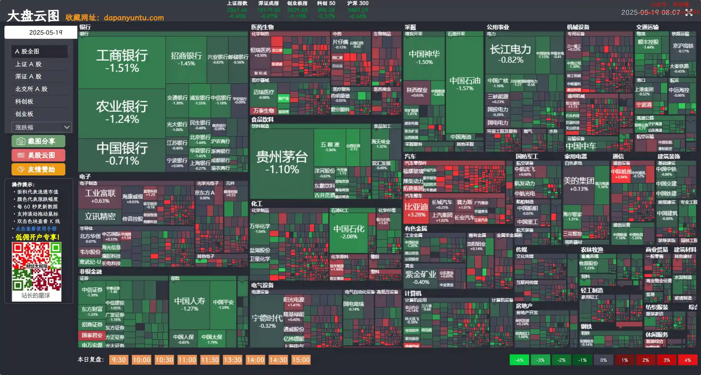

# 好物周刊#107：大盘云图

> 作者：[村雨遥](https://github.com/cunyu1943)
> 
> 不要哀求，学会争取，若是如此，终有所获
> 
> 原文：https://mp.weixin.qq.com/s/fBaVwYfQJFNLoed24zhW2g

## 🎈 号外 

最近，公众号之外，建立了微信交流群，不定期会在群里分享各种资源（影视、IT 编程、考试提升……）&知识。如果有需要，可以**扫码或者后台添加小编微信备注入群**。进群后**优先看群公告**，**呼叫群中【资源分享小助手】**，还能免费帮找资源哦～

 

## 一、项目

### 1. [All in SSL](https://github.com/allinssl/allinssl)

一个集证书申请、管理、部署和监控于一体的 SSL 证书全生命周期管理工具。

### 2. [vitepress-theme-teek](https://github.com/Kele-Bingtang/vitepress-theme-teek)

一个轻量、简洁高效、灵活配置的 VitePress 主题。

### 3. [WeClone](https://github.com/xming521/WeClone)

从聊天记录创造数字分身的一站式解决方案，使用聊天记录微调大语言模型，让大模型有 “那味儿”，并绑定到聊天机器人，实现自己的数字分身。 

## 二、软件

### 1. [好用便签](https://www.haoyong333.com)

一款简单易用免费无广告的电脑桌面便签软件工具，电脑端手机端云同步，贴边自动隐藏，一键加密，用于记录笔记、待办事项、任务清单、日程提醒、短信提醒等，支持团队多人共享。

### 2. [MousePlus](https://mouseplus.cn)

一款轻便小巧的鼠标右键增强工具，使用鼠标右键拖动即可唤醒鼠标轮盘，功能界面和操作逻辑类似 quicker。同时还支持自定义快捷键功能，可以根据用户的使用习惯和需求，设置不同的快捷键来执行各种操作，提高工作效率。

### 3. [Effidit](https://effidit.qq.com)

腾讯 AI Lab 开发的一个研究性原型系统，探索用 AI 技术提升写作者的写作效率和创作体验。

## 三、网站

### 1. [大盘云图](https://dapanyuntu.com)

颠覆了以往看盘软件一成不变的红涨绿跌，它将所有股票按所属行业进行了板块划分，并以方块形式展示，用红色和绿色的深浅代表涨跌幅度，实现直观的展现大盘的全景图，适合股票爱好者和专业投资人使用盯盘使用，还可从不同的周期、资金流向、涨跌幅及量比等维度实时查看大盘最新数据。

### 2. [风鸟](https://riskbird.com/#/?inviteCode=15062F23C105437B)

一款信用查询监控平台，核心功能：查公司、查人员、查关系、企业查、查老赖，提供便捷的工商信用查询、企业信息报告下载、主体信用报告下载、风险预警监控、关联族谱查询、营业执照查询等服务。为您提供全国企业信息查询，包括企业工商信息查询，信用信息查询，经营状况查询等相关信息。

### 3. [听脑 AI](https://itingnao.com)

专业智能录音助手，采用 AI 技术实现实时语音转写，准确率 98%。支持会议记录、课堂笔记、销售通话等场景，提供实时转写、多人识别、智能总结功能。快速处理本地及网络音视频，支持多语言，3 分钟总结 1 小时会议内容，让沟通更高效。

## 四、插件

### 1. [视频下载器](https://chromewebstore.google.com/detail/视频下载器-mpmux/mbflpfaamifmmmkdjkcmpofpccfmlmap)

一款适用于下载网络视频的扩展程序，与大多数视频下载扩展程序相比，它有所不同，因为它除了可以下载普通的 mp4、webm 视频之外，还可以下载 HLS 视频、HLS 直播流（HLS 视频是目前网络上流行的视频播放方式），无需借助第三方工具即可将 HLS 流输出为单个 mp4 文件。

### 2. [EditThisCookie](https://chromewebstore.google.com/detail/editthiscookie/cmbkolgnkghmgajbbapoicfhjlabmpef)

一个 cookie 管理器，支持添加，删除，编辑，搜索，锁定和屏蔽 cookies。

### 3. [Tabrr仪表板](https://chromewebstore.google.com/detail/tabrr仪表板-带有ai的新标签页/ehmneimbopigfgchjglgngamiccjkijh)

带有 AI 的新标签页，个人仪表板组织书签、收藏的网站，并从起始页提供对 ChatAI 的访问。

## 五、资料

### 1. [ChinaTextbook](https://github.com/TapXWorld/ChinaTextbook)

所有小初高、大学 PDF 教材开源合集，仓库维护着的初心是促进义务教育的普及和消除地区间的教育贫困。

### 2. [机器学习系列课程 - 温州大学](https://github.com/fengdu78/WZU-machine-learning-course)

温州大学《机器学习》课程资料（代码、课件等），黄海广老师主讲。

### 3. [The Resources about PL and Compiler](https://github.com/shining1984/PL-Compiler-Resource)

收集程序语言与编译技术相关资源。目前收集的资料主要分为课程、书籍、论文、项目、博客和会议（论坛），已经收集课程 78+，书籍 81+，项目 26+，博客 32+，会议 & 杂志 15+, 论文 68+，持续更新中。

## ✍️ 说明

周刊专栏相关信息：

- **项目地址**：[Github](https://github.com/cunyu1943/weekly)，觉得不错麻烦给我一个**Star**，感谢 ❤️
- **浏览地址**：公众号 | [电子书](https://cunyu1943.github.io/weekly) | [语雀](https://yuque.com/cunyu1943/weekly)

如果你阅读到这里，说明我的工作没有白费。如果你想推荐项目/网站/软件/资源，欢迎提交 **[issue](https://github.com/cunyu1943/weekly/issues)** 或者添加我 **个人微信：coder_cunYu** 与我交流。

---

## ⏳ 联系

想解锁更多知识？不妨关注我的微信公众号：**村雨遥（id：JavaPark）**。

扫一扫，探索另一个全新的世界。

