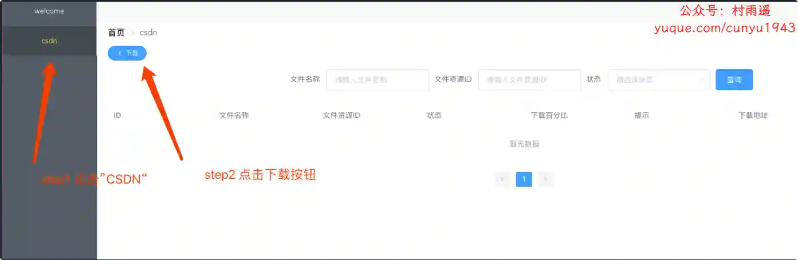
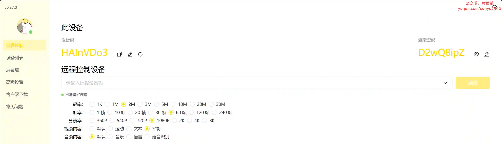
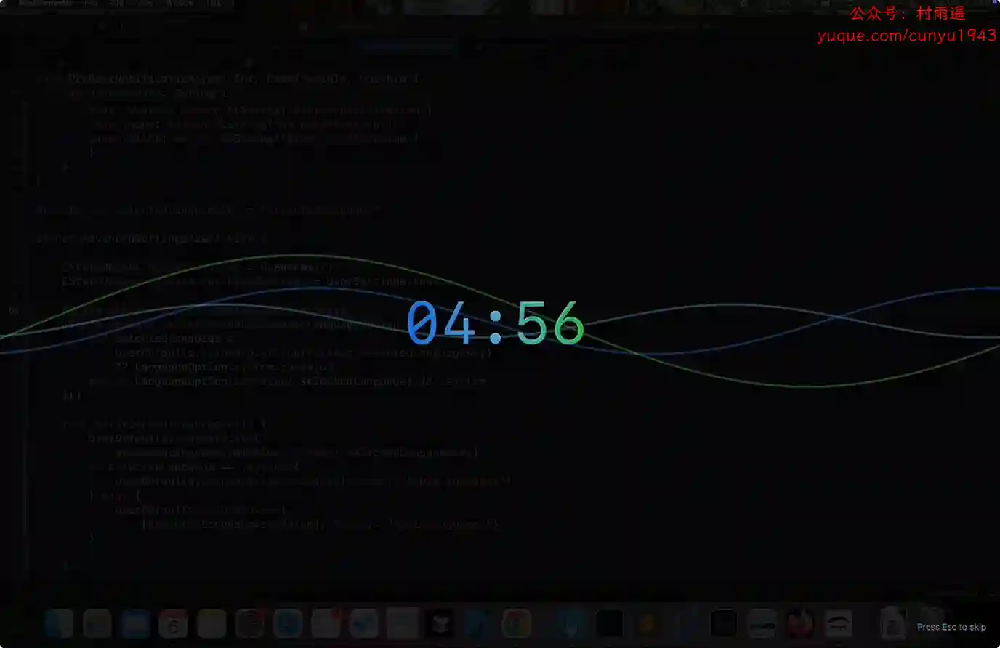
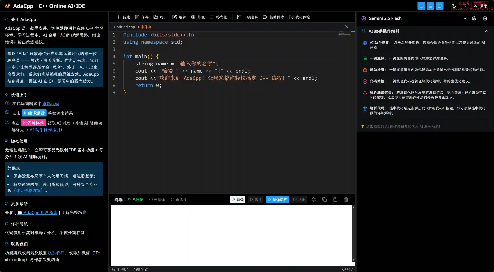
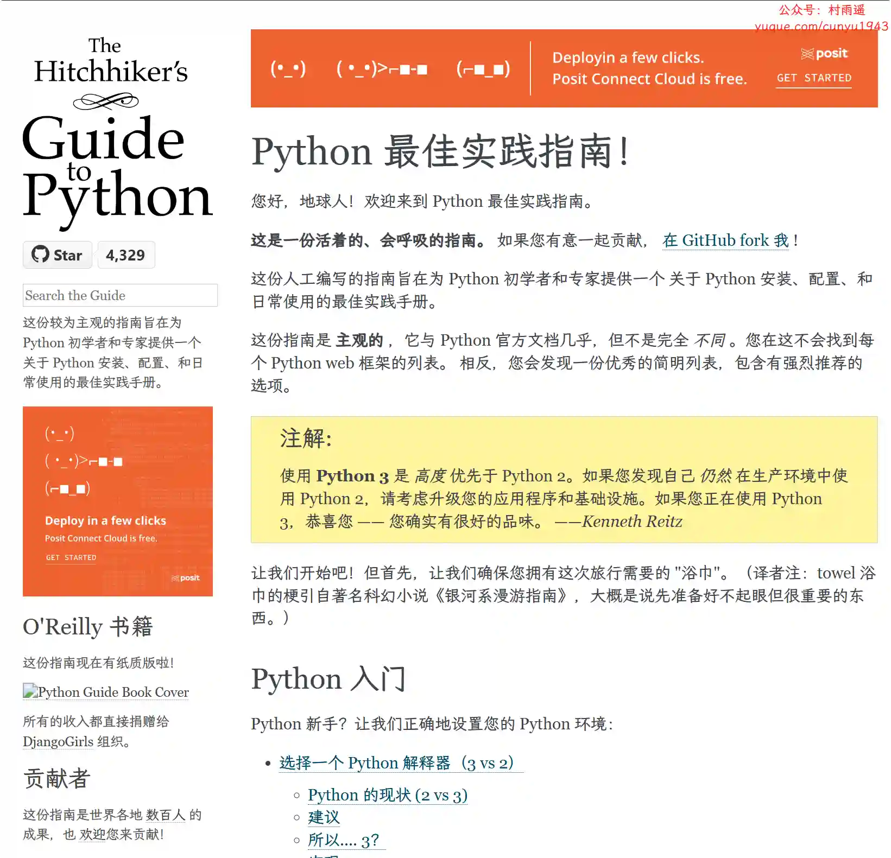
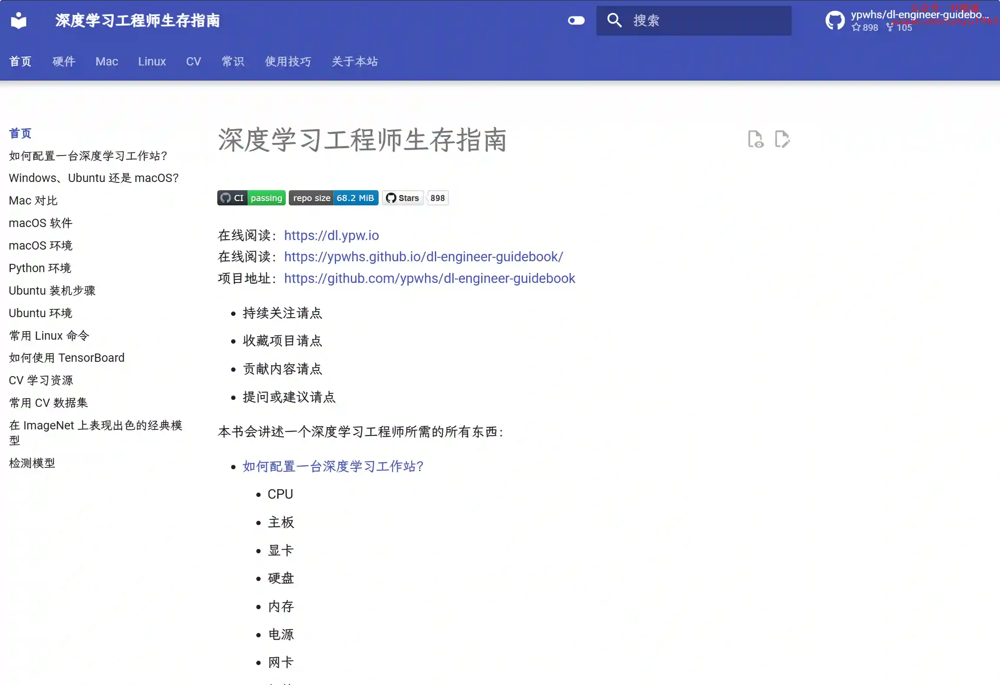

# 好物周刊#113：简历模板

> 作者：[村雨遥](https://github.com/cunyu1943)
> 
> 不要哀求，学会争取，若是如此，终有所获
> 
> 原文：https://mp.weixin.qq.com/s/muTBoTstmVPzJRgDVHHANw

## 🎈 号外 

最近，公众号之外，建立了微信交流群，不定期会在群里分享各种资源（影视、IT 编程、考试提升……）&知识。如果有需要，可以**扫码或者后台添加小编微信备注入群**。进群后**优先看群公告**，**呼叫群中【资源分享小助手】**，还能免费帮找资源哦～

## 一、项目

### 1. [91Writing](https://github.com/ponysb/91Writing)

一个基于 Vue 3 + Element Plus 的智能 Ai 小说创作工具，集成多种 AI 模型，助力作者高效创作。

### 2. [Typing Word](https://github.com/zyronon/typing-word)

可在网页上使用的背单词软件，内置了常用的 CET-4 、CET-6 、GMAT 、GRE 、IELTS 、SAT 、TOEFL 、考研英语、专业四级英语、专业八级英语，也有程序员常见英语单词以及多种编程语言 API 等词库。

### 3. [CSDN 资源下载工具](https://github.com/bigintpro/csdn_downloader)

CSDN 免积分下载，免会员下载，付费内容下载体验地。

## 二、软件

### 1. [火星搜题](https://www.ktyyapp.cn)

一款免费的大学搜题学习软件，包含学习题目、课后答案及主流网课平台答案，与此同时，还有考研、教师导游、专升本、计算机等资料，支持悬浮窗搜题。

### 2. [BilldDesk 远程桌面控制](https://github.com/galaxy-s10/billd-desk)

基于 Vue3 + WebRTC + Nodejs + Electron 搭建的远程桌面控制。

### 3. [BlinkAway](https://greatwhole90.com/apps/BlinkAway)

通过智能休息提醒帮助您保持健康的工作习惯。自定义休息间隔，追踪您的习惯，改善 Mac 上的工作生活平衡。

## 三、网站

### 1. [简历模板](https://cv-template.online)

提供 2025 年多种免费简历模板，帮助求职者轻松制作专业简历。我们的模板简洁美观，适用于不同职业和行业，免费下载使用，能够让你在求职过程中脱颖而出！

### 2. [EXIF 水印生成器](https://exifframe.org)

创建精美的相机水印。免费在线工具，为您的照片添加专业的相机信息水印。支持佳能、尼康、索尼、iPhone 等 30+ 相机品牌。自动识别 EXIF 数据，可定制模板，即时导出。

### 3. [今日热榜](https://hot.liushen.fun)

汇聚全网热点，热门尽览无余，免费无广告。

## 四、插件

### 1. [浸入式学语言助手](https://github.com/xiao-zaiyi/illa-helper)

一款基于"可理解输入"理论的浏览器扩展，帮助你在日常网页浏览中自然地学习语言。

### 2. [AiHome 新标签页](https://chromewebstore.google.com/detail/jfkpodihjheodhnjcncinhgpcdfldmpn?utm_source=item-share-cb)

集成 GPT-4 和 DeepSeek，随时随地进行高级 AI 搜索、阅读、写作和办公，提升工作效率。

### 3. [万能搜 Max](https://chromewebstore.google.com/detail/idnggfmcbibblkcobnobnjgameidlhhl?utm_source=item-share-cb)

一款强大的多平台聚合搜索工具，让您一次性在多个搜索引擎、社交平台、AI 工具及专业网站中快速找到所需信息，大幅提升信息获取效率。

## 五、资料

### 1. [AdaCpp](https://www.adacpp.com)

专业的 C++ 在线开发环境，集成 AI 助手、Monaco 编辑器、GCC 编译器。支持实时编译、智能代码分析、错误诊断。免费使用，无需安装，适合 C++ 学习和开发。

### 2. [Python 最佳实践指南中文版](https://github.com/Prodesire/Python-Guide-CN)

Python 最佳实践指南，旨在为 Python 初学者和专家提供一个关于 Python 安装、配置和日常使用的最佳实践手册。

### 3. [深度学习工程师生存指南](https://github.com/ypwhs/dl-engineer-guidebook)

讲述一个深度学习工程师所需的所有东西。

## ✍️ 说明

周刊专栏相关信息：

- **项目地址**：[Github](https://github.com/cunyu1943/weekly)，觉得不错麻烦给我一个**Star**，感谢 ❤️
- **浏览地址**：公众号 | [电子书](https://cunyu1943.github.io/weekly) | [语雀](https://yuque.com/cunyu1943/weekly)

如果你阅读到这里，说明我的工作没有白费。如果你想推荐项目/网站/软件/资源，欢迎提交 **[issue](https://github.com/cunyu1943/weekly/issues)** 或者添加我 **个人微信：coder_cunYu** 与我交流。

---

## ⏳ 联系

想解锁更多知识？不妨关注我的微信公众号：**村雨遥（id：JavaPark）**。

扫一扫，探索另一个全新的世界。

