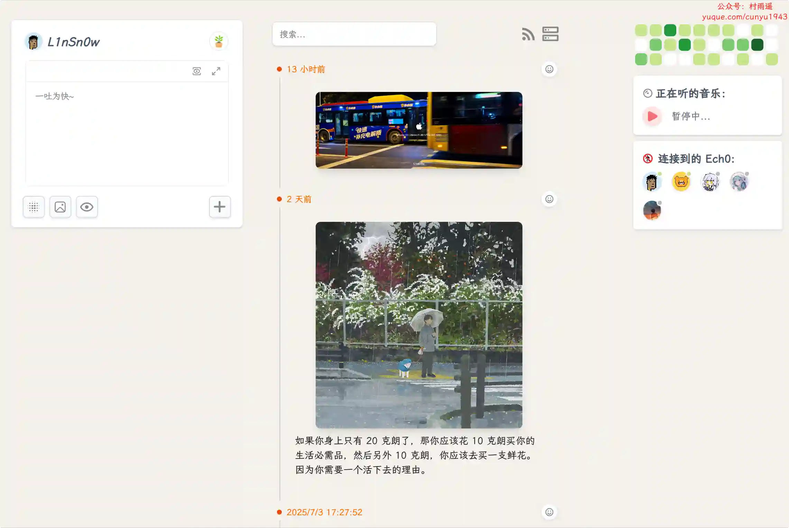
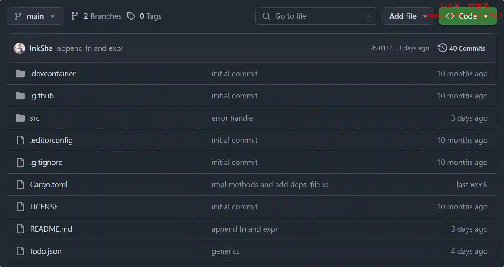
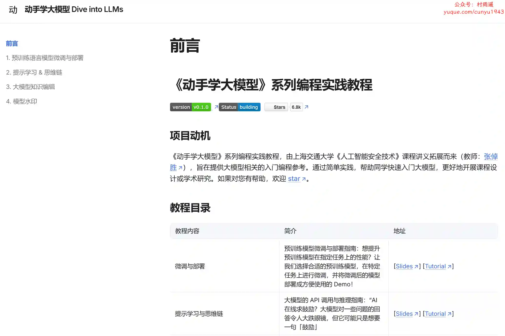

# 好物周刊#114：素材搜搜

> 作者：[村雨遥](https://github.com/cunyu1943)
> 
> 不要哀求，学会争取，若是如此，终有所获
> 
> 原文：https://mp.weixin.qq.com/s/CyWlXefUrgvYb1W5H2Nc_g

## 🎈 号外

最近，公众号之外，建立了微信交流群，不定期会在群里分享各种资源（影视、IT 编程、考试提升……）&知识。如果有需要，可以**扫码或者后台添加小编微信备注入群**。进群后**优先看群公告**，**呼叫群中【资源分享小助手】**，还能免费帮找资源哦～

 

## 一、项目

### 1. [Mall-Cook](https://github.com/wangyuan389/mall-cook)

一个基于 vue 开发的可视化商城搭建平台，包括多页面可视化构建、Json Schema 生成器（可视化搭建物料控制面板），实现组件流水线式标准接入平台。最新版本使用 uni-app 重构物料、模板项目，支持生成 H5、小程序多端商城。

### 2. [Forest](https://github.com/dromara/forest)

一个高层的、极简的声明式 HTTP 调用 API 框架。相比于直接使用 Httpclient 您不再用写一大堆重复的代码了，而是像调用本地方法一样去发送 HTTP 请求。

### 3. [Ech0](https://github.com/lin-snow/Ech0)

一款专为轻量级分享而设计的开源自托管平台，支持快速发布与分享你的想法、文字与链接。简单直观的操作界面，轻松管理你的内容，让分享变得更加自由，确保数据完全掌控，随时随地与世界连接。

## 二、软件

### 1. [Reeden](https://reeden.app)

一个 AI 驱动的全平台电子书阅读器，它可以帮助你快速阅读电子书，并提供智能化的阅读体验。支持多平台，智能笔记，语音朗读等功能。

### 2. [联想扫描王](https://static.xue.lenovomm.com/scannerpc.html)

一款免费专业的扫描软件，支持 PC、手机、平板秒变高清扫描仪。你的“掌上扫描仪”，让工作更高效，学习更轻松。

### 3. [MediaNex](https://github.com/medianexapp)

一个强大的视频播放器，支持各种协议和云盘，自动为视频生成精美的海报墙。

## 三、网站 

### 1. [素材 SoSo](https://clipso.agilestudio.cn)

一个 AI 智能素材搜索引擎，能帮助内容创作者快速找到免版权视频和图片素材。

### 2. [CodeBox](https://www.codebox.club)

专业的智能二维码生成平台，支持 URL、WiFi、文本等多种类型二维码创建。提供个性化样式定制、实时预览、数据追踪分析等功能。轻松生成高颜值二维码，智能管理扫码数据，助力提升营销效果和用户体验。

### 3. [XCloud 音乐](https://music.xcloudv.top)

在线听歌，跨平台音乐播放器，支持网易云、酷狗、酷我多平台！

## 四、插件

### 1. [Pip-Helper](https://chromewebstore.google.com/detail/pip-helper-picture-in-pic/emfmcmaapkkmfogeamhofioabkaifpcg)

一款简单易用的浏览器扩展，帮助您在任何网页上使用画中画功能观看视频。

### 2. [UpSeller](https://chromewebstore.google.com/detail/gbnfheoijkjfgeobhbkpgdkfabihjonj?utm_source=item-share-cb)

帮助卖家一键采集拉美主流电商平台（例如：亚马逊、美客多等）产品信息并发布到自己的店铺，省时省力。采集的信息包括：标题、描述、图片、价格等。

### 3. [有道灵动翻译](https://chromewebstore.google.com/detail/jlpcnoohcpfgpbalhlggdhjocgnlgafn?utm_source=item-share-cb)

使用有道翻译大模型，沉浸式网页翻译的首选工具！支持以下功能：

-   实时对照翻译：让任何网页变成对照。
-   图片翻译：轻松提取图片文字
-   输入框即时翻译：输入中文轻松变英文。

## 五、资料

### 1. [Rust Tutorial](https://github.com/InkSha/rust-tutorial)

一个针对新手的 Rust 快速教程，教你从零实现一个简单用于记录 Todo 事项的 CLI (Command Line Interface, 命令行接口) 程序。

### 2. [动手学大模型](https://github.com/Lordog/dive-into-llms)

《动手学大模型》系列编程实践教程，由上海交通大学 2024 年春季《人工智能安全技术》课程（NIS3353）讲义拓展而来，旨在提供大模型相关的入门编程参考。本教程属公益性质、完全免费。通过简单实践，帮助同学们快速入门大模型，更好地开展课程设计或学术研究。

### 3. [VitePress 教程](https://github.com/Yiov/vitepress-doc)

给零基础的朋友，提供一些上手经验，让你爱上 VitePress。

## ✍️ 说明

周刊专栏相关信息：

- **项目地址**：[Github](https://github.com/cunyu1943/weekly)，觉得不错麻烦给我一个**Star**，感谢 ❤️
- **浏览地址**：公众号 | [电子书](https://cunyu1943.github.io/weekly) | [语雀](https://yuque.com/cunyu1943/weekly)

如果你阅读到这里，说明我的工作没有白费。如果你想推荐项目/网站/软件/资源，欢迎提交 **[issue](https://github.com/cunyu1943/weekly/issues)** 或者添加我 **个人微信：coder_cunYu** 与我交流。

---

## ⏳ 联系

想解锁更多知识？不妨关注我的微信公众号：**村雨遥（id：JavaPark）**。

扫一扫，探索另一个全新的世界。

