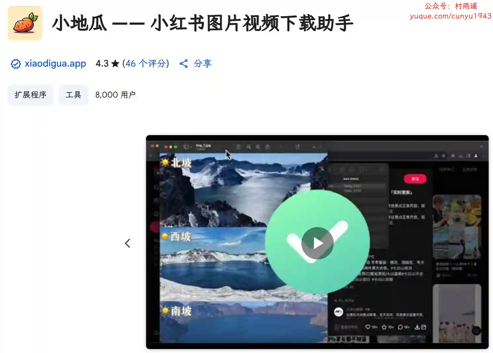
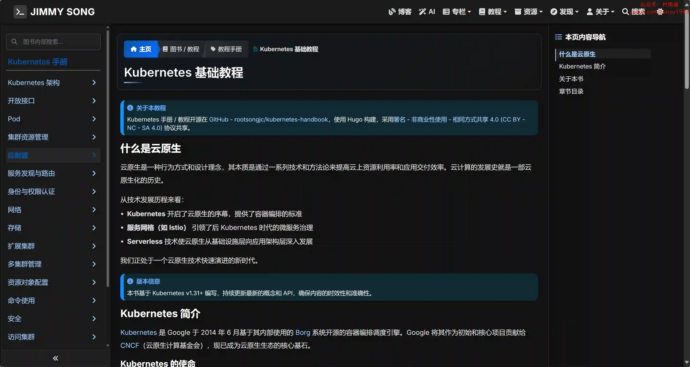
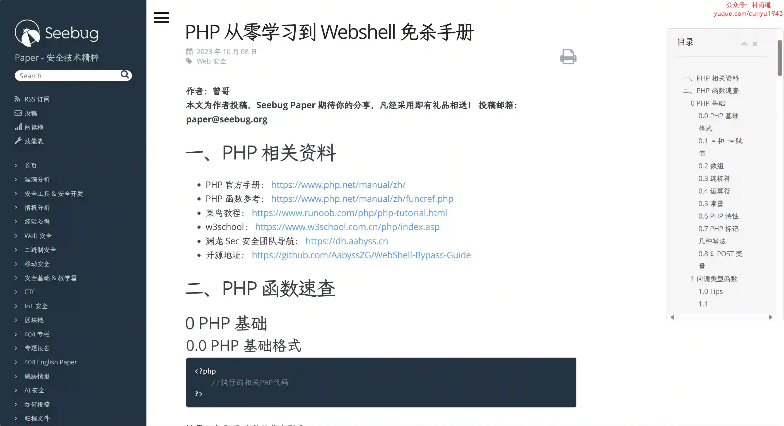

# 好物周刊#116：视频创作 APP

> 作者：[村雨遥](https://github.com/cunyu1943)
> 
> 不要哀求，学会争取，若是如此，终有所获
> 
> 原文：https://mp.weixin.qq.com/s/NSFAGp5H9-hT91Qzh-zWJA

## 🎈 号外 

最近，公众号之外，建立了微信交流群，不定期会在群里分享各种资源（影视、IT 编程、考试提升……）&知识。如果有需要，可以**扫码或者后台添加小编微信备注入群**。进群后**优先看群公告**，**呼叫群中【资源分享小助手】**，还能免费帮找资源哦～

## 一、项目

### 1. [好享记账前端](https://github.com/suyu610/journal-flutter)

一个基于 flutter 开发的，跨端 AI 记账 APP。实现了多人记账、语音记账、截屏快捷记账、自然语言记账等功能。项目开源，前端源码仓库。

### 2. [好享记账后端](https://github.com/suyu610/journal-server)

一个基于 flutter 开发的，跨端 AI 记账 APP。实现了多人记账、语音记账、截屏快捷记账、自然语言记账等功能。项目开源，后端源码仓库，使用 Java、MySQL、Redis。

### 3. [HubProxy](https://github.com/sky22333/hubproxy)

基于 Go 的自托管轻量级、高性能的多功能代理加速服务，提供 Docker 镜像加速、GitHub 加速、下载离线镜像等功能。单域名实现所有功能，支持仓库审计。流式转发，无缓存。

## 二、软件

### 1. [PicSeed](https://picseed.com)

图片图文收藏助手，微博、小红书、抖音、推特、Instagram、Spotify、AppleMusic、即刻等平台图片批量下载。

### 2. [快影](https://h5.kwaiying.com/officialWebsite)

一款强大而易于使用的视频剪辑软件，它提供各种工具和特效帮助您快速制作专业的视频，一键分享快手。快影官网为您提供快影 APP 免费下载服务，移动端包含安卓版与苹果版，快来体验吧！

### 3. [必剪](https://bcut.bilibili.cn)

哔哩哔哩官方推出的一款免费视频剪辑软件，它集成了录屏、剪辑、一键投稿等功能，专为 B 站用户和 up 主设计。包括高清录屏、录音提词、全能剪辑、语音转字幕、热门素材、画面特效和一键投稿等功能，让视频创作更加便捷。

## 三、网站

### 1. [UP 简历](https://upcv.tech)

一款基于 AI 技术的免费在线简历制作工具，智能生成专业简历内容，让做简历更简单、更高效、更智能、更专业。AI 助手帮您 10 分钟完成一份脱颖而出的求职简历，支持在线编辑、多种模板、中英文切换、PDF 导出等功能。助力你轻松获得更多面试机会！

### 2. [真实地址生成器](https://realaddress.remit.ee)

在线生成全球真实地址，支持 24 个国家，适合开发者、测试人员、跨境卖家、海外电商用户的高效工具。

### 3. [极简壁纸](https://bizhi.likew.net)

提供宝藏 4K/8K 超高清无水印壁纸下载，每日更新美女、影视、风景等分类壁纸，适配桌面和手机，免费下载无水印，打造你的专属桌面。

## 四、插件

### 1. [小地瓜](https://chromewebstore.google.com/detail/phlkdccenedhbieigmejomebppjajnbk?utm_source=item-share-cb)

小红书图片视频下载助手，支持一键下载小红书网页版帖子里的图片视频。

### 2. [Ctool 程序开发常用工具](https://chromewebstore.google.com/detail/ipfcebkfhpkjeikaammlkcnalknjahmh?utm_source=item-share-cb)

程序开发常用工具，支持哈希/加解密/编码转换/时间戳/二维码/拼音/IP查询/代码优化/Unicode/正则等功能，同时支持离线使用。

### 3. [zoom & read](https://chromewebstore.google.com/detail/mamgplcihonkbopicdfhbadppehecgoa?utm_source=item-share-cb)

一键缩放文本至 200%，无干扰阅读模式和隐藏图像，提升 Chrome 的可读性。

## 五、资料

### 1. [React 技术揭秘](https://github.com/BetaSu/just-react)

打造一本严谨、易懂的 React 源码分析教程，具有如下特点：

-   不预设观点
-   丰富的参考资料
-   保持更新

### 2. [Kubernetes 基础教程](https://github.com/rootsongjc/kubernetes-handbook)

全面介绍容器编排技术的实战手册，涵盖核心架构、关键组件和实际应用，涵盖容器、Kubernetes、服务网格、Serverless 等云原生的多个领域。

### 3. [从零学习 Webshell 免杀手册](https://github.com/AabyssZG/WebShell-Bypass-Guide)

一本能让你从零开始学习 PHP 的 WebShell 免杀的手册。

## ✍️ 说明

周刊专栏相关信息：

- **项目地址**：[Github](https://github.com/cunyu1943/weekly)，觉得不错麻烦给我一个**Star**，感谢 ❤️
- **浏览地址**：公众号 | [电子书](https://cunyu1943.github.io/weekly) | [语雀](https://yuque.com/cunyu1943/weekly)

如果你阅读到这里，说明我的工作没有白费。如果你想推荐项目/网站/软件/资源，欢迎提交 **[issue](https://github.com/cunyu1943/weekly/issues)** 或者添加我 **个人微信：coder_cunYu** 与我交流。

---

## ⏳ 联系

想解锁更多知识？不妨关注我的微信公众号：**村雨遥（id：JavaPark）**。

扫一扫，探索另一个全新的世界。

