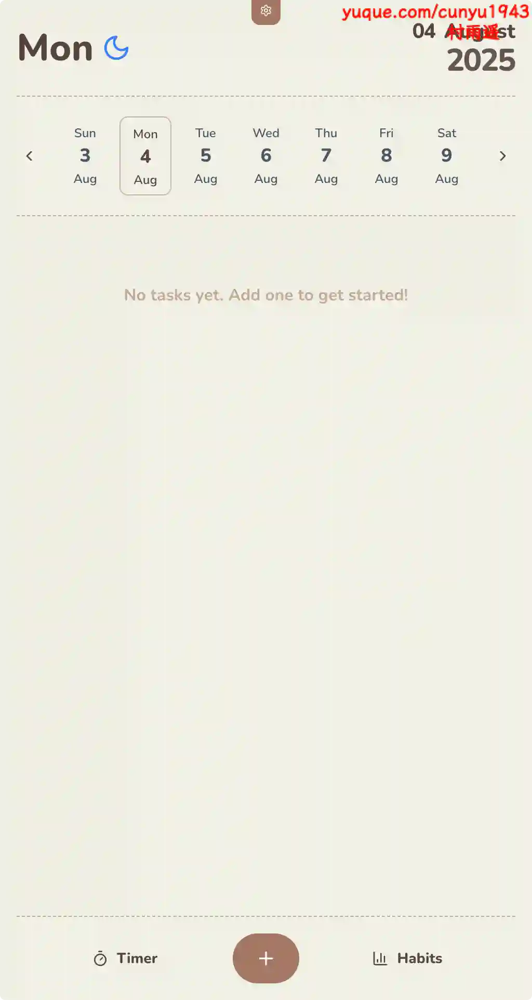
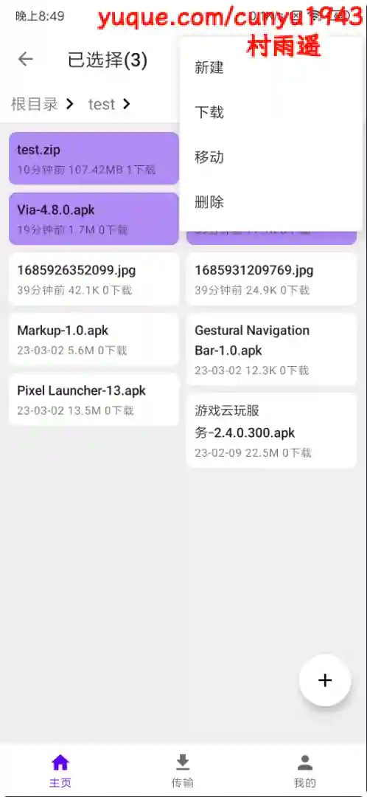
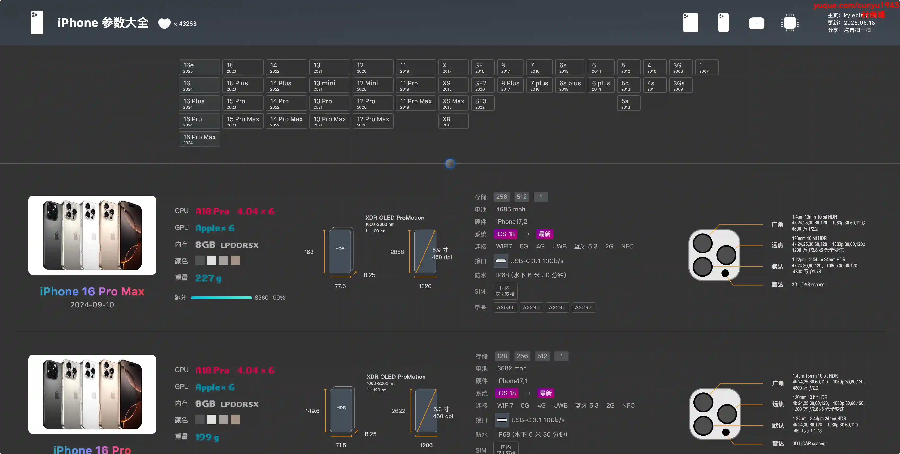
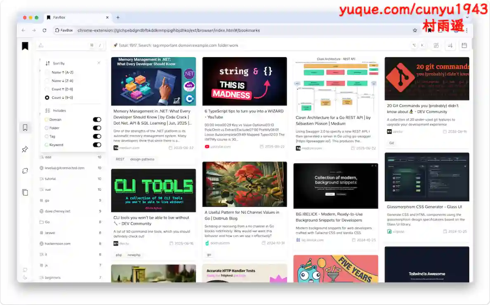
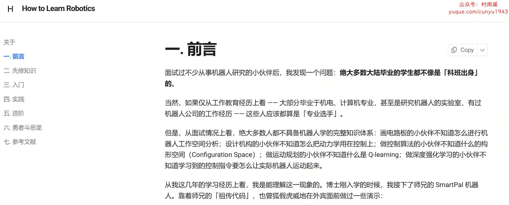

# 好物周刊#118：购房指北

> 作者：[村雨遥](https://github.com/cunyu1943)
> 
> 不要哀求，学会争取，若是如此，终有所获
> 
> 原文：https://mp.weixin.qq.com/s/SUT0Esps3z_R1V5DrpaIEg

## 🎈 号外 

最近，公众号之外，建立了微信交流群，不定期会在群里分享各种资源（影视、IT 编程、考试提升……）&知识。如果有需要，可以**扫码或者后台添加小编微信备注入群**。进群后**优先看群公告**，**呼叫群中【资源分享小助手】**，还能免费帮找资源哦～

## 一、项目

### 1. [句乐部](https://github.com/cuixueshe/earthworm)

一款让你上瘾的英语学习 App，通过游戏化闯关、独创长句拆解与海量重复练习，助你快速掌握核心词汇、流利口语和地道表达。告别枯燥死记硬背，无论中小学、四六级、考研雅思还是商务英语，都能在这里找到高效提升的乐趣！

### 2. [LiteOps](https://github.com/opsre/LiteOps)

轻量级 DevOps 平台。简单、高效的 CI / CD 解决方案。

### 3. [Priospace](https://github.com/AnoyRC/priospace)

一个高颜值的多合一效率工具，集任务管理、番茄钟、习惯追踪、实时协作等核心功能于一身。支持子任务拆解、彩色标签、90 天进度热图等功能。还能通过 WebRTC 实现多人协作编辑，无需服务器。

## 二、软件

### 1. [Foliate](https://github.com/johnfactotum/foliate)

号称 Linux 下的最佳电子书阅读器。颜值在线，功能强大，支持EPUB、MOBI、AZW、PDF 等主流格式。

### 2. [SplitLanzou](https://github.com/Yu2002s/SplitLanzou)

第三方蓝奏云客户端。双面板快速管理文件，突破上传文件限制，分割上传文件。

### 3. [CompressO](https://github.com/codeforreal1/compressO)

基于 FFmpeg 的开源视频压缩工具，支持全平台（macOS、Linux、Windows）。界面简洁，支持离线运行。

## 三、网站

### 1. [飞库文学网](https://www.feiku6.com)

广大书友最喜欢的文学小说阅读网，网站收录了最好最全的经典精品图书，免费提供高质量的图书小说阅读，是广大文学小说爱好者必备的文学阅读网。

### 2. [通通好课](https://www.tthaoke.com)

小鹅通精品课程合作平台，涵盖知识付费、互联网课程、小学初中高中线上培训、成人再就业、跨境电商、股票楼市知识。

### 3. [iPhone 参数大全](http://kylebing.cn/tools/iphone/)

涵盖了 iPhone、iPad、AirPods、Apple Watch、M/A 系产品芯片的详细参数，从 iPhone 1 到 iPhone 16 都囊括，作为果粉，绝对不可错过。

## 四、插件

### 1. [FavBox](https://chromewebstore.google.com/detail/favbox/eangbddipcghohfjefjmfihcjgjnnemj)

一款本地优先的浏览器书签管理扩展，无需云存储或第三方服务即可增强和简化书签管理。

### 2. [Language Reactor](https://chromewebstore.google.com/detail/language-reactor/hoombieeljmmljlkjmnheibnpciblicm)

一个强大的语言学习工具箱。 它可帮您发现、理解母语材料并从中学习。通过观看您正在学习的语言的电影和剧集，有效且愉快地提升您的语言技能。

### 3. [Bilibili ”换一换“ 历史](https://chromewebstore.google.com/detail/npfopljnjbamegincfjelhjhnonnjloo?utm_source=item-share-cb)

专门为 Bilibili 网站设计，用于保存和导航"换一换"推荐历史记录。当用户在 Bilibili 首页点击"换一换"按钮刷新推荐内容时，扩展会自动保存当前的推荐视频列表，并提供前进和后退按钮，让用户可以轻松浏览之前错过的推荐内容。

## 五、资料

### 1. [购房指北](https://github.com/851235550/how-to-buy-house)

一个基于国家统计局房价指数数据的房价走势可视化工具，帮助用户了解各城市房价变化趋势。

### 2. [开源机器人学学习指南](https://github.com/qqfly/how-to-learn-robotics)

开源机器人学学习指南，主要从必修知识、到入门、实践、进阶等方面教你如何让一个机器人动起来。

### 3. [具身智能技术指南](https://github.com/TianxingChen/Embodied-AI-Guide)

具身智能入门的路径以及高质量信息的总结，期望是按照路线学习走完后，能够帮助新手快速建立关于这个领域的认知，帮助他们入门。

## ✍️ 说明

周刊专栏相关信息：

- **项目地址**：[Github](https://github.com/cunyu1943/weekly)，觉得不错麻烦给我一个**Star**，感谢 ❤️
- **浏览地址**：公众号 | [电子书](https://cunyu1943.github.io/weekly) | [语雀](https://yuque.com/cunyu1943/weekly)

如果你阅读到这里，说明我的工作没有白费。如果你想推荐项目/网站/软件/资源，欢迎提交 **[issue](https://github.com/cunyu1943/weekly/issues)** 或者添加我 **个人微信：coder_cunYu** 与我交流。

---

## ⏳ 联系

想解锁更多知识？不妨关注我的微信公众号：**村雨遥（id：JavaPark）**。

扫一扫，探索另一个全新的世界。

